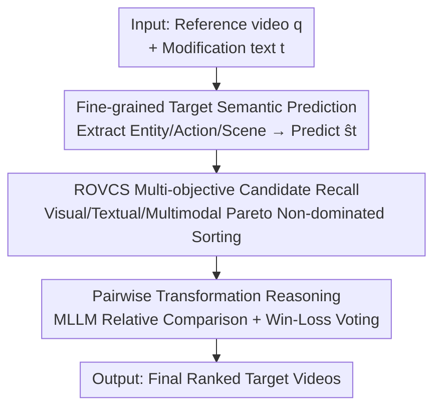

# Compositional Transformation Reasoning for Composed Video Retrieval

**Conference**: CVPR 2026  
**Paper**: [CVF Open Access](https://openaccess.thecvf.com/content/CVPR2026/html/Huang_Compositional_Transformation_Reasoning_for_Composed_Video_Retrieval_CVPR_2026_paper.html)  
**Code**: None (Repository not disclosed)  
**Area**: Video Understanding  
**Keywords**: Composed Video Retrieval, Multi-objective Optimization, MLLM Reasoning, Zero-shot Retrieval, Entity-Action-Scene Decomposition  

## TL;DR
Addressing the Composed Video Retrieval task ("given a reference video + modification text, retrieve a target video"), this paper proposes MoRe, a zero-shot framework. It employs multi-objective Pareto ranking to recall a small set of high-quality candidates, then utilizes an MLLM to decompose videos into "Entity-Action-Scene" dimensions for pairwise reasoning to determine which candidate best matches the modification intent. This achieves R@1 gains of +5.8 and +10.8 on EgoCVR and WebVid-CoVR, respectively.

## Background & Motivation
**Background**: The input for Composed Video Retrieval (CoVR) consists of a "reference video + modification text," aiming to retrieve a target video from a database that reflects the transformation described (e.g., "change walking to running" or "the same street scene filmed at night"). Prevailing approaches rely on supervised training: either mining video–text–video triplets from web corpora like WebVid2M to align joint embeddings through contrastive learning (CoVR-BLIP, Dense-CoVR), or using LLMs to generate denser modification texts/video descriptions to strengthen cross-modal alignment (ECDE, FDCA).

**Limitations of Prior Work**: These supervised methods consume noisy web-scale triplets and tend to learn "dataset-specific correlations" rather than transferable compositional reasoning capabilities—performance degrades significantly in egocentric or fine-grained scenarios. Dense text annotations only increase descriptive richness without teaching the model how text modifications should rewrite video content over time. Recent training-free methods like TFR-CVR use visual similarity for coarse filtering followed by LLM reranking based on predicted target semantics, offering better generalization. However, they suffer from two flaws: the first stage relies solely on visual similarity, causing relevant targets to be discarded prematurely; the reranking depends only on static video–text similarity, failing to capture fine-grained temporal/semantic transformations.

**Key Challenge**: The difficulty of CoVR lies in "compositional multimodal transformations"—entities, actions, and scenes evolve independently with fine-grained text edits. Existing training-free two-stage methods exhibit a "recall ↔ reranking" disconnection: recall only considers one modality (visual similarity), while reranking makes absolute judgments within the remaining pool. Once a target is filtered out during recall, it cannot be recovered. Furthermore, the absolute discriminability of an MLLM judging "whether a single candidate matches" is relatively low.

**Goal**: To decouple the task into two sub-problems: (1) designing a high-recall candidate selection mechanism that considers visual, textual, and multimodal signals simultaneously; (2) designing a reasoning mechanism that explains how entities/actions/scenes change while avoiding the inaccuracies of absolute MLLM judgments.

**Key Insight**: The authors observe that MLLMs are significantly more reliable at "pairwise relative comparisons" than "absolute relevance scoring" for single candidates. Thus, they model reranking as pairwise comparisons. Simultaneously, they upgrade the "visual-only recall" to a "visual/textual/multimodal three-objective Pareto equilibrium," ensuring target videos are more likely to remain in the candidate set.

**Core Idea**: Replace "single-modal coarse filtering + absolute relevance reranking" with "multi-objective Pareto recall + entity-action-scene semantic prediction + MLLM pairwise relative reasoning," achieving a completely zero-shot, training-free pipeline.

## Method

### Overall Architecture
Given a reference video $q$ and modification text $t$, the goal is to retrieve the target video from database $V$ that best matches the transformation described by $t$. MoRe is a two-stage, training-free pipeline. The **first stage** uses the Recall-Oriented Video Candidate Selection (ROVCS) module to perform non-dominated (Pareto) sorting across three conflicting objectives—"visual, textual, and multimodal"—to select a small batch of candidates with both high recall and semantic diversity. The **second stage** employs an MLLM for pairwise candidate comparison, aggregating results via "win-loss" voting into a global ranking. A bridge between these stages is fine-grained target semantic prediction: rewriting the short, ambiguous modification text $t$ into a three-dimensional target semantic $\hat{s}_t$ (Entity/Action/Scene), which replaces $t$ during text/multimodal similarity calculation to improve recall accuracy.

### Key Designs

**1. ROVCS: Recalling via Three-objective Pareto Non-dominated Sorting**

Addressing the limitation where "relevant targets are discarded by visual-only recall." Each candidate video $v_i$ is scored in three complementary spaces: visual similarity $s^{vis}_i=\mathrm{Sim}(f_v(q),f_v(v_i))$, textual relevance $s^{txt}_i=\mathrm{Sim}(f_t(t),f_t(v_i))$, and multimodal consistency $s^{mul}_i=\mathrm{Sim}(f_m(q,t),f_m(v_i))$ (where $\mathrm{Sim}$ is cosine similarity). These are inherently conflicting; for example, in "same scene but at night," a daytime video has high $s^{vis}$ but low $s^{txt}$, whereas the nighttime target is the opposite. Instead of weighted summation, the authors use the non-dominated relationship from multi-objective optimization: candidate $v_a$ dominates $v_b$ if and only if it is no worse in all three and strictly better in at least one:

$$s^{vis}_a \ge s^{vis}_b,\quad s^{txt}_a \ge s^{txt}_b,\quad s^{mul}_a \ge s^{mul}_b \;(\text{and at least one is strict }>)$$

The set of candidates not dominated by any others forms the Pareto Front $P_1$. The recall process is an iterative greedy expansion: starting from an empty set, the pool grows over $K$ steps. At each step, a new candidate is added to each preserved set of size $k-1$, and non-dominated sorting is applied to $(s^{vis},s^{txt},s^{mul})$ to retain the top $L_{max}$ sets. Within the same front, diversity is maintained using crowding distance. After $K$ rounds, the union of fronts $V^\ast=\bigcup_{k=1}^{K}P_k$ serves as the final recall pool. This explicitly balances multimodal query requirements, increasing the target presence in the candidate set from 64.5%/79.2% to 74.5%/85.4% (EgoCVR/WebVid-CoVR).

**2. Fine-grained Target Semantic Prediction: Rewriting Text into Entity-Action-Scene Semantics**

Addressing the limitation where $t$ is too brief, leading to broad/vague embeddings. An MLLM $G(\cdot)$ first generates structured tokens for the reference video: $E_q=G(p_{Entity},q)$, $A_q=G(p_{Action},q)$, and $C_q=G(p_{Scene},q)$. Combining $t$ and reference captions $n_q$, the MLLM reasons about changes:

$$\hat{E}_t=G(p_{EChange},E_q,n_q,t),\quad \hat{A}_t=G(p_{AChange},A_q,n_q,t),\quad \hat{C}_t=G(p_{SChange},C_q,n_q,t)$$

This decouples the compositional meaning of the edit. Finally, a fusion prompt $p_{Fusion}$ integrates these into a coherent target semantic $\hat{s}_t=G(p_{Fusion},\hat{E}_t,\hat{A}_t,\hat{C}_t)$, which replaces $t$ for calculating $s^{txt}$ and $s^{mul}$. This is highly effective: in text-to-video retrieval, using $\hat{s}_t$ instead of $t$ improves R@1 on EgoCVR from 0.9 to 5.9 and WebVid-CoVR from 24.4 to 47.6.

**3. Pairwise Transformation Reasoning: Relative Comparison and Voting**

Addressing the low accuracy of absolute MLLM relevance judgments. For any two candidates $(v_i, v_j)$ in $V^\ast$, a comparison prompt $p_{cmp}$ is constructed. The MLLM evaluates which better fits the transformation given $q, n_q, t$, outputting a discrete label $o_{i,j}\in\{win_i, win_j, tie, uncertain\}$. The Chain-of-Thought is constrained to: 1) Extract ref video semantics; 2) Determine modified dimensions; 3) Update target semantics; 4) Compare candidates. Results aggregate into a confidence score $T_i$:

$$T_i=\frac{1}{|V^\ast|-1}\sum_{j\ne i}\big[\mathbb{1}(o_{i,j}=win_i)-\mathbb{1}(o_{i,j}=win_j)\big]$$

The switch from absolute to relative judgment provides orders of magnitude improvement: MoRe with absolute relevance achieves R@1 of 7.4, which jumps to 20.4 with relative comparison. Complexity $O(K^2)$ is managed via Swiss tournament strategies.

## Key Experimental Results

### Main Results
Evaluated on three CoVR benchmarks: EgoCVR (egocentric, action-centric), WebVid-CoVR (third-person, object-centric), and Dense-WebVid-CoVR (fine-grained edits with ~31 words). Backbone: LanguageBind for features, Qwen2.5-VL-Instruct for MLLM reasoning, $K=15, L_{max}=3$.

| Dataset | Metric | Ours (MoRe) | Prev. SOTA | Gain |
|--------|------|-----------|----------|------|
| EgoCVR (Global) | R@1 | 20.4 | 14.6 (Dense-CoVR) | +5.8 |
| EgoCVR (Global) | R@10 | 72.1 | 54.9 (Dense-CoVR) | +17.2 |
| WebVid-CoVR | R@1 | 63.0 | 52.2 (FDCA-BLIP, zero-shot) | +10.8 |
| Dense-WebVid-CoVR | R@1 | 49.6 | 48.1 (Dense-CoVR) | +1.5 |

Notably, MoRe's zero-shot performance on WebVid-CoVR surpasses transfer learning methods fine-tuned on in-domain data (e.g., ECDE Transfer 60.1, CoVR-BLIP Transfer 53.1).

### Ablation Study
Ablations based on TFR-CVR (two-stage training-free baseline):

| Config | Stage 1 | Stage 2 | EgoCVR R@1 | WebVid R@1 | Description |
|------|---------|---------|------------|------------|------|
| Baseline (TFR-CVR) | Visual Sim | Text Sim | 14.1 | 51.7 | Starting point |
| Stage 1 Only | ROVCS($\hat{s}_t$) | Text Sim | 8.4 | 47.6 | Recall ↑, Precision ↓ |
| Stage 2 Only | Visual Sim | MLLM Reason | 15.8 | 60.3 | MLLM is strong alone |
| Stage 1+2 (Full) | ROVCS($\hat{s}_t$) | MLLM Reason | **20.4** | **63.0** | Full MoRe model |

### Key Findings
- **ROVCS used alone increases recall but drops precision**: Switching only Stage 1 caused EgoCVR R@1 to drop from 14.1 to 8.4 because distractors with conflicting visual evidence were recalled. MLLM reasoning is required to filter these out.
- **Relative comparison is the biggest lever**: R@1 increased from 7.4 to 20.4 when switching from absolute to relative judgment.
- **Semantic prediction is impactful**: In text-only retrieval, $\hat{s}_t$ improves EgoCVR R@1 from 0.9 to 5.9 by completing missing action/scene dimensions.
- **Efficiency-Accuracy Trade-off**: At $K=15$, runtime is 23.9s; at $K=10$ with Swiss strategy, runtime is 10.4s (near baseline's 8.2s) with R@1 still at 17.2 (+3.1 over baseline).

## Highlights & Insights
- **Modeling recall as Pareto multi-objective optimization**: Instead of weighted sums, non-dominated sorting + crowding distance naturally preserves balanced and diverse candidates. This is applicable to any multi-signal recall task.
- **"Switch to relative if absolute is inaccurate" is the key insight**: Changing the way the MLLM is queried yielded a +13 point gain—a crucial takeaway for all MLLM ranking tasks.
- **The $\hat{s}_t$ bridge is elegant**: Stage 1 uses fine-grained target semantics rather than vague instructions, ensuring recall and reranking stages share the same "language."

## Limitations & Future Work
- **Computational Overhead**: $O(K^2)$ pairwise comparisons are slow (23.9s per query vs 8.2s). Real-time retrieval remains a challenge.
- **Dependency on MLLM Quality**: Decomposition, prediction, and judgment rely entirely on Qwen2.5-VL. Performance decay with weaker models was not systematically analyzed in the main text.
- **Recall-Reranking Coupling**: ROVCS introduces distractors that require a strong reranker, making the system sensitive to the quality of the MLLM.
- **Future Directions**: Adaptive $K$ (dynamic comparison budgets based on difficulty) and near-linear pairwise strategies (e.g., uncertainty-based sparse comparisons).

## Related Work & Insights
- **vs TFR-CVR**: Upgraded from visual-only recall to three-objective Pareto recall and from text-similarity reranking to MLLM pairwise reasoning.
- **vs Supervised (Dense-CoVR, etc.)**: These rely on noisy web triplets; MoRe surpasses them using zero-shot compositional reasoning.
- **vs FDCA**: FDCA decomposes text into Leave/Inject/Exclude tokens; MoRe decomposes into Entity/Action/Scene dimensions, which better aligns with temporal video evolution.

## Rating
- Novelty: ⭐⭐⭐⭐ Pareto recall combined with pairwise reasoning is a novel and self-consistent design for CoVR.
- Experimental Thoroughness: ⭐⭐⭐⭐ Complete benchmarking, ablation, and efficiency analysis.
- Writing Quality: ⭐⭐⭐⭐ Clear motivation and architecture; well-documented formulas and figures.
- Value: ⭐⭐⭐⭐ Zero-shot results surpassing supervised methods; the "relative comparison" insight is broadly applicable.

<!-- RELATED:START -->

## Related Papers

- [\[CVPR 2026\] Beyond Caption-Based Queries in Video Moment Retrieval](beyond_caption-based_queries_in_video_moment_retrieval.md)
- [\[CVPR 2026\] Towards Sparse Video Understanding and Reasoning](towards_sparse_video_understanding_and_reasoning.md)
- [\[CVPR 2026\] StreamRAG: Enhancing Real-Time Video Understanding with Retrieval Augmentation](streamrag_enhancing_real-time_video_understanding_with_retrieval_augmentation.md)
- [\[NeurIPS 2025\] VGEnt: Graph-Based Retrieval-Reasoning-Augmented Generation for Long Video Understanding](../../NeurIPS2025/video_understanding/vgent_graph-based_retrieval-reasoning-augmented_generation_for_long_video_unders.md)
- [\[CVPR 2026\] VAST: Video Ability-Stratified Taxonomy for Data-Efficient Video Reasoning](vast_video_ability-stratified_taxonomy_for_data-efficient_video_reasoning.md)

<!-- RELATED:END -->
