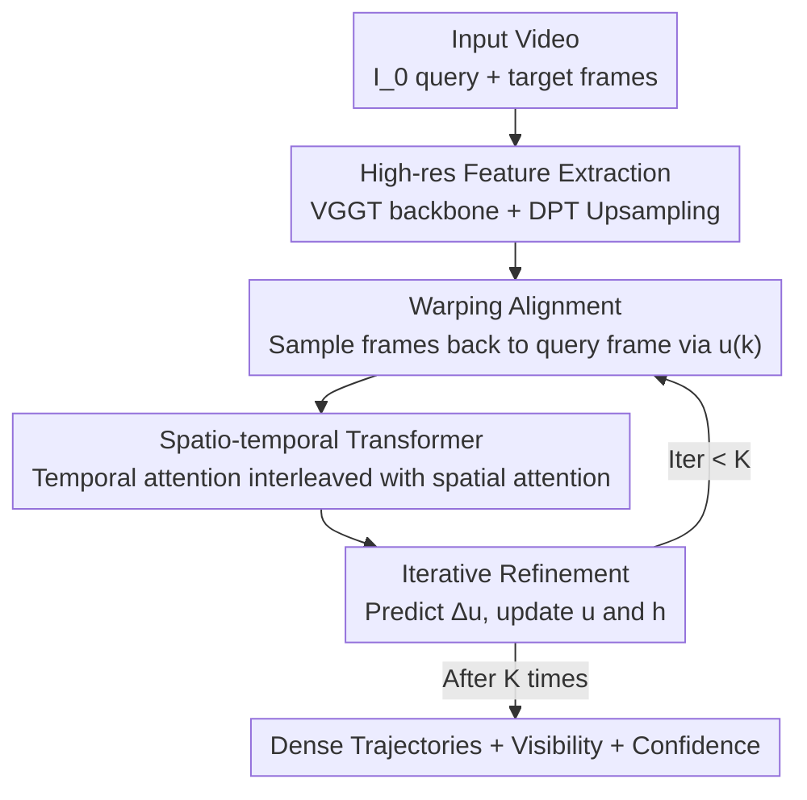

# CoWTracker: Tracking by Warping instead of Correlation

**Conference**: CVPR 2026  
**Paper**: [CVF Open Access](https://openaccess.thecvf.com/content/CVPR2026/html/Lai_CoWTracker_Tracking_by_Warping_instead_of_Correlation_CVPR_2026_paper.html)  
**Code**: Project Page https://cowtracker.github.io (Code TBD)  
**Area**: Video Understanding  
**Keywords**: Point tracking, optical flow, feature warping, spatio-temporal Transformer, dense correspondence

## TL;DR
CoWTracker replaces the "cost volume calculation for matching" in dense point tracking with "warping target frame features back to the reference frame based on current trajectory estimates + global reasoning via spatio-temporal Transformer." By removing the cost volume, which grows quadratically with resolution, it achieves SOTA results on TAP-Vid / RoboTAP. Furthermore, the same model outperforms specialized optical flow methods when zero-shot transferred to optical flow tasks.

## Background & Motivation
**Background**: Starting from PIPs, mainstream track-any-point (TAP) trackers have largely followed a specific paradigm—using cost volumes (correlation volumes) to match features between frames, followed by refinements using Transformers that treat each trajectory as a token sequence (e.g., CoTracker, LocoTrack, AllTracker). The cost volume concept originates from optical flow literature (RAFT), explicitly comparing the similarity between each position in the source image and a set of candidate positions in the target image.

**Limitations of Prior Work**: The cost of cost volumes increases **quadratically** with spatial resolution—for $H'\times W'$ positions in the source image, each must be compared against a neighborhood in the target image. To manage GPU memory, these methods are forced to calculate matches on low-resolution features. Consequently, fine structures (e.g., bicycle handlebars, roller coaster tracks), large viewpoint changes, and re-localization after occlusion are easily lost. For instance, AllTracker loses track of fine structures in roller coaster scenes during the first half of the sequence.

**Key Challenge**: High tracking precision requires high-resolution feature alignment, but the quadratic complexity of cost volumes forces a reduction in resolution—representing a hard trade-off between resolution and efficiency/memory.

**Key Insight**: The authors noted that the optical flow field has recently begun to question cost volumes. WAFT demonstrated that a **warping mechanism** can replace cost volumes: instead of searching a range of candidates, every iteration warps the target frame feature back to the source frame by **sampling only one point** (at the location specified by the current estimate) and concatenating it with the source feature for the network to update the flow field. While it might seem that matching only one target position per source position is insufficient, the key insight of WAFT is that by passing these aligned features through a self-attention layer, the model can still reason about correspondences globally.

**Core Idea**: The authors found that "global reasoning of matching via self-attention" in WAFT and "joint tracking via cross-trajectory self-attention" in CoTracker are conceptually identical. Thus, they ported warping from optical flow to dense point tracking—**using warping instead of correlation**: trajectories are estimated for each pixel in the reference frame, features from all other frames are warped back to the reference frame according to the current trajectory, and a Transformer with factorized spatial/temporal attention is used for iterative refinement. The complexity is reduced from quadratic to linear with respect to resolution, allowing direct feature alignment at high resolutions.

## Method

### Overall Architecture
CoWTracker takes a video of $T+1$ frames as input. Frame 0 $I_0$ is the query frame, and the others are target frames. It predicts the position $x_t(p)$ for each pixel $p$ of the query frame in every target frame $I_t$, alongside visibility $v_t(p)$ and confidence $\sigma_t(p)$. Trajectories are represented by displacement fields: $x_t(p) = p + u_t(p)$, assuming all points are initially stationary ($u^{(0)}=0$).

The pipeline consists of three steps: **Backbone** (strong pre-trained models like VGGT) extracts low-resolution features for each frame → **DPT Upsampler** lifts features to a high resolution near the input resolution → **warping-only tracker** uses a lightweight update operator for $K$ iterations. In each iteration, features from all frames are warped back to the query frame based on the current displacement $u^{(k)}$, then concatenated and fed into a spatio-temporal Transformer to predict residual displacements, updating the displacement field and hidden states. After $K$ iterations, final hidden states are passed through linear heads to output visibility and confidence. Crucially, there is **no correlation volume** anywhere in the head; the only point where cross-frame feature pairing occurs is the warping operation (Eq. 2), making the head's overhead **linear** with respect to the number of frames $T$, resolution $|P|$, and iterations $K$.

### Key Designs

**1. Warping Alignment: Replacing Quadratic Cost Volumes with Single-Point Sampling**

This is the core of the paper, directly addressing the pain point where quadratic complexity forces lower resolutions. Given the current displacement estimate $u$, the warping operation $G = W(F, u, p)$ performs bilinear sampling of features for each target frame $t$ at $p+u_t(p)$, aligning them back to the position $p$ in query frame 0:

$$G_t(p) = \text{sample}(F_t,\ p + u_t(p))$$

Unlike cost volumes that compare every source position against a neighborhood of candidates, warping **evaluates only one pair per iteration** (the point pointed to by the current trajectory). This is the source of the reduction from quadratic to linear complexity—no correlation volumes or multi-resolution pyramids need to be constructed or stored. The trade-off is that single-point sampling is sparse; whether the match is correct depends entirely on the subsequent Transformer's ability to correct it via global reasoning. Removing warping and using "original features" instead (Ours no warp) caused $\delta_{avg}$ on DAVIS to plummet by 23.4, proving that explicit warping is indispensable.

**2. spatio-temporal Separated Transformer: Global Reasoning for Sparse Warping**

Since warping provides only one sparse pair per iteration, a global reasoning module is needed to establish reliable correspondences. The update operator concatenates the warped target features $G_t$, query features $F_0$, current displacement $u_t^{(k)}$, and hidden state $h_t^{(k)}$ along the channel dimension to form token tensors $z$:

$$z_t = G_t^{(k)} \,\|\, F_0 \,\|\, u_t^{(k)} \,\|\, h_t^{(k)}, \quad t \in T$$

These tokens are organized by time × space. After adding spatio-temporal positional encodings, they pass through a video Transformer modified from ViT: **one temporal attention layer is interleaved every two spatial attention layers**. Spatial attention runs across all positions $P$ for a fixed time $t$, while temporal attention runs across all frames $T$ for a fixed position $p$. Spatial attention performs "global reasoning of matching" as in WAFT, while temporal attention is equivalent to cross-trajectory joint tracking in CoTracker, allowing the model to infer positions during occlusions using neighboring trajectories. Ablations show that temporal attention provides massive gains of +11.7 / +11.2 $\delta_{avg}$ on long videos (600 frames, RGB-Stacking / RoboTAP).

**3. Iterative Refinement: Converging from Zero Displacement**

The tracker maintains two states—the displacement field $u^{(k)}$ and the hidden state $h^{(k)}$ ($h^{(0)}$ is initialized by reducing the dimension of concatenated $F_0$ and $F_t$ via a small network $\xi$ consisting of $1\times1$ convolution + LayerNorm). In each iteration, the update operator outputs a residual displacement which is accumulated:

$$\Delta u^{(k+1)} = h^{(k+1)} W_u, \qquad u^{(k+1)} = u^{(k)} + \Delta u^{(k+1)}$$

Since $u^{(0)}=0$ (assuming points are static), the first warping iteration is equivalent to sampling at the original position. Subsequent iterations use more accurate displacements for re-warping, resulting in more aligned features and further refined displacements, forming a "warp → refine → re-warp" loop. Performance improves significantly from $K=1$ to $K=2$ and saturates around $K=5$–$6$ (default $K=5$). Ablations show a difference of +6.6 $\delta_{avg}$ on DAVIS between single-pass and iterative refinement.

**4. DPT High-resolution Upsampling: High-resolution Indexing**

Cost volume methods are forced to calculate matches at low resolutions. Because the warping-only design eliminates the need to store large correlation volumes, it can afford high resolutions. The authors use a DPT upsampler (a lightweight convolutional decoder with skip connections from the backbone) to lift low-resolution backbone features $\hat F$ to a high-resolution feature with stride $s' = 2s$. Following WAFT, a small U-Net also processes the original image directly, and its output is concatenated with the upsampled features. Pulling feature resolution closer to the input resolution greatly aids in tracking small objects (handlebars, tracks) near boundaries. Ablations showed that as the indexing stride refined from 1/16 to 1/2, DAVIS $\delta_{avg}$ increased from 70.9 to 78.0, confirming the benefit of high-resolution indexing.

### Loss & Training
Training is conducted solely on Kubric synthetic data. Displacements are supervised using Huber loss (for both visible and occluded trajectories), with weights for each iteration increasing exponentially (following CoTracker3). Visibility and confidence are supervised at each iteration using BCE. Ground-truth confidence is provided by an indicator function determining if the predicted trajectory falls within 12 pixels of the truth. AdamW is used with a $5\times10^{-4}$ learning rate and cosine decay. Training uses a batch of 32 videos, up to 16 frames each, at $336\times560$ resolution for 50k steps. Augmentations include randomized frame rates and video lengths, utilizing mixed precision and gradient checkpointing.

## Key Experimental Results

### Main Results
Trained only on Kubric, CoWTracker outperforms the strongest dense tracker, AllTracker, across all four datasets (TAP-Vid DAVIS / RGB-Stacking / Kinetics and RoboTAP) and all three metrics (AJ / $\delta_{avg}$ / OA). The following table shows the mean across the four datasets:

| Method | Training Data | Mean AJ↑ | Mean $\delta_{avg}$↑ | Mean OA↑ |
|------|---------|----------|----------|----------|
| CoTracker3 (offl.) [19] | Kub+15k | 62.0 | 74.4 | 89.6 |
| DELTA [29] | Kub | 61.1 | 74.6 | 87.2 |
| AllTracker [14] | Kub+Mix | 68.9 | 80.5 | 91.5 |
| **Ours** | **Kub** | **71.3** | **81.8** | **93.3** |

Compared to AllTracker (Kub+Mix), the mean Gain is AJ +2.4 / $\delta_{avg}$ +1.3 / OA +1.8. In a fair comparison where both are trained only on Kubric (vs AllTracker Kub), the gap widens to +3.3 / +2.2 / +3.0. The improvement in occlusion accuracy (OA) is particularly significant (+4.3 on DAVIS). The authors attribute this to the head working directly on image features rather than compressed correlation scores, preserving channel-wise cues for visibility prediction at boundaries.

**Zero-shot Optical Flow**: Using the same model (untrained on any optical flow data) directly on frame pairs as two-frame videos:

| Method | Sintel Clean↓ | Sintel Final↓ | KITTI EPE↓ | KITTI Fl-all↓ |
|------|---------------|---------------|-----------|---------------|
| RAFT [37] | 1.15 | 1.86 | 1.53 | 7.81 |
| SEA-RAFT (M) [44] | 0.97 | 1.96 | 1.60 | 8.26 |
| WAFT (twins-a2) [43] | 0.94 | 2.09 | 1.15 | 5.29 |
| **Ours (Zero-shot)** | **0.78** | **1.48** | **1.04** | **4.87** |

Relative to the best specialized optical flow models, the EPE is reduced by 17%/20% on Sintel Clean/Final. On KITTI, it reduces EPE by 9.6% and Fl-all by 7.9% compared to the strongest WAFT—a model trained for point tracking outperformed specialized optical flow methods zero-shot.

### Ablation Study
(Reported in $\delta_{avg}$)

| Configuration | DAVIS | RGB-S | RoboTAP | Description |
|------|-------|-------|---------|------|
| Full (VGGT + DPT + warp + ST + iter) | 78.0 | 92.8 | 83.4 | Complete model |
| Ours (no warp) | 54.6 | 85.5 | 73.8 | Removing warping → DAVIS drops 23.4 |
| ViT (img., spatial only) | 74.7 | 81.1 | 72.6 | No temporal attention → Long videos drop 11+ |
| Single-pass (non-iterative) | 71.4 | 90.0 | 79.4 | No iteration → DAVIS −6.6 |
| No Upsampler | 72.5 | 90.3 | 80.0 | Low-res indexing → DAVIS −5.5 |
| Backbone: CoTracker ConvNet | 62.9 | 77.1 | 68.3 | Weak backbone is significantly worse |

### Key Findings
- **Warping is critical**: Replacing warping with "original feature lookup" dropped $\delta_{avg}$ by 23.4 on DAVIS, the largest drop in all ablations, proving explicit trajectory-based sampling for alignment is irreplaceable.
- **Temporal attention is vital for long videos**: On the longest 600-frame videos (RGB-Stacking / RoboTAP), adding temporal attention yielded +11.7 / +11.2, showing that cross-frame joint reasoning is the source of robustness to occlusions and long durations.
- **High-res indexing is worth it**: Finer indexing strides are better (1/2 > 1/4 > 1/8 > 1/16). Even when using larger patch sizes to compensate for computation, high resolution remains clearly superior—a dividend affordable only by removing the quadratic complexity of cost volumes.
- **Stronger video backbones yield more benefits**: VGGT > Pi3 > ViT > CoTracker's ConvNet; the head directly benefits from backbone improvements.

## Highlights & Insights
- **A Unified Perspective**: The authors identify "warping + self-attention in WAFT" and "cross-trajectory attention in CoTracker" as conceptually the same, cleanly porting the warping paradigm from optical flow to point tracking. This conceptual bridge is the "Aha!" moment of the paper, allowing a single model to unify dense point tracking and optical flow.
- **Trading Complexity for Dimension**: Removing the cost volume does more than save memory; it allows the "re-investment" of that budget into "higher resolution indexing," resulting in more accurate tracking of boundaries and fine structures. This is an ingenious engineering trade-off applicable to any matching task constrained by quadratic complexity.
- **Occlusion Robustness as a By-product**: Warping-indexed features retain channel-level appearance cues. Compared to cost volumes that compress appearance into dot-product similarities, this provides the visibility head with more information at occluded boundaries, leading to significant OA gains.

## Limitations & Future Work
- **Dependency on Strong Pre-trained Backbones**: Performance is highly dependent on strong video feature extractors like VGGT (performance drops significantly with weaker backbones). The contribution of the warping head is somewhat coupled with backbone quality.
- **Advantage Vanishes in Low-Motion Regimes**: In very low-motion scenarios like Spring (average displacement of only 3.5 pixels), CoWTracker slightly underperforms specialized WAFT. The authors acknowledge that at this scale, errors are close to noise levels. ⚠️ This suggests the advantages of warping are most apparent in large-displacement or texture-sparse scenarios.
- **Synthetic-only Training (Kubric)**: While generalization to the real domain is good, the potential for further improvement via large-scale self-training on real data (as in CoTracker3 or BootsTAPIR) remains unexplored.
- Future Directions: Implementing the warping head on lighter backbones for mobile versions, or exploring 3D/depth-aware warping for tracking.

## Related Work & Insights
- **vs AllTracker**: Both pursue dense tracking and "tracking all points," but AllTracker still uses cost volumes + multi-resolution pyramids, forced into low-res matching. CoWTracker's warping-only head removes the cost volume and utilizes high-res indexing, outperforming AllTracker across all metrics on four datasets, with the most notable advantage in occlusion accuracy (OA).
- **vs CoTracker / CoTracker3**: CoTracker uses cross-trajectory self-attention for joint tracking but still relies on correlation features. CoWTracker adopts the temporal attention idea but replaces the matching mechanism entirely with warping and supports dense rather than sparse tracking.
- **vs WAFT**: WAFT proposed warping as a cost volume replacement for optical flow. CoWTracker points out its equivalence to joint tracking, applies it to point tracking, and adds temporal attention for long videos—consequently outperforming WAFT on zero-shot optical flow.
- **vs TAPTRv2**: TAPTRv2 uses deformable attention to remove cost volumes for sparse tracking, but each query produces only a single displacement, making it hard to scale to dense tracking. CoWTracker's warping naturally supports per-pixel dense trajectories.

## Rating
- Novelty: ⭐⭐⭐⭐⭐ Cleanly ports the warping paradigm to dense point tracking and unifies both tasks with a simple and powerful conceptual connection.
- Experimental Thoroughness: ⭐⭐⭐⭐⭐ SOTA on both point tracking and zero-shot optical flow; six ablations disassemble backbone, upsampling, resolution, temporal attention, iteration, and head design.
- Writing Quality: ⭐⭐⭐⭐ Clear motivation and solid formulation; some symbols (from OCR sources) require cross-checking with the original text.
- Value: ⭐⭐⭐⭐⭐ Removing quadratic complexity and unifying tracking with optical flow provides methodological value for future matching-related tasks.

<!-- RELATED:START -->

## Related Papers

- [\[CVPR 2026\] One-Shot Flow, Any-Time Frame: A Bidirectional Warping Framework for Event-Based Video Frame Interpolation](one-shot_flow_any-time_frame_a_bidirectional_warping_framework_for_event-based_v.md)
- [\[CVPR 2026\] Efficient All-Pairs Correlation Volume Sampling for Optical Flow Estimation](efficient_all-pairs_correlation_volume_sampling_for_optical_flow_estimation.md)
- [\[AAAI 2026\] BAT: Learning Event-based Optical Flow with Bidirectional Adaptive Temporal Correlation](../../AAAI2026/video_understanding/bat_learning_event-based_optical_flow_with_bidirectional_adaptive_temporal_corre.md)
- [\[CVPR 2026\] Generative Point Tracking and Forecasting](generative_point_tracking_and_forecasting.md)
- [\[AAAI 2026\] Task-Specific Distance Correlation Matching for Few-Shot Action Recognition](../../AAAI2026/video_understanding/task-specific_distance_correlation_matching_for_few-shot_action_recognition.md)

<!-- RELATED:END -->
