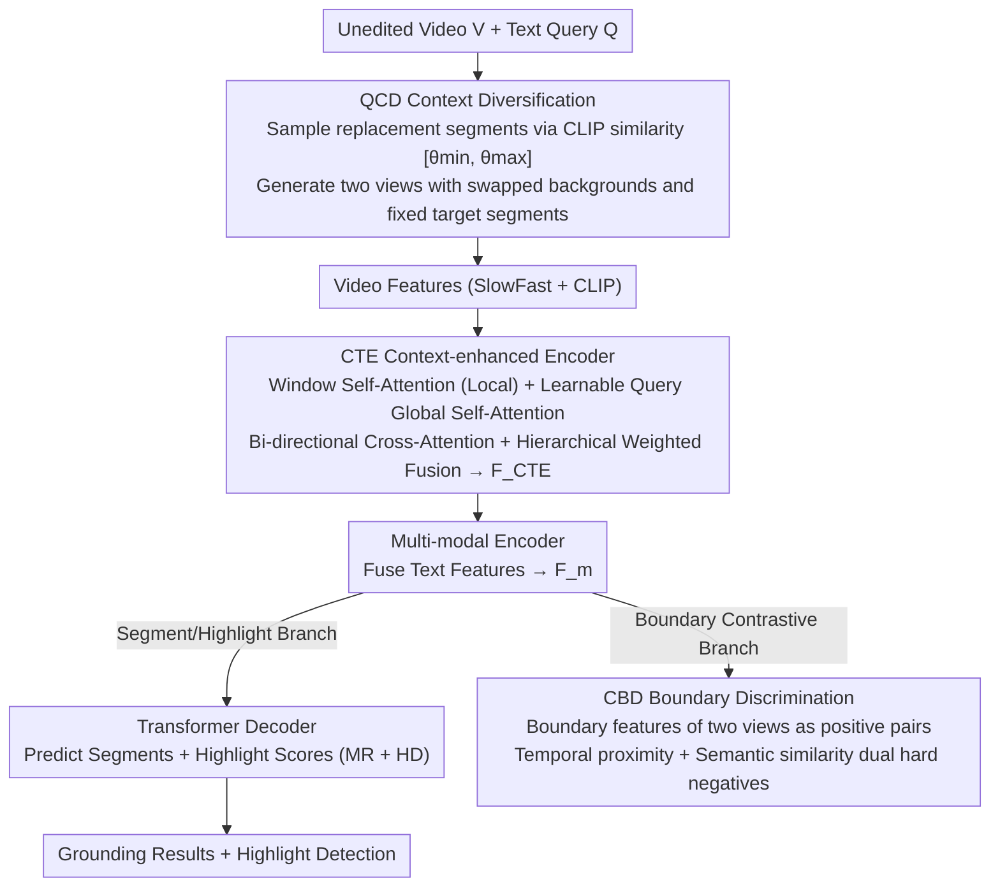

# CVA: Context-aware Video-text Alignment for Video Temporal Grounding

**Conference**: CVPR 2026  
**arXiv**: [2603.24934](https://arxiv.org/abs/2603.24934)  
**Code**: [https://byeol3325.github.io/projects/CVA/](https://byeol3325.github.io/projects/CVA/)  
**Area**: Video Understanding / Temporal Grounding  
**Keywords**: Video Temporal Grounding, Data Augmentation, Contrastive Learning, Context Invariance, Video-Text Alignment

## TL;DR
The Context-aware Video-text Alignment (CVA) framework is proposed, consisting of three synergistic components: Query-aware Context Diversification (QCD), Context-invariant Boundary Discrimination (CBD) loss, and Context-enhanced Transformer Encoder (CTE). It addresses false negatives and background correlation issues in video temporal grounding, achieving approximately a 5-point improvement in R1@0.7 on the QVHighlights dataset.

## Background & Motivation

**Background**: Video Temporal Grounding (VTG) aims to locate target segments in unedited videos based on text queries, encompassing Video Moment Retrieval (VMR) and Highlight Detection (HD). Recently, end-to-end methods based on DETR have become the mainstream.

**Limitations of Prior Work**: (1) Models tend to learn spurious correlations—overly associating text queries with static backgrounds rather than focusing on target actions/events; (2) TD-DETR proposed content mixing augmentation to break this association, but the selection of replacement segments is query-agnostic, potentially introducing false negatives (replacing segments semantically related to the query while labeling them as negatives).

**Key Challenge**: The effectiveness of content mixing augmentation depends on the semantics of the replacement segments—query-agnostic mixing cannot guarantee that the replacement segments are truly unrelated to the query.

**Goal**: How to diversify context while avoiding false negatives? How to enable the model to learn representations at the boundaries that are robust to context changes?

**Key Insight**: (1) Construct a query-aware effective replacement pool at the dataset level based on pre-computed CLIP text-video similarity statistics; (2) Strengthen context-invariant representations at temporal boundaries using contrastive learning; (3) Capture multi-scale temporal context using a hierarchical Transformer.

**Core Idea**: Query-aware data augmentation + Boundary-focused contrastive learning + Hierarchical temporal modeling = SOTA temporal grounding.

## Method

### Overall Architecture
The core problem CVA aims to solve is that video temporal grounding models easily bind text queries to static backgrounds, while existing "content mixing" augmentations can inadvertently affect segments related to the query, creating false negatives. It adds three cooperating components onto a standard DETR-based framework: during training, QCD first generates "background-swapped but semantic-consistent" augmented video pairs; then, CTE replaces the standard Transformer encoder to capture multi-scale temporal context; finally, CBD imposes contrastive constraints at the segment boundaries between the two augmented views. These three function sequentially: QCD manages "what data to feed," CTE manages "how to encode," and CBD manages "what representations to learn at the boundaries." The downstream follows the DETR paradigm: CTE outputs are passed through a multi-modal encoder with text features, then branched to a Transformer decoder (for segments + highlight scores) and a contrastive head (for the CBD loss).

### Key Designs

**1. Query-aware Context Diversification (QCD): Ensuring "correct segment" replacement to eliminate false negatives at the source**

The pain point is direct: TD-DETR breaks "query ↔ background" spurious correlations with content mixing, but it does not consider the query during replacement. It might swap in a segment semantically related to the query while still labeling it as a negative, thus misguiding the model. QCD makes replacement an "informed selection": it pre-computes a cosine similarity matrix between all video segments and all queries using CLIP, then uses the percentile distributions of GT pairs ($\mathcal{S}_{\text{gt}}$) and non-GT pairs ($\mathcal{S}_{\text{non}}$) to define an effective sampling interval:

$$\theta_{\min} = \text{Percentile}_\alpha(\mathcal{S}_{\text{non}}), \quad \theta_{\max} = \text{Percentile}_\beta(\mathcal{S}_{\text{gt}})$$

Replacement segments are only sampled from other videos where the similarity falls within $[\theta_{\min}, \theta_{\max}]$. Meanwhile, the GT segment and its $p$ neighboring segments are preserved (context maintenance). These two constraints serve distinct roles: the lower bound $\theta_{\min}$ filters out trivial segments unrelated to the query (which provide no meaningful negative signals), and the upper bound $\theta_{\max}$ filters out segments with high similarity that are likely false negatives. For example, out of 30 candidate segments, those below $\theta_{\min}$ (too irrelevant) and above $\theta_{\max}$ (suspected false negatives) are excluded; only those "relevant enough but not true positives" enter the sampling pool. Using percentiles instead of fixed thresholds allows for adaptive thresholding across different datasets.

**2. Context-enhanced Transformer Encoder (CTE): Supplementing local temporal patterns and fusing multi-scale context**

Standard Transformer encoders perform global self-attention immediately, lacking explicit modeling of "local temporal patterns"—yet temporal grounding relies on local action fluctuations to find boundaries. CTE replaces the encoder with $N_b$ stacked blocks, each performing three tasks: window self-attention for local temporal dependencies; global self-attention on learnable queries to provide global semantic anchors; and bi-directional cross-attention for information exchange between video and queries. Finally, instead of taking only the last layer, outputs from all layers are concatenated, compressed via MLP, and fused with original video features using learnable weights:

$$\mathbf{F}_{\text{CTE}} = \omega \cdot \mathbf{F}_v + (1-\omega) \cdot \text{Norm}(\text{MLP}(\text{Concat}_{l=1}^{N_b}(\mathbf{F}^{(l)})))$$

This feeds local dependencies (window), global semantics (learnable queries), and multi-scale across-layer information into the downstream heads.

**3. Context-invariant Boundary Discrimination (CBD): Anchoring contrastive learning to boundaries for robust discriminative representations**

Boundaries are critical yet prone to error—a few frames of difference can drop the IoU category. The rationale for CBD is: since QCD generates two augmented views $\mathbf{V}'_{\text{mix}}$ and $\mathbf{V}''_{\text{mix}}$ with swapped backgrounds but identical target segments, features should be sampled at the GT segment boundaries (start/end frames) and aligned as positive pairs. Hard negatives are specifically selected from two dimensions: spatial background frames adjacent to the boundary (hard boundary negatives, forcing the model to distinguish "just inside vs. just outside") and distant but semantically similar background frames (hard semantic negatives, preventing the model from being deceived by similar-looking backgrounds). The contrastive loss is defined as:

$$\mathcal{L}_{CBD} = -\frac{1}{|\mathcal{B}|} \sum_{b \in \mathcal{B}} \log \frac{\exp(s_{p,b})}{\exp(s_{p,b}) + \sum_{\mathbf{z}_n \in \mathcal{Z}^-} \exp(s_{n,b})}$$

This forces boundary representation consistency under "swapped background" perturbations, training context-invariant boundary discrimination.

### Loss & Training
- $\mathcal{L}_{\text{total}} = \mathcal{L}_{\text{MR}} + \mathcal{L}_{\text{HD}} + \lambda_{\text{CBD}} \mathcal{L}_{\text{CBD}}$
- MR Loss: $\lambda_{\text{L1}} \mathcal{L}_{\text{L1}} + \lambda_{\text{gIoU}} \mathcal{L}_{\text{gIoU}}$
- HD Loss: $\lambda_{\text{HD}}(\mathcal{L}_{\text{margin}} + \mathcal{L}_{\text{rank}})$
- $\lambda_{\text{L1}}=10$, $\lambda_{\text{gIoU}}=1$, $\lambda_{\text{HD}}=1$, $\lambda_{\text{CBD}}=0.005$
- QCD Parameters: $\alpha=10$, $\beta=60$, mixing ratio 0.3, maintenance window $p=1$
- AdamW optimizer, cosine annealing, batch size 32

## Key Experimental Results

### Main Results—QVHighlights test split

| Method | R1@0.5↑ | R1@0.7↑ | mAP Avg↑ | HD mAP↑ |
|------|---------|---------|----------|---------|
| Moment-DETR | 52.89 | 33.02 | 30.73 | 35.69 |
| QD-DETR | 62.40 | 44.98 | 39.86 | 38.94 |
| CG-DETR | 65.43 | 48.38 | 42.86 | 40.33 |
| TD-DETR | 64.53 | 50.37 | 46.69 | - |
| CDTR | 65.79 | 49.60 | 44.37 | - |
| **CVA (Ours)** | **70.05** | **55.32** | **47.49** | **44.43** |

Gain: R1@0.5 +4.26 (vs CDTR), R1@0.7 +4.95 (vs TD-DETR), HD mAP +4.1 (vs CG-DETR).

### Charades-STA and TACoS

| Dataset | Method | R1@0.5↑ | R1@0.7↑ | mIoU↑ |
|--------|------|---------|---------|-------|
| Charades | BAM-DETR (prev best) | 59.95 | 39.38 | 52.33 |
| Charades | **CVA** | **62.61** | **40.78** | **53.35** |
| TACoS | BAM-DETR (prev best) | 41.45 | 26.77 | 39.31 |
| TACoS | **CVA** | **43.21** | **27.73** | **41.07** |

### Ablation Study

| Config | R1@0.5↑ | R1@0.7↑ | HD mAP↑ | Note |
|------|---------|---------|---------|------|
| Baseline (QCD basic) | ~63 | ~48 | ~39 | Basic Aug |
| + QCD (query-aware) | ~68 | ~52 | ~41 | Significant R1 Gain |
| + QCD + CTE | ~68.5 | ~53.5 | ~43 | Arch Enhancement |
| + QCD + CTE + CBD | **70.05** | **55.32** | **44.43** | Full CVA |

### Key Findings
- Significant improvements in R1 metrics (~5 points) directly demonstrate the effectiveness of QCD in reducing false negatives.
- CBD contributes most to precise localization, especially R1@0.7 (where boundary discrimination is more vital under strict IoU thresholds).
- Synergy between components is evident: QCD provides diverse, high-quality training samples, CTE offers better temporal modeling, and CBD ensures boundary discriminability.

## Highlights & Insights
- **Data-centric Perspective**: Emphasizes quality of training data alongside architecture; QCD solving false negatives via augmentation is a key innovation.
- **Boundary Focus**: CBD precisely targets contrastive learning to critical boundary regions, proving more efficient than full-frame contrast.
- **Statistics-driven Thresholding**: Uses dataset-level similarity distribution statistics (percentiles) instead of manual settings for better adaptability.
- **Dual-source Hard Negatives**: Considering both temporal proximity and semantic similarity for hard negatives enhances discriminative power comprehensively.

## Limitations & Future Work
- QCD requires pre-computing the CLIP similarity matrix (one-time overhead), which can be slow for massive datasets.
- Hyperparameter selection for window sizes and query counts has not been fully explored.
- Relies on SlowFast + CLIP features; stronger video encoders might yield further gains.
- Has not been compared with recent VLM-based methods.

## Related Work & Insights
- TD-DETR identified background correlation issues; CVA's QCD addresses its false negative flaws—a classic "problem → partial solution → refinement" research trajectory.
- The combination of window attention (Swin Transformer inspired) and learnable queries (DETR inspired) is effective for temporal tasks.
- Boundary contrastive learning could be extended to other tasks requiring precise temporal boundaries, such as action detection and video segmentation.

## Rating
- Novelty: ⭐⭐⭐⭐ 
- Experimental Thoroughness: ⭐⭐⭐⭐⭐ 
- Writing Quality: ⭐⭐⭐⭐ 
- Value: ⭐⭐⭐⭐⭐ 

<!-- RELATED:START -->

## Related Papers

- [\[CVPR 2026\] TF-CADE: Foreground-Concentrated Text-Video Alignment for Zero-Shot Temporal Action Detection](tf-cade_foreground-concentrated_text-video_alignment_for_zero-shot_temporal_acti.md)
- [\[CVPR 2026\] T2SGrid: Temporal-to-Spatial Gridification for Video Temporal Grounding](t2sgrid_temporal-to-spatial_gridification_for_video_temporal_grounding.md)
- [\[CVPR 2026\] Learning to Refuse: Refusal-Aware Reinforcement Fine-Tuning for Hard-Irrelevant Queries in Video Temporal Grounding](learning_to_refuse_refusal-aware_reinforcement_fine-tuning_for_hard-irrelevant_q.md)
- [\[CVPR 2026\] HieraMamba: Video Temporal Grounding via Hierarchical Anchor-Mamba Pooling](hieramamba_video_temporal_grounding_via_hierarchical_anchor-mamba_pooling.md)
- [\[CVPR 2026\] DETACH: Decomposed Spatio-Temporal Alignment for Exocentric Video and Ambient Sensors with Staged Learning](detach_decomposed_spatio-temporal_alignment_for_exocentric_video_and_ambient_sen.md)

<!-- RELATED:END -->
