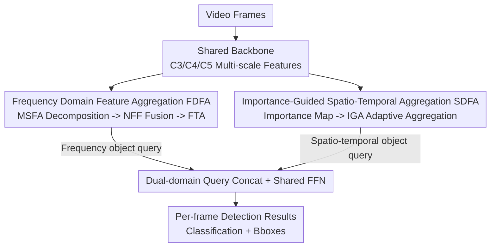

# D2FANet: Enhancing Video Object Detection with Dual-Domain Feature Aggregation Network

**Conference**: CVPR 2026  
**Paper**: [CVF Open Access](https://openaccess.thecvf.com/content/CVPR2026/html/Qi_D2FANet_Enhancing_Video_Object_Detection_with_Dual-Domain_Feature_Aggregation_Network_CVPR_2026_paper.html)  
**Code**: None (Not publicly available)  
**Area**: Video Understanding / Object Detection  
**Keywords**: Video Object Detection, Frequency-Domain Feature Aggregation, Importance Guidance, Deformable DETR, Spatio-temporal Modeling  

## TL;DR
D2FANet introduces **frequency-domain feature aggregation** to video object detection for the first time. It employs a frequency-domain branch (Octave convolution for high/low frequency decomposition + cross-scale neighborhood fusion + frequency temporal attention) and a spatio-temporal branch (adaptive token aggregation guided by importance maps) to enhance object queries independently. The concatenated queries are fed into the detection head, achieving 91.8% mAP with Swin-Base on ImageNet VID with the fastest inference speed.

## Background & Motivation

**Background**: The mainstream approach in video object detection is "feature aggregation"—aggregating features from adjacent frames to the current frame to mitigate instabilities caused by motion blur, occlusion, and deformation. Recent representative works either use Faster R-CNN/SSD with long-term feature reuse (e.g., DNFM, MSTF) or use Transformers to perform global cross-frame attention for object query fusion (e.g., TransVOD, TGBFormer).

**Limitations of Prior Work**: The authors identify two common flaws in these methods. First, **aggregation occurs only in the spatio-temporal domain**, utilizing only spatial position and temporal features, failing to capture frequency-domain information characterizing periodic motion, object boundary details, and global contours. Second, **aggregation is performed uniformly across all regions**, failing to distinguish between salient foreground and redundant background. This can lead to information loss or confusion in critical areas while wasting computation on redundant background semantics.

**Key Challenge**: Spatio-temporal features have incomplete information dimensions (lacking a frequency perspective), and undifferentiated aggregation makes it impossible to balance "detail preservation" with "computational efficiency." Frequency analysis reveals that high-frequency features correspond to fast-changing details like foreground/background boundaries, while low-frequency features correspond to slowly changing global layouts. Both are complementary and useful for detection but are ignored by previous methods.

**Goal**: (1) Integrate frequency-domain aggregation into video object detection to model alongside spatio-temporal aggregation; (2) Enable spatio-temporal aggregation to adaptively distribute resources based on regional importance, preserving details in important areas and suppressing redundancy in the background.

**Key Insight**: Since frame features can be decomposed into high- and low-frequency distributions along the channel dimension, and different tokens naturally possess varying importance, two complementary branches are designed. The frequency branch supplements detail and global motion cues, while the spatio-temporal branch aggregates based on importance. The resulting features are then combined for the detection head.

**Core Idea**: Utilize dual-domain synergy via "frequency-domain aggregation + importance-guided spatio-temporal aggregation" to replace "single spatio-temporal domain + undifferentiated aggregation," enhancing two sets of object queries for final detection.

## Method

### Overall Architecture

D2FANet takes multiple frames of a video segment as input and outputs detection results for all frames. Each frame first passes through a **shared backbone** (ResNet-101 / ResNeXt-101 / Swin-Base) to extract features $f^i_m \in \mathbb{R}^{c_i\times h_i\times w_i}$ at three scales (C3, C4, C5). Based on Deformable DETR, a set of vanilla object queries $Q_m\in\mathbb{R}^{N\times D}$ is generated for each frame.

The three-scale features then flow into two parallel branches: **Frequency-Domain Feature Aggregation (FDFA)** decomposes features into high/low-frequency distributions, performs cross-scale fusion, and updates queries using frequency temporal attention to produce **frequency object queries**. **Spatio-Temporal Feature Aggregation (SDFA)** generates an importance map from frame features and performs importance-guided adaptive aggregation to produce **spatio-temporal object queries**. The two sets of queries are concatenated and fed into a **shared FFN detection head** to output classification confidence and bounding boxes.

### Key Designs

**1. Frequency-Domain Feature Aggregation (FDFA): Supplementing Frequency Information in Object Queries**

This branch addresses the lack of frequency-domain details in spatio-temporal aggregation. It consists of three modules. First, the **Multi-Scale Frequency Aggregation (MSFA)** block uses a channel allocation ratio $\alpha$ to split frame features into high-frequency $f^{i,H}_m\in\mathbb{R}^{(1-\alpha)c\times h\times w}$ and low-frequency $f^{i,L}_m\in\mathbb{R}^{\alpha c\times \frac h2\times\frac w2}$ (low-frequency spatial resolution is halved). **Octave convolutions** are then used for bidirectional interaction:

$$S^{i,H}_m = \mathcal{F}(f^{i,H}_m; W_{H\to H}) + \mathrm{Up}\big(\mathcal{F}(f^{i,L}_m; W_{L\to H}),\,2\big)$$

$$S^{i,L}_m = \mathcal{F}(f^{i,L}_m; W_{L\to L}) + \mathcal{F}\big(\mathrm{Pool}(f^{i,H}_m, 2); W_{H\to L}\big)$$

Where $H\to H$ and $L\to L$ preserve the frequency band, while $H\to L$ and $L\to H$ perform cross-band conversion. The authors then perform aligned summation $S^i_m=\mathrm{Resize}(S^{i,H}_m\oplus S^{i,L}_m)$.

The **Neighborhood Frequency Fusion (NFF)** block then captures inter-scale correlations across C3/C4/C5 by coupling adjacent scales via element-wise multiplication $\otimes$ and upsampling. Finally, the fused frequency feature $S_m$ is tokenized into $S'_m$ to serve as key/value for **Frequency Temporal Attention (FTA)**:

$$Q'_m = \mathrm{Norm}\big(Q_m + \mathrm{FTA}(Q_m, \{S'_m\}_{m=1}^{M})\big)$$

FTA integrates frequency cues from all $M$ frames into the query, outputting the frequency object query $Q'_m$.

**2. Importance-Guided Spatio-Temporal Aggregation (SDFA): Region-Adaptive Aggregation**

This branch addresses undifferentiated aggregation by preserving details in important areas and compressing background redundancy. It first calculates an **importance map** $E\in\mathbb{R}^T$ ($T=h\times w$), initialized uniformly. Frame features $x=f^3_m\in\mathbb{R}^{T\times C}$ are processed by an MLP to get local features $G^{local}$, and global features $G^{global}=\mathrm{Avgpool}(G^{local}, E)$ are obtained. These are combined to predict importance probabilities:

$$G_o = \mathrm{Concat}[G^{local}_o, G^{global}_o],\quad P_o = \sigma(\mathrm{MLP}(G_o))$$

The importance map is updated via $E\leftarrow E\odot P$. Features are then fed into the **Importance-Guided Transformer Encoder (IGTE)**, specifically the **Importance-Guided Aggregation (IGA)** block. It controls token aggregation rates: tokens are grouped into $N$ intervals $E_1,\dots,E_N$ based on importance, with lower aggregation rates $R_n$ assigned to more important groups:

$$X_n = \mathrm{Aggre}(x_n, R_n),\quad X=\mathrm{Concat}(X_1,\dots,X_N)$$

The aggregation $\mathrm{Aggre}$ is implemented via fully connected layers. This ensures background areas are efficiently compressed while salient regions retain detail.

**3. Dual-domain Query Concatenation + Shared FFN Detection Head**

Frequency and spatio-temporal object queries are merged via concatenation, combining frequency-derived detail/motion cues with importance-guided spatio-temporal semantics.

### Loss & Training
Using Deformable DETR as the baseline, the model is optimized with AdamW (weight decay $10^{-4}$). The learning rate is $2\times10^{-4}$ for the first 100K steps and $2\times10^{-5}$ for the final 40K steps. Backbones are pre-trained on ImageNet. Default testing uses $M=20$ frames and 100 object queries. Training frames undergo random flipping and scaling (short side $\ge 600$, long side $\le 1000$). Trained on 4 RTX-4090 GPUs with a batch size of 4.

## Key Experimental Results

### Main Results

ImageNet VID (mAP / Runtime comparison):

| Backbone | Method | Base Detector | mAP (%) | Runtime (ms) |
|----------|------|---------------|---------|--------------|
| ResNet-101 | HyMATOD (2025) | Faster R-CNN | 86.7 | - |
| ResNet-101 | **Ours** | Deformable DETR | **87.7** | **24.6** |
| ResNeXt-101 | DGC-Net (2025) | Faster R-CNN | 87.3 | 191.5 |
| ResNeXt-101 | **Ours** | Deformable DETR | **88.7** | 38.5 |
| Swin-Base | STPN (2023) | SELSA | 90.6 | - |
| Swin-Base | TGBFormer (2025) | DETR | 90.3 | 49.7 |
| Swin-Base | **Ours** | Deformable DETR | **91.8** | 43.9 |

EPIC-KITCHENS (Egocentric Kitchen Scene):

| Method | Backbone | mAP (%) | Runtime (ms) |
|------|----------|---------|--------------|
| CSMN | ResNet-101 | 42.7 | 917.4 |
| **Ours** | ResNet-101 | **44.5** | 28.5 |
| TransVOD | Swin-Base | 47.4 | 301.7 |
| **Ours** | Swin-Base | **50.0** | 48.9 |

### Ablation Study

Module Ablation (ImageNet VID, ResNet-101 baseline 78.5%):

| Config | FDFA | SDFA | mAP (%) | Notes |
|------|------|------|---------|------|
| A | | | 78.5 | Deformable DETR baseline |
| B | ✓ | | 85.8 | Frequency aggregation only, +7.3 |
| C | | ✓ | 86.4 | Spatio-temporal aggregate only, +7.9 |
| D | ✓ | ✓ | **87.7** | Dual-domain synergy, Best |

Channel ratio $\alpha$ and Importance Map Config:

| Dimension | Value / Config | mAP (%) | Remarks |
|------|-------------|---------|------|
| $\alpha$ | 0 / 0.25 / 1 | 86.4 / **87.7** / 86.2 | 0=No low-freq; too large dilutes high-freq |
| Importance Map | Initial / Local / Global / Hybrid | 86.1 / 86.9 / 87.2 / **87.7** | Hybrid (Local+Global) is optimal |

### Key Findings
- **Both modules are significant and contribute equally**: Adding FDFA alone gives +7.3%, and SDFA alone gives +7.9%. Their combination yields +9.2%, confirming their complementarity.
- **Balance of frequencies is crucial**: $\alpha=0.25$ is optimal. Low frequency supplements global contours while high frequency preserves boundary details.
- **Importance maps require both local and global cues**: Local information lacks context, while global information misses fine details.
- **Visualization** shows D2FANet achieves more stable cross-frame detection for fast-moving small objects (birds, squirrels) and partially occluded objects (zebras).

## Highlights & Insights
- **First introduction of frequency-domain aggregation to VOD**: While frequency techniques are common in segmentation/classification, applying Octave convolution-style decomposition and neighborhood fusion to VOD via temporal attention is a novel performance-booster.
- **Adaptive token aggregation is practical**: Using importance maps to drive non-uniform token compression balances accuracy and computational cost, a strategy transferable to other Transformer-based video/image encoders.
- **Accuracy-latency win**: Achieving the highest accuracy with the lowest latency on ResNet-101 demonstrates that the architectural complexity does not compromise speed.

## Limitations & Future Work
- **Acknowledged Limitations**: The fusion mechanism between the two domains is simple (concatenation). More sophisticated cross-domain interactions are needed for challenging scenarios.
- **Observed Limitations**: (1) Code is not public; sensitivity of hyperparameters ($\alpha$, $N$, $R_n$) is not fully disclosed. (2) Evaluations are limited to two datasets. (3) Slight typesetting inconsistencies exist in multi-scale fusion formulas.
- **Future Directions**: Replace concatenation with learnable gating or cross-attention for deeper domain fusion.

## Related Work & Insights
- **vs. TransVOD / TGBFormer**: D2FANet adds a frequency branch and importance-guided spatial-temporal aggregation, outperforming TGBFormer (91.8% vs 90.3% under Swin-Base).
- **vs. Frequency-based Vision Methods**: Unlike methods focusing on single-frame camouflage detection or segmentation, this work extends frequency decomposition to cross-frame temporal aggregation.
- **vs. Uniform Feature Aggregation**: D2FANet's SDFA uses non-uniform token aggregation to suppress background redundancy, which is more discriminative than standard methods.

## Rating
- Novelty: ⭐⭐⭐⭐ 
- Experimental Thoroughness: ⭐⭐⭐⭐ 
- Writing Quality: ⭐⭐⭐⭐ 
- Value: ⭐⭐⭐⭐ 

<!-- RELATED:START -->

## Related Papers

- [\[CVPR 2026\] ELV-Halluc: Benchmarking Semantic Aggregation Hallucinations in Video Understanding](elv-halluc_benchmarking_semantic_aggregation_hallucinations_in_video_understandi.md)
- [\[CVPR 2026\] Dual-level Adaptation for Multi-Object Tracking: Building Test-Time Calibration from Experience and Intuition](tcei_test_time_calibration_experience_intuition_mot.md)
- [\[CVPR 2026\] SpikeTrack: High-performance and Energy-efficient Event-Based Object Tracking with Spiking Neural Network](spiketrack_high-performance_and_energy-efficient_event-based_object_tracking_wit.md)
- [\[CVPR 2026\] Enhancing Video Vision Language Model with Hippocampal Sensing](enhancing_video_vision_language_model_with_hippocampal_sensing.md)
- [\[CVPR 2026\] StreamRAG: Enhancing Real-Time Video Understanding with Retrieval Augmentation](streamrag_enhancing_real-time_video_understanding_with_retrieval_augmentation.md)

<!-- RELATED:END -->
