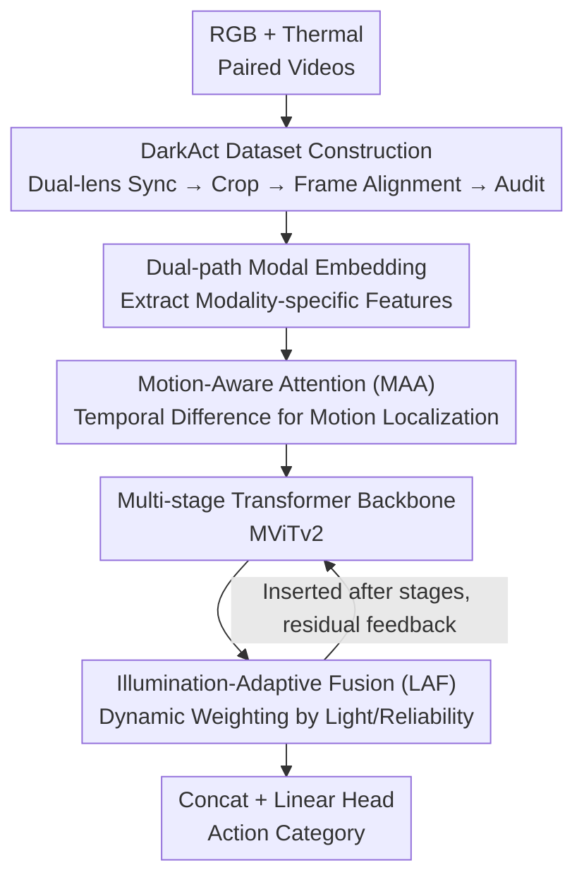

# DarkAct: A RGB-Thermal Dataset and Fusion Framework for Multimodal Low-Light Action Recognition

**Conference**: CVPR 2026  
**Paper**: [CVF Open Access](https://openaccess.thecvf.com/content/CVPR2026/html/Tan_DarkAct_A_RGB-Thermal_Dataset_and_Fusion_Framework_for_Multimodal_Low-Light_CVPR_2026_paper.html)  
**Code**: https://github.com/darkact-creator/DarkAct  
**Area**: Video Understanding  
**Keywords**: Low-light action recognition, RGB-thermal fusion, Multimodal dataset, Motion attention, Illumination-adaptive fusion

## TL;DR
To address the lack of data and methods for human action recognition under nighttime/low-light conditions, the authors construct the first large-scale paired RGB-Thermal video dataset, DarkAct (12,778 video pairs, 27 action classes). They further propose DarkAct-Net, a fusion framework that extracts motion-salient regions using motion-aware attention and dynamically integrates the two modalities based on reliability through illumination-adaptive fusion. It achieves 74.4% Top-1 accuracy in multimodal recognition, significantly exceeding all single-modality and existing fusion baselines.

## Background & Motivation

**Background**: Human Action Recognition (HAR) has achieved significant maturity, with CNNs, 3D convolutions, and Video Transformers performing exceptionally well on benchmarks like Kinetics, UCF101, and HMDB51. However, these mainstream datasets and methods almost universally assume "sufficient illumination," where human appearance is clear and textures are discernible.

**Limitations of Prior Work**: In low-light scenarios (nighttime, poorly lit infrastructure, security surveillance), RGB quality degrades sharply: visibility drops, motion blur increases, and discriminative appearance information is nearly lost. A natural solution is RGB-Thermal fusion, as thermal imaging does not rely on visible light and provides stable imaging in the dark, perfectly complementing RGB's weaknesses. However, this direction is constrained by a major bottleneck: **the lack of large-scale, high-quality paired RGB-Thermal video datasets**. Existing low-light datasets like ARID only provide RGB, cover 11 classes, and mostly feature static scenes with fixed viewpoints. Multimodal datasets (depth, skeleton, inertial sensors) either involve expensive/impractical sensors or are collected under normal lighting.

**Key Challenge**: Robust action recognition in the dark requires an inexpensive, illumination-invariant complementary modality (thermal imaging naturally fits this). However, training such fusion models lacks paired data, creating a deadlock between data and methodology gaps. Furthermore, the authors' empirical tests show that applying existing multimodal fusion frameworks to these low-light heterogeneous signals **actually underperforms single-modality models**, indicating that current fusion mechanisms are not designed for "lighting degradation + cross-spectral registration errors."

**Goal**: Twofold: (1) Construct the first large-scale paired RGB-Thermal dataset specifically for low-light action recognition; (2) Design a fusion baseline capable of handling "low-light + cross-spectral" challenges.

**Key Insight**: Position humans using "motion saliency" instead of "appearance," and integrate modalities using "dynamic weighting based on illumination and modal reliability" instead of "fixed fusion."

**Core Idea**: Utilize Motion-Aware Attention (MAA) to locate humans via motion and Illumination-Adaptive Fusion (LAF) to dynamically integrate modalities.

## Method

The DarkAct paper presents two parallel contributions: the **dataset** (DarkAct) and the **fusion framework** (DarkAct-Net).

### Overall Architecture

**Data level**: A Dahua dual-lens camera captures visible and thermal infrared streams simultaneously. Data was collected in multiple scenarios in Central China during nighttime (20:00–23:00). 11 volunteers performed 27 types of routine nighttime actions. After cropping, frame synchronization, and third-party auditing (>650 hours of manual processing), 12,778 pairs of frame-aligned RGB-Thermal videos were obtained.

**Mechanism**: DarkAct-Net is a Transformer-based framework using MViTv2 as the backbone. Given a pair of RGB-Thermal videos, modal embeddings first extract modality-specific features. These features pass through **Motion-Aware Attention (MAA)** to highlight motion-salient regions and suppress dominant low-light noise. The enhanced features are fed into a multi-stage Transformer, with an **Illumination-Adaptive Fusion (LAF)** module inserted after each stage to dynamically fuse modalities based on illumination reliability. Final stage fusion features are concatenated and passed through a linear classification head for action category prediction using standard cross-entropy loss.

### Key Designs

**1. DarkAct Dataset: First Large-scale Paired RGB-Thermal Low-Light Action Dataset**

This design addresses the fundamental "lack of data" gap in low-light HAR. Using a Dahua DH-TPC-BF2241 dual-lens camera mounted on an adjustable tripod (0.8–3m), the authors covered three dimensions of diversity: **Multi-illumination** (from weak visibility to near-invisibility), **Multi-viewpoint** (top/eye-level/bottom views), and **Multi-scenario/Multi-distance** (indoor/outdoor including terraces, corridors, stairs, meeting rooms, etc.). Action categories (27) include common nighttime activities (walking, waving, squatting, drinking water) while purposefully excluding light-dependent activities (outdoor ball games, cycling). The scale includes 12,778 pairs (30fps, 9,040 train / 3,738 test) with durations of 4.5–19.1s (mean ~5.4s). Pixel intensity statistics show most values concentrated near 0, confirming the "low-light" property. Quality control was rigorous, involving manual cropping and frame-by-frame synchronization.

**2. Motion-Aware Attention (MAA): Locking Humans via Motion Saliency**

Addressing the loss of appearance and dominance of background noise in low-light, MAA relies on "moving regions" rather than texture. For a modal feature $G\in\mathbb{R}^{C\times T\times H\times W}$, temporal difference is calculated: $\Delta_t(i,j)=N(\sin(G_t(i,j)-G_{t-1}(i,j)))$, where $N(\cdot)$ is frame-wise normalization and $\sin$ amplifies subtle temporal changes. A final difference between the first and last frames maintains the $T$ dimension, followed by an MLP to generate the temporal saliency map $E_S$. To handle cross-modal registration errors, a **space-tolerant query** $E_Q$ is constructed by concatenating max and average pooled features of $G$, followed by an MLP: $E_Q=\bar{E}W_M^A$. Finally, attention is applied along the **channel dimension**: $Y=\mathrm{Softmax}\!\big(\frac{E_Q(E_S)^\top}{\sqrt{C}}\big)E_S$. This models inter-channel dependencies to amplify discriminative motion channels and suppress redundancy, while the channel-wise approach provides "tolerance" for pixel-level misalignment.

**3. Light-Adaptive Fusion (LAF): Dynamic Weighting Based on Reliability**

Recognizing that thermal is more reliable in darkness while RGB becomes useful in light, LAF performs dynamic fusion attention $\mathrm{Att}(F^Q,F^K,F^V)$ after each Transformer stage. The **illumination-adaptive query** concatenates motion-enhanced features and stage features: $F^Q=\phi([Y^r\odot F^r;\,Y^t\odot F^t])$. The **modal-specific keys** use 3x3 dilated convolutions: $F^K_{r/t}=\mathrm{ConvBlock}(F_{r/t})$. **Cross-modal values** utilize cross-attention where RGB serves as the query/key and Thermal as the value (and vice-versa): $F^r_A=\mathrm{Att}(F^r,F^r,F^t)$, then concatenates and pools them to derive $F^V$. The output for each modality $F^{r/t}_d=\mathrm{Softmax}\!\big(\frac{F^Q(F^K_{r/t})^\top}{\sqrt{C}}\big)F^V$ is summed after MLP processing to produce $F_{LAF}$, which is added back via residual connections. This allows the weights to adaptively shift towards RGB in bright scenes and Thermal in dark scenes.

### Loss & Training

The network is trained with standard cross-entropy loss using the AdamW optimizer (weight decay 5e-3). A two-stage learning rate schedule is employed: 20 epochs of warmup, followed by 100 epochs of cosine annealing (from 1e-3 to 1e-4) with a batch size of 8 on two RTX A800 GPUs.

## Key Experimental Results

### Main Results

Comparison of DarkAct with existing HAR datasets (MS=Multi-scenario, MV=Multi-viewpoint, MD=Multi-distance):

| Dataset | Classes | Clips | Modality | Light | MS/MV/MD |
|--------|------|--------|------|------|----------|
| UCF101 | 101 | 13,320 | RGB | Normal | ✓/✓/✗ |
| Kinetics-400 | 400 | 254,380 | RGB | Normal | ✓/✓/✗ |
| ARID | 11 | 5,572 | RGB | Low-light | ✓/✗/✗ |
| **DarkAct (Ours)** | 27 | 12,778 | RGB+Thermal | Low-light | ✓/✓/✓ |

DarkAct-Net vs. Single/Multimodal methods (Top-1 %):

| Method | Type | RGB | Thermal | Multimodal Fusion |
|------|------|------|--------|-----------|
| Conv2Former | Single (Best RGB) | 62.1 | 63.9 | – |
| MViTv2-B | Single (Best Thermal) | 57.1 | 69.1 | – |
| CMX | Multimodal Fusion | – | – | 52.6 |
| MRFS | Multimodal Fusion | – | – | 52.7 |
| DFormerv2 | Multimodal Fusion | – | – | 51.1 |
| **DarkAct-Net (Ours)** | Multimodal Fusion | – | – | **74.4** |

**Counter-intuitive findings**: ① Thermal-only significantly outperforms RGB-only (e.g., MViTv2-B 69.1 vs 57.1). ② Existing multimodal fusion methods (CMX/MRFS/DFormerv2 ~52%) **underperform single-modality thermal**, as they are not designed for low-light heterogeneous signals. DarkAct-Net reaches 74.4%, 5.3% higher than the strongest single modality.

### Ablation Study

| Configuration | Top-1 | Top-5 | Description |
|------|-------|-------|------|
| DarkAct-Net (Full) | 74.4 | 92.9 | Full Model |
| w/o MAA | 71.2 | 89.8 | Removes motion awareness |
| w/o LAF | 72.3 | 88.4 | Fixed concatenation instead of LAF |
| w/o MAA + LAF | 70.9 | 90.7 | Baseline dual-stream Transformer |

### Key Findings

- **Complementary Modules**: Removing MAA causes a 3.2% drop; removing LAF causes a 2.1% drop. Both are essential.
- **VLM Failure**: Zero-shot evaluation of VLMs (Cosmos-Reason, LLaVA-Video, GPT-5, etc.) showed **all Top-1 < 20%** (GPT-5 17.9%). This highlights a major gap in VLM generalization to low-light cross-spectral data.
- **Distance/Viewpoint Impact**: Performance drops as subjects move further (78.9% near vs 74.2% far). DarkAct-Net is robust to viewpoints (overhead/eye-level/bottom 78.4/77.3/78.1), whereas CMX fluctuates wildly (69.9 to 54.0).

## Highlights & Insights

- **"Motion over Appearance"**: MAA bypasses the futile attempt to recover low-light textures, focusing on temporal differences. Channel-wise attention handles binocular misalignment gracefully.
- **Illumination-Dependent Fusion**: LAF treats fusion as a function of light. The "dynamic weighting" concept is transferable to any task where modal reliability fluctuates with the environment.
- **Documenting Failure**: Showing that standard fusion models fail against single-modality thermal provides a valuable "negative result" that justifies the need for tailored datasets and methods.
- **VLM Stress Test**: Benchmarking top-tier foundation models like GPT-5 and Gemini (<20%) provides a clean counter-example to "general-purpose" claims in the low-light/cross-spectral domain.

## Limitations & Future Work

- Data is geographically and temporally limited (Central China, 11 volunteers, 20:00–23:00). Generalization to different populations or climates remains unverified.
- Action distribution is slightly imbalanced (e.g., many "walking" samples, fewer "umbrella" samples). ⚠️ Fine-grained class accuracy was not detailed.
- While MViTv2 is the backbone, the inference overhead and real-time capabilities for security deployment were not fully analyzed.
- Long-distance recognition remains a weakness (5% lower than near-distance).

## Related Work & Insights

- **vs. ARID**: ARID is RGB-only with limited classes and viewpoints. DarkAct provides paired RGB-T and significantly more diversity.
- **vs. General Fusion Models (CMX/DFormerv2)**: These models fail to handle low-light heterogeneity, performing worse than single-modality thermal (~52% vs 69%). DarkAct-Net specializes for these conditions.
- **vs. VLM-based HAR**: Current VLMs lack the cross-spectral grounding needed for low-light, necessitating specialized fusion designs.

## Rating
- Novelty: ⭐⭐⭐⭐ First large-scale paired RGB-T low-light dataset + specialized fusion framework.
- Experimental Thoroughness: ⭐⭐⭐⭐ Exhaustive baselines including VLMs; lacks fine-grained class analysis.
- Writing Quality: ⭐⭐⭐⭐ Logical flow from motivation to data and method; clear visualizations.
- Value: ⭐⭐⭐⭐⭐ Fills a major gap in low-light multimodal HAR; open-sourced dataset and code have high practical value for security and robotics.

<!-- RELATED:START -->

## Related Papers

- [\[CVPR 2026\] OpenMarcie: Dataset for Multimodal Action Recognition in Industrial Environments](openmarcie_dataset_for_multimodal_action_recognition_in_industrial_environments.md)
- [\[CVPR 2026\] DarkShake-DVS: Event-based Human Action Recognition under Low-light and Shaking Camera Conditions](darkshake-dvs_event-based_human_action_recognition_under_low-light_and_shaking_c.md)
- [\[CVPR 2026\] VideoNet: A Large-Scale Dataset for Domain-Specific Action Recognition](videonet_a_large-scale_dataset_for_domain-specific_action_recognition.md)
- [\[CVPR 2026\] SHANDS: A Multi-View Dataset and Benchmark for Surgical Hand-Gesture and Error Recognition Toward Medical Training](shands_a_multi-view_dataset_and_benchmark_for_surgical_hand-gesture_and_error_re.md)
- [\[CVPR 2026\] Seeing Motion Through Polarity for Event-based Action Recognition](seeing_motion_through_polarity_for_event-based_action_recognition.md)

<!-- RELATED:END -->
