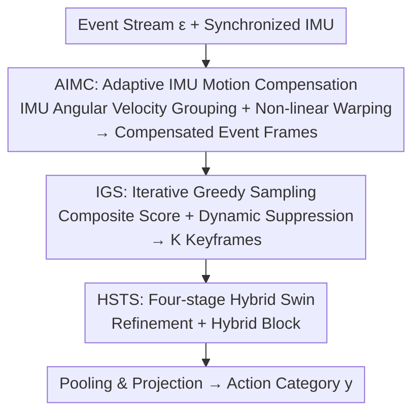

# DarkShake-DVS: Event-based Human Action Recognition under Low-light and Shaking Camera Conditions

**Conference**: CVPR 2026  
**Paper**: [CVF Open Access](https://openaccess.thecvf.com/content/CVPR2026/html/Chen_DarkShake-DVS_Event-based_Human_Action_Recognition_under_Low-light_and_Shaking_Camera_CVPR_2026_paper.html)  
**Code**: Open source promised (Paper tagged [Code], repository URL pending)  
**Area**: Video Understanding  
**Keywords**: Event-based camera, action recognition, IMU motion compensation, keyframe sampling, Swin Transformer  

## TL;DR
Aiming at the realistic but long-neglected action recognition scenario of "low-light + handheld 6-DoF shaking," this paper first utilizes an Adaptive IMU Motion Compensation (AIMC) driven by angular velocity to correct event stream distortions caused by shaking. Subsequently, Iterative Greedy Sampling (IGS) is employed to select the most informative keyframes, followed by a four-stage Hybrid Spatio-Temporal Swin Transformer (HSTS) for recognition. The authors also release DarkShake-DVS (18,041 segments, 62 classes), the first event-based action dataset featuring low-light, intense shaking, and synchronized IMU data, outperforming SOTA on three benchmarks.

## Background & Motivation

**Background**: Mainstream methods for Human Action Recognition (HAR) are almost entirely built on the ideal assumptions of "sufficient lighting + stationary camera," utilizing RGB videos fed into 3D Convolutional/Transformer/Swin-like backbones.

**Limitations of Prior Work**: Real-world deployments (night surveillance, handheld devices, drones) violate both assumptions simultaneously—low-light collapses the signal-to-noise ratio, and 6-DoF free camera motion introduces motion blur. The combination of these factors destroys both spatial appearance and temporal continuity. RGB sensors capture almost no usable information under these conditions (Fig. 1(b) in the paper shows RGB accuracy at only 2.24% in the same setup).

**Key Challenge**: Event cameras are inherently suitable for such scenarios due to their microsecond temporal resolution and high dynamic range, remaining sensitive even in low light. However, existing event-based HAR methods still collapse under the "low-light + shaking" combination for two primary reasons: first, a **lack of datasets** covering low-light, ego-motion, and synchronized IMU data for evaluation; second, existing methods **rarely perform explicit motion compensation**, with IMU-assisted compensation being largely unexplored in HAR.

**Goal**: To address these deficiencies by establishing a truly difficult benchmark and designing a robust recognition pipeline based on the "stabilization first, sampling next, then recognition" strategy.

**Key Insight**: The DAVIS event camera features an integrated IMU providing angular velocity and linear acceleration, which serve as natural cues to estimate and counteract ego-motion. Furthermore, the microsecond timestamps of event streams enable point-by-point compensation.

**Core Idea**: Utilizing the frequency domain characteristics of IMU angular velocity to adaptively segment time windows, and performing non-linear warping to map rotational distortions back to compensate event coordinates. This "cleans" the noisy event stream before passing it to the sampling and recognition network—referred to as Event–IMU Stabilized HAR (EIS-HAR).

## Method

### Overall Architecture
EIS-HAR is a three-stage serial pipeline: the raw event stream and synchronized IMU data are first processed by **AIMC (Adaptive IMU Motion Compensation)** to correct rotational distortions and aggregate them into clear compensated event frames. Since the resulting frame sequence is numerous and highly redundant, **IGS (Iterative Greedy Sampling)** is used to select a small subset of keyframes based on a composite score and dynamic suppression. Finally, these keyframes are fed into a four-stage **HSTS (Hybrid Spatio-Temporal Swin Transformer)** architecture to jointly model long-range structures and local spatio-temporal cues, followed by pooling and projection into action categories. The **DarkShake-DVS benchmark** supports training and evaluation.

### Key Designs

**1. AIMC: Adaptive Windowing via IMU Frequency Characteristics and Non-linear Warping**

The pain point is the drift in event stream positions caused by shaking. The event stream is denoted as $\varepsilon \in \mathbb{R}^{W\times H\times T}=\{e_1,\dots,e_N\}$, where each event $e_i=\{x_i,y_i,t_i,p_i\}$ contains pixel coordinates, microsecond timestamp, and polarity. The IMU provides camera-system angular velocity $\omega_c = R_{ci}\,\omega_i$ (where $R_{ci}$ is the extrinsic rotation from IMU to camera). Compensation integrates angular velocity to obtain three-axis rotation angles $\phi,\theta,\psi$, and establishes a mapping $\varphi:\mathbb{R}^3\to\mathbb{R}^3$ to transform original coordinates into compensated ones: $x'_t = [R(x_t-c_o)-T]+c_o$, where $c_o$ is the image plane center, $R$ is a 2D rotation matrix from z-axis rotation, and $T$ is the equivalent translation caused by x/y rotations. The crucial non-linear term stems from the geometry of the angle of incidence: $\alpha=\tan^{-1}(x\cdot w/f)$, $\beta\approx\alpha-\theta$, and displacement $\Delta l = x-\rho\tan\beta$ ($\rho=f/w$), thus $T=(x_t-c_o)-\rho\tan\beta$. This step solves the differential displacement problem where the same rotation angle corresponds to different displacements at large incident angles.

An implementation hurdle was identified: the microsecond interval between adjacent event frames results in compensation values at the $10^{-6}$ magnitude, while pixel coordinates are stored as integers. Rounding would effectively zero out the displacement. To solve this "physical failure" at the implementation level, the authors propose **adaptive grouping based on angular velocity frequency**: data is first split into positive and negative regions based on the sign of angular velocity, then segmented at local extrema within monotonic regions, and finally grouped based on the median cumulative angular displacement. The time boundaries of each group are synchronized with the event stream using IMU timestamps. Additionally, an **IMU time-aware dynamic scaling factor** is introduced to align the adjacent event interval $\Delta t_{event}$ to the IMU sampling interval $\Delta t_{imu}$. The scaling factor varies according to:

$$\gamma_{group}=\gamma_{min}+\frac{\gamma_{max}-\gamma_{min}}{a\cdot N_{imu}+b}$$

adaptively changing with the number of IMU samples $N_{imu}$ per group ($a,b$ are adjustment coefficients, and $\gamma_{min},\gamma_{max}$ are scaling bounds). This addresses the mismatch of fixed scaling factors under dynamic angular velocities, allowing compensation granularity to change dynamically—making it significantly faster than optimization-based traditional motion compensation (70ms vs. 210–300ms).

**2. IGS: Iterative Greedy Selection via Composite Scoring and Dynamic Suppression**

The total number of compensated frames is highly variable, and long samples are extremely redundant, while traditional uniform sampling may miss sparse but critical moments. IGS calculates a composite score for each candidate frame $i$:

$$S_{comb}(i)=w_{rel}\hat S_{rel}(i)+w_{q}\hat S_{qual}(i)+w_{u}\hat S_{uni}(i)+w_{d}\hat S_{div}(i)$$

where $\hat S_{rel}$ (relevance to action) and $\hat S_{qual}$ (frame quality) represent the **intrinsic value** of the frame, while $\hat S_{uni}$ (temporal uniformity) and $\hat S_{div}$ (visual diversity) represent **dynamic suppression**. The algorithm iteratively builds the keyframe set: the first round selects the highest-scoring frame based solely on intrinsic value. Once selected, dynamic suppression is activated, recalculating $\hat S_{uni}$ and $\hat S_{div}$ for remaining frames—lowering scores for frames with visual redundancy or temporal proximity to the selected set. This ensures high information density while forcing temporal and appearance dispersion.

**3. HSTS: Four-stage Hybrid Swin with Parallel Global Attention and Local Spatio-temporal Convolutions**

$K$ keyframes $X\in\mathbb{R}^{C\times K\times H\times W}$ are divided into non-overlapping 3D patches and projected via 3D convolution: $P_{emb}=E_{patch}(X)$. The architecture consists of four stages, each containing a patch merging layer, a macro **Refinement Block**, and two micro **Hybrid Blocks**. The **Refinement Block** counteracts semantic drift from patch merging by applying spatial consistency and temporal continuity priors using parallel lightweight 2D/1D depthwise separable convolutions: $P_{sp}=C^S_i(P_{in})$, $P_{tp}=C^T_i(P_{in})$, fused as $P_r=P_{sp}+P_{tp}$. The **Hybrid Block** is the core, featuring three parallel paths: $P_A=\mathcal{A}_{Swin}(P_r)$ (Swin attention for global correlations), $P_{LS}=L^S_i(P_r)$ (local spatial for feature stabilization), and $P_{LT}=L^T_i(P_r)$ (local temporal for noise suppression), fused via learnable scalar weights: $P_{out}=w_A P_A+w_{LS}P_{LS}+w_{LT}P_{LT}$. Finally, normalization, global average pooling, and a projection head yield logits: $y=H(P_{avg}(N(P_{out})))$, trained with cross-entropy. This parallel hybrid design captures long-range structures while preserving local spatio-temporal details, as pure Swin attention is sensitive to local noise.

**4. DarkShake-DVS: The First Event HAR Benchmark with Low-light, Intense 6-DoF Shaking, and Synchronized IMU**

Data contribution is as significant as the methodology. High-quality data was collected using a DAVIS-346 (346×260) in real-world low-light scenes, where collectors intentionally introduced 6-DoF motion to simulate realistic shaking, with synchronized accelerometer and gyroscope data. It covers diverse indoor and outdoor scenes (offices, playgrounds, kitchens, etc.), multiple viewpoints, and includes occlusions. It contains 62 classes (30 single-person + 32 two-person interactions like cutting wood, dancing, CPR), involving 15 performers and 18,041 segments, split 6:3:1 for training/validation/test. Difficulty is categorized objectively: the average angular velocity from the gyroscope is used to split the data into low, medium, and high shaking subsets (30%/40%/30%), providing a continuous motion intensity spectrum for robustness evaluation.

### Loss & Training
Hidden dimension is 96, using Adam optimizer (weight decay 2e-2), initial learning rate 5e-4 with CosineAnnealingLR (minimum 1e-5). Training on 2×NVIDIA 4090 for 250 epochs with a batch size of 20, using cross-entropy loss.

## Key Experimental Results

### Main Results
EIS-HAR leads across three benchmarks (HARDVS, DailyDVS-200, DarkShake-DVS).

| Dataset | Metric | Ours | Prev. SOTA | Gain |
|--------|------|------|----------|------|
| HARDVS | acc top-1 | **53.21** | Swin-T 51.91 / ESTF 51.22 | +1.30 |
| DailyDVS-200 | acc top-1 | **51.99** | Evmamba 49.65 | +2.34 |
| DarkShake-DVS | acc (w/ AIMC) | **91.35** | Swin-T 88.86 | +2.49 |

On DarkShake-DVS, the model achieves the highest score with only 34.0M parameters. Furthermore, when AIMC is applied as a plug-and-play preprocessing module to other backbones, nearly all methods show improvement (e.g., SlowFast 83.91→87.25, Spikformer 80.17→85.77). Unexpectedly, Mamba/SSM-based models (VMamba, Vision Mamba, VideoMamba) performed worse, suggesting SSMs may be particularly sensitive to camera shaking.

### Ablation Study
Module-wise ablation on DarkShake-DVS (Full model 91.35):

| Configuration | acc | Description |
|------|------|------|
| Full (Ours) | **91.35** | AIMC + IGS + Re + Hi all enabled |
| w/o AIMC | 88.61 | Remove motion compensation, drop 2.74 |
| w/o IGS | 85.76 | Replace IGS with uniform sampling, drop 5.59 (most critical) |
| w/o Re | 89.43 | Remove Refinement Block, drop 1.92 |
| w/o Hi | 87.36 | Remove spatio-temporal paths of Hybrid Block, drop 3.99 |

Compensation efficiency comparison (single-thread AMD EPYC 7B12): Ours completes an entire segment's compensation in 70ms, whereas the optimization-based optical flow method [11] takes 210ms, and the 4-DOF model [29] takes 300ms. Ours also achieves higher pixel-event density.

### Key Findings
- **IGS is the primary contributor**: Replacing it with uniform sampling leads to a 5.59 drop, significantly more than removing compensation (2.74) or the hybrid block (3.99). This indicates that "selecting the right frames" is more critical than the backbone itself.
- **Motion compensation is an essential preprocessing**: t-SNE visualization shows entangled features for many classes without AIMC; interleaved class separability improves significantly with AIMC. However, the authors admit that some classes with extreme shaking remain difficult to distinguish even after compensation.
- **SSMs behave abnormally under shaking**: Mamba-based models are among the few that do not improve or even degrade with AIMC, suggesting a structural weakness in state-space models regarding camera ego-motion robustness.

## Highlights & Insights
- **Addressing the "integer rounding" pitfall**: Unlike many papers that hide implementation details, this work explicitly notes that microsecond compensation values ($10^{-6}$) are zeroed out by integer rounding, and bypasses this via frequency grouping and dynamic scaling factors—a problem identified through real-world deployment.
- **Objective shaking classification via gyroscope**: Categorizing dataset difficulty into quantitative low/medium/high tiers is more reliable than subjective labeling and provides a standardized axis for robustness evaluation.
- **Plug-and-play AIMC**: As an independent preprocessing module, it improves performance when paired with various existing backbones, offering high transfer value for any event-based HAR work with synchronized IMU data.

## Limitations & Future Work
- **Dependence on synchronized IMU and approximation assumptions**: The method approximates depth as a constant (no depth sensing, assuming uniform distance), which may fail in scenes with drastic distance variations.
- **Limits in extreme shaking**: The authors concede that some high-shaking categories still suffer from feature collapse after compensation, indicating purely rotational compensation has limitations against large translational distortions.
- **Hyperparameter sensitivity**: Details for $a,b,\gamma_{min},\gamma_{max}$ are in the supplementary materials; the main text lacks sensitivity analysis for these parameters.
- Most comparisons and ablations are concentrated on the DarkShake-DVS dataset, with cross-domain generalization (e.g., on real drone platforms) yet to be fully validated.

## Related Work & Insights
- **vs. IMU Motion Compensation [55]**: Ours follows its rotational compensation framework but fixes grid artifacts caused by floating-point precision and adds frequency adaptive grouping for sharper reconstruction and higher density.
- **vs. Optimization-based Compensation (Contrast Maximization [11] / Joint Motion Estimation [29])**: Optimization methods rely on expensive iterative solvers (210–300ms) and suffer from local optical flow overlaps. This work uses IMU spatio-temporal correlation for faster (70ms) compensation, avoiding optimization.
- **vs. General Video Backbones (Swin-T / TimeSformer / SlowFast)**: These assume stable inputs and show limited effectiveness on shaking event frames. This work stabilizes before recognition, and the HSTS parallel hybrid architecture better fits the sparse spatio-temporal nature of event data.

## Rating
- Novelty: ⭐⭐⭐⭐ First low-light+6-DoF+IMU event HAR benchmark; adaptive IMU compensation is an innovative path.
- Experimental Thoroughness: ⭐⭐⭐⭐ Three datasets + complete ablation + compensation quality/efficiency + t-SNE, though some hyperparameter details are relegated to supplementary materials.
- Writing Quality: ⭐⭐⭐⭐ Clear motivation, complete formulas, and honest disclosure of implementation challenges.
- Value: ⭐⭐⭐⭐ The dataset and plug-and-play AIMC provide tangible value to the event-based HAR community.

<!-- RELATED:START -->

## Related Papers

- [\[CVPR 2026\] Seeing Motion Through Polarity for Event-based Action Recognition](seeing_motion_through_polarity_for_event-based_action_recognition.md)
- [\[CVPR 2026\] DarkAct: A RGB-Thermal Dataset and Fusion Framework for Multimodal Low-Light Action Recognition](darkact_a_rgb-thermal_dataset_and_fusion_framework_for_multimodal_low-light_acti.md)
- [\[CVPR 2026\] SMV-EAR: Bring Spatiotemporal Multi-View Representation Learning into Efficient Event-Based Action Recognition](smv-ear_bring_spatiotemporal_multi-view_representation_learning_into_efficient_e.md)
- [\[CVPR 2026\] EgoXtreme: A Dataset for Robust Object Pose Estimation in Egocentric Views under Extreme Conditions](egoxtreme_a_dataset_for_robust_object_pose_estimation_in_egocentric_views_under_.md)
- [\[CVPR 2026\] SDTrack: A Baseline for Event-based Tracking via Spiking Neural Networks](sdtrack_a_baseline_for_event-based_tracking_via_spiking_neural_networks.md)

<!-- RELATED:END -->
