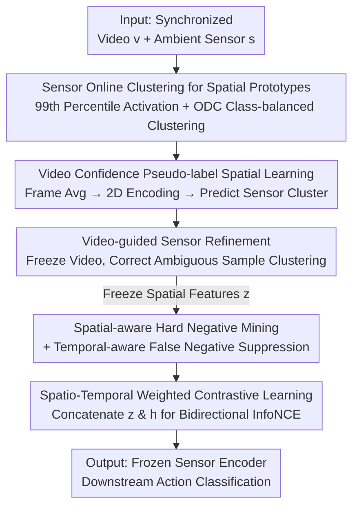

# DETACH: Decomposed Spatio-Temporal Alignment for Exocentric Video and Ambient Sensors with Staged Learning

**Conference**: CVPR 2026  
**Paper**: [CVF Open Access](https://openaccess.thecvf.com/content/CVPR2026/html/Yoon_DETACH__Decomposed_Spatio-Temporal_Alignment_for_Exocentric_Video_and_Ambient_CVPR_2026_paper.html)  
**Code**: https://github.com/JaemoJeong/DETACH  
**Area**: Video Understanding  
**Keywords**: Cross-modal Alignment, Human Activity Recognition, Ambient Sensors, Spatio-temporal Decoupling, Contrastive Learning  

## TL;DR
Addressing the novel non-intrusive activity recognition scenario of "fixed exocentric video + ambient sensors," DETACH decomposes both video and sensor data into "spatial components + temporal components." It establishes cross-modal spatial correspondence via online clustering and performs fine-grained temporal alignment using spatial-guided weighted contrastive loss. On Opportunity++ and HWU-USP, it achieves up to a 30% F1 improvement and a 50% mAP improvement over methods adapted from egocentric baselines.

## Background & Motivation

**Background**: Mainstream multimodal Human Activity Recognition (HAR) has recently focused on aligning **egocentric video and wearable sensors (IMU)**. Since these modalities are naturally synchronized and highly correlated in space and time, methods (e.g., IMU2CLIP, PRIMUS, EVI-MAE, COMODO) that compress whole video segments and sensor streams into single vectors for **Global Alignment** have performed well.

**Limitations of Prior Work**: Egocentric and wearable-based solutions face significant deployment hurdles: users must wear devices constantly (discomfort), privacy is exposed, and multi-user scaling is difficult. A more practical alternative is **exocentric video (fixed cameras) + ambient sensors (contact switches on objects/walls, object IMUs)**, which is non-intrusive and scalable. however, this combination was previously **unexplored**, and directly applying Global Alignment fails.

**Key Challenge**: The authors identify two structural failures of Global Alignment in this new scenario:
- **P1 Inability to capture local details**: When visual changes are subtle and the background is static, compressing a whole video into one vector allows the static background to overwhelm temporal dynamics. This results in semantically distinct actions like "opening a drawer," "closing a dishwasher," and "opening a fridge" appearing highly similar in the feature space.
- **P2 Over-reliance on modality-invariant temporal features**: Exocentric video contains visual spatio-temporal context, whereas ambient sensors are time series that **implicitly encode spatial semantics in "which channel is activated."** The only shared signal between modalities is temporal dynamics. Consequently, temporal features dominate alignment, distorting negative sample relationships—e.g., for an anchor "Open Cabinet 1," the model might incorrectly pull "Open Cabinet 2" (easy negative, should be distinct) closer than "Close Cabinet 1" (hard negative, should be semantically similar but temporally opposite).

**Goal**: In the absence of shared spatial signals in exocentric-ambient scenarios, the goal is to preserve subtle temporal cues in video (solving P1) while reconstructing cross-modal spatial correspondence to correct negative sample structures distorted by temporal similarity (solving P2).

**Core Idea**: **Align space and time separately in two stages**—first, establish spatial structures within each modality (using frame-averaged spatial features for video and online clustering for sensors to turn implicit channel activations into explicit spatial prototypes) to build cross-modal spatial grounding. Second, freeze spatial features and use a **spatial-guided weighted contrastive loss** to focus on fine-grained temporal differentiation, weighting hard negatives and suppressing false negatives.

## Method

### Overall Architecture

DETACH processes a mini-batch of $N$ synchronized video-sensor pairs $B=\{(v_i,s_i)\}_{i=1}^N$. Each modality utilizes two encoders: spatial encoders $f_{\{v,s\}}$ producing spatial embeddings $z_{v,i}=f_v(v_i),\ z_{s,i}=f_s(s_i)\in\mathbb{R}^{d_S}$, and temporal encoders $g_{\{v,s\}}$ producing temporal embeddings $h_{v,i}=g_v(v_i),\ h_{s,i}=g_s(s_i)\in\mathbb{R}^{d_T}$. The process is **serial across two stages**:

- **Stage 1 (Cross-modal Spatial Representation Learning)**: Organize representations in latent spaces according to spatial sources. The sensor side discovers location activation patterns via online clustering, while the video side learns to predict sensor cluster pseudo-labels. Video is then used to refine ambiguous sensor samples to establish robust spatial grounding.
- **Stage 2 (Cross-modal Temporal Alignment)**: **Freeze** the spatial features from Stage 1. Use them to identify and weight negative samples for spatial-guided weighted contrastive learning, forcing the model to focus on fine-grained temporal discrimination.

### Key Designs

**1. Sensor Online Clustering for Spatial Prototypes: Making Implicit Activation Explicit**

This is the first step to solve P2. Ambient sensors lack explicit "spatial coordinates," but **every activation reflects activity at a specific location**—an IMU and a switch on the same door share a location. The authors use Online Deep Clustering (ODC) to make this location semantics explicit: the number of clusters is set to the number of installed sensor locations. A base encoder (1D CNN + GRU) encodes activation patterns. To enhance spatial discriminability, the **99th percentile of each channel's signal** is used as a "channel activation intensity vector" (to resist outliers), which is projected and element-wise added to the encoding. The objective is class-balanced cross-entropy:

$$\mathcal{L}_{\text{cluster}} = -\frac{1}{N}\sum_{i=1}^{N} w_{\hat{y}_i}\,\log p(\hat{y}_i\mid z_{s,i})$$

where $\hat{y}_i$ is the pseudo-label and $w_{\hat{y}_i}=1/|C_{\hat{y}_i}|^{0.5}$ handles cluster imbalance. This maps "opening/closing the same object" to the same spatial cluster, providing the basis for cross-modal spatial grounding.

**2. Confidence Pseudo-labels + Video-guided Refinement: Bi-directional Calibration**

To align video with the same spatial structure, the authors train a video spatial encoder (frame averaging + 2D CNN) to predict sensor pseudo-labels. To handle sensor noise, samples are evaluated based on their **Euclidean distance to the cluster centroid**. Samples in the top 75th percentile of distance within each cluster are marked as confident ($m_i=1$), and others as ambiguous. Video learning occurs only on confident samples:

$$\mathcal{L}_{\text{videospatial}} = -\frac{1}{\sum_i m_i}\sum_{i=1}^{N} m_i\,\log p(\hat{y}_i\mid z_{v,i})$$

Subsequently, the video spatial encoder is **frozen**, and its hard predictions $\tilde{y}_i$ are used to refine the clustering of ambiguous sensor samples ($m_i=0$):

$$\mathcal{L}_{\text{refine}} = -\frac{1}{\sum_i (1-m_i)}\sum_{i=1}^{N}(1-m_i)\,\log p(\tilde{y}_i\mid z_{s,i})$$

**3. Spatio-Temporal Adaptive Weights: Hard Negative Mining & False Negative Suppression**

In Stage 2, frozen spatial features are used to weight negative pairs. Easy negatives (different spaces) are already separable. The focus shifts to **hard negatives (same space, different temporal dynamics)**. Intra-modal spatial similarity is calculated:

$$\mathcal{S}_{ij}^{\text{spatial}} = \text{ReLU}\!\left(\max\big(\text{sim}(z_{v,i},z_{v,j}),\ \text{sim}(z_{s,i},z_{s,j})\big)\right)$$

Weights are interpolated from $1.0$ (easy) to $\lambda_{\text{hard}}$ (hard): $W_{ij}^{\text{spatial}}=1.0+(\lambda_{\text{hard}}-1.0)\cdot\mathcal{S}_{ij}^{\text{spatial}}$. To avoid penalizing **false negatives** (same space, same time), temporal similarity $\mathcal{S}_{ij}^{\text{temporal}}$ from a momentum encoder (EMA) is used for down-weighting:

$$W_{ij} = W_{ij}^{\text{spatial}} \cdot (1.0 - (\mathcal{S}_{ij}^{\text{spatial}}\cdot\mathcal{S}_{ij}^{\text{temporal}}))$$

**4. Spatio-Temporal Weighted Contrastive Learning**

Frozen spatial embeddings $z$ and temporal embeddings $h$ are **concatenated** as $u_{x,i}=[z_{x,i},h_{x,i}]$ to provide spatial context for temporal features. The adaptive weights $W_{ij}$ are integrated into a bidirectional InfoNCE loss:

$$\mathcal{L}_{\text{v2s}}=-\frac{1}{N}\sum_{i=1}^{N}\log\frac{\exp(\mathcal{S}_{ii})}{\exp(\mathcal{S}_{ii})+\sum_{j\neq i}W_{ij}\cdot\exp(\mathcal{S}_{ij})}$$

### Loss & Training
The two stages are trained separately: Stage 1 for 10 epochs and Stage 2 for 50 epochs. The AdamW optimizer is used with a weight decay of $1\times10^{-4}$ and an initial learning rate of $1\times10^{-4}$. Cluster count $K=7$ (or 6 for HWU-USP). Hyperparameters: $\alpha=1.0, \beta=1.5, \tau=0.10, \lambda_{\text{hard}}=3.0$.

## Key Experimental Results

### Main Results
Evaluated on **Opportunity++** (IMU/switches, 14 labels) and **HWU-USP** (switches/motion sensors, 5 labels). The sensor encoder is frozen for linear evaluation.

| Dataset | Metric | DETACH | Runner-up (EVI-MAE) | Gain |
|--------|------|--------|---------------|------|
| Opportunity++ | F1 (Weighted) | **0.73** | 0.56 | +0.17 |
| Opportunity++ | mAP | **0.87** | 0.58 | +0.29 |
| HWU-USP | F1 (Weighted) | **0.73** | 0.60 | +0.13 |
| HWU-USP | mAP | **0.67** | 0.55 | +0.12 |

While EVI-MAE benefits from multimodal masked modeling, its reliance on Global Alignment limits performance. DETACH significantly outperforms all baselines.

### Ablation Study

**Adaptive Weight Components**:

| Configuration | Opp++ F1 | Opp++ mAP | HWU F1 | HWU mAP |
|------|----------|-----------|--------|---------|
| Full ($\mathcal{L}_{\text{CL}}$) | **0.73** | **0.87** | **0.73** | **0.67** |
| w/o $W^{\text{spatial}}$ | 0.56 | 0.71 | 0.65 | 0.61 |
| w/o $W^{\text{temporal}}$ | 0.62 | 0.71 | 0.60 | 0.61 |

**Loss Components**:

| Refinement | Contrastive | Opp++ F1 | Opp++ mAP | HWU F1 | HWU mAP |
|------------|-------------|----------|-----------|--------|---------|
| × | InfoNCE | 0.59 | 0.70 | 0.68 | 0.62 |
| ✓ | $\mathcal{L}_{\text{CL}}$ (Ours) | **0.73** | **0.87** | **0.73** | **0.67** |

### Key Findings
- **Complementary Weights**: Removing $W^{\text{spatial}}$ significantly hurts performance (Opportunity++ F1 0.73 → 0.56), showing hard negative mining is the primary driver.
- **Refinement synergy**: Refinement must be paired with weighted contrastive learning; applying refinement with standard InfoNCE can lead to instability.
- **Categorical separability**: The model effectively separates hard/false negatives along the temporal similarity axis within high spatial similarity regions.

## Highlights & Insights
- **Ambient Sensor Logic**: The insight that "channel activation equals implicit spatial encoding" is crucial. Using clustering to turn this into explicit prototypes creates the grounding necessary for cross-modal alignment.
- **Negative Sample Refinement**: Categorizing negatives into easy, hard, and false types—and treating them differently—is far more precise than standard InfoNCE and is applicable to other noisy contrastive learning scenarios.
- **Staged Learning**: Prioritizing spatial grounding before temporal alignment prevents the "dynamic-overwhelming" problem (P1).

## Limitations & Future Work
- **Sensor Modalities**: Currently limited to explicit motion dynamics; fusion with audio or lighting sensors is left for future work.
- **Single-user Bias**: The framework is designed for single-user scenarios due to dataset limitations; multi-user scalability remains to be tested.
- **Heuristics**: Cluster count $K$ is tied to physical sensor counts, which requires deployment prior knowledge.

## Related Work & Insights
- **Contrast with Global Alignment**: Whereas prior works (IMU2CLIP, EVI-MAE) use global vectors suited for egocentric-wearable pairs, DETACH addresses the structural asymmetry of exocentric-ambient data through decomposition. 
- **Contrast with Fine-grained Decoupling**: Similar to DiCoSA and ProST in video-text, DETACH extends "semantic decoupling" to the exocentric-ambient domain, specifically solving the "implicit space" problem of ambient sensors.

## Rating
- Novelty: ⭐⭐⭐⭐⭐ 
- Experimental Thoroughness: ⭐⭐⭐⭐ 
- Writing Quality: ⭐⭐⭐⭐⭐ 
- Value: ⭐⭐⭐⭐ 

<!-- RELATED:START -->

## Related Papers

- [\[CVPR 2026\] CVA: Context-aware Video-text Alignment for Video Temporal Grounding](cva_context-aware_video-text_alignment_for_video_temporal_grounding.md)
- [\[CVPR 2026\] SARL-STG: A Spatially Aware Reinforcement Learning Framework for Refining MLLMs in Spatio-Temporal Video Grounding](sarl-stg_a_spatially_aware_reinforcement_learning_framework_for_refining_mllms_i.md)
- [\[CVPR 2026\] Cluster-Wise Spatio-Temporal Masking for Efficient Video-Language Pretraining](cluster-wise_spatio-temporal_masking_for_efficient_video-language_pretraining.md)
- [\[CVPR 2026\] CaptionFormer: Unified Segmentation, Tracking, and Captioning for Spatio-Temporal Objects](captionformer_unified_segmentation_tracking_and_captioning_for_spatio-temporal_o.md)
- [\[CVPR 2026\] Spatio-Temporal Conditional Denoising Transformer for Modality-Missing RGBT Tracking](spatio-temporal_conditional_denoising_transformer_for_modality-missing_rgbt_trac.md)

<!-- RELATED:END -->
