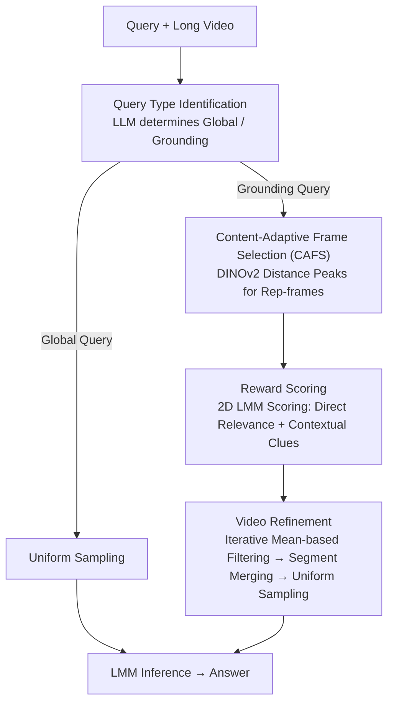

# DIvide, then Ground: Adapting Frame Selection to Query Types for Long-Form Video Understanding

**Conference**: CVPR 2026  
**arXiv**: [2512.04000](https://arxiv.org/abs/2512.04000)  
**Code**: [GitHub](https://github.com/Jialuo-Li/DIG)  
**Area**: Video Understanding  
**Keywords**: Long video understanding, Frame selection, Query classification, Content-adaptive sampling, Large Multimodal Models (LMMs)

## TL;DR

DIG is a training-free frame selection framework that categorizes queries into global or grounding types. It employs uniform sampling for global queries and a specialized pipeline—consisting of content-adaptive frame selection, LMM-based reward scoring, and video refinement—for grounding queries, consistently outperforming existing methods across three long video understanding benchmarks.

## Background & Motivation

Large Multimodal Models (LMMs) face a **Key Challenge** in video understanding: the massive volume of video tokens versus the limited LLM context length, which necessitates inputting only a sampled subset of frames. While uniform sampling maximizes temporal coverage, it is entirely query-agnostic.

Prior works proposed query-aware adaptive frame selection (e.g., AKS, Q-Frame) but incur high computational costs. This paper identifies a **frequently overlooked core problem**:

> Is a complex search mechanism necessary for all query types? The answer is **no**.

The design of the proposed method is driven by these **Key Insights**:

- **Global Queries** (e.g., "What is the theme of this video?"): These require comprehensive video information, for which uniform sampling is already efficient and effective.
- **Grounding Queries** (e.g., "What kind of bike is that person riding?"): These target specific time segments; uniform sampling introduces many irrelevant frames, leading to performance degradation.
- **More frames $\neq$ better performance**: Experiments reveal that the accuracy of all LMMs eventually declines after reaching an optimal number of frames, with the decline primarily driven by grounding queries.

## Method

### Overall Architecture

DIG aims to solve the problem of how to optimally use the limited "slots" in an LMM's context (often just dozens of frames). Instead of applying the same complex search to all questions, it first identifies "what the query wants." The process starts with query routing into two distinct paths: global queries go directly to uniform sampling without additional search, while grounding queries enter a specialized grounding pipeline. This pipeline generates representative frames via CAFS, assigns relevance scores using an LMM, iteratively filters low-score frames, and finally merges surviving segments for uniform sampling. The **Mechanism** is summarized as: **classify first, then decide whether to invest in frame searching.**

### Key Designs

**1. Query Type Identification: Deciding whether to search based on question category**

The value of DIG rests on this bifurcation. The authors discovered that complex frame selection offers little to no benefit (and sometimes negative gain) for global queries because they require full-clip information already well-covered by uniform sampling. DIG uses an off-the-shelf LLM (Qwen3-Next-80B-A3B) to automatically classify queries. Global queries skip the expensive pipeline, while only grounding queries initiate the search. This **Design Motivation** moves the computational decision to the very front of the process.

**2. Content-Adaptive Frame Selection (CAFS): Aligning sampling density with visual changes**

Fixed-rate sampling either misses key moments or wastes slots on redundant frames. CAFS samples based on "content change" rather than time. It first samples $M$ frames at 2fps, extracts features using DINOv2, and calculates the cosine distance sequence between adjacent frames:

$$d_i = 1 - \text{sim}(V_{I_i}, V_{I_{i+1}})$$

High-distance points indicate significant visual changes or scene cuts. CAFS detects prominent peaks (prominence > 0.1) in this sequence as split points, dividing the video into semantically coherent segments and selecting the midpoint of each as a **representative frame (r-frame)**.

**3. Reward Scoring: Using LMMs instead of CLIPScore for relevance**

Conventional methods use CLIPScore for shallow feature matching, but grounding queries often require reasoning (e.g., identifying a person before their bike). DIG employs an LMM to score frames on two dimensions: **direct relevance** to the query, and whether the frame **hints at supplementary information in neighboring frames**. This second dimension ensures the model looks beyond isolated frames.

**4. Video Refinement: Parameter-free filtering and segment restoration**

Instead of using a fixed Top-K hyperparameter, DIG uses **Iterative Reward-Guided Selection**. It repeatedly removes r-frames with scores below the current mean until the set stabilizes. To maintain context, DIG performs **segment merging**: it doesn't just keep the r-frame but merges its original segment and neighboring segments within a window $w_{len}$ into continuous video clips. Final frames are then uniformly sampled from these refined segments.

### Loss & Training

DIG is a completely **training-free** framework. All components (DINOv2, LLM classifier, LMM scorer) utilize pre-trained models. The only primary hyperparameters are the token count per frame (56) and the window size ($w_{len}=2$).

## Key Experimental Results

### Main Results

**Using Qwen2.5-VL-32B as the base LMM:**

| Method | #Frames | MLVU | LVB | VideoMME-Med | VideoMME-Long |
|------|-----|------|-----|-------------|--------------|
| UNI | 32 | 61.91 | 57.89 | 57.89 | 53.33 |
| AKS | 32 | 66.42 | 59.31 | 59.89 | 56.00 |
| Q-Frame | 32 | 60.95 | 57.37 | 60.43 | 55.90 |
| **Ours (DIG)** | 32 | **70.69** | **61.86** | **60.87** | **57.76** |

### Ablation Study

| Configuration | Function / Insight |
|------|---------|
| UNI on GQ vs. DIG on GQ | Comparable performance; complex selection is unnecessary for global queries. |
| UNI on LQ vs. DIG on LQ | DIG significantly leads; grounding queries are the primary source of gain. |
| CLIPScore vs. LMM Reward | LMM Reward provides a +1~3% boost by handling complex reasoning. |
| Extending 8 to 256 frames | DIG maintains a lead, whereas AKS/Q-Frame can drop below UNI at high frame counts. |

### Key Findings

1. **Gain**: At 32 frames, DIG improves by 7.68% (MLVU) and 4.51% (LVB) over uniform sampling.
2. **Query Classification**: Critical for balancing efficiency and accuracy across different task types.
3. **Performance Degradation**: Grounding queries are the main cause of accuracy drops when frame counts increase beyond the optimal point.
4. **Scalability**: Unlike competitors, DIG remains effective even when the frame budget is high (e.g., 256 frames).

## Highlights & Insights

- **Simple Core Insight**: The realization that not all queries need complex selection is intuitive but powerful.
- **Training-Free**: Plugs into existing LMM pipelines without any retraining or fine-tuning costs.
- **Parameter-Free Filtering**: The iterative mean-reduction approach avoids manual tuning of the "K" in Top-K selection.
- **Context Preservation**: Merging segments instead of picking isolated frames provides the LMM with necessary temporal context.

## Limitations & Future Work

1. **LLM Dependency**: The accuracy of query classification is a single point of failure.
2. **Computational Overhead**: While efficient for global queries, the grounding pipeline (DINOv2 + LMM scoring) remains computationally intensive.
3. **Granularity of Classification**: A binary (Global/Grounding) split may be too simple for complex queries involving both global and local temporal dynamics.
4. **Fixed Thresholds**: The prominence threshold for CAFS might not generalize to all video styles (e.g., extremely fast vs. slow pacing).

## Related Work & Insights

- Demonstrates superiority over current SOTA frame selection methods like AKS and Q-Frame by being strategy-adaptive.
- Validates the trend of using LMMs themselves as evaluators for frame relevance.
- The "Segment Merging" concept shares similarities with video retrieval and summarization techniques.

## Rating

- **Novelty**: ⭐⭐⭐⭐ — The core insight regarding query-specific strategies is elegant and effective.
- **Experimental Thoroughness**: ⭐⭐⭐⭐⭐ — Extensive testing across multiple benchmarks, LMMs, and frame counts.
- **Writing Quality**: ⭐⭐⭐⭐ — Clear motivation and well-structured technical descriptions.
- **Value**: ⭐⭐⭐⭐ — Highly practical for deployment in real-world long video understanding systems.

## Related Papers

- [\[CVPR 2026\] Efficient Frame Selection for Long Video Understanding via Reinforcement Learning](efficient_frame_selection_for_long_video_understanding_via_reinforcement_learnin.md)
- [\[CVPR 2026\] Wavelet-based Frame Selection by Detecting Semantic Boundary for Long Video Understanding](wavelet-based_frame_selection_by_detecting_semantic_boundary_for_long_video_unde.md)
- [\[CVPR 2026\] VideoARM: Agentic Reasoning over Hierarchical Memory for Long-Form Video Understanding](videoarm_agentic_reasoning_over_hierarchical_memory_for_long-form_video_understa.md)
- [\[CVPR 2026\] Thinking with Drafts: Speculative Temporal Reasoning for Efficient Long Video Understanding](thinking_with_drafts_speculative_temporal_reasoning_for_efficient_long_video_und.md)
- [\[CVPR 2026\] Video Panels for Long Video Understanding](video_panels_for_long_video_understanding.md)

<!-- RELATED:END -->

<!-- RELATED:START -->

## Related Papers

- [\[CVPR 2026\] Efficient Frame Selection for Long Video Understanding via Reinforcement Learning](efficient_frame_selection_for_long_video_understanding_via_reinforcement_learnin.md)
- [\[CVPR 2026\] Wavelet-based Frame Selection by Detecting Semantic Boundary for Long Video Understanding](wavelet-based_frame_selection_by_detecting_semantic_boundary_for_long_video_unde.md)
- [\[CVPR 2026\] Video Panels for Long Video Understanding](video_panels_for_long_video_understanding.md)
- [\[CVPR 2026\] GIFT: Global Irreplaceability Frame Targeting for Efficient Video Understanding](gift_global_irreplaceability_frame_targeting_for_efficient_video_understanding.md)
- [\[ICCV 2025\] Q-Frame: Query-aware Frame Selection and Multi-Resolution Adaptation for Video-LLMs](../../ICCV2025/video_understanding/q-frame_query-aware_frame_selection_and_multi-resolution_adaptation_for_video-ll.md)

<!-- RELATED:END -->
