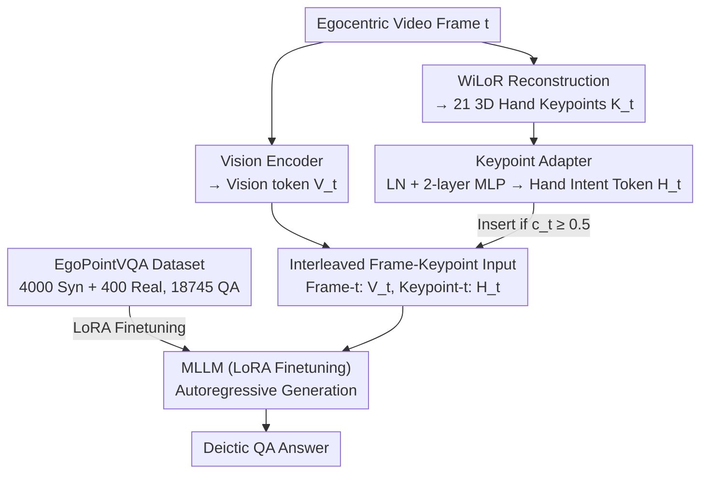

# Do You See What I Am Pointing At? Gesture-Based Egocentric Video Question Answering

**Conference**: CVPR 2026  
**arXiv**: [2603.12533](https://arxiv.org/abs/2603.12533)  
**Code**: [https://yuuraa.github.io/papers/choi2026egovqa](https://yuuraa.github.io/papers/choi2026egovqa) (Coming soon)  
**Area**: Video Understanding  
**Keywords**: Egocentric Video QA, Gesture Understanding, Deictic Reference, 3D Hand Keypoints, Multi-modal Large Language Models

## TL;DR
The paper introduces the EgoPointVQA dataset and the HINT (Hand Intent Tokens) method. By encoding 3D hand keypoints into hand intent tokens and interleaving them with vision tokens as input to an MLLM, the approach solves gesture-based deictic question answering in egocentric videos. HINT-14B achieves 68.1% accuracy, outperforming InternVL3-14B by 5.4pp.

## Background & Motivation
With the increasing popularity of AR/VR devices (e.g., Apple Vision Pro, Meta Orion) and smart glasses, AI assistants need to understand the user's focus of attention within the environment. In natural communication, people frequently use deictic expressions (e.g., "What is this?", "Should I use this?"), which can only be answered by combining the user's gesture pointing.

**Limitations of Prior Work**: Current MLLMs (including GPT-4o and Qwen3-VL-32B) perform poorly on such tasks for two reasons: (1) training data lacks egocentric videos rich in gestures; (2) architectures lack explicit mechanisms to encode gesture information—models only perform global vision-text fusion and fail to map "this" to a specific object pointed at by a finger.

**Core Idea**: Use a lightweight adapter to encode 3D hand keypoints into hand intent tokens aligned with vision tokens, explicitly providing gesture pointing information to the model.

## Method

### Overall Architecture
The goal of HINT is to enable MLLMs to understand exactly what "this/that" refers to, which is determined by the user's gesture. It maintains the backbone and introduces a parallel hand intent stream: while processing frame-by-frame, the vision encoder outputs vision tokens $V_t$, while a pre-existing WiLoR model reconstructs 21 3D hand keypoints $K_t \in \mathbb{R}^{21 \times 3}$ from the image. A lightweight Keypoint Adapter then compresses these geometric coordinates into a hand intent token $H_t$. Rather than concatenating features, the tokens are interleaved chronologically (a hand intent token immediately follows the vision tokens of the corresponding frame) and fed into the LLM. This allows the model to simultaneously perceive "what is in the scene" and "where the hand is pointing" when generating answers. The method is accompanied by the EgoPointVQA dataset, as the lack of training data is a primary bottleneck.

### Key Designs

**1. EgoPointVQA Dataset: Filling the gap in "gesture-pointing QA" training data**

One root cause of the performance bottleneck lies in data: existing egocentric VQA datasets do not focus on gesture pointing scenarios. The authors constructed EgoPointVQA, consisting of 4000 synthetic videos from the AI2-THOR simulator (184 indoor scenes) using MIXAMO inverse kinematics to generate natural pointing gestures. Additionally, 400 real videos were collected by 20 participants using Meta Ray-Ban smart glasses (360 indoor + 40 outdoor segments). Collectively, there are 18,745 QA pairs covering 6 task categories: Reference (identifying the pointed object), Counting (counting similar items), Spatial (spatial relationships), Temporal (sequence of multiple points), Attribute (properties), and Feedback (functional feedback). The test set consists of 300 real videos with 672 QA pairs, manually verified for answer correctness and unambiguous deixis.

**2. Keypoint Adapter: Encoding 3D hand keypoints as tokens rather than visual overlays**

Instead of superimposing keypoints or arrows on frames—which ablation studies show can interfere with visual understanding—HINT uses learned encoding. $K_t$ is flattened into a 63-dimensional vector $\tilde{k}_t = \text{flatten}(K_t) \in \mathbb{R}^{63}$, processed via LayerNorm and a two-layer MLP with GeLU to map it to the LLM's hidden dimension, resulting in a hand intent token:

$$H_t = W_2\,\sigma\!\big(W_1\,\text{LN}(\tilde{k}_t)\big), \quad W_1 \in \mathbb{R}^{d_h \times 63},\; W_2 \in \mathbb{R}^{d \times d_h}.$$

The token is only inserted when the hand detection confidence $c_t \geq \tau = 0.5$, naturally skipping frames without hands. This allows the model to learn how to utilize geometric information rather than imposing a fixed visual prompt format. The adapter is extremely lightweight, with tokens accounting for less than 1% of the total count and adding only 0.26s to inference time.

**3. Interleaved Frame-Keypoint Input: Temporal alignment of gesture tokens and frames**

HINT arranges the sequence in an interleaved format: `Frame-1: <vis> Keypoint-1: <key> Frame-2: <vis> ...`. By placing the hand intent token immediately after the corresponding frame's vision tokens, the LLM autoregressively generates answers conditioned on the gesture signals:

$$p(X_a \mid V, X_q, H) = \prod_{i=1}^{L} p\big(x_i \mid V, X_{q,<i}, X_{a,<i}, H_{<i}\big).$$

Compared to concatenating all gesture tokens separately, this alignment allows the model to naturally bind each gesture to its corresponding frame along the temporal axis, facilitating spatiotemporal alignment for temporal sequence questions.

### Loss & Training
- LoRA is used to finetune the vision encoder and LLM, while the Keypoint Adapter is trained from scratch.
- AdamW optimizer with a cosine learning rate scheduler, batch size of 32, for 1 epoch.
- Training data consists of synthetic data mixed with 100 real videos.

## Key Experimental Results

### Main Results

| Model | Params | Reference | Temporal | Spatial | Count | Attr. | Feed. | Average |
|------|--------|-----------|----------|---------|-------|-------|-------|------|
| GPT-5 | - | 75.6 | 53.6 | 62.3 | 50.0 | 56.1 | 77.8 | 62.6 |
| Qwen3-VL | 32B | 63.7 | 67.9 | 65.8 | 66.7 | 63.4 | 77.2 | 67.5 |
| InternVL3 | 14B | 63.1 | 66.1 | 61.4 | 50.0 | 58.5 | 77.2 | 62.7 |
| **HINT-InternVL3** | **14B** | **73.8** | **69.6** | **64.9** | **54.2** | **63.4** | **82.5** | **68.1** |
| InternVL3 | 8B | 66.1 | 57.5 | 63.2 | 33.3 | 51.3 | 76.8 | 58.0 |
| **HINT-InternVL3** | **8B** | **75.0** | **66.1** | **64.9** | **35.4** | **61.0** | **79.8** | **63.7** |

HINT-14B achieves an average of 68.1%, surpassing the InternVL3-14B baseline by 5.4pp and even exceeding GPT-5 (62.6%).

### Ablation Study

| Configuration | Reference | Temporal | Spatial | Attribute | Description |
|------|-----------|----------|---------|-----------|------|
| InternVL3-8B (zero-shot) | 66.1 | 57.5 | 63.2 | 51.3 | No finetuning |
| + SFT only | 68.5 | 60.7 | 59.6 | 56.7 | Finetuning only, no hand tokens |
| + SFT + HINT | **75.0** | **66.1** | **64.9** | **61.0** | Full method |

| Gesture Modeling Method | Reference | Temporal | Spatial |
|---------------|-----------|----------|---------|
| None (SFT only) | 68.5 | 60.7 | 59.6 |
| Visual Keypoints (Points on frame) | 57.1 | 60.7 | 61.4 |
| Visual Arrow (Arrows on frame) | 70.2 | 60.7 | 62.3 |
| 3D Keypoints in Text | 68.5 | 55.4 | 58.8 |
| **HINT (Learned Encoding)** | **75.0** | **66.1** | **64.9** |

### Key Findings
- SFT alone only provides a +2.4pp improvement, whereas adding HINT yields +8.9pp (Reference), suggesting explicit gesture encoding is more crucial than being purely data-driven.
- Drawing keypoints on frames actually hurts performance (Reference drops to 57.1%), as visual overlays interfere with the MLLM's visual understanding.
- Even the 78B InternVL3 only reaches 66.6% average accuracy, indicating that scaling up does not solve the problem.
- HINT tokens occupy <1% of the total tokens, and inference time increases by only 0.26s.
- Mixed training with synthetic and real data outperforms using either in isolation.

## Highlights & Insights
- Target a critical yet neglected problem: MLLMs do not understand what "this" refers to in egocentric contexts.
- Robust dataset design: Combines synthetic and real data with 6 task categories and strict manual quality control.
- HINT is extremely lightweight (<1% token overhead) yet achieves significant gains.
- Effective across multiple backbones (LLaVA-OV, InternVL3-8B, InternVL3-14B).
- Highly inspiring for embodied AI and AR assistant directions.

## Limitations & Future Work
- Currently supports only pointing gestures; does not cover other types (e.g., grasping, waving, measuring size).
- Relies on the accuracy of WiLoR hand reconstruction; may fail in complex scenes (high occlusion, incomplete hands).
- A gap remains between synthetic and real data; the amount of real training data is relatively small (100 videos).
- The test set (672 QA pairs) is small.
- Gesture disambiguation in multi-person scenarios remains unexplored.

## Related Work & Insights
- Unlike region-specific VQA (Ferret, Osprey), this work infers the target region from gestures rather than relying on provided bounding boxes.
- While visual prompting (SoM) uses manual tags, this work utilizes natural gesture signals.
- Complementary to EgoGPT/Ego-R1, which focus on long-term memory, as HINT focuses on fine-grained gesture pointing.

## Rating
- Novelty: ⭐⭐⭐⭐⭐ First deictic gesture egocentric VQA task and dataset; HINT design is novel.
- Experimental Thoroughness: ⭐⭐⭐⭐ Comparison with 15 baselines and rich ablations, though dataset scale is limited.
- Writing Quality: ⭐⭐⭐⭐ Problem definition is clear with a complete structure and rich visualizations.
- Value: ⭐⭐⭐⭐⭐ Identifies a key direction for AR/VR assistants with high impact.

<!-- RELATED:START -->

## Related Papers

- [\[CVPR 2026\] Ego-Grounding for Personalized Question-Answering in Egocentric Videos](ego-grounding_for_personalized_question-answering_in_egocentric_videos.md)
- [\[CVPR 2026\] LensWalk: Agentic Video Understanding by Planning How You See in Videos](lenswalk_agentic_video_understanding_by_planning_how_you_see_in_videos.md)
- [\[CVPR 2026\] Time Blindness: Why Video-Language Models Can't See What Humans Can?](time_blindness_why_video-language_models_cant_see_what_humans_can.md)
- [\[CVPR 2026\] MovieRecapsQA: A Multimodal Open-Ended Video Question-Answering Benchmark](movierecapsqa_a_multimodal_open-ended_video_question-answering_benchmark.md)
- [\[CVPR 2026\] HERBench: A Benchmark for Multi-Evidence Integration in Video Question Answering](herbench_a_benchmark_for_multi-evidence_integration_in_video_question_answering.md)

<!-- RELATED:END -->
