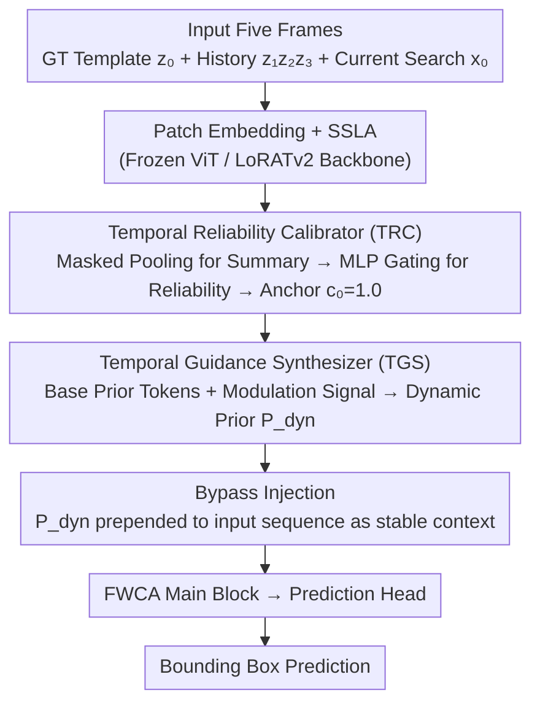

# Drift-Resilient Temporal Priors for Visual Tracking

**Conference**: CVPR 2026  
**arXiv**: [2604.02654](https://arxiv.org/abs/2604.02654)  
**Code**: [GitHub](https://github.com/NorahGreen/DTPTrack)  
**Area**: Object Detection / Visual Tracking  
**Keywords**: Visual Tracking, Model Drift, Temporal Modeling, Transformer, Plug-and-play

## TL;DR

Ours proposes DTPTrack—a lightweight plug-and-play temporal modeling module that assigns reliability scores to historical frames via a Temporal Reliability Calibrator (TRC) to filter noise, and synthesizes calibrated historical information into dynamic prior tokens via a Temporal Guidance Synthesizer (TGS) to suppress tracking drift, achieving SOTA performance across multiple benchmarks.

## Background & Motivation

**Model drift** is a core vulnerability of multi-frame visual trackers: when a tracker makes an inaccurate prediction in a specific frame (e.g., due to occlusion or distractors), this erroneous information is "baked" into the temporal model of the target, leading to further errors in subsequent frames, forming a cascaded error and eventual tracking failure.

Two major limitations of existing temporal modeling methods:

**Online template update**: Templates are refreshed using high-confidence recent predictions, but a single incorrect update can irreversibly damage the template.

**Multi-frame feature fusion**: Multi-frame features are directly concatenated and fed into a Transformer, implicitly treating all historical frames as equally reliable, failing to distinguish between high-quality predictions and noisy frames.

Key Insight: A robust temporal tracker must not only "remember" the past but also "critically evaluate" the reliability of past information.

## Method

### Overall Architecture

DTPTrack is a plug-and-play temporal module inserted before the main Transformer blocks, specifically designed to address "model drift"—where errors in one frame are baked into the temporal model. It processes five frames per step: the initial template $z_0$ (from GT), three historical reference frames $z_1, z_2, z_3$ (search regions from previous steps), and the current search region $x_0$. The backbone is based on an extended LoRATv2, utilizing Frame-Wise Causal Attention (FWCA, combining intra-frame full attention and cross-frame causal attention) to balance spatial reasoning and temporal dependencies. Each input stream is equipped with a Stream-Specific LoRA Adapter (SSLA) while sharing a frozen ViT. Built upon this backbone, the two core modules of DTPTrack operate serially: first, the **Temporal Reliability Calibrator (TRC)** assigns reliability scores to historical frames to filter noise; then, the **Temporal Guidance Synthesizer (TGS)** synthesizes the calibrated history into dynamic prior tokens. Finally, these tokens are prepended to the sequence via **bypass injection** as stable context, without directly modifying visual features.

### Key Designs

**1. Temporal Reliability Calibrator (TRC): Evaluating historical frame reliability before trust allocation**

The root of drift is that existing methods treat all historical frames as equally reliable. TRC assigns a quality score to each historical frame: it first performs masked average pooling per frame, generating a binary mask $M_i$ based on the target bounding box. A weighted average of patch tokens overlapping with the target yields the summary vector $s_i \in \mathbb{R}^D$. A lightweight MLP with a sigmoid confidence gate $f_{gate}$ predicts reliability scores $c_i \in [0,1]$ for the three dynamic reference frames, resulting in calibrated summaries $\hat{s}_i = s_i \cdot c_i$. A key design choice is **fixing** the confidence of the initial template to $c_0 = 1.0$—since it comes from GT, it remains a clean reference anchor, which experiments prove is crucial for suppressing long-term drift.

**2. Temporal Guidance Synthesizer (TGS): Compressing calibrated history into dynamic prior tokens**

With reliability scores calculated, historical information must be fed back into the tracker without corrupting visual features. TGS maintains a set of learnable base prior tokens $P_{base} \in \mathbb{R}^{K \times D}$. A modulator MLP processes the calibrated summary sequence to generate modulation signals, yielding dynamic priors $P_{dyn} = P_{base} + f_{mod}([\hat{s}_0, \hat{s}_1, \hat{s}_2, \hat{s}_3])$, followed by learnable position and token type embeddings. The base tokens provide a stable foundation, while the modulation term adjusts based on historical reliability, preventing noise from biasing the priors.

**3. Bypass Injection: Prior tokens as stable context**

The dynamic prior tokens are prepended to the standard input sequence: $\text{Input} = \text{Concat}[P_{dyn}, Z_0, Z_1, ..., X_0]$. Within FWCA, the prior tokens are grouped in the same computation block as the initial template, acting as stable foundational context. This "bypass guidance" is safer than directly concatenating and fusing historical features, as history only communicates indirectly through prior tokens, making it harder for erroneous information to pollute current visual representations.

### Loss & Training

The backbone (DINOv2 ViT) is frozen throughout. Only the DTPTrack module, SSLA adapters, and prediction head are trained. Training data includes LaSOT + TrackingNet + GOT-10k + COCO, sampling 5-frame sequences. During inference, historical predictions are maintained, reference frames are selected using the SPMTrack strategy, and a Hanning window penalty is applied to suppress abrupt changes.

## Key Experimental Results

### Main Results

| Benchmark | Metric | DTPTrack-L378 | SPMTrack-L | LoRATv2-L378 | LoRAT-g378 |
|-----------|--------|---------------|------------|--------------|------------|
| LaSOT | AUC | **77.5** | 76.8 | 76.1 | 76.2 |
| VastTrack | AUC | **47.2** | - | 44.2 | 46.0 |
| GOT-10k | AO | **80.3** | 80.0 | 78.2 | 78.9 |
| TrackingNet | AUC | **86.9** | 86.9 | 85.7 | 86.0 |
| UAV123 | AUC | **72.3** | - | - | - |

### Ablation Study

| Configuration | LaSOT AUC | VastTrack AUC | Description |
|---------------|-----------|---------------|-------------|
| Fixed Threshold (vs. Learned Gate) | 72.0 | 38.2 | Learned gating in TRC is crucial (-2.3) |
| Full Gating on $z_0$ | 73.2 | 40.1 | Anchoring the GT template is critical |
| No Base Prior Tokens | 72.7 | 39.0 | Base tokens provide a stable foundation |
| Concatenated Fusion (vs. Prior Tokens) | 73.4 | 40.3 | Prior tokens outperform direct concatenation |
| Baseline (w/o DTPTrack) | 73.3 | 40.1 | - |
| Full Model | **74.3** | **40.7** | +1.0 AUC Gain |

### Key Findings

1. **Plug-and-play Effectiveness**: Consistent improvements were observed when integrated into OSTrack (+1.0 AUC), ODTrack (+0.5 AUC), and LoRAT (+0.8 AUC). On VastTrack, the improvement for OSTrack reaches +1.8 AUC. Computational overhead is minimal (MACs increase by <1G, parameters by 1-3M).

2. **Critical TRC Design Choices**:
    - Learned Gating vs. Fixed Threshold: A difference of 2.3 AUC proves the necessity of dynamic quality assessment.
    - Anchoring GT Template ($c_0 = 1.0$) vs. Learnable Confidence: The former is significantly better, highlighting the importance of an unpolluted reference.

3.  **TGS Comparison**: Learned dynamic priors outperform momentum-based methods (+0.5 AUC) and optical flow-based methods (+1.1 AUC), with the gap widening in complex scenarios like VastTrack.

4.  **Temporal Depth Analysis**: Consistent gains were observed from 2 to 5 frames (72.0 → 74.3 AUC), with 5 frames serving as the optimal balance.

5.  **Efficiency Advantages**: DTPTrack-L378 processing 5 frames requires fewer MACs (581G) than SPMTrack-L processing 4 frames (975G), thanks to the efficient FWCA design.

## Highlights & Insights

- The dual-stage design philosophy of "**Remembering Past**" + "**Evaluating Past**" is simple yet effective: TRC handles information filtering, while TGS performs information synthesis.
- Fixing GT template confidence at 1.0 is a critical and practical design choice—providing a "reliable anchor" during long-term tracking, a simple but often overlooked technique.
- "Plug-and-play" is validated across three distinct architectures with minimal overhead (<1G MACs).
- The prior token design avoids direct visual feature corruption—this "bypass guidance" approach is safer than direct fusion.

## Limitations & Future Work

- Reliability scores are based solely on appearance (masked pooling features), ignoring other cues like motion consistency.
- Utilizing only 3 historical frames may be insufficient to capture long-term motion patterns.
- The MLP in TRC scores all reference frames jointly, which might limit scalability to a larger number of frames.
- The number of prior tokens $K$ is a hyperparameter; its impact was not analyzed in the paper.
- The reference frame selection strategy is borrowed from SPMTrack; adaptive selection coupled with TRC was not explored.

## Related Work & Insights

- LoRATv2 (NeurIPS'25) provides the foundation for efficient frame-wise causal attention and stream-specific LoRA.
- SPMTrack (CVPR'25) proposes the reference frame selection strategy.
- ODTrack (AAAI'24) uses direct concatenation of multi-frame features for joint spatio-temporal modeling.
- TATrack (AAAI'23) employs a dynamic update scheme to refresh templates.
- The core contribution of Ours lies in introducing reliability gating for temporal information, a feature missing in the aforementioned methods.

## Rating

- Novelty: ⭐⭐⭐⭐ (Temporal reliability calibration + guided synthesis are targeted innovations for tracking drift)
- Experimental Thoroughness: ⭐⭐⭐⭐⭐ (7 benchmarks, 3 host architectures, extensive ablations)
- Writing Quality: ⭐⭐⭐⭐ (Clear motivation, detailed experimental analysis)
- Value: ⭐⭐⭐⭐⭐ (Highly practical plug-and-play design, consistent significant gains, open-source code)

<!-- RELATED:START -->

## Related Papers

- [\[CVPR 2026\] SpikeTrack: A Spike-driven Framework for Efficient Visual Tracking](spiketrack_a_spike-driven_framework_for_efficient_visual_tracking.md)
- [\[CVPR 2026\] Adaptive Capacity Autoregressive Visual Tracking](adaptive_capacity_autoregressive_visual_tracking.md)
- [\[CVPR 2026\] Beyond Explicit Language: Plug-and-Play Visual-to-Linguistic Modeling Toward General Object Tracking](beyond_explicit_language_plug-and-play_visual-to-linguistic_modeling_toward_gene.md)
- [\[CVPR 2026\] An Efficient Token Compression Framework for Visual Object Tracking](an_efficient_token_compression_framework_for_visual_object_tracking.md)
- [\[CVPR 2026\] Toward Low-Cost yet Effective Temporal Learning for UAV Tracking](toward_low-cost_yet_effective_temporal_learning_for_uav_tracking.md)

<!-- RELATED:END -->
