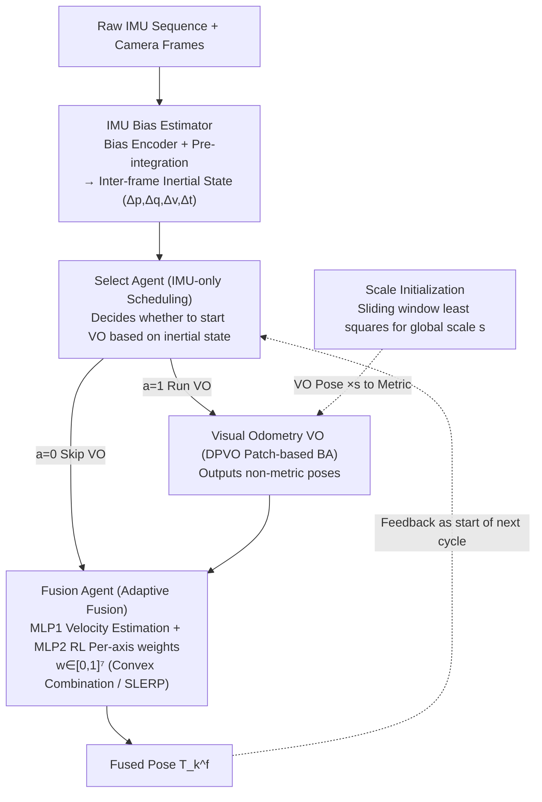

# Dual-Agent Reinforcement Learning for Adaptive and Cost-Aware Visual-Inertial Odometry

**Conference**: CVPR2026  
**arXiv**: [2511.21083](https://arxiv.org/abs/2511.21083)  
**Code**: TBD  
**Area**: Video Understanding / Visual Odometry  
**Keywords**: Visual-Inertial Odometry, Reinforcement Learning, Adaptive Fusion, Computational Scheduling, IMU Bias Estimation, PPO

## TL;DR

A dual-agent reinforcement learning framework is proposed, utilizing a Select Agent (deciding whether to trigger the visual front-end based on IMU signals) and a Fusion Agent (adaptively fusing visual-inertial states). This approach significantly reduces the calling frequency and computational overhead of VIBA without completely removing it, achieving a superior trade-off between accuracy, efficiency, and memory usage.

## Background & Motivation

**Key Challenge of VIO**: Filtering methods (MSCKF, ROVIO) are efficient but suffer from severe drift; optimization methods (VINS-Mono, ORB-SLAM3) offer high precision but involve heavy VIBA computation, making them difficult to deploy on resource-constrained edge devices.

**Limitations of E2E deep learning**: Methods like VINet and SelfVIO directly regress poses, but their accuracy and generalization remain inferior to mature optimization frameworks.

**Bottleneck of hybrid methods**: iSLAM, DPVO, and others introduce learning modules to enhance feature matching or optimization but are still limited by the computational bottleneck of VIBA.

**Inefficiency of keyframe selection**: Traditional strategies require processing images before determining frame utility, failing to make skipping decisions prior to visual computation.

**Inflexibility of fixed fusion weights**: Static EKF or fixed-gain fusion cannot dynamically adjust the trust levels of visual/inertial data based on motion intensity and sensor reliability.

**RL application limitations**: Existing works (Messikommer et al.) only use RL to optimize internal heuristics of VO, without addressing high-level scheduling from the perspective of "whether to start the entire VO pipeline."

## Method

### Overall Architecture

The system is a VIO pipeline with a feedback loop, consisting of four decoupled modules. The core idea is to use two lightweight RL agents to manage "whether to compute vision" and "how to fuse":

- **IMU Preprocess**: A bias encoder estimates gyroscope/accelerometer biases. After correction, pre-integration is performed to output inter-frame inertial states $(\Delta\mathbf{p}, \Delta\mathbf{q}, \Delta\mathbf{v}, \Delta t)$.
- **Select Agent**: An RL policy that decides whether to activate the high-cost Visual Odometry (VO) based solely on IMU inertial states.
- **Visual Odometry (VO)**: Based on DPVO's patch-based recurrent optimization, it is activated only when the Select Agent outputs 1, producing sparse, high-precision, non-metric poses.
- **Fusion Agent**: A composite module where MLP1 supervisedly estimates metric velocity, and MLP2 uses RL to output per-axis fusion weights, adaptively fusing VO observations and IMU propagation into the final pose.

Additionally, during system startup, **Scale Initialization** uses IMU pre-integration and VO relative translation within a sliding window to construct an overdetermined linear system, solving for the global metric scale $s$ via least squares. VO poses are multiplied by $s$ to become metric before fusion. The pose obtained from each fusion cycle is fed back to the state propagation module as the starting point for the next cycle, closing the loop.

### Key Designs

**1. IMU Bias Estimator**
- Trains two lightweight encoding networks $f_{bias}^g$ (gyroscope) and $f_{bias}^a$ (accelerometer), taking raw sensor sequences and noise parameters as input to output 3-axis bias estimates.
- Chooses to estimate constant bias rather than random noise, as bias models are better at capturing slowly varying dominant patterns.

**2. Select Agent (RL Scheduling)**
- **State Space**: Compact IMU-only state $s_t^{sel} = \{\Delta\mathbf{p}_t, \Delta\mathbf{q}_t, \Delta\mathbf{v}_t, \Delta t_t^{vo}\}$, requiring no visual features.
- **Action Space**: Binary decision $a_t^{sel} \in \{0, 1\}$, where 0 = skip VO and 1 = run VO.
- **Reward Function**: Terminal ATE reward + dense step-wise penalty + VO call cost, $R_{episode} = \frac{A}{ATE + \epsilon} - B \cdot N_f$.
- Trained using PPO with MLP-parameterized policies.

**3. Fusion Agent (Adaptive Fusion)**
- **MLP1** (Supervised): Estimates metric velocity from scaled VO poses and IMU pre-integration.
- **MLP2** (RL Policy): Outputs 7-dimensional per-axis fusion weights $\mathbf{w} \in [0,1]^7$, performing convex combination for position and velocity, and SLERP interpolation for orientation.
- When VO is skipped, $\mathbf{w}$ defaults to zero, resulting in pure IMU propagation.
- Reward: $r_k = -\|\mathbf{p}_k - \mathbf{p}_{gt}\|_2^2 - \lambda \operatorname{Tr}(\mathbf{\Sigma}_k)$, driving both low error and reasonable uncertainty.

**4. Scale Initialization**
- Aligns the world frame with the initial IMU body frame, utilizing IMU pre-integration and VO relative translation within a sliding window to construct an overdetermined linear system, solving for the global metric scale $s$ via least squares.

### Loss & Training

- Two-stage training: MLP1 supervised pre-training $\rightarrow$ MLP2 supervised initialization followed by PPO fine-tuning.
- PPO is trained in a Gym-style playback environment using real IMU-VO pairs, naturally incorporating sensor drift and noise.

## Key Experimental Results

### Main Results

**EuRoC MAV Dataset (Table 1)**: Comparison with classic CPU-VIO.

| Method | MH2 | MH3 | MH4 | MH5 | V11 | V12 | V13 | V21 | V22 | V23 | Avg |
|------|------|------|------|------|------|------|------|------|------|------|------|
| MSCKF | 0.45 | 0.23 | 0.37 | 0.48 | 0.34 | 0.20 | 0.67 | 0.10 | 0.16 | 1.13 | 0.413 |
| VINS-MONO | 0.15 | 0.22 | 0.32 | 0.30 | 0.079 | 0.11 | 0.18 | 0.080 | 0.16 | 0.27 | 0.187 |
| DM-VIO | 0.044 | 0.097 | 0.102 | 0.096 | 0.048 | 0.045 | 0.069 | 0.029 | 0.050 | 0.114 | 0.069 |
| ORB-SLAM3 | 0.037 | 0.046 | 0.075 | 0.057 | 0.049 | 0.015 | 0.037 | 0.042 | 0.021 | 0.027 | **0.041** |
| **Ours** | 0.064 | 0.119 | 0.112 | 0.112 | 0.047 | 0.125 | 0.073 | 0.055 | 0.036 | 0.179 | 0.092 |

**Comparison with GPU-based methods (Table 4)**: Unified evaluation of accuracy, efficiency, and VRAM.

| Method | Avg ATE | FPS | VRAM (GB) |
|------|---------|-----|-----------|
| DPVO | 0.106 | 22 | 4.92 |
| iSLAM | 0.529 | 31 | 6.47 |
| DROID-VO | 0.188 | 14 | 8.63 |
| **Ours** | **0.092** | **39** | **4.37** |

### Ablation Study

1. **IMU Bias Estimator**: Simultaneously estimating gyroscope and accelerometer biases (Omega+Accel) yields the best results; the constant bias model outperforms the random noise model.
2. **Select Agent**: The IMU-only prior scheduling shows a smoother degradation curve compared to heuristic and RL-gating (KF) methods under aggressive frame skipping (75%~87.5%). At a 50% skip target, the IMU-only strategy achieves significantly higher FPS with an ATE increase of <3%.
3. **Fusion Agent**: RL fusion (ATE 0.112m) outperforms EKF fusion (0.127m) and fixed-weight fusion (0.143m). The fusion strategy remains effective after switching to a DROID-VO front-end (0.399 $\rightarrow$ 0.237m), proving generalization across different back-ends.
4. **Robustness**: Under 5%/10% image blur degradation, this method's ATE (0.138/0.153m) remains consistently lower than DPVO (0.174/0.192m).

### Key Findings

- This method achieves the best average ATE (0.092m) among GPU-based methods, while reaching 39 FPS (1.77x of DPVO) and using only 4.37GB VRAM (49.4% saving compared to DROID).
- CPU-side BA/VIBA time is reduced from 121ms in ORB-SLAM3 to 12.77ms, structurally lowering the optimization load.
- Compared to classic optimization-based VIO, the accuracy is acceptable (Avg 0.092 vs. DM-VIO 0.069), but the computational efficiency advantage is significant.
- On the TUM-VI dataset, the average ATE is 0.80m, slightly higher than DM-VIO's 0.77m, maintaining competitiveness.

## Highlights & Insights

- **IMU-only prior scheduling** is the core innovation: making skip decisions before visual computation saves far more resources than merely optimizing internal VO heuristics.
- The dual-agent design decouples scheduling and fusion, optimizing different objectives respectively with a clear architecture.
- Fusion Agent generalizes across VO back-ends (DPVO $\rightarrow$ DROID-VO), proving that the policy relies on physical quantities rather than architectural features.
- Training PPO on real data using Gym-style playback avoids the sim-to-real gap.

## Limitations & Future Work

- Accuracy still lags behind top-tier optimization methods like ORB-SLAM3 (Avg 0.092 vs. 0.041), showing a clear gap.
- Scale initialization depends on a sliding window with sufficient motion; static startup scenarios may fail.
- Validation is limited to two indoor datasets (EuRoC and TUM-VI), lacking evaluation in outdoor or driving scenarios.
- The robustness of the Select Agent's skipping strategy in extreme scenarios (continuous frames with fast rotation) is not fully discussed.
- Training requires ground truth from real sequences; the zero-shot generalization capability to new environments has not been verified.

## Related Work & Insights

- **Classic VIO**: MSCKF, ROVIO (Filtering); VINS-Mono, ORB-SLAM3, DM-VIO (Optimization).
- **Deep Learning VO/VIO**: VINet, SelfVIO (End-to-End); DPVO, DROID-SLAM (Hybrid); iSLAM (Learning-enhanced classic pipelines).
- **Adaptive Visual Selection**: VS-VIO and others dynamically re-weight at the feature level but still run the visual encoder for every frame.
- **RL in VO**: Messikommer et al. used RL to replace internal keyframe selection heuristics in VO; this work elevates RL to high-level scheduling.
- **Most Related**: This is the first work to model "whether to run the entire VO pipeline" as an RL prior decision.

## Rating

- Novelty: ⭐⭐⭐⭐ — The dual-agent RL architecture and IMU-only prior scheduling are novel ideas, though RL applications in robotics are not entirely new.
- Experimental Thoroughness: ⭐⭐⭐⭐ — Exhaustive ablation, cross-backend generalization, and robustness tests are provided, though limited to two indoor datasets.
- Writing Quality: ⭐⭐⭐⭐ — Clear structure, sufficient motivation, and complete mathematical derivations.
- Value: ⭐⭐⭐⭐ — The accuracy-efficiency trade-off is meaningful for practical deployment, but the gap with SOTA optimization methods limits high-precision applications.

<!-- RELATED:START -->

## Related Papers

- [\[CVPR 2026\] Learning to Assist: Physics-Grounded Human-Human Control via Multi-Agent Reinforcement Learning](learning_to_assist_physics-grounded_human-human_control_via_multi-agent_reinforc.md)
- [\[CVPR 2026\] VideoChat-M1: Collaborative Policy Planning for Video Understanding via Multi-Agent Reinforcement Learning](videochatm1_collaborative_policy_planning_for_vide.md)
- [\[ICML 2026\] RELO: Reinforcement Learning to Localize for Visual Object Tracking](../../ICML2026/video_understanding/relo_reinforcement_learning_to_localize_for_visual_object_tracking.md)
- [\[CVPR 2026\] Efficient Frame Selection for Long Video Understanding via Reinforcement Learning](efficient_frame_selection_for_long_video_understanding_via_reinforcement_learnin.md)
- [\[CVPR 2026\] Learning to Refuse: Refusal-Aware Reinforcement Fine-Tuning for Hard-Irrelevant Queries in Video Temporal Grounding](learning_to_refuse_refusal-aware_reinforcement_fine-tuning_for_hard-irrelevant_q.md)

<!-- RELATED:END -->
