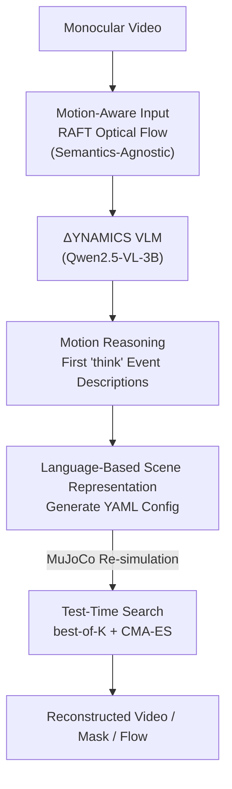

# Dynamics: Language-Based Representation for Inferring Rigid-Body Dynamics From Videos

**Conference**: CVPR 2026  
**Paper**: [CVF Open Access](https://openaccess.thecvf.com/content/CVPR2026/html/Kao_Dynamics_Language-Based_Representation_for_Inferring_Rigid-Body_Dynamics_From_Videos_CVPR_2026_paper.html)  
**Code**: https://iandrover.github.io/2026_dynamics/ (Project Page)  
**Area**: Video Understanding / 3D Vision (Physics Inference video-to-simulation)  
**Keywords**: Rigid-body dynamics, Vision-Language Models, Structured text representation, Optical flow, Test-time search

## TL;DR
This paper redefines "inferring rigid-body physical states and parameters from monocular video" as a **text generation** problem: training a VLM (ΔYNAMICS, based on Qwen2.5-VL-3B) to directly output a YAML configuration describing the entire scene (geometry / initial velocity / material / camera / gravity). This is then passed to MuJoCo for re-simulation. Performance is enhanced by "reasoning about motion events in natural language before generating the configuration" and using "optical flow input." It achieves a segmentation IoU 7 times higher than mainstream VLMs on CLEVRER and successfully transfers to 235 real-world videos.

## Background & Motivation

**Background**: Recovering physical properties (friction, elasticity, initial velocity, camera pose) from videos is fundamental to physics-aware perception and simulation. Prior works (e.g., sliding boxes, billiards, projectiles) typically estimate a fixed-length physical parameter vector within constrained scenarios.

**Limitations of Prior Work**: Such methods suffer from two major drawbacks. First, **rigid representation**—they assume a specific physical system, fixed object types, and fixed-length parameter vectors (e.g., specialized for "balls" or "boxes"), making them inapplicable when the number of objects or interaction types changes. Second, **fixed camera assumptions**—most assume known or fixed camera poses, failing to adapt to varying viewpoints and distances in the real world. Consequently, they only address a very narrow subset of the video-to-simulation problem.

**Key Challenge**: The root of the problem lies in **how the scene should be parameterized**. Regressing a fixed-length numerical vector inherently cannot accommodate open scenes with "arbitrary numbers of objects and interaction types," leading to a conflict between representation capacity and generalization.

**Goal**: To develop a unified representation that can describe both single-object and multi-object scenes, cover various motions (rolling, sliding, bouncing, colliding), estimate camera parameters simultaneously, and transfer from synthetic data to real-world videos.

**Key Insight**: The authors observe that structured graphical programs (SVG, TikZ, MuJoCo XML/JSON) have long been used to represent visual content, and language is naturally variable-length, readable, editable, and composable. Representing a physical scene as a **text configuration** simultaneously solves the issues of "variable length" and "interpretability."

**Core Idea**: Use **language as a unified representation for rigid-body dynamics**—instead of regressing fixed-length vectors, the VLM generates a structured YAML scene configuration that is directly executed by a physics engine for simulation.

## Method

### Overall Architecture

The core of ΔYNAMICS is replacing the mapping "video → physical parameters" with "video → text directly executable by a physics engine." Formally, given a video $X$, the model $F_\omega$ predicts a configuration $c = F_\omega(X)$, which is then fed to a physics engine $S$ to reconstruct the sequence $\hat{X} = S(c)$. Throughout training, the objective is to ensure $\hat{X}$ faithfully reproduces the motion observed in $X$.

The pipeline consists of a training phase and an inference phase. **Training phase**: Sample a YAML scene configuration → Convert to MuJoCo XML to render synthetic videos → Extract optical flow with RAFT → Train ΔYNAMICS to generate the configuration given the optical flow (using 400,000 synthetic scenes). **Inference phase**: Extract optical flow from real videos, generate the configuration with the VLM, and re-simulate RGB / segmentation masks / optical flow using MuJoCo for evaluation. Two model variants exist: a base version that outputs the configuration directly, and a motion reasoning version that outputs a `<think>` motion event description before the `<answer>` configuration. Test-time search can be optionally applied after inference for further refinement.

### Key Designs

**1. Language-Based Scene Representation: Replacing Fixed-Length Vectors with YAML**

To address the fundamental issue that fixed-length vectors cannot accommodate open scenes, the authors frame physical estimation as **symbolic generation** rather than **numerical regression**. The model autoregressively outputs a YAML text encoding the entire scene—object geometry (radius/height/width/depth/mass), initial states (position, linear/angular velocity, quaternion orientation), materials (rolling/sliding friction, damping), and global parameters (camera height/pitch/FOV, gravity). Scenes are assembled from three primitives (sphere, cylinder, box), covering common rigid bodies like tennis balls, cans, mugs, books, and wooden crates. Configuration length naturally scales with the number of objects—for instance, a 4-box scene involves $20\times4$ (20 parameters per box) $+\,3$ (camera) $+\,1$ (gravity) $= 84$ estimated parameters.

**Mechanism**: Textual representation is inherently variable-length, readable, editable, and supports counterfactual analysis. By treating simulation as text generation, a VLM can be trained end-to-end without multi-stage engineering. The target format is simplified to `<answer> configuration </answer>`. This is the cornerstone of the work—consolidating object counts, types, and camera parameters into a single generation interface.

**2. Motion Reasoning: Natural Language Descriptions Before Configuration**

Regressing configurations directly from optical flow can lead to a lack of physical understanding. The authors prompt the model to generate a natural language description of the dynamics before the configuration: `<think> description </think> <answer> configuration </answer>`. The supervision signal for this description is derived from simulation traces (state history, contact history, segmentation masks). Rule-based functions extract three types of key events from these traces: **visibility** (when objects enter/exit the field of view), **motion changes** (when rolling/sliding stops), and **collisions** (when hitting the ground or other objects). These events are then populated into predefined templates to create structured motion descriptions for training.

**Mechanism**: Clarifying "who hit whom at t=0.13s" and "who stopped at t=0.43s" before predicting parameters allows the model to form a richer representation of the underlying dynamics. This intermediate representation provides a more structured and physically plausible exploration region for sampling, allowing search to find more robust solutions rather than drifting into infeasible parameter spaces.

**3. Motion-Aware Input: Using Optical Flow as Semantics-Agnostic Input**

Raw RGB frames are filled with visual semantics (textures, backgrounds, appearances) that are irrelevant to motion and act as confounding factors for physical inference. Instead, the authors use optical flow fields calculated by RAFT as the input. Optical flow is insensitive to visual semantics and appearance, providing explicit motion cues. In implementation, the optical flow is converted into a 2D array per channel (RGB-coded optical flow maps), which can be fed into the VLM without changing its architecture.

**Mechanism**: On synthetic data, optical flow input increases the full-sequence segmentation IoU from 0.19 to 0.24 (a +26% relative improvement) and significantly reduces the optical flow End-Point Error (EPE). The object composition accuracy reaches 97%. While RGB versions sometimes perform slightly better at damping estimation (due to visual cues from checkerboard floors), discarding appearance in favor of motion is a net benefit for cross-domain generalization.

**4. Test-Time Search: best-of-K Sampling + CMA-ES Evolution**

Greedy decoding does not guarantee the highest quality parameter set from the model's output distribution. The authors employ three complementary test-time strategies that **do not require target domain labels**. The first is **best-of-K sampling**: generating $N=32$ configurations with temperature 0.1 and top-p 0.9, then reporting Best@32. The second is **preference optimization**, using the similarity between forward rendering and the input video (e.g., mask IoU) as an implicit reward. The third is **CMA-ES evolutionary search**: initializing from Best@32 samples, fixing object types, and optimizing dimensions, initial velocities, physical parameters, and camera poses. The fitness function is $\text{IoU} - \text{EPE}$, with a population size of 128 and 100 iterations.

**Mechanism**: Sampling reaches more accurate solutions in the long-tail distribution via multiple attempts. CMA-ES performs non-convex optimization on the non-differentiable black-box physics engine. Starting from a strong Best@32 initialization, it achieves the highest precision for full-sequence alignment, allowing the fixed-weight model to "compensate" during inference without any target domain supervision.

### Loss & Training

Training follows standard autoregressive negative log-likelihood (NLL). Given a dataset $D=\{(X_i, c_i)\}$, where configuration $c$ is tokenized, the likelihood is decomposed autoregressively by token:

$$p_\omega(c \mid X) = \prod_{t=1}^{|c|} p_\omega(c_t \mid X, c_{<t})$$

The optimization objective is to minimize NLL:

$$\mathcal{L}_{\text{VLM}} = -\sum_{(X,c)\in D} \log p_\omega(c \mid X)$$

**Implementation**: Based on Qwen2.5-VL-3B, with 10 frames uniformly sampled from 1-second/30 FPS videos. The model underwent full-parameter fine-tuning for 10 epochs (bfloat16 precision, 8×A100-40G) using AdamW with a learning rate of $2\times10^{-5}$ and weight decay of 0.01. The global batch size was 128. Training used 400,000 MuJoCo scenes, filtered for initial overlaps, visibility, and object size, with four specific 4-object combinations held out for compositional generalization testing.

## Key Experimental Results

### Main Results (Synthetic, In-Distribution)

| Method | Input | Obj. Comp. Acc↑ | Initial IoU↑ | Full Seq. IoU↑ | Full Seq. EPE↓ |
| :--- | :--- | :--- | :--- | :--- | :--- |
| ViViT (Non-VLM Regression) | Flow | 0.00 | 0.07 | 0.06 | 8.90 |
| Qwen2.5-VL-7B | RGB | 0.27 | 0.03 | 0.03 | 16.33 |
| Claude-4-Sonnet | RGB | 0.45 | 0.09 | 0.07 | 11.07 |
| ΔYNAMICS | RGB | 0.60 | 0.52 | 0.32 | 19.66 |
| ΔYNAMICS | Flow | 0.97 | 0.88 | 0.49 | 9.24 |
| ΔYNAMICS + Reasoning | Flow | **0.99** | **0.91** | **0.54** | **8.52** |

Mainstream VLMs (including Claude-4) can only roughly identify object composition, while performing poorly on trajectory reconstruction and parameter estimation (IoU ≤0.09, EPE >11). ΔYNAMICS leads even with RGB input; switching to optical flow boosts object composition to 97% and drastically reduces EPE. Adding motion reasoning further pushes the full-sequence IoU to 0.54. The higher EPE for the RGB version stems from occasional initial state interpenetrations, which result in large MuJoCo contact forces and abrupt motions.

### Cross-Engine / Real-World with Test-Time Search

| Setting | Configuration | Initial IoU↑ | Full Seq. IoU↑ | Full Seq. EPE↓ |
| :--- | :--- | :--- | :--- | :--- |
| CLEVRER (Blender, Zero-shot) | Best Mainstream VLM | 0.03 | 0.04 | — |
| CLEVRER | ΔYNAMICS+Reasoning (Flow) | 0.67 | 0.30 | — |
| CLEVRER | +Best@32 | 0.76 | 0.38 | 5.17 |
| CLEVRER | +CMA-ES | 0.62 | **0.66** | **0.11** |
| Real Video (235 clips) | ΔYNAMICS+Reasoning | 0.54 | 0.29 | 0.58 |
| Real Video | +Best@32 | **0.72** | 0.41 | 0.46 |
| Real Video | +CMA-ES | 0.57 | **0.65** | **0.36** |

In zero-shot transfer from MuJoCo to the Blender-rendered CLEVRER dataset, ΔYNAMICS improves the full-sequence IoU from 0.04 (mainstream VLM) to 0.30. Adding test-time search with CMA-ES drives the IoU to 0.66 and reduces EPE to 0.11. Similar trends are observed on 235 real-world videos: motion reasoning improves IoU and EPE by 12-13%, while Best@32 and CMA-ES provide the best sequence alignment.

### Key Findings
- **Optical flow input is the most significant contributor**: Changing from RGB to optical flow improves object composition from 0.60 back to 0.97 and initial IoU from 0.52 to 0.88.
- **Best-of-32 increases initial IoU by 27% on CLEVRER**: The reasoning variant benefits more from sampling than the vanilla version, confirming that intermediate reasoning provides a more plausible exploration space.
- **CMA-ES provides the performance ceiling**: Utilizing Best@32 as initialization for black-box evolution achieves the lowest EPE and highest IoU, though it is computationally expensive as it requires re-simulation.
- **Graceful generalization**: IoU remains stable (0.54 to 0.52) when testing with 5 or 6 objects despite being trained only on up to 4, demonstrating the resilience of language representations and motion reasoning to increased complexity.

## Highlights & Insights
- **Reconceptualizing physics inversion as "writing an executable scene script"**: YAML configurations act as both model output and MuJoCo simulation inputs, creating a closed-loop, interpretable, and editable system.
- **Automated supervision for "motion reasoning" using simulation traces**: Rule-based extraction of events from engine traces generates free CoT (Chain of Thought) data. This approach of using internal engine information to generate reasoning chains is applicable to any simulator-based task.
- **Optical flow as semantics-agnostic input**: Discarding appearance in favor of motion reduces the synthetic-to-real domain gap without requiring architecture changes.
- **Label-free test-time refinement**: Using the similarity between re-rendering and raw input as an implicit reward allows non-differentiable engines to utilize CMA-ES, further suppressing long-tail errors.

## Limitations & Future Work
- **Primitive limitations**: Only spheres, cylinders, and boxes are supported. Irregular objects (e.g., apples) can only be approximated, limiting geometric expressiveness.
- **Dependency on optical flow quality**: Inaccuracies in RAFT due to heavy occlusion, severe motion blur, or low texture lead to input degradation.
- **High cost of CMA-ES**: 128 population x 100 iterations with re-simulation makes real-time processing impossible. The large gap between feedforward and search results (0.30 vs 0.66 IoU) suggests trajectory accuracy still relies heavily on search.
- **Restricted camera model**: The camera is fixed at $(0, -2, h)$ with variable pitch only; general 6-DoF poses in real-world scenes remain uncovered.

## Related Work & Insights
- **vs. Traditional Physics Estimation**: Unlike previous works that regress fixed-length vectors for specific systems, this work uses language to unify arbitrary object counts and types while estimating camera parameters.
- **vs. Structured Graphical Programs**: While similar to works translating images to TikZ/JSON for graphics engines, this work specifically applies the concept to **motion dynamics** in video and introduces motion reasoning as an intermediate representation.
- **vs. Differentiable Simulation**: Differentiable pipelines require predefined physical models and differentiable engines; this work utilizes a feedforward VLM to produce a configuration in one pass followed by black-box optimization.

## Rating
- Novelty: ⭐⭐⭐⭐⭐ Reformulating physical inversion as VLM-generated executable YAML is a elegant paradigm for generalization.
- Experimental Thoroughness: ⭐⭐⭐⭐ Solid three-tier evaluation (synthetic/cross-engine/real) with test-time strategy ablation, though it lacks direct comparisons with traditional methods.
- Writing Quality: ⭐⭐⭐⭐ Clear logic across motivation, representation, reasoning, input, and search.
- Value: ⭐⭐⭐⭐ Provides a linguistic bridge between perception and simulation, offering insights for embodied AI and physical reasoning.

<!-- RELATED:START -->

## Related Papers

- [\[CVPR 2026\] FlexiVideo: Variation-Aware Temporal Dynamics Modeling for Efficient Video Understanding](flexivideo_variation-aware_temporal_dynamics_modeling_for_efficient_video_unders.md)
- [\[NeurIPS 2025\] Token Bottleneck: One Token to Remember Dynamics](../../NeurIPS2025/video_understanding/token_bottleneck_one_token_to_remember_dynamics.md)
- [\[ICCV 2025\] MikuDance: Animating Character Art with Mixed Motion Dynamics](../../ICCV2025/video_understanding/mikudance_animating_character_art_with_mixed_motion_dynamics.md)
- [\[CVPR 2026\] CLCR: Cross-Level Semantic Collaborative Representation for Multimodal Learning](clcr_cross-level_semantic_collaborative_representation_for_multimodal_learning.md)
- [\[CVPR 2026\] Ego-Grounding for Personalized Question-Answering in Egocentric Videos](ego-grounding_for_personalized_question-answering_in_egocentric_videos.md)

<!-- RELATED:END -->
