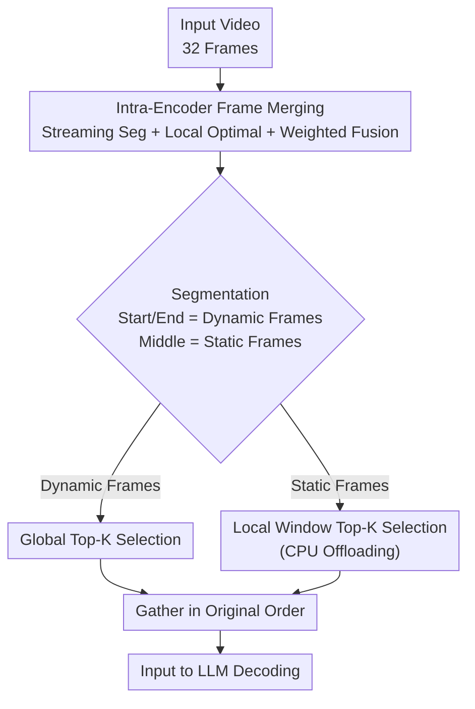

# EarlyTom: Early Token Compression Completes Fast Video Understanding

**Conference**: CVPR 2026  
**arXiv**: [2605.30010](https://arxiv.org/abs/2605.30010)  
**Code**: https://viridisgreen.github.io/EarlyTom (Project Homepage)  
**Area**: Video Understanding / Video-LLM Inference Acceleration  
**Keywords**: Visual token compression, Video large models, TTFT, Frame merging, Training-free

## TL;DR
EarlyTom is a training-free video token compression framework that shifts the compression point from "after the visual encoder" to "inside the visual encoder" via intra-encoder frame merging, paired with a decoupled spatial token selection strategy. On LLaVA-OneVision-7B, it reduces Time-to-First-Token (TTFT) by up to $2.65\times$ and FLOPs by 61%, while maintaining over 96% of the full-token baseline accuracy.

## Background & Motivation

**Background**: Video Large Multimodal Models (Video-LLMs) are powerful for video understanding, but a single video is segmented into many frames, each encoded into hundreds of visual tokens. This token explosion makes inference slow and expensive. Consequently, various token compression works have emerged, categorized by compression location: internal LLM pruning (FastV, SparseVLM, PyramidDrop), pre-LLM pruning (VisionZip, LLaVAPruMerge), and hybrid approaches (HoliTom, FastVID, DyCoke).

**Limitations of Prior Work**: Most methods treat the visual encoder as a non-optimizable black box, performing compression only "after the visual encoder." However, decomposing TTFT reveals that visual encoding accounts for 36.3% of TTFT (323 ms) in the baseline. This proportion becomes even more significant in SOTA methods that already optimize LLM prefill—HoliTom accounts for 55.8% and VisionZip for 68.4%. Visual encoding has become the new primary bottleneck. Furthermore, compression in methods like HoliTom introduces extra overhead (+78 ms in the visual token processing stage, a +121.9% increase over baseline).

**Key Challenge**: While existing methods aggressively reduce token retention to 10–25%, TTFT remains stuck at 458–661 ms because they do not modify the visual encoder. No matter how much compression occurs afterward, the expensive step of "encoding all frames completely" cannot be bypassed.

**Goal**: Move the compression action inside the visual encoder to merge redundant frames during the encoding process. By reducing tokens at the source, visual encoding latency is directly cut without requiring additional training or significant overhead.

**Key Insight + Core Idea**: The authors observe high redundancy between adjacent video frames (high cosine similarity between intermediate encoder layers). Thus, they implement "merging similar frames while encoding inside the encoder." They also identify **sink tokens** in SigLIP attention (exceptionally large query norms that dominate attention regardless of content), which bias standard top-K selection based on attention scores. To counter this, a "decoupled" spatial selection strategy is designed. In short: **Early token compression inside the encoder (early) combined with decoupled selection to eliminate sink token bias.**

## Method

### Overall Architecture
EarlyTom is a training-free framework designed to optimize the visual encoding stage, which dominates TTFT. The pipeline consists of two serial stages: **Stage I performs temporal frame merging inside the visual encoder** (merging redundant frames during encoding to reduce encoding latency), and **Stage II performs spatial token selection after encoding** (further pruning tokens within each frame while avoiding sink token bias). Finally, the results are concatenated in original order for LLM decoding. These two stages target temporal and spatial redundancy, respectively.

> Note: "Intra-Encoder Frame Merging" corresponds to Key Design 1; Dynamic/Static Top-K paths correspond to Key Design 2; CPU offloading corresponds to Key Design 3.

### Key Designs

**1. Intra-Encoder Frame Merging: Reducing TTFT at the source**

This addresses the bottleneck where visual encoding is expensive but unoptimized. EarlyTom inserts frame merging at selected layers of the visual encoder (optimal starting from layer 6). It follows three steps. First, **Streaming Segmentation**: calculating cosine similarity of corresponding spatial tokens between adjacent frames, smoothed via Exponential Moving Average (EMA)—$\hat{s}_t = \alpha s_t + (1-\alpha)\hat{s}_{t-1}$. A segment boundary is created when $\hat{s}_t < \tau_{\mathrm{seg}}$. Second, **Intermediate Frame Merging**: using a "local optimal" criterion within a segment—$F_i$ and $F_{i+1}$ are merged if and only if $s_i > \tau_{\mathrm{merge}}$ and $s_i > s_{i+1}$, ensuring temporal continuity. Third, **Weighted Fusion**: using similarity-weighted fusion $\hat{F} = \frac{s_i F_i + s_{i+1} F_{i+1}}{s_i + s_{i+1}}$ to align the representation with semantically important content. Since merged frames are not processed in subsequent layers, encoding latency is directly reduced.

**2. Decoupled Spatial Token Selection: Avoiding sink token bias**

SigLIP attention contains sink tokens—tokens at fixed spatial positions with exceptionally large query norms ($|Q_{\text{sink}}|_2 \gg |Q_p|_2$) that dominate attention regardless of content. Pure Top-K selection in methods like FastVID or HoliTom is biased by these tokens, leading to distribution shifts. EarlyTom's solution is "decoupling": splitting frames from Stage I into **Dynamic Frames** (segment boundaries, high discriminative power) and **Static Frames** (segment interiors). Dynamic frames use **Global Top-K** selection with a recalibrated ratio $\hat{r} = \frac{r}{(\frac{B-N}{B})\cdot L}$ to account for Stage I merging. Static frames use **Local Window Top-K**: dividing tokens into $M=\lceil L/w \rceil$ windows ($w=\lfloor L/\hat{r}\rfloor$) and selecting only the top attention token per window. This ensures the static frame distribution is closer to the original, preventing sink tokens from exhausting the selection budget.

**3. CPU–GPU Heterogeneous Collaboration: Maximizing throughput**

To address the latency of dynamic token selection on large candidate sets, EarlyTom offloads **Static Token Selection to the CPU**. While the GPU determines dynamic tokens, the CPU processes the segmented static frames. This utilizes idle CPU resources without blocking the GPU, increasing overall processing speed. The implementation includes custom Triton kernels for operator efficiency and reuses HoliTom's inner-LLM merging techniques.

### Loss & Training
EarlyTom is **completely training-free**, introducing no learnable parameters. It relies on similarity thresholds and attention scores for rule-based merging and selection. Implemented on LLaVA-OneVision-0.5B/7B using pre-trained SigLIP with 32-frame sampling. TTFT is measured via NVIDIA Nsight Systems; throughput is averaged over 10 runs (2 warm-ups); FLOPs follow the HoliTom protocol (visual encoding + LLM prefill) using the LMMs-Eval framework.

## Key Experimental Results

### Main Results (LLaVA-OV-7B, 10% Retention, A100)
EarlyTom leads in TTFT, FLOPs, and throughput among training-free SOTAs while maintaining over 96% accuracy.

| Method | Retention | FLOPs(T)↓ | TTFT(ms)↓ | Throughput↑ | 4-Bench Avg↑ | Score% |
|------|--------|-----------|-----------|-------|-------------|--------|
| LLaVA-OV-7B (Full) | 100% | 82.6 | 889.9 | 24.4 | 58.6 | 100 |
| VisionZip (CVPR'25) | 10% | 45.2 | 458.5 | 28.5 | 53.5 | 91.6 |
| HoliTom (NeurIPS'25) | 10% | 44.6 | 556.6 | 29.0 | 57.9 | 99.1 |
| **Ours (EarlyTom)** | 10% | **32.2** | **336.2** | **31.6** | 56.2 | 96.2 |
| **Ours (EarlyTom)** | 25% | 36.5 | 426.3 | **32.9** | 58.2 | 99.7 |

Note: Compared to the 889.9 ms baseline, EarlyTom achieves a $2.65\times$ TTFT speedup (336.2 ms) and ~61% FLOPs reduction at 10% retention. At 25%, it is nearly lossless (99.7% score).

### Ablation Study

**Module Contribution (0.2 Retention)**

| Config | Retention | MVBench | VideoMME | EgoSchema | Avg |
|------|--------|---------|----------|-----------|-----|
| Baseline (Full) | 100% | 58.3 | 58.6 | 60.4 | 59.1 |
| Stage I Only | 73.9% | 57.9 | 57.0 | 60.3 | 58.4 |
| Stage II Only | 20% | 57.3 | 57.6 | 60.4 | 58.4 |
| **EarlyTom (Both)** | 20% | 57.8 | 58.1 | 60.6 | **58.8** |

**Sampling Comparison**: Local window sampling (Avg 58.8) outperforms global Top-K (Avg 58.4) and is faster, as it avoids the sorting overhead of $O(N \log K)$ and bypasses sink token bias.

## Highlights & Insights
- **Quantifying Bottlenecks**: By using Nsight to decompose TTFT, the authors show that as the LLM is optimized, the visual encoder's share of latency climbs (up to 68.4%). This profiling forms a strong motivation for intra-encoder optimization.
- **Sink Token Insight**: Identifying that SigLIP attention is dominated by tokens with abnormal norms explains why standard Top-K selection is biased, justifying the "Decoupled + Local Window" strategy.
- **Dynamic/Static Duality**: Using global Top-K for motion-heavy frames and local windows for static frames balances saliency and spatial uniformity.
- **System Synergy**: Offloading tasks to the CPU and using Triton kernels ensures that FLOP reductions translate into real-world wall-clock time speedups.

## Limitations & Future Work
- **Threshold Dependency**: Streaming segmentation ($\tau_{\mathrm{seg}}$) and merging ($\tau_{\mathrm{merge}}$) rely on preset thresholds. Stage I retention is "sample-dependent," which might require tuning for videos with varying levels of redundancy.
- **Aggressive Compression Drop**: Accuracy drops to 96.2% at 10% retention (e.g., LongVideoBench falls from 60.4 to 52.4), suggesting tasks requiring long-context integrity are sensitive to early frame merging.
- **Future Directions**: Implementing adaptive thresholds, content-adaptive merging layers, and validation on larger or longer video backbones.

## Related Work & Insights
- **vs. HoliTom (NeurIPS'25)**: HoliTom uses post-encoding spatio-temporal merging. EarlyTom moves merging inside the encoder, reducing TTFT from 556.6 ms to 336.2 ms at the same 10% retention level.
- **vs. VisionZip (CVPR'25)**: VisionZip clusters tokens before the LLM. At 10% retention, VisionZip loses ~9% accuracy, whereas EarlyTom loses ~4% with lower TTFT (336 vs 458 ms).
- **vs. FastVID (NeurIPS'25)**: FastVID performs post-encoding pruning with Top-K. EarlyTom's decoupled local window selection specifically addresses the sink token bias that affects Top-K.

## Rating
- Novelty: ⭐⭐⭐⭐ 
- Experimental Thoroughness: ⭐⭐⭐⭐ 
- Writing Quality: ⭐⭐⭐⭐ 
- Value: ⭐⭐⭐⭐ Training-free, plug-and-play, and delivers a $2.65\times$ TTFT reduction.

<!-- RELATED:START -->

## Related Papers

- [\[CVPR 2026\] StreamingTOM: Streaming Token Compression for Efficient Video Understanding](streamingtom_streaming_token_compression_for_efficient_video_understanding.md)
- [\[CVPR 2026\] Unified Spatiotemporal Token Compression for Video-LLMs at Ultra-Low Retention](unified_spatiotemporal_token_compression_for_video-llms_at_ultra-low_retention.md)
- [\[CVPR 2026\] An Efficient Token Compression Framework for Visual Object Tracking](an_efficient_token_compression_framework_for_visual_object_tracking.md)
- [\[ICLR 2026\] FLoC: Facility Location-Based Efficient Visual Token Compression for Long Video Understanding](../../ICLR2026/video_understanding/floc_facility_location-based_efficient_visual_token_compression_for_long_video_u.md)
- [\[ICLR 2026\] EAST: Early Action Prediction Sampling Strategy with Token Masking](../../ICLR2026/video_understanding/east_early_action_prediction_sampling_strategy_with_token_masking.md)

<!-- RELATED:END -->
