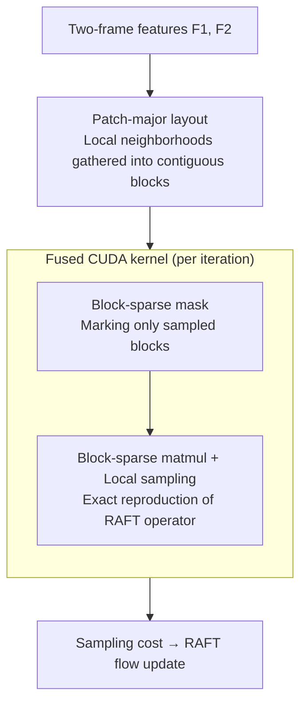

# Efficient All-Pairs Correlation Volume Sampling for Optical Flow Estimation

**Conference**: CVPR 2026  
**arXiv**: [2505.16942](https://arxiv.org/abs/2505.16942)  
**Code**: Not provided in the text (DisneyResearch｜Studios + ETH Zürich)  
**Area**: Video Understanding / Optical Flow Estimation / Operator Acceleration  
**Keywords**: Optical Flow Estimation, RAFT, Correlation Volume, Block Sparse, CUDA Kernel, Ultra-high Resolution

## TL;DR
Addressing the dilemma in RAFT-based optical flow methods where "all-pairs correlation volume sampling" either leads to memory explosion or low speed at high resolutions, this paper observes that only 1.6% of the correlation volume is actually sampled. Based on this, a sampling operator featuring **block sparsity + patch-major layout + fused CUDA kernel** is designed. It **mathematically reproduces** the RAFT sampling definition with bit-accuracy while reducing both time and memory complexity from quadratic to linear $\mathcal{O}(n)$. The method saves up to 63–67% of end-to-end inference time and achieves SOTA on the precision-speed Pareto front using a self-built 8K dataset.

## Background & Motivation
**Background**: The mainstream of contemporary optical flow estimation follows the RAFT pipeline: first constructing an **all-pairs correlation volume** $\mathbf{C}\in\mathbb{R}^{H_1\times W_1\times H_2\times W_2}$ between features of two frames, then performing bilinear sampling of matching costs in the local neighborhood of the current flow estimate over several iterations to update the flow. RAFT provides two sampling implementations, most of which have been adopted by subsequent works.

**Limitations of Prior Work**: Both implementations have critical flaws. The **default implementation** computes and stores the full 4D correlation volume at once, resulting in memory consumption that **grows quadratically** with the number of pixels—storing the volume for a $1024\times448$ resolution requires 719GB, leading to OOM at high resolutions. The **on-demand sampling** has low memory overhead but recomputes Eq.1 for every pixel, which is hardware-unfriendly and cannot reuse results across iterations, making it **an order of magnitude slower** than the default implementation in practice.

**Key Challenge**: There is a hard trade-off between speed and memory. Consequently, many recent methods simply **avoid** the full correlation volume (e.g., using 1D decomposition or low-rank approximation) or **remove** it entirely in favor of larger backbones (ReCoVEr, WAFT)—but these come at the **cost of accuracy**. Furthermore, due to computational constraints, many methods can only run at downsampled resolutions, losing fine-grained details.

**Key Insight**: The authors performed a key empirical analysis—running default RAFT on Sintel and tracking which correlation volume cells were actually sampled. The conclusion: since each lookup only samples within a $(2r+1)^2$ local grid around the current flow and neighborhoods overlap significantly between iterations, **on average, only 1.6% of the cells are actually used throughout all iterations**. Since the vast majority of the correlation volume is computed in vain, only the used portion should be calculated.

**Core Idea**: The correlation volume is represented in a **block-sparse** format, making computational decisions at the granularity of "blocks" rather than "pixels." Combined with a **patch-major layout** that clusters local neighborhoods into contiguous memory blocks and a single **fused CUDA kernel**, the quadratic complexity is reduced to linear **without changing the mathematical definition of RAFT**.

## Method

### Overall Architecture
The input consists of $D$-dimensional features $F^{1,2}\in\mathbb{R}^{H\times W\times D}$ extracted from two frames, and the output is the local sampling cost $\mathcal{C}_r(\mathbf{y},\mathbf{x})$ required for each RAFT iteration. The operator logic consists of "one preprocessing step + three steps per iteration": first, image features are rearranged into a **patch-major layout** (making 2D spatial blocks contiguous in memory); then, in each RAFT flow update iteration (typically 4–32 iterations), the following are executed: (a) **determining which blocks need computation** based on the current sampling grid and setting a computation mask, (b) using **block-sparse matrix multiplication** to compute only these blocks, and (c) **local sampling** on the computed blocks. While a high-level implementation would explicitly store the mask and block-sparse volume, the final **fused CUDA kernel** strings these three steps into a single thread block—sampling immediately after computing a block row without writing intermediate results to global memory—achieving $\mathcal{O}(n)$ time and memory complexity. This operator is bit-wise equivalent to the original RAFT definition (EPE difference only 0.03%).

### Key Designs

**1. Block-Sparse Sampling: Computing only the used 1.6%**

The pain point is straightforward—the default implementation stores the entire correlation volume, yet only 1.6% of the cells are sampled. Storing a pixel-wise binary mask would be as large as the full volume. The authors solve this by **raising the decision granularity to blocks**: representing the volume $\mathbf{C}$ in a block-sparse format and deciding whether to compute at the block level. The mask is built by taking the integer grid sampling positions defined in Eq.1, dividing them by the block size $B$ to get block indices, and performing an **inverse operation (scatter)** to set these blocks to 1 in the mask. Using blocks slightly increases the percentage of cells computed (a whole block is computed if a single value is used), but as long as the block is small, the ratio remains far lower than the full matrix, and blocks themselves are hardware-friendly dense sub-matrices.

**2. Patch-major Layout: Clustering 2D local neighborhoods into contiguous memory blocks**

Block sparsity alone is insufficient—RAFT's sampling grid is defined over a **2D neighborhood**. When an image is flattened using standard row-major order, 2D neighbors are scattered across many non-contiguous columns and blocks, diluting the "sparsity." To address this, the authors rearrange the layout to **patch-major**: padding the image to a multiple of $B$, tiling it into $B^2$ tiles, flattening each tile internally in row-major order, and then arranging all tiles in row-major order. This ensures a 2D spatial block is a contiguous segment in memory, naturally clustering sampled regions into a few blocks. Figure 3 shows that this "block-aware" layout **significantly improves sparsity with zero additional computational overhead**, providing the prerequisite for block sparsity to save computation.

**3. Three-step Block-Sparse Operator: Reproducing RAFT exactly, not approximating**

This is the main algorithm, aimed at replacing the dense computation in Eq.2 without approximation. Each iteration involves three steps: (a) **Designing the computation mask**—using scatter to mark required blocks; (b) **Sparse correlation volume computation**—performing matrix multiplication only on blocks with non-zero masks, where each block is the product of two $B^4\times D$ small matrices (block height $B=8$); (c) **Sparse volume sampling**—for each target cost value, determining which block it falls into, gathering its memory location, calculating relative coordinates, and performing sampling. This design differs fundamentally from approximation methods that "avoid/remove correlation volumes": it remains the **exact RAFT operator** (EPE difference only 0.03%) and can be used as a drop-in replacement.

**4. Fused CUDA Kernel + Implicit Voting Mask: Achieving $\mathcal{O}(n)$ Spacetime**

High-level implementations requiring explicit mask and block-sparse volume storage still incur notable overhead. The authors **fuse the three steps into a single CUDA kernel**: each **block row** of the correlation volume is processed serially by a thread block ("compute one block, sample immediately"), with each thread responsible for one source pixel. Intermediate results are **never written back to global memory**, using only shared memory and registers, compressing both time and memory complexity to linear $\mathcal{O}(n)$. The most ingenious part is the **implicit computation mask**: to avoid storing the full row mask, each thread calculates its required block indices (typically $\le 9$) and stores them in a sorted register array; then, all threads use **atomic minimum voting** on shared memory to select the next smallest block to compute. The kernel is implemented using the CUTLASS CuTe DSL, targeting Ampere architecture warp-level MMA tensor cores with bfloat16 input and float32 accumulation.

**5. Cascaded Inference: Training-free large displacement patch for SEA-RAFT**

An independent contribution addressing a side effect of high-resolution inference: while capturing fine details, estimating large displacements becomes difficult. The authors add a **test-time, zero-training cascaded initialization** to SEA-RAFT. Before any iteration, the flow is initialized recursively using low-resolution estimates—whenever the minimum input dimension $>800$px, the input is downsampled to $1/4$ to estimate once, then $1/2$ downsampled output initializes the current flow. This is a multi-resolution version of RAFT's warm-start but, unlike MS-RAFT+, **does not require training multiple resolution modules**.

## Key Experimental Results

### Isolation Tests: Correlation sampling operator only
On Sintel train (1041 samples), with $2048\times896$ input, $256$ channels, and $32$ iterations, comparing default vs. on-demand vs. ours (NVIDIA GH200 / A100). Core conclusion: the operator **reduces runtime by 90%+ at equal memory** or **reduces memory by up to 99% at equal runtime**, with both scaling linearly with pixel count.

| Method (RAFT, Input Width) | Default Time/Mem | On-demand Time/Mem | Ours Time/Mem |
|------|------|------|------|
| $1024$-$1/8$ | 0.07s / 3.42GB | 0.56s / 3.23GB | **0.09s / 3.23GB** |
| $2048$-$1/4$ | 0.25s / 8.78GB | 0.89s / 4.08GB | **0.25s / 4.08GB** |
| $4096$-$1/2$ | OOM | 2.62s / 7.46GB | **0.96s / 7.46GB** |
| $8192$-$1/1$ | OOM | 10.47s / 20.96GB | **3.43s / 20.96GB** |

- vs. On-demand: **~63% faster** at $4096$ ($0.96/2.62$), **~67% faster** at $8192$ ($3.43/10.47$) with identical memory.
- vs. Default: Comparable or faster runtime, but default goes OOM at $\ge 4096$.

### 8K End-to-End: Self-built Charge Dataset (332 pairs, $8192\times3432$, 80GB VRAM limit)
Listed are the best scales within 80GB; EPE is End-Point Error, LM is the Large Multiplier (displacement >128px) subset.

| Method | Scale | 1px↓ | EPE↓ | LM-1px↓ | LM-EPE↓ | E2E Speedup |
|------|------|------|------|---------|---------|------|
| RAFT | $4096$-$1/2$ | 18.9 | 5.90 | 49.8 | 36.41 | **−63%** (2.62→0.96s) |
| MS-RAFT+ | $4096$-$1/2$ | 14.5 | 1.92 | 34.6 | 32.03 | −25% (5.51→4.15s) |
| CCMR | $4096$-$1/2$ | 15.8 | 2.16 | 39.7 | 42.86 | −16% |
| DPFlow | $8192$-$1/1$ | 16.5 | 1.92 | 34.4 | **18.03** | −9% |
| SEA-RAFT | $4096$-$1/2$ | 16.8 | 4.94 | 39.8 | 39.83 | −33% (0.62→0.42s) |
| **SEA-RAFT (cascaded)** | $8192$-$1/1$ | **13.3** | 2.70 | **31.6** | 21.53 | −34% |
| **SEA-RAFT (cascaded)** | $4096$-$1/2$ | 15.8 | **1.90** | 36.8 | 18.58 | −37% |

### Key Findings
- **Most RAFT-based methods see >30% end-to-end speedup**: Since correlation sampling accounts for a large portion of total runtime, optimizing it significantly lowers total latency.
- **Cascaded SEA-RAFT achieves SOTA 1px (13.3%) and LM-1px (31.6%)**: Proves that cost-volume methods can outperform "correlation-free" methods in accuracy when equipped with an efficient sampler.
- **Precision-Speed Pareto Frontier**: While previous methods struggle or degrade at 8K, this work allows cost-volume methods to lead in both speed and quality.

## Highlights & Insights
- **The paradigm of "quantifying sparsity before designing operators"**: The 1.6% empirical figure is the foundation—it transforms intuition into actionable design.
- **Patch-major layout as a "free sparsity multiplier"**: Changing the memory layout to cluster 2D neighborhoods significantly boosts sparsity with zero extra computation.
- **Bit-accurate reproduction is the key differentiator**: Unlike other efficient flow methods that compromise accuracy, this pure engineering optimization enables a seamless drop-in replacement.
- **Implicit voting mask is elegant**: Using shared memory atomic-min for collaborative thread decisions avoids explicit mask overhead, illustrating how to compress high-level algorithms into $\mathcal{O}(n)$ kernels.

## Limitations & Future Work
- **Speedup is concentrated in the correlation sampling operator**: End-to-end gains depend on the operator's share of total runtime; benefits are limited for methods where the bottleneck is the backbone (e.g., WAFT, ReCoVEr).
- **Strong hardware dependence**: The fused kernel relies on CUTLASS CuTe DSL and Ampere warp-level MMA; porting to other architectures requires re-implementation.
- **Fixed block height $B$**: $B=8$ is an empirical trade-off; whether it remains optimal across different resolutions or iterations is not explored.
- **Limited 8K Dataset diversity**: The Charge dataset is single-source (Blender) and contains only 332 pairs; evaluation on real-world 8K footage is still missing.

## Related Work & Insights
- **vs. Default RAFT**: Quadratic memory and OOM at high resolutions; Ours uses linear memory and is mathematically equivalent.
- **vs. RAFT On-demand**: On-demand is low-memory but slow; Ours is equally low-memory but 63–67% faster due to hardware-friendly block matmul.
- **vs. Flow-1D / SCV / HCVFlow**: They use 1D decomposition or low-rank volumes to bypass the quadratic cost but lose accuracy; Ours keeps the exact operator definition.
- **vs. MS-RAFT+**: MS-RAFT+ trains multiple resolution modules; Cascaded inference is a training-free, lightweight multi-resolution warm-start.

## Rating
- Novelty: ⭐⭐⭐⭐ Not a new architecture but a rigorous operator rewrite; the path from "empirical sparsity" to "fused kernel" is very solid.
- Experimental Thoroughness: ⭐⭐⭐⭐ Extensive coverage of isolation and end-to-end tests across 8K; however, code is not public.
- Writing Quality: ⭐⭐⭐⭐ Motivation-driven design with clear logic; kernel details are dense.
- Value: ⭐⭐⭐⭐⭐ High practical value as a drop-in replacement that enables 30-67% speedups for the RAFT ecosystem at high resolutions.

<!-- RELATED:START -->

## Related Papers

- [\[CVPR 2026\] FlowFM: Advancing Dark Optical Flow Estimation with Flow Matching](flowfm_advancing_dark_optical_flow_estimation_with_flow_matching.md)
- [\[CVPR 2026\] U2Flow: Uncertainty-Aware Unsupervised Optical Flow Estimation](u2flow_uncertainty_aware_unsupervised_optical_flow_estimation.md)
- [\[CVPR 2026\] From Contrast to Consistency: Rethinking Event-based Continuous-Time Optical Flow Estimation](from_contrast_to_consistency_rethinking_event-based_continuous-time_optical_flow.md)
- [\[ICCV 2025\] MEMFOF: High-Resolution Training for Memory-Efficient Multi-Frame Optical Flow Estimation](../../ICCV2025/video_understanding/memfof_high-resolution_training_for_memory-efficient_multi-frame_optical_flow_es.md)
- [\[AAAI 2026\] BAT: Learning Event-based Optical Flow with Bidirectional Adaptive Temporal Correlation](../../AAAI2026/video_understanding/bat_learning_event-based_optical_flow_with_bidirectional_adaptive_temporal_corre.md)

<!-- RELATED:END -->
