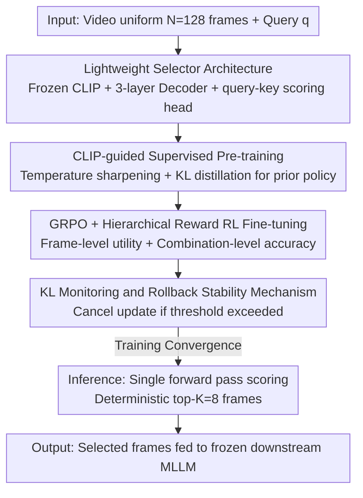

# Efficient Frame Selection for Long Video Understanding via Reinforcement Learning

**Conference**: CVPR 2026  
**Paper**: [CVF Open Access](https://openaccess.thecvf.com/content/CVPR2026/html/Qin_Efficient_Frame_Selection_for_Long_Video_Understanding_via_Reinforcement_Learning_CVPR_2026_paper.html)  
**Code**: None  
**Area**: Video Understanding / Multimodal VLM  
**Keywords**: Keyframe Selection, Long Video Understanding, Reinforcement Learning, GRPO, Multi-modal Large Language Model  

## TL;DR
Addressing the issue that "uniform sampling misses keyframes" in long video understanding, this paper trains a lightweight, plug-and-play query-adaptive frame selector. It first distills a semantic relevance prior from a frozen CLIP and then fine-tunes it using an improved GRPO (with hierarchical rewards at both frame and combination levels), directly using the downstream MLLM's accuracy as the signal. The method achieves an average +3.28% gain across four mid-to-long video benchmarks, with more significant improvements on longer videos.

## Background & Motivation
**Background**: Multi-modal Large Language Models (MLLM) have made rapid progress in video QA. However, limited by context windows and computational costs, most models employ **uniform sampling** to reduce videos to a fixed number of frames before feeding them into the LLM.

**Limitations of Prior Work**: Useful "key moments" in long videos are often sparse and unevenly distributed. Uniform sampling easily misses critical evidence, leaving redundant frames that lead to inference errors. Previous works have attempted several paths: AKS dynamically allocates more samples to information-dense segments; FRAG and M-LLM Based Selection use a large model as a scorer to evaluate query relevance frame-by-frame; FrameVoyager learns a ranking function supervised by prediction loss.

**Key Challenge**: These methods have critical flaws. First, **online scoring with MLLMs is expensive and introduces high latency**. Second, they optimize **proxy targets** (query–frame relevance, prediction loss), but "looking relevant" does not equate to "being useful for answering." Selecting many highly similar relevant frames causes redundancy, while critical clues might have weak single-frame relevance but provide lethal evidence when combined. A systematic bias exists between proxy signals and actual task utility.

**Goal**: To create a lightweight and accurate frame selector that satisfies three conditions: (1) no reliance on online large model scoring, ensuring minimal overhead and plug-and-play capability; (2) an optimization objective directly aligned with downstream accuracy rather than relevance proxies; (3) the ability to weigh relevance, diversity, and temporal coverage at the frame-combination level.

**Core Idea**: A **two-stage training** approach is proposed. First, it distills a relevance prior from a frozen CLIP for initialization. Then, it uses **improved GRPO + hierarchical rewards** to let the selector explore frame combinations in real tasks, using the correctness of the downstream MLLM directly as the reward to learn "selecting the right combination" instead of "selecting the most relevant frames."

## Method

### Overall Architecture
Given a video $V$ and a text query $q$, a candidate pool of $N=128$ frames is first uniformly sampled. The goal is to select a compact subset of $K=8$ frames ($K\ll N$) for the frozen downstream MLLM to maximize accuracy. This is formulated as a **query-conditioned scoring-selection problem**: the selector policy $\pi_\theta$ scores each frame and outputs a distribution $P_{\pi_\theta}$, from which the top-$K$ frames are taken during inference.

The pipeline consists of a "lightweight selector + two-stage training + stabilization mechanism": the selector architecture is minimal (frozen CLIP features + 3-layer Transformer decoder + query-key scoring head); the first stage uses CLIP as a teacher for relevance distillation, and the second stage uses RL to optimize task utility directly, with KL monitoring + rollback to prevent policy collapse.

### Key Designs

**1. Lightweight Selector Architecture: Using frozen CLIP + minimal decoder + query-key head to achieve near-zero scoring overhead**

To address the high cost of online MLLM scoring, the selector is split into three parts, most of which are frozen: the feature extractor uses a frozen CLIP ViT-L/14 to leverage its cross-modal alignment prior, obtaining query embedding $e_q\in\mathbb{R}^d$ and frame embeddings $e_{f_i}\in\mathbb{R}^d$. The context module is a 3-layer Transformer decoder with hidden dimension $d$, allowing information to flow between frames for temporal context refinement.

The key lies in the scoring head: the authors **do not** use a standard fully connected layer to map context features to $N$ scores. Instead, they introduce a simplified **query-key attention head** to explicitly condition the scoring on the query—the query embedding is enriched with image context via the decoder to obtain $Q'\in\mathbb{R}^{d_k}$, while the frame representations are **not updated by the decoder** and are projected directly as $K_i\in\mathbb{R}^{d_k}$. The scalar score for the $i$-th frame is:

$$s_i = \frac{Q' K_i^\top}{\sqrt{d_k}}, \qquad P_{\pi_\theta}(i)=\mathrm{softmax}\big((s_j)_{j=1}^N\big)_i$$

This ensures the selector's computational footprint is minimal, making it plug-and-play for various MLLMs. Unlike one-shot ranking, it **explicitly evaluates all $N$ frames**, preserving room for exploring "better frame combinations" in the RL stage.

**2. CLIP-guided Supervised Pre-training: Distilling a "sharpened relevance prior" to provide a good starting point for RL**

Training a selector purely with RL is unstable and sample-inefficient. Thus, the first stage performs supervised distillation to obtain a reliable initialization. Cosine similarity $c_i=\mathrm{sim}(e_q,e_{f_i})$ is calculated for each query–frame pair. Since only a few frames are eventually selected, the authors aim for a "sharper" distribution using a temperature coefficient $\tau<1$:

$$P_{\text{CLIP}}(i)=\frac{\exp(c_i/\tau)}{\sum_{j=1}^N \exp(c_j/\tau)}$$

The selector aligns with this sharpened distribution by minimizing the KL divergence $L_{ST}=D_{KL}\big(P_{\text{CLIP}}\,\|\,P_{\pi_\theta}\big)$, resulting in a base policy $\pi_{\text{ref}}$ with reliable semantic relevance priors (experimental $\tau=0.03$ for 54 epochs). This step essentially injects CLIP's cross-modal knowledge into the lightweight selector, avoiding a cold start from a random policy during RL.

**3. Improved GRPO + Hierarchical Reward: Substituting "relevance proxies" with "downstream accuracy" and assigning credit at both frame and combination levels**

This is the core of the paper. High relevance $\neq$ utility for answering: selecting similar highly relevant frames causes redundancy, while key clues may have weak single-frame relevance but are effective in combination. Therefore, the second stage models frame selection as a **one-step RL** problem—treating each frame as a token, $K$ frames are **sampled without replacement** from the probability $p_i=\mathrm{softmax}(s)_i$ to form a subset $I$. For each query, $G$ rollouts are sampled in parallel, and each subset is fed to the downstream MLLM to obtain scalar rewards.

However, the binary signal "correct=1, incorrect=0" is too sparse, and since the action is a set, credit assignment for success or failure is entangled among frames, leading to mis-punishing useful frames or mis-rewarding useless ones. This work uses **hierarchical rewards** for denser, more aligned signals:

- **Frame-level Utility**: Qwen2-VL is used to score each frame in the selected set with a utility score $h_i \in \{0, \dots, 5\}$ (5 = directly determines the answer, 0 = useless or misleading). Intra-set centralized normalization provides the frame-level advantage $\hat{A}^{(i)}_{\text{frame}}=\big(h_i-\bar h\big)\big/\sqrt{\mathrm{Var}(h)+\epsilon}$, encouraging the policy to prioritize the most useful frames within the selection.
- **Combination-level Success**: The $G$ combinations each receive a binary task reward $r^{(g)}_{\text{task}}\in\{0,1\}$ from the downstream task. Intra-group normalization yields $\hat{A}^{(g)}_{\text{comb}}=\big(r^{(g)}_{\text{task}}-\bar r\big)\big/\sqrt{\mathrm{Var}(r)+\epsilon}$, distributing the credit of "which one is better relative to peers under the same query" to the frames in that combination.

These are weighted into the final frame advantage $\hat{A}_i=\lambda_f \hat{A}^{(i)}_{\text{frame}}+\lambda_s \hat{A}^{(i)}_{\text{comb}}$, which is substituted into the GRPO clipping objective:

$$J_{RL}(\theta)=\mathbb{E}_i\Big[\min\big(r_i \hat A_i,\ \mathrm{clip}(r_i,1-\epsilon_c,1+\epsilon_c)\hat A_i\big)\Big],\quad r_i=\frac{\pi_{\theta_t}(f_i\mid q,f_{<i})}{\pi_{\theta_{t-1}}(f_i\mid q,f_{<i})}$$

This maintains combination-level alignment while supplementing it with dense, structured credit assignment from frame-level utility. Note: Specific values for $\lambda_f, \lambda_s$ were not provided in the original text; refer to the original paper for implementation details.

**4. KL Monitoring and Hard Rollback: Using KL as a "runtime supervisor" to revoke steps exceeding boundaries rather than as a loss term**

Standard GRPO adds KL as a loss term. However, the authors argue that KL punishment is **ex post facto**—the penalty only applies after the policy has already taken too large a step and likely drifted too far, making recovery slow and unstable.

Thus, this paper **intentionally removes the explicit KL penalty term** and treats KL as a real-time monitoring metric: $D_{KL}(\pi_{\theta_t}\|\pi_{\theta_{t-1}})$ is calculated at each step. If it exceeds a threshold $\delta_{KL}$, a hard rollback is executed—parameters are reverted via $\theta_t\leftarrow\theta_{t-1}$ and the batch is discarded. This "monitoring + rollback" approach immediately blocks stability-destroying gradients while allowing bold updates within the trust region, reacting faster than a lagging loss penalty.

### Loss & Training
- **Stage 1** (Distillation): AdamW, lr $1\times10^{-4}$, batch size 64, temperature $\tau=0.03$, 54 epochs, target $L_{ST}=D_{KL}(P_{\text{CLIP}}\|P_{\pi_\theta})$.
- **Stage 2** (RL): GRPO style, lr $1\times10^{-6}$, clipping $\epsilon=0.2$, **only 1 epoch**; downstream reward MLLM is Qwen2-VL.
- Training Data: Filtered 2–3 minute videos from the YouTube subset of LLaVA-178K. Hardware: 8×NVIDIA L20.
- Inference: Uniformly sample $N=128$ frames, single forward pass scoring, deterministic top-$K=8$ fed to downstream MLLM.

## Key Experimental Results

### Main Results
On four mid-to-long video benchmarks (LongVideoBench/~8min, VideoMME/~17min, EgoSchema/~3min, MLVU/~12min), the "Uniform vs. Selector" comparison was conducted for various downstream MLLMs with strictly identical frame counts. The selector improved accuracy across all model-dataset combinations, with an **average gain of +3.28%**, more pronounced on long videos (MLVU +6.16% avg, LongVideoBench +3.87% avg; EgoSchema +0.99% avg).

| Downstream MLLM | Scale | LongVideoBench | VideoMME | EgoSchema | MLVU |
|--------|------|------|------|------|------|
| LLaVA-NeXT-Video | 7B | 39.7→41.6 | 39.3→40.6 | 38.5→39.2 | 42.9→**47.2** (+4.3) |
| LLaVA-NeXT-Video | 34B | 48.3→49.9 | 48.2→49.6 | 42.5→43.1 | 49.2→**56.8** (+7.6) |
| InternVL2 | 8B | 35.7→40.5 (+4.8) | 34.3→36.5 | 38.4→38.6 | 41.3→47.7 (+6.4) |
| InternVL2 | 40B | 49.2→54.3 | 54.0→56.3 | 42.0→43.6 | 43.9→**51.0** (+7.1) |
| VideoLLaMA3 | 7B | 50.3→55.6 | 55.1→57.3 | 53.5→53.8 | 57.4→64.0 (+6.6) |
| Qwen2-VL | 7B | 51.1→56.5 | 53.1→56.1 | 56.5→58.0 | 52.4→58.9 (+6.5) |

Larger models show more significant gains on long videos, confirming that while content in short videos is already dense, selection is more critical when evidence is sparse in long videos.

**Comparison with Other Selection Methods** (Qwen2-VL-7B / LongVideoBench):

| Method | Accuracy (%) | Selection Latency (s) |
|------|------|------|
| Random | 49.7 | / |
| Uniform | 51.1 | / |
| CLIP-TopK | 55.7 | 3.34 |
| AKS | 55.9 | 7.84 |
| **Ours** | **56.5** | 3.36 |

Ours achieves the highest accuracy with latency almost identical to CLIP-TopK, outperforming Uniform by +5.4%, CLIP-TopK by +0.8%, and AKS by +0.6% while being twice as fast.

### Ablation Study
VideoMME / Qwen2-VL backbone:

| Configuration | Accuracy (%) | Description |
|------|------|------|
| Ours (Full Model) | 56.5 | Full model |
| w/o RL Stage | 55.1 | Only CLIP distillation, -1.4% |
| w/o Pre-training Stage | 54.8 | Pure RL cold start, -1.7% |
| w/o hierarchical reward | 55.6 | Combination-level reward only, -0.9% |
| w/o KL monitor | 55.2 | Remove monitoring/rollback, -1.3% |

Different frame counts $K$ (LongVideoBench):

| Frame Count $K$ | Qwen2-VL-7B Uniform | Qwen2-VL-7B Selector | LLaVA-NeXT-34B Uniform | LLaVA-NeXT-34B Selector |
|------|------|------|------|------|
| 2 | 46.8 | 52.1 | 45.1 | 49.3 |
| 4 | 49.4 | 54.5 | 47.0 | 50.7 |
| 8 | 51.1 | 56.5 | 48.3 | 49.9 |
| 16 | 52.8 | 55.9 | 50.1 | 50.2 |

### Key Findings
- **Pre-training stage is the most significant contributor**: Removing it (pure RL cold start) causes a 1.7% drop, highlighting the instability of pure RL and the need for CLIP priors.
- **Hierarchical rewards are essential**: Using only combination-level rewards results in a 0.9% drop, showing that frame-level utility provides necessary credit assignment in set-based actions.
- **KL monitoring prevents collapse**: KL spikes were observed during training; removing monitoring/rollback led to a drop from 56.5% to 55.2%.
- **Quality over Quantity**: Selecting 2 frames (52.1) nearly matches or exceeds uniform sampling of 8 frames (51.1), proving that "selecting the right frames" is more critical than "selecting more frames."

## Highlights & Insights
- **Modeling "frame selection" as a one-step RL token sampling**: Treating each frame as a token and using parallel rollouts for subsets allows for an elegant reuse of the GRPO mechanism from LLMs, stabilizing credit assignment.
- **Switching rewards from relevance proxies to downstream accuracy**: Using frame-level LLM scoring (0–5 utility) combined with combination-level accuracy aligns the task better and resolves credit entanglement in set-based actions.
- **KL as a supervisor rather than a penalty**: Addressing the lagging nature of KL penalties, the "hard rollback" approach is simple yet effective, potentially applicable to other unstable on-policy fine-tuning tasks.
- **Surprising efficiency**: The RL stage only requires 1 epoch and 8×L20 GPUs; the selector itself has negligible parameter overhead and high plug-and-play utility.

## Limitations & Future Work
- **Limited Training Data**: Training only utilized 2–3 minute YouTube videos from LLaVA-178K; generalization to ultra-long videos (tens of minutes) or first-person/professional domains is not fully verified.
- **Dependency on Qwen2-VL for Rewards**: Both frame-level utility and combination rewards rely on Qwen2-VL; if the reward model is biased, the selector may inherit those biases.
- **Fixed $K$ and Deterministic Top-K**: Inference uses a fixed 8 frames and deterministic truncation, lacking the ability to adaptively adjust frame counts based on video or query complexity.
- **Missing Hyperparameters**: Critical values like weights $\lambda_f, \lambda_s$ are not specified, affecting reproducibility.

## Related Work & Insights
- **vs. AKS (Training-free Adaptive Sampling)**: AKS relies on rules to balance relevance and coverage without training but is slow (7.84s); the proposed method is twice as fast (3.36s) and more accurate, aligning with accuracy rather than heuristic coverage.
- **vs. FRAG / M-LLM Based Selection**: These use large models for online scoring, incurring high costs and optimizing relevance proxies; the proposed method uses large models only during **training** for rewards, with a lightweight selector for inference.
- **vs. FrameVoyager / Q-Frame**: FrameVoyager uses prediction loss as a proxy; this method achieves higher gains on VILA-1.5-8B backbones over Q-Frame with better parameter efficiency (0.425B selector vs. 1.5B MLLM-based).

## Rating
- Novelty: ⭐⭐⭐⭐ Modeling frame selection as one-step RL with hierarchical rewards and KL rollback is a clean combination, though individual components are clever adaptations of existing techniques.
- Experimental Thoroughness: ⭐⭐⭐⭐ Coverage of 6 downstream models and 4 benchmarks is robust; however, validation on ultra-long videos and reward model robustness is missing.
- Writing Quality: ⭐⭐⭐⭐ Motivation-method-experiment chain is logical; lack of some hyperparameter values slightly hinders reproducibility.
- Value: ⭐⭐⭐⭐ Plug-and-play, low-cost, and provides clear gains for long video tasks; a highly practical component for long video MLLM preprocessing.

<!-- RELATED:START -->

## Related Papers

- [\[CVPR 2026\] GIFT: Global Irreplaceability Frame Targeting for Efficient Video Understanding](gift_global_irreplaceability_frame_targeting_for_efficient_video_understanding.md)
- [\[ICLR 2026\] FOCUS: Efficient Keyframe Selection for Long Video Understanding](../../ICLR2026/video_understanding/focus_efficient_keyframe_selection_for_long_video_understanding.md)
- [\[CVPR 2026\] DIvide, then Ground: Adapting Frame Selection to Query Types for Long-Form Video Understanding](divide_then_ground_adapting_frame_selection_to_query_types_for_long-form_video_u.md)
- [\[CVPR 2026\] Wavelet-based Frame Selection by Detecting Semantic Boundary for Long Video Understanding](wavelet-based_frame_selection_by_detecting_semantic_boundary_for_long_video_unde.md)
- [\[CVPR 2026\] VideoChat-M1: Collaborative Policy Planning for Video Understanding via Multi-Agent Reinforcement Learning](videochatm1_collaborative_policy_planning_for_vide.md)

<!-- RELATED:END -->
