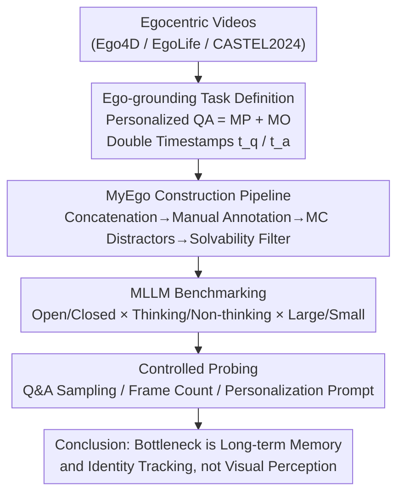

# Ego-Grounding for Personalized Question-Answering in Egocentric Videos

**Conference**: CVPR 2026  
**Paper**: [CVF Open Access](https://openaccess.thecvf.com/content/CVPR2026/html/Xiao_Ego-Grounding_for_Personalized_Question-Answering_in_Egocentric_Videos_CVPR_2026_paper.html)  
**Code**: None (Not provided in the paper)  
**Area**: Video Understanding / Multimodal VLM  
**Keywords**: Egocentric Video, Personalized QA, Ego-grounding, VideoQA Benchmark, Long-term Memory

## TL;DR
This paper proposes **MyEgo**—the first diagnostic benchmark for "personalized egocentric video question answering" (541 long videos, 5K questions regarding "my things/my activities/my past"). It systematically examines whether mainstream MLLMs can perform **ego-grounding** (understanding, remembering, and tracking the "camera wearer/me"). The results reveal that GPT-5 achieves only 46% accuracy, trailing humans by nearly 40 points. Furthermore, increasing model scale or adding Chain-of-Thought (CoT) fails to solve the issue, as the bottleneck lies in long-term memory and identity tracking.

## Background & Motivation
**Background**: With the proliferation of wearable devices like smart glasses, first-person (egocentric) video has become a vital medium for recording personal daily experiences. For an AI assistant to help users recall "what I saw/did/touched," it must first perform **ego-grounding**: identifying "me," "my things," "my activities," and "my past" within "my" first-person videos. Modern MLLMs, with strong visual reasoning and long-context capabilities, seem promising for this task.

**Limitations of Prior Work**: In egocentric videos, the camera wearer is often only **partially visible** (hands, arms, ego-motion, occasional reflections), lacks a full-face view, and has no stable appearance anchors. Existing VideoQA/egocentric benchmarks (EgoSchema, EgoMemoria, EgoThink, etc.) evaluate general first-person understanding, but none specifically test "personalized coreference resolution"—distinguishing "me" from bystanders or identifying "the one I used" among multiple similar objects.

**Key Challenge**: Successful ego-grounding requires both **spatial discrimination** (distinguishing the camera wearer from others/similar objects nearby) and **long-term temporal reasoning** (recalling interactions from tens of seconds or minutes ago that are no longer visible). Most current MLLMs process only 8–32 frames at a time, limiting long-range integration. Worse, they tend to rely on short-term appearance cues rather than true identity "anchoring," leading to incorrect answers once the referent leaves the frame.

**Goal**: Instead of proposing a new model, the goal is to construct a dataset and evaluation framework to **specifically diagnose whether ego-grounding exists**, decomposing failures into spatial confusion versus failures in remembering "me" and "my past."

**Key Insight**: The authors start from a simple observation: humans easily solve questions like "Is that my rag?", but all MLLMs fail the same question if it is asked after the referent has left the frame and another person appears with a similar object. This suggests the problem is not "understanding the current frame" but "maintaining identity/object representations over time."

**Core Idea**: Explicitly turn "personalized first-person reference" into controllable diagnostic questions. Each question is bound to two timestamps—a **question moment ($t_q$)** and an **answer moment ($t_a$)**. Questions are specifically designed to require distinguishing "me vs. others" or "my object vs. similar distractors," thereby exposing the models' weaknesses in memory and tracking.

## Method

### Overall Architecture
This is a **benchmark + diagnostic analysis** paper. The "method" consists of: (1) Formalizing personalized egocentric QA as a measurable ego-grounding task; (2) Building the MyEgo dataset via a human-in-the-loop pipeline; (3) Designing three sets of controlled probes to locate MLLM failures in "long-term memory/keyframe retrieval" rather than "visual misunderstanding." The workflow is: task definition → data construction → benchmarking MLLMs → controlled analysis of bottlenecks → conclusion.

### Key Designs

**1. Ego-grounding Task Definition: Decomposing "Personalized First-Person Reference" into Two Diagnostic Difficulties**

The authors formalize "egocentric personalized VideoQA" as answering questions in streaming first-person videos that require **anchoring first-person references** ("I", "my"). Questions fall into two dimensions most fatal to current MLLMs: **MP (Multi-Person)**—distinguishing the camera wearer "me" from others in the scene (e.g., which hand holds "my rag"); and **MO (Multi-Object)**—identifying "the one I interacted with" among multiple **category-identical and visually similar** instances (e.g., distinguishing the green pawn I used from others' red ones or unused blue ones). These difficulties target the "spatial discrimination + long-term tracking" pain points: only by truly anchoring the referent to "my" trajectory can one answer correctly.

To ensure controllability, each question is annotated with two timestamps: the **question moment $t_q$** and the **answer evidence moment $t_a$**, where $t_a \le t_q$. Questions are categorized: if $t_q - t_a \le 2\text{s}$, it is **Current** (answer is in the present); otherwise, it is **Previous** (answer is in the historical context). The average interval between $t_q$ and $t_a$ is approximately 20 seconds, with 70.6% of questions being "Previous," forcing the model to recall and maintain a stable concept of "me." Inputs consist of fixed frames (usually 32) sampled from the video start to $t_q$ at a maximum of 1 fps, simulating a "streaming question" setting.

**2. MyEgo Construction Pipeline: A Human-Centric Multi-Step Process for Diagnostic Questions**

The authors found that automated question generation using GPT-5/Gemini-2.5 Pro failed to capture "personalized, context-specific" nuances. Thus, a **human-led** pipeline was used. **Video Side**: Sourced from Ego4D, EgoLife, and CASTEL2024, excluding single-person videos. Short EgoLife clips were concatenated into ~10-minute videos; dynamic timestamps were masked; CASTEL2024 was trimmed into 6–20 minute continuous activity segments. This resulted in **541 videos with an average length of 9.2 minutes**. **Annotation Side**: 10 students were trained to annotate questions following three principles: *Egocentric* (first-person perspective), *Personalized* (must highlight the difference between "me" and others), and *Visual Answer* (short answers visible in the video). Annotators provided GT answers, $t_q$, and $t_a$ for 5,012 open-ended (OE) questions.

For standardized evaluation, OE questions were converted to Multiple Choice (MC). Gemini-2.5 Pro generated 4 distractors **verifiable in the video**, prioritizing **temporally relevant** (appearing at $t_q$ or $t_a$) or **contextually confusing** (e.g., "action by others vs. my action") distractors. Yes/no questions were treated as 2-choice. A critical **de-biasing filter** was applied: Gemini-2.5 Pro and GPT-5 were given video frames and options **without the question**. Questions solved by both models were flagged as "guessable via options" and manually revised, ensuring that correct answers require true ego-grounding. The final 5,012 questions include 953 2-choice and 4,059 5-choice MC items.

**3. Controlled Probes: PINPOINTING Failures to "Memory/Retrieval" Rather Than "Perception"**

To find the root cause, three controlled experiments were designed. **(a) Q&A moment-aware sampling vs. Uniform sampling**: Instead of uniform sampling, 8 frames are sampled within $\pm 1.5\text{s}$ of both $t_a$ and $t_q$, totaling 16 frames. If providing the keyframes directly significantly improves performance, it proves the model "cannot retrieve/remember" evidence rather than "not understanding" the visuals. **(b) Frame count analysis**: Sweeping the number of frames from 8 to 64 for InternVL3-8B and LLaVA-Video, and testing "backward sampling" (1–48 frames back from $t_q$) in MC settings to check if "more frames" is always better. **(c) Personalization-aware prompting ablation**: Modifying prompts in two ways—*Enhanced* (replacing "I/my" with "the camera wearer('s)" to clearly define the referent) and *Remove* (stripping personalized cues) to measure sensitivity to explicit personalized reasoning.

## Key Experimental Results

### Main Results
Evaluation covered closed-source (GPT-5, Gemini-2.5 Pro) and numerous open-source MLLMs (Qwen2.5/3-VL, InternVL2.5/3/3.5, LLaVA-OneVision/Video, etc.). Human performance was measured using 2 students on a 300-question subset. OE questions were scored binary (yes/no) by GPT-5 mini (94% human agreement) and given a 0–5 match score.

| Model | MC-2 | MC-5 | OE-Cur. | OE-Pre. | OE-Avg. (Acc) |
|------|------|------|---------|---------|---------------|
| Human | 95.1 | 92.1 | 84.0 | 85.0 | **84.7** |
| GPT-5 (Closed) | 66.4 | 53.7 | 51.1 | 44.0 | **46.1** |
| Gemini-2.5 Pro (Closed) | 61.8 | 45.5 | 42.4 | 40.3 | 40.9 |
| Qwen3-VL-8B-Instruct | 55.0 | 36.6 | 37.4 | 36.0 | 36.4 (Best Open OE) |
| InternVL3-8B | 54.5 | 38.4 | 34.7 | 34.1 | 34.3 (Strong Open MC) |
| LLaVA-Video | 54.8 | 36.0 | 37.4 | 33.9 | 35.0 |
| InternVL2.5-8B | 53.1 | 36.6 | 27.2 | 23.5 | 24.5 |

Key observations: ① All models trail humans by 33%–55%. GPT-5 is the strongest overall, but no model leads in all categories. ② Most models score ~50% in 2-choice MC (near random) because distractors are designed to mislead without true anchoring. ③ InternVL series drops significantly from MC to OE, suggesting its MC scores rely on "option shortcuts." ④ **Previous questions are harder than Current**, confirming tracking/memory bottlenecks.

### Ablation Study

**Q&A moment-aware sampling (16 frames vs. Uniform) shows significant gains, especially for "Previous" questions:**

| Model | Sampling | Acc@Cur. | Acc@Pre. |
|------|------|----------|----------|
| Gemini-2.5 Pro | Uniform → Q&A | 42.4 → 49.3 (↑6.9) | 40.3 → 51.5 (**↑11.2**) |
| Qwen2.5-VL-7B | Uniform → Q&A | 37.7 → 43.4 (↑5.7) | 33.2 → 42.4 (**↑9.2**) |
| Qwen3-VL-8B-Think | Uniform → Q&A | 38.4 → 41.3 (↑2.9) | 32.0 → 41.1 (↑9.1) |
| LLaVA-Video | Uniform → Q&A | 36.3 → 37.7 (↑1.4) | 33.7 → 41.6 (↑7.9) |

**Personalization prompt ablation (Enhanced: clarifying "me" / Remove: stripping identity):**

| Model | OE (Orig→Enh→Rem) | MC (Orig→Enh→Rem) |
|------|---------------------|---------------------|
| InternVL3.5-8B | 33.1 → 33.2 → 31.7 (↓1.4) | 39.5 → 41.1 → 38.5 |
| LLaVA-Video | 34.5 → 35.9 → 35.3 | 37.5 → 38.1 → 37.5 |

### Key Findings
- **More Frames ≠ Better**: Under uniform sampling, InternVL3-8B peaks at 16 frames; LongVA/LongVU show no gains at 128 frames. The authors suggest more frames introduce noise, polluting the already sparse ego-cues. In backward MC sampling, performance gains saturate after 8 frames—**information relevance matters more than quantity**.
- **"Thinking" and "Scaling" Fail**: Qwen3-VL-8B-Thinking and InternVL3.5-8B-Thinking show almost no gain over non-thinking versions, contradicting findings in general VideoQA. 4B models can match or beat larger ones, indicating general scaling does not solve MyEgo.
- **Accuracy Decays Over Time**: Under uniform sampling, accuracy is highest in the 1st minute and lowest after 8 minutes. Q&A moment sampling remains stable across time bins, confirming the importance of "keyframe grounding."
- **Prompt Sensitivity**: Models are not extremely sensitive to prompt phrasing, though "Enhanced" (clarifying referent) usually helps slightly, while "Remove" (removing identity) leads to universal performance drops.

## Highlights & Insights
- **Quantifying "Understanding Me"**: The use of double timestamps ($t_q$/$t_a$) and the Current/Previous split is the most ingenious design. It decouples "understanding the present" from "remembering the past self," making failure modes localized and transferable to other long-term memory tasks.
- **De-biasing Filter**: Using two strong models as "cheating detectors" to re-annotate questions that are guessable from options alone ensures that the benchmark measures true multi-modal reasoning.
- **Counter-intuitive Discovery**: Chain-of-Thought and model scaling fail here, and more frames can be detrimental. This indicates that "personalized first-person understanding" is **orthogonal** to general video reasoning and cannot be solved by simply scaling up compute or context—it requires explicit memory and identity anchoring.

## Limitations & Future Work
- **Diagnosis without Solution**: This paper is a benchmark and analysis; it does not provide a new model architecture. While Q&A moment-aware sampling helps, it relies on oracle information (knowing when the answer occurs), which models must learn to retrieve on their own.
- **Dependency on LLM Judges**: OE scoring relies on GPT-5 mini. While alignment is high (94%), there is a 6% deviation that might introduce systematic errors regarding wording vs. semantics.
- **MC Distractors**: Distractors generated by Gemini may still carry stylistic biases, and the random performance on 2-choice questions suggests uneven difficulty distribution.
- **Future Directions**: The authors point toward better "long-term memory," "personalized reasoning," and "intelligent key-moment detection" (replacing oracle sampling) as the next steps.

## Related Work & Insights
- **vs. EgoSchema / EgoMemoria / EgoThink**: These measure general egocentric understanding; MyEgo specifically tests personalized coreference (me vs. others, my object vs. distractors).
- **vs. QAEgo4D / EgoLifeQA**: These emphasize episodic memory, but do not require linking recalled moments back to the current scene for ego-grounding.
- **vs. EgoTextVQA / EgoBlind**: These focus on scene text or blind assistance; MyEgo focuses on personalized ego-grounding in long video streams.
- **vs. Personalized VLM (Adapting via visual prompts/profiles)**: Unlike methods that adapt to a user profile, MyEgo requires models to derive personalization directly **from the historical ego-video itself**, necessitating visual memory and identity tracking.

## Rating
- Novelty: ⭐⭐⭐⭐⭐ First to turn "personalized ego-grounding" into a diagnostic benchmark; MP/MO + double timestamps is a precise design.
- Experimental Thoroughness: ⭐⭐⭐⭐⭐ Covers open/closed, thinking/non-thinking, large/small scale, and human baselines with deep controlled probes.
- Writing Quality: ⭐⭐⭐⭐ Motivations and failure cases are clear; some analytical details are relegated to the Supplementary material.
- Value: ⭐⭐⭐⭐⭐ Exposes a critical flaw in general MLLMs for egocentric long-term memory, providing a clear direction for wearable personalized assistants.

<!-- RELATED:START -->

## Related Papers

- [\[CVPR 2026\] Do You See What I Am Pointing At? Gesture-Based Egocentric Video Question Answering](do_you_see_what_i_am_pointing_at_gesture-based_egocentric_video_question_answeri.md)
- [\[CVPR 2026\] Minerva-Ego: Spatiotemporal Hints for Egocentric Video Understanding](minerva-ego_spatiotemporal_hints_for_egocentric_video_understanding.md)
- [\[CVPR 2026\] HERBench: A Benchmark for Multi-Evidence Integration in Video Question Answering](herbench_a_benchmark_for_multi-evidence_integration_in_video_question_answering.md)
- [\[CVPR 2026\] MovieRecapsQA: A Multimodal Open-Ended Video Question-Answering Benchmark](movierecapsqa_a_multimodal_open-ended_video_question-answering_benchmark.md)
- [\[CVPR 2026\] Mistake Attribution: Fine-Grained Mistake Understanding in Egocentric Videos](mistake_attribution_fine-grained_mistake_understanding_in_egocentric_videos.md)

<!-- RELATED:END -->
