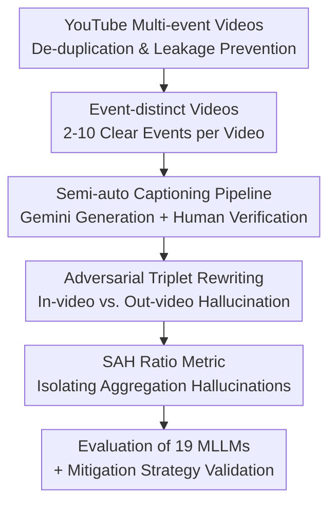

# ELV-Halluc: Benchmarking Semantic Aggregation Hallucinations in Video Understanding

**Conference**: CVPR 2026  
**Paper**: [CVF Open Access](https://openaccess.thecvf.com/content/CVPR2026/html/Lu_ELV-Halluc_Benchmarking_Semantic_Aggregation_Hallucinations_in_Video_Understanding_CVPR_2026_paper.html)  
**Code**: https://github.com/hlsv02/ELV-Halluc  
**Area**: Video Understanding / Multimodal VLM  
**Keywords**: Video hallucination, Semantic Aggregation Hallucination, benchmark, adversarial Q&A, DPO  

## TL;DR
This paper identifies "Semantic Aggregation Hallucinations (SAH)," an overlooked type of video hallucination where a model perceives each frame correctly but misattributes semantics during cross-event aggregation. The authors construct ELV-Halluc, the first benchmark targeting SAH (348 multi-event videos, adversarial triplet Q&A). Systematic evaluation of 19 MLLMs proves that SAH increases with semantic complexity. By employing improved positional encoding and DPO with 8K adversarial pairs, the SAH Ratio is reduced by up to 27.7%.

## Background & Motivation

**Background**: Video hallucinations (where model outputs are inconsistent with video content or completely fabricated) are a core obstacle to the deployment of Video-MLLMs. Extensive prior work (VideoHallucer, EventHallusion, VidHalluc, ARGUS, etc.) has attempted to measure this, attributing causes to three categories: vision-language misalignment, poor frame quality/sampling, and over-reliance on language priors.

**Limitations of Prior Work**: These three explanations share a common blind spot—they assume errors occur at the "frame-level semantic perception" stage. However, another scenario exists: **frame-level semantics are perceived correctly, but the model errs when aggregating these semantics into an event-level interpretation.** For example, in a news video, a host might hold "paper" in the first news segment, while "Starbucks" appears in a later segment; the model might hallucinate "Starbucks" into the first segment's description. Here, all visual elements are seen correctly, but the temporal attribution of semantics is wrong.

**Key Challenge**: Existing benchmarks mostly utilize **short videos and single self-contained events**. In these settings, frame-level content directly corresponds to one event, making aggregation errors rare and nearly impossible to measure in isolation. However, real-world long videos with multiple events and rapid semantic shifts are precisely where aggregation fails—revealing a mismatch between existing benchmarks and real-world difficulties.

**Goal**: (1) Formally name and define quantifiable metrics for this overlooked hallucination; (2) Create a benchmark that stably induces and finely measures it; (3) Provide effective mitigation methods.

**Key Insight**: The authors re-examine video hallucinations through the lens of "semantic aggregation" and propose **Semantic Aggregation Hallucination (SAH)**—where correctly perceived frame-level semantics are incorrectly reorganized into event-level outputs. The key observation is that to **isolate** SAH from general "misperception" hallucinations, one must design probes that distinguish between "content exists in the video but is misattributed (SAH)" and "content does not exist in the video at all (general hallucination)."

**Core Idea**: Utilize "event-distinct" multi-event videos combined with **adversarial triplet Q&A (Ground Truth / In-video Hallucination / Out-video Hallucination)**. By calculating the accuracy gap between in-video and out-video hallucinations, SAH is quantified independently.

## Method

ELV-Halluc is an **evaluation benchmark**. The core of the method is the construction of a dataset and evaluation protocol that stably induces and cleanly measures SAH. The process follows four steps: data collection → semi-auto labeling → adversarial Q&A construction → evaluation metrics.

### Overall Architecture

The pipeline aims to take multi-event videos, obtain high-quality "event-level ground truth captions," perform controlled hallucination rewrites on the ground truth, and score them using a metric that separates SAH. The input consists of manually collected multi-event videos from YouTube, resulting in 200 test videos (4,800 binary Q&A pairs, forming 3,200 adversarial pairs) and 148 training videos.

The benchmark scale is significantly larger than prior work: ELV-Halluc features an average video length of **681.8 seconds** and **37.2 Q&As per video**, whereas VidHalluc has only 24.7s / 1.8 Q&As and EventHallusion has 11.2s / 1.7 Q&As. This high Q&A density in long videos is the prerequisite for exposing SAH.

### Key Designs

**1. Event-by-Event Video: Making Semantic Complexity Controllable and SAH Inducible**

The difficulty in measuring SAH stems from the lack of video types that stably trigger it. The authors define "Event-distinct Videos"—composed of multiple **clearly separated events sharing a common theme** (e.g., a news broadcast with multiple stories). This structure offers three advantages: events are segmented into independent semantic units, reducing labeling difficulty; multiple events in the same video can be "recombined" into seemingly plausible but incorrect descriptions, providing **fertile ground for inducing SAH**; and the number of events acts as a direct proxy for "semantic complexity." The authors manually collected 500 videos from YouTube, filtered for overlap with YouCook2, and kept only those with **2–10** clearly distinguishable events, resulting in 348 videos.

**2. Semi-auto Three-stage Captioning Pipeline: Ensuring Accuracy with Reduced Cost**

Precise, event-level ground truth with accurate timestamps is essential for SAH evaluation, but manual labeling of long videos is costly. The authors use a "quality check → Gemini generation → manual refinement" pipeline: annotators first write keywords for core events; **Gemini-2.5 Flash** then segments the video based on these keywords, removes transitions/non-core segments, and generates detailed captions; finally, humans correct timestamps, factual errors, remove redundant segments, and add missing events. This ensures high-accuracy ground truth while significantly reducing manual effort. ⚠️ As Gemini-2.5 Flash was used for ground truth, the authors note its own evaluation metrics should not be directly compared with other models.

**3. Adversarial Triplet Q&A + In-video/Out-video Rewriting: Isolating SAH from General Hallucinations**

This is the core measurement design. GPT-4o is used to inject hallucinations into ground truth captions across four semantic granularities: **visual details** (color/shape/size/texture/spatial/OCR), **actions**, **objects** (people/entities), and **statements** (high-level judgments like "Team A leads"). Two rewriting strategies are used:

- **In-video rewriting**: Replaces an object in the ground truth with an object **that actually appears in a different event within the same video**.
- **Out-video rewriting**: Replaces it with a fictional object **that does not appear anywhere in the video captions**.

The logic: if a model is fooled by an in-video hallucination, any hallucination type (including SAH) could be the cause. If it is fooled by an out-video hallucination, SAH **cannot** be the cause because the content is not in the video. Thus, the difference $\text{In-video Misleading Rate} - \text{Out-video Misleading Rate}$ approximates the SAH contribution. A **strict judgment** is used: a pair is correct only if the model answers "Yes" to the GT and "No" to the hallucination. After GPT-4o automatic re-checking for validity and plausibility, the final benchmark includes 4,800 binary Q&A pairs.

**4. SAH Ratio Metric: Decoupling Model Capability via Relative Contribution**

Simply looking at the absolute difference in accuracy is skewed by the model's overall performance level. The authors define:

$$\text{SAH Ratio} = \frac{\text{OutAcc} - \text{InAcc}}{1 - \text{InAcc}}$$

where $\text{OutAcc}$ and $\text{InAcc}$ are accuracies for out-video and in-video hallucination pairs, respectively. The numerator is the absolute SAH contribution, while the denominator $1-\text{InAcc}$ normalizes it. This measures "what proportion of in-video errors are attributed to cross-event aggregation errors," allowing for a more precise reflection of **relative SAH severity** while minimizing the impact of absolute performance levels.

### Loss & Training

For mitigation, **DPO (Direct Preference Optimization)** is used: the 148 training videos are used to construct preference pairs. The template is: "Please generate a detailed caption for mm:ss-mm:ss. Chosen=GT, Rejected=Hallucination." Settings include 4k in-video pairs, 4k out-video pairs, and an 8k combined set, using Qwen2.5-VL-7B as the base.

## Key Experimental Results

The evaluation covers **17 open-source MLLMs (1B–78B) + 2 closed-source (GPT-4o, Gemini-2.5 Flash)**. Results confirm that SAH is prevalent—most models show significantly lower accuracy on in-video hallucinations compared to out-video ones.

### Main Results (Partial Model Acc and SAH Ratio)

| Model | Scale | Acc↑ | SAH-Ratio↓ |
|-------|-------|------|------------|
| InternVL3-1B | <4B | 9.94 | 1.68 |
| Qwen2.5-VL-3B | <4B | 7.40 | 4.59 |
| Qwen2.5-VL-7B | 7B | 18.18 | 8.88 |
| Qwen3-VL-8B | 7B | 23.59 | 2.34 |
| **Qwen2.5-VL-32B** | 32B | 17.73 | **0.18** (Lowest Open-source) |
| Qwen2.5-VL-72B | 72B | 32.01 | 5.89 |
| InternVL3-78B | 78B | 29.39 | 5.41 |
| GPT-4o | Closed | 8.70 | 1.04 |
| Gemini-2.5 Flash | Closed | 53.09 | 9.78 ⚠️ Bias caution |

Overall accuracy is generally low (Gemini maxes at 53%, most open-source models are between single digits and 30%), indicating that multi-event video hallucination remains unsolved.

### Ablation Study: Positional Encoding + DPO

RoPE variant comparison (based on Qwen2-VL):

| Position Encoding | In.↑ | Out.↑ | SAH Ratio↓ |
|-------------------|------|-------|------------|
| Vanilla-RoPE | 0.94 | 2.75 | 1.82 |
| TAD-RoPE | 0.44 | 2.62 | 2.18 |
| M-RoPE | 1.12 | 2.06 | 0.95 |
| **Video-RoPE** | 1.19 | 2.06 | **0.88** |

DPO Mitigation (Base: Qwen2.5-VL-7B):

| Setting | ELV Acc↑ | ELV SAH Ratio↓ | VideoMME Avg↑ |
|---------|----------|----------------|---------------|
| Qwen2.5-VL-7B | 15.9 | 8.3 | 61.9 |
| + invideo-4k | 16.2 | **6.0 (-27.7%)** | 62.3 |
| + outvideo-4k | 16.0 | 8.6 (+3.6%) | 62.8 |
| + together-8k | 16.4 | 8.4 (+1.2%) | 62.4 |

### Key Findings
- **SAH scales with semantic complexity**: For models of various sizes (Qwen2.5, InternVL3, Gemini), the SAH Ratio correlates positively with the number of events. Video duration shows no consistent correlation.
- **Faster semantic shifts increase SAH**: Visual details (fastest changing) show the highest SAH, followed by objects and actions; statements (slowest changing) show the lowest.
- **SAH trends can oppose overall hallucination trends**: Increasing frame counts improves overall accuracy but often increases the SAH Ratio (more complexity leads to more misattribution)—justifying the need to measure SAH separately.
- **Larger models ≠ Lower SAH**: While larger models are more robust overall, model capacity does not correlate consistently with the SAH Ratio.
- **RL post-training mitigates SAH**: Qwen2.5-VL-32B's exceptionally low SAH is likely due to specialized RLHF. Qwen3-VL "Thinking" variants consistently show lower SAH than "Instruct" versions.
- **In-video DPO is key**: DPO with in-video pairs alone reduced SAH from 8.3 to 6.0 (-27.7%) while increasing VideoMME by 0.4. Conversely, out-video DPO increased SAH, suggesting that optimizing for "rejecting irrelevant content" pushes the model toward more language priors.

## Highlights & Insights
- **Redefining the Hallucination Space**: Unlike prior work focusing on "seeing wrong" or "language priors," this paper identifies "seeing right but aggregating wrong" as an independent dimension.
- **In-video vs. Out-video Dual Rewriting**: This design serves as a clever probe, using content existence to mathematically decouple SAH from general hallucinations without expensive per-frame causal annotations.
- **Normalized SAH Ratio**: The use of $1-\text{InAcc}$ as a denominator decouples "absolute hallucination volume" from "aggregation error proportion," making metrics comparable across models of different strengths.
- **Diagnosis-to-mitigation Loop**: The benchmark not only identifies the problem but uses the same data to create DPO preference pairs, proving that in-video preference alignment can mitigate SAH.

## Limitations & Future Work
- **Narrow Video Domain**: Event-distinct videos (news/sports) were selected to induce SAH; results for long videos with "intertwined events and blurred boundaries" remain to be verified.
- **Reliance on LLMs for Labeling**: Ground truth uses Gemini and rewrites use GPT-4o. Systematic biases in how GPT-4o generates hallucinations might affect the relative conclusions across the four categories.
- **Moderate Mitigation Gains**: While a 27.7% reduction is significant, the SAH Ratio remains non-zero. The extremely low absolute accuracy across models suggests the task is still fundamentally difficult.
- **SAH Approximation Boundary**: The difference assumes in-video and out-video rewrites are of equal difficulty. If in-video rewrites are naturally more "plausible," the metric might overestimate SAH.

## Related Work & Insights
- **Comparison with VideoHallucer / EventHallusion / VidHalluc / ARGUS**: These focus on short videos and simple semantics, attributing hallucinations to vision-language misalignments. This paper highlights the lack of explicit discussion regarding SAH and introduces a way to isolate it.
- **Comparison with Video-MME / MVBench / LVBench / MLVU**: These general benchmarks cover various capabilities but leave the reliability dimension (specifically cross-event semantic misattribution) largely blank.
- **Positional Encoding (VideoRoPE / M-RoPE)**: Rather than proposing a new RoPE, the paper uses them as tools to demonstrate that stronger temporal position encoding helps bind frames to events, reducing SAH.

## Rating
- Novelty: ⭐⭐⭐⭐⭐ Proposes and defines a neglected hallucination dimension (SAH) with a self-consistent probe design.
- Experimental Thoroughness: ⭐⭐⭐⭐ Covers 19 models and multi-dimensional analysis, though mitigation experiments use a limited set of base models.
- Writing Quality: ⭐⭐⭐⭐ Clear definitions and complete charts.
- Value: ⭐⭐⭐⭐⭐ First SAH benchmark with a provided training set; the "relativized" metric provides a new diagnostic tool for long-video research.

<!-- RELATED:START -->

## Related Papers

- [\[AAAI 2026\] UVLM: Benchmarking Video Language Model for Underwater World Understanding](../../AAAI2026/video_understanding/uvlm_benchmarking_video_language_model_for_underwater_world_understanding.md)
- [\[CVPR 2026\] D2FANet: Enhancing Video Object Detection with Dual-Domain Feature Aggregation Network](d2fanet_enhancing_video_object_detection_with_dual-domain_feature_aggregation_ne.md)
- [\[CVPR 2026\] Wavelet-based Frame Selection by Detecting Semantic Boundary for Long Video Understanding](wavelet-based_frame_selection_by_detecting_semantic_boundary_for_long_video_unde.md)
- [\[CVPR 2025\] MLVU: Benchmarking Multi-task Long Video Understanding](../../CVPR2025/video_understanding/mlvu_benchmarking_multi-task_long_video_understanding.md)
- [\[CVPR 2026\] Bootstrapping Video Semantic Segmentation Model via Distillation-assisted Test-Time Adaptation](bootstrapping_video_semantic_segmentation_model_via_distillation-assisted_test-t.md)

<!-- RELATED:END -->
