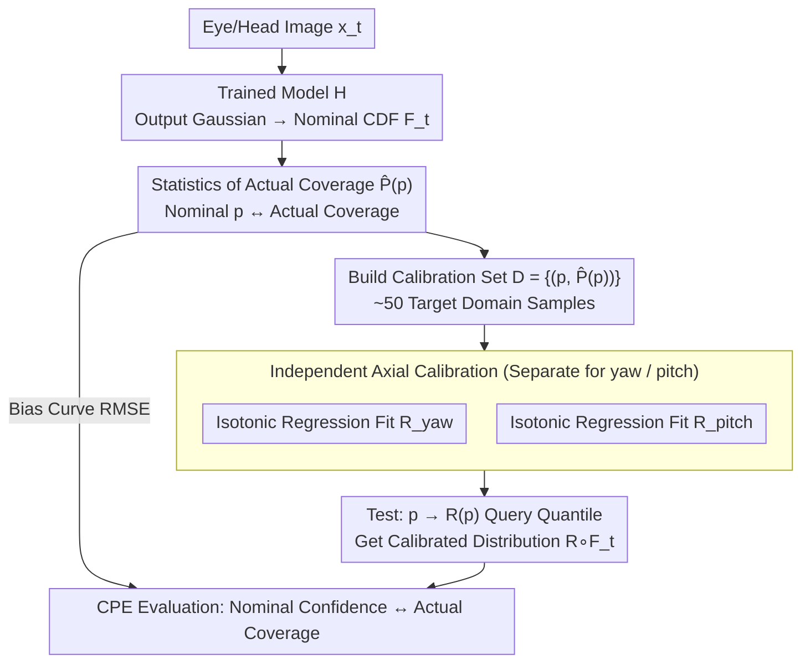

# Enhancing Accuracy of Uncertainty Estimation in Appearance-based Gaze Tracking with Probabilistic Evaluation and Calibration

**Conference**: CVPR 2026  
**arXiv**: [2501.14894](https://arxiv.org/abs/2501.14894)  
**Code**: Available (provided on project homepage)  
**Area**: Video Understanding  
**Keywords**: Gaze tracking, uncertainty estimation, post-hoc calibration, domain shift, coverage probability error

## TL;DR
This paper proposes a data-efficient post-hoc calibration method that aligns the predicted distribution of uncertainty-aware gaze tracking models with the true observed distribution using isotonic regression. It introduces the Coverage Probability Error (CPE) metric to replace the unreliable Error-Uncertainty Correlation (EUC) for evaluating uncertainty quality.

## Background & Motivation
Appearance-based gaze tracking directly predicts gaze angles from eye/face images using deep learning, serving as a core technology for safety-critical applications such as driver monitoring. Providing only a point estimate is insufficient; systems must know "how reliable this estimate is," making uncertainty estimation crucial.

**Limitations of Prior Work**:

**Unreliable Uncertainty under Domain Shift**: Uncertainty estimates from existing models (heteroscedastic regression, quantile regression, etc.) are often valid only within the training domain. When testing data features changes in lighting, cameras, or subjects, predicted variance values become unreliable—the model may assign high confidence to incorrect predictions.

**Flawed Evaluation Metrics**: The widely used EUC (Error-Uncertainty Correlation) assumes that uncertainty correlates with prediction error. However, this is a spurious correlation—uncertainty stems from aleatoric and epistemic factors rather than the prediction error itself, making EUC an unreliable measure of uncertainty quality.

**High Cost of Parameter-level Adaptation**: While meta-learning or transfer learning can correct uncertainty, they require substantial target domain data to relearn conditional distributions.

**Core Idea**: Instead of modifying model parameters, use post-hoc calibration. Learn a monotonic mapping function to map nominal probabilities to actual coverage probabilities, bringing the calibrated distribution closer to the true distribution. This requires only approximately 50 calibration samples.

## Method

### Overall Architecture
The paper addresses a practical deployment problem: Given a pre-trained uncertainty-aware gaze tracking model, does the reported variance remain trustworthy in a new scenario (different lighting, cameras, subjects)? The authors do not touch the model parameters; instead, they attach a lightweight "translation layer" at the model output. Specifically, the trained model $H$ outputs a Gaussian distribution for each input image $x_t$—the mean is the predicted gaze angle, and the variance is the self-reported uncertainty, corresponding to a cumulative distribution function (CDF) $F_t$. The issue is that this CDF is nominal and often biased in new domains. The calibration process appends a monotonic mapping $R$ after $F_t$ to convert nominal probabilities into actual coverage probabilities, resulting in a calibrated distribution $R \circ F_t$. This method requires only ~50 target domain samples and no gradient-based training, allowing it to be applied plug-and-play to any gaze model outputting probability distributions.

### Key Designs

**1. Coverage Probability Error (CPE): Replacing unreliable EUC with a metric that directly measures distribution matching**

The community has long used EUC (Error-Uncertainty Correlation) to judge the quality of uncertainty. However, this is a spurious correlation—uncertainty arises from aleatoric and epistemic factors and should not be strictly tied to a single prediction error. Thus, EUC cannot indicate the quality of calibration. The authors propose asking a more fundamental question: Does the "nominal confidence" claimed by the model match the "actual coverage"? For every nominal probability $p$, they calculate the actual proportion $\hat{P}(p)$ of ground truth labels falling below the corresponding quantile. Ideal calibration should satisfy $\hat{P}(p)=p$ everywhere. CPE is the RMSE of this bias curve across the entire probability interval:

$$CPE = \sqrt{\frac{1}{n}\sum_{i=0}^{n} p_{err}\left(\frac{i}{n}\right)^2}, \quad p_{err}(p) = \left|p - \hat{P}(p)\right|$$

This follows the logic of proper scoring rules: directly comparing the predicted distribution against the observed distribution without using error as a proxy. Intuitively, $CPE=0.05$ means a nominal 80% confidence interval actually covers roughly 70%–90%, with the bias suppressed to a 5-percentage-point magnitude.

**2. Isotonic Regression Calibrator: Capturing non-linear miscalibration in new domains via non-parametric monotonic mapping**

How to fix the miscalibration exposed by CPE? The key constraint is that the calibration mapping must be monotonic (to preserve the order of the CDF) and should not make strong assumptions about the form of miscalibration. Methods like temperature scaling assume linear/affine correction, which is insufficient for non-linear miscalibration caused by domain shift. The authors collect a calibration set $D=\{(p_i,\hat{P}(p_i))\}$ and use isotonic regression to fit a monotonically increasing mapping $R:[0,1]\to[0,1]$, which naturally satisfies $R(p_i)\le R(p_{i+1})$. During inference, instead of using the nominal probability $p$ to find the quantile, they first map it to $\tilde p=R(p)$, ensuring the calibrated coverage proportion approaches the nominal value:

$$\frac{\sum_{t=1}^{T} I\{\theta_t \leq F_t^{-1}(R(p))\}}{T} \to p$$

This is effective because: 1) the non-parametric form fits arbitrary non-linear miscalibration curves; 2) isotonic regression enforces monotonicity as a hard constraint; 3) fitting is a simple one-line sklearn call requiring only ~50 samples, making it far more data-efficient than meta-learning; 4) it leaves the original model parameters untouched.

**3. Independent Axial Calibration: Calibrating yaw and pitch separately**

Miscalibration in the horizontal (yaw) and vertical (pitch) components of gaze angles often differs in new domains—for instance, yaw may be more affected by head rotation. Variance shifts in both axes are not synchronized. Using a shared mapping for calibration would force a compromise between the two axes. The authors fit independent $R$ mappings for yaw and pitch, allowing each axis to approximate its respective true observed distribution more precisely.

### Loss & Training
- The base model is trained using heteroscedastic NLL loss: $NLL_t = \frac{1}{2}\ln(\hat{\sigma}_t^2) + \frac{l_{n,t}}{2\hat{\sigma}_t^2}$, where $l_{n,t}$ is the smooth L1 loss.
- The calibrator requires no gradient training; it is fitted using isotonic regression (one line of code).
- Two backbones: ResNet-18 and ResNet-50.

## Key Experimental Results

### Main Results

| Test Scenario | Train Set → Test Set | Backbone | CPE (Uncalibrated) | CPE (Calibrated) | Gain | Angle Error (Uncalibrated) | Angle Error (Calibrated) |
|----------|-------------|----------|-------------|-------------|---------|-----------------|-----------------|
| Cross-subject | MPII → MPII | ResNet18 | 23.17% | 5.18% | ↓78% | 5.77° | 5.09° (↓12%) |
| Cross-subject | RTGene → RTGene | ResNet18 | 19.60% | 5.26% | ↓73% | 12.36° | 10.55° (↓15%) |
| Cross-dataset | MPII → RTGene | ResNet18 | 20.60% | 4.75% | ↓77% | 13.71° | 10.12° (↓26%) |
| Cross-dataset | RTGene → MPII | ResNet18 | 27.21% | 4.84% | ↓82% | 18.46° | 14.50° (↓21%) |
| Cross-dataset | MPII → RTGene | ResNet50 | 20.10% | 4.63% | ↓77% | 13.89° | 9.50° (↓32%) |

CPE improved by over 70% in all scenarios, which was statistically significant (Mann-Whitney U test p<0.05).

### Ablation Study

| Calibration Samples | CPE (%) | Trend Description |
|-----------|---------|---------|
| 0 (Uncalibrated) | ~40% | Baseline |
| 10 | ~15% | Significant improvement |
| 20 | ~10% | Continued improvement |
| 50 | ~5% | Near saturation |
| 100 | ~5% | Little further improvement |

| 95% CI Coverage | Quantile Reg | Uncalibrated | Calibrated | Ideal |
|---------------|---------|-----------|-----------|-------|
| Case 1 | 40.5% | 41.1% | **88.0%** | 95% |
| Case 5 | 34.3% | 47.8% | **86.7%** | 95% |
| Case 8 | 16.4% | 46.2% | **88.6%** | 95% |

### Key Findings
- CPE consistently reduced from the 8-45% range to ~5%, showing high stability.
- Saturation was reached with only 50 calibration samples, demonstrating much higher data efficiency than meta-learning methods.
- Calibration provided a side benefit: angle error was reduced by 7-32%, as calibrated medians are more robust than original means.
- EUC remained almost unchanged before and after calibration (~0.1-0.26), failing to reflect the actual improvements, further proving EUC is an unreliable metric.

## Highlights & Insights
- Accurate identification of a long-overlooked problem in gaze tracking: severe miscalibration of uncertainty under domain shift and the community's reliance on the flawed EUC metric.
- CPE is a general uncertainty evaluation metric not limited to gaze tracking.
- The post-hoc calibration method is extremely simple (isotonic regression + ~50 samples), plug-and-play, and requires no modification to the original model.
- Systematic experimental design: 4 domain-shift scenarios × 2 backbones × 3-fold cross-validation.

## Limitations & Future Work
- Calibration assumes the calibration and test sets share the same distribution; online updates may be needed if domain shifts change continuously (e.g., transitioning from indoor to outdoor).
- Only validated on ResNet-18/50 with Gaussian distribution assumptions; more complex architectures (e.g., Transformers) or non-parametric distributions were not tested.
- MPIIGaze and RTGene are relatively controlled datasets; performance under larger domain shifts (extreme lighting, different ethnicities) is unknown.
- The calibrator itself does not provide uncertainty for its own predictions; the reliability of the calibration is unknown.
- Lacks comparison with Bayesian Neural Networks or MC Dropout.

## Related Work & Insights
- **Platt Scaling / Temperature Scaling**: These classical methods for classification assume linear/affine mappings from logits to probabilities. The isotonic regression calibrator in this paper is non-parametric, offering more expressiveness for non-linear miscalibration in regression tasks without requiring gradient optimization on a validation set.
- **Quantile Regression**: Learns conditional quantiles directly to avoid distribution assumptions. However, experiments showed that quantile regression also fails under domain shift (95% CI coverage only 16-40%), indicating its learned quantiles are domain-dependent. This paper's post-hoc calibration can be combined with quantile regression for further improvement.
- **MC Dropout / Deep Ensembles**: These epistemic uncertainty methods require multiple forward passes or models, entailing high inference costs. The proposed method requires only a single forward pass + post-processing lookup, making deployment costs negligible.
- **Meta-learning Domain Adaptation**: Methods like FADA or MAML-based approaches can fine-tune uncertainty in target domains but require significant labeled data and additional training. This work requires only ~50 samples and no gradient updates.

## Related Work & Insights
- **Generality of the CPE Metric**: CPE does not depend on a specific task and can evaluate uncertainty quality for any model outputting probability distributions (e.g., pose estimation, depth estimation, weather forecasting). It could be beneficial for uncertainty evaluation in medical image segmentation.
- **Value of the Post-hoc Calibration Paradigm**: The idea of "fixing the output distribution without modifying the model" is highly deployment-friendly for existing systems where uncertainty becomes unreliable in new scenarios.
- **Impact on Downstream Gaze Applications**: Calibrated uncertainty can inform decision-making in driving—e.g., switching to a more conservative driving strategy when gaze estimation uncertainty is high.

## Rating
- Novelty: ⭐⭐⭐⭐ CPE and the calibration approach are clear, though technical contribution is more in the combination than a ground-up invention.
- Experimental Thoroughness: ⭐⭐⭐⭐⭐ 4 domain-shift scenarios + 2 backbones + cross-validation + sample size ablation + case study; very systematic.
- Writing Quality: ⭐⭐⭐⭐ Clear logic and intuitive charts, though some notation is slightly redundant.
- Value: ⭐⭐⭐⭐ Highly practical method; the CPE metric is valuable for the broader uncertainty estimation field.

<!-- RELATED:START -->

## Related Papers

- [\[CVPR 2026\] U2Flow: Uncertainty-Aware Unsupervised Optical Flow Estimation](u2flow_uncertainty_aware_unsupervised_optical_flow_estimation.md)
- [\[CVPR 2026\] UniVBench: Towards Unified Evaluation for Video Foundation Models](univbench_towards_unified_evaluation_for_video_foundation_models.md)
- [\[CVPR 2026\] Dual-level Adaptation for Multi-Object Tracking: Building Test-Time Calibration from Experience and Intuition](tcei_test_time_calibration_experience_intuition_mot.md)
- [\[CVPR 2026\] SkillSight: Efficient First-Person Skill Assessment with Gaze](skillsight_efficient_first-person_skill_assessment_with_gaze.md)
- [\[CVPR 2026\] VirtueBench: Evaluating Trustworthiness under Uncertainty in Long Video Understanding](virtuebench_evaluating_trustworthiness_under_uncertainty_in_long_video_understan.md)

<!-- RELATED:END -->
