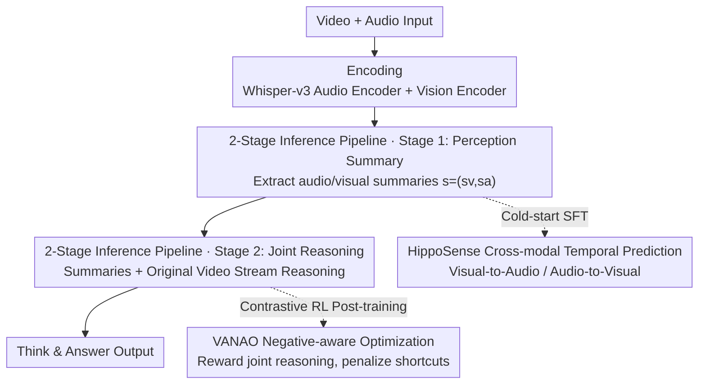

# Enhancing Video Vision Language Model with Hippocampal Sensing

**Conference**: CVPR 2026  
**Paper**: [CVF Open Access](https://openaccess.thecvf.com/content/CVPR2026/html/Cao_Enhancing_Video_Vision_Language_Model_with_Hippocampal_Sensing_CVPR_2026_paper.html)  
**Code**: None (not public)  
**Area**: Video Understanding / Multimodal VLM  
**Keywords**: Video VLM, cross-modal prediction, joint audio-visual reasoning, hippocampal sensing, contrastive reinforcement learning

## TL;DR
This paper mimics the hippocampal cross-modal association mechanism by first performing SFT on a Video VLM using "cross-modal temporal prediction" (completing audio from video, and vice versa), followed by a contrastive RL strategy (VANAO) with "negative-aware rewards" to enforce genuine joint audio-visual reasoning. This approach enables 7B/8B small models to rival GPT-4o and Gemini-1.5-Pro across multiple video VQA benchmarks.

## Background & Motivation
**Background**: Current mainstream approaches for video VLMs involve flattening video into a long sequence of static frames and feeding them into a long context for a "single-pass scan and answer." This essentially constitutes brute-force long-context modeling where the model passively consumes all frames to answer questions.

**Limitations of Prior Work**: This passive perception has two fatal flaws. First, it discards the natural temporal continuity of video, failing to capture long-form narratives, complex object interactions, or subtle social dynamics. Second, it barely utilizes audio. While closed-source large models (Gemini-1.5-Pro, GPT-4o) act as agentic systems—actively invoking audio streams or video search engines for supplementary information—open-source models have limited context windows and cannot simultaneously process massive frames and long audio transcripts. Furthermore, raw audio is filled with task-irrelevant noise, preventing open-source models from learning "joint reasoning under audio-visual co-occurrence."

**Key Challenge**: Humans can "mentally complete" information using an internal world model when visual input is missing—a multi-modal pattern completion primarily performed by the hippocampus. Existing VLMs lack both cross-modal prediction pre-training tasks and mechanisms to prevent model laziness (modality collapse: guessing answers based only on visuals or only on sound). Consequently, existing pre-training/post-training paradigms are sub-optimal for joint audio-visual reasoning.

**Goal**: (1) Provide video VLMs with a cross-modal prediction learning objective to build an internal multimodal world model; (2) Design a post-training strategy that explicitly rewards "genuine joint reasoning across both modalities" rather than taking unimodal shortcuts.

**Key Insight**: The authors draw inspiration from the biological mechanism of the hippocampus—a "prediction engine" that generates visual expectations from auditory cues, bridging memory and sensation. By migrating this capability into VLM fine-tuning, the model shifts from "passive brute-force processing" to "active cross-modal selection and integration."

**Core Idea**: Use "cross-modal temporal prediction" (using current video + partial audio to predict an audio summary at a different timestamp, and vice versa) as the perceptual objective instead of "next-frame prediction," and use contrastive RL to reward joint reasoning while penalizing unimodal shortcuts.

## Method

### Overall Architecture
The inference of HippoVLM is a **two-stage pipeline** that decouples "high-level reasoning" from "raw audio-visual transcript perception," corresponding to the human cognitive progression from perception to reasoning. The architecture uses Qwen2.5-VL / Qwen3-VL as the backbone, with an additional Whisper-v3 audio encoder; both audio and visual features are linearly projected into the LLM's unified semantic space via respective MLP connectors.

- **Stage 1 (Perception & Summary)**: The LLM processes visual and audio features separately to extract information-dense, concise summaries $s=(s_v, s_a)$ specific to the main question.
- **Stage 2 (Reasoning)**: These two summaries are fed into the LLM alongside the **original video stream** for joint reasoning, allowing the model to focus on core information without being overwhelmed by massive raw audio tokens.

Stage 2 is formalized as autoregressive generation: the model maximizes $P(\hat{y}_i \mid v_i, q_i, s_i) = \prod_{j=1}^{L} P_\theta(\hat{y}_{i,j} \mid v_i, q_i, s_i, \hat{y}_{i,<j})$, where the answer is generated token-by-token conditioned on the original video stream $v_i$, the main question $q_i$, and the Stage 1 summaries $s_i$.

Training consists of two steps: cold-start SFT using **HippoSense** (injecting cross-modal prediction capabilities), followed by **VANAO** contrastive RL post-training (optimizing selective joint reasoning). Data is sourced from the self-constructed **Hippo-Think** dataset.

### Key Designs

**1. Two-Stage Inference Pipeline: Decoupling "Transcript Perception" and "High-Level Reasoning"**

Addressing the pain point where open-source models cannot fit massive frames and long audio transcripts into their context—and the noise inherent in audio—HippoVLM does not force the LLM to swallow all raw data at once. Instead, Stage 1 compresses audio and video into brief, question-targeted summaries $s=(s_v, s_a)$. Stage 2 then reasons using these summaries and the original video. This offers several benefits: the summaries have high information density and filter out task-irrelevant raw noise, allowing the model to focus on core logic. Additionally, this pipeline naturally compensates for low frame sampling rates—the "context completion" mechanism generates predictive summaries for relevant audio-visual segments. The trade-off is that two-stage inference is inevitably slower than single-stage models (e.g., Video-R1), but it remains significantly faster than multi-round visual grounding or agentic tool-calling methods like VideoChat-R1.5.

**2. HippoSense: Upgrading Unimodal Perception to Multimodal Association via Cross-Modal temporal Prediction**

This is the core paradigm of the paper. Targeting the lack of joint audio-visual pre-training tasks, it replaces "next-frame prediction" with "cross-modal temporal prediction." The model is forced to use the context of **one modality** to reconstruct the summary of the **other modality** at a shifted time point (10 seconds into the future or past). Specifically, two auxiliary losses are trained:

- Visual-to-Audio sensing loss $L_{VAS}$: Given the full video $v_i$, currently available audio $a_i$, and an audio-related query $q_i$ for the future/past, generate the ground-truth asynchronous audio summary $y^a$. $L_{VAS} = -\sum_{j=1}^{L} \log P_\theta(y^a_{i,j} \mid v_i, a_i, q_i, y^a_{i,<j})$.
- Audio-to-Visual sensing loss $L_{AVS}$: Conversely, given full audio $a_i$, current video frames $v_i$, and a future/past visual query, generate the asynchronous video summary $y^v$. $L_{AVS} = -\sum_{j=1}^{L} \log P_\theta(y^v_{i,j} \mid a_i, v_i, q_i, y^v_{i,<j})$.

These auxiliary losses are optimized jointly with the main SFT loss $L_{SFT}$ (generating summaries or answering directly):

$$L_{total} = L_{SFT} + \lambda_1 L_{VAS} + \lambda_2 L_{AVS}$$

where $\lambda_1 = \lambda_2 = 0.1$ (empirically set). This works because forcing the model to "imagine sound while seeing video" and "imagine visuals while hearing sound" explicitly builds a cross-modal internal world model. The model stops treating audio and video as independent streams and learns to compensate for one using the other—an engineering replication of hippocampal pattern completion.

**3. VANAO: Contrastive RL with Negative-Aware Reward to Force Modal Synergy**

While SFT injects capability, the model may still "get lazy" (modality collapse) during inference—guessing answers based solely on video or audio transcripts. VANAO adds a **contrastive negative-aware reward** $r_n$ to the GRPO framework to solve this. Using GRPO, given question $q$, vision $v$, and Stage 1 summaries $s=(s_v,s_a)$, $G=4$ reasoning paths are sampled. Rules provide original rewards, which are z-normalized into relative advantages $A_i = \frac{r_i - \text{mean}(R)}{\text{std}(R)}$, with a KL penalty against the reference model.

The innovation is $r_n$. Authors **off-line pre-calculate** the accuracy of the reference policy $\pi_{ref}$ under two unimodal "blind" settings: video summary only $\tilde{p}_v = \frac{1}{G}\sum_j \mathbb{1}[\hat{y}_{v,j}=y]$ (masking $s_a=\varnothing$), and audio summary only $\tilde{p}_a$ (masking $s_v=\varnothing$). During training, if the current group's accuracy is $p=\frac{1}{G}\sum_i r_a(o_i)$, the negative-aware reward acts as a group-level bonus:

$$r_n = \gamma \cdot \big(\mathbb{1}[p > \tilde{p}_v] + \mathbb{1}[p > \tilde{p}_a]\big)$$

A bonus is issued only when joint reasoning **strictly outperforms** both unimodal shortcuts. The final total reward combines format reward $r_f$ and length reward $r_l$ (encouraging length within $[l_{min}, l_{max}]$), while $r_n$ is gated by the accuracy reward $r_a$:

$$R_i = r_f(o_i) + r_l(o_i) + (1 + r_n)\cdot r_a(o_i)$$

This $(1+r_n)\cdot r_a$ multiplicative gating ensures that the cross-modal synergy bonus is only granted when the answer is **actually correct**, explicitly hard-coding "joint modality use" into the reward rather than just "global improvement." Pre-calculating blind baselines offline also avoids the high cost of repeated online RL decoding.

**4. Hippo-Think Dataset: Cold-Start Data with Cross-Modal Summaries and CoT**

The HippoSense paradigm requires high-quality data with cross-modal summaries and CoT reasoning. The authors developed Hippo-Think (10K videos, 50K detailed CoT annotations) using a human-in-the-loop iterative engine. The data subset is balanced across temporal reasoning, social reasoning, and video understanding. The process: Whisper-large-v3 extracts transcripts → Gemini-2.5-Flash generates initial summaries → GPT-4o acts as LLM-as-judge for screening → Manual verification of batches every 1000 items. Feedback is injected into system prompts to improve regeneration with Gemini-2.5-Pro, creating a continuous improvement loop. To support cross-modal prediction, summaries are split into temporal segments to construct tasks like "predicting the latter audio summary from early audio + all video." CoT quality is filtered via consensus—retaining only those where three independent samplings yield identical and correct results.

### Loss & Training
Training is conducted in two stages: (1) Cold-start SFT—HippoSense fine-tuning for 2 epochs to maximize correct reasoning step likelihood; (2) VANAO RL on Hippo-Think (group size $G=4$). Training used 16×A100 (80G), mixed precision, global batch size 16, AdamW, peak learning rate $\approx 1\times10^{-6}$, 5% linear warm-up + cosine decay. The maximum sequence length is 32k tokens. Due to compute limits, RL ran for only 1000 steps. Training used up to 16 frames at 256×28×28 resolution; inference used up to 16/64 frames at 512×28×28.

## Key Experimental Results

### Main Results
Four audio-visual VQA benchmarks (VideoMMMU, Video-MME, VNBench, Social-IQ 2.0). Open-source competitors were restricted to 7B/8B scale with 64 frames.

| Model | Backbone / Frames | VideoMMMU | Video-MME | VNBench | Social-IQ |
|------|------|------|------|------|------|
| GPT-4o (Closed) | UNK / >180 | 61.2 | 71.9 | 66.7 | 75.2 |
| Gemini-1.5-Pro (Closed) | UNK / >180 | 53.9 | 75.0 | 64.4 | 71.8 |
| Qwen2.5-VL-7B | Qwen2.5-7B / 64 | 47.4 | 59.6 | 32.6 | 60.3 |
| Video-R1-7B | Qwen2.5-7B / 64 | 52.4 | 61.4 | - | 64.6 |
| Qwen3-VL-8B | Qwen3-8B / 64 | 59.8 | 61.5 | 66.2 | 57.9 |
| **HippoVLM-7B** | Qwen2.5-7B / 16 | 49.9 | 62.5 | 66.0 | 69.5 |
| **HippoVLM-7B** | Qwen2.5-7B / 64 | 53.5 | 68.8 | 70.2 | 71.2 |
| **HippoVLM-8B** | Qwen3-8B / 64 | **62.7** | 70.4 | **72.0** | 73.4 |

HippoVLM-8B outperforms GPT-4o on VideoMMMU (62.7) and VNBench (72.0), while Social-IQ (73.4) approaches closed-source levels. Notably, HippoVLM-7B with only 16 frames scores 69.5 on Social-IQ, approximately 9 points higher than its backbone Qwen2.5-VL-7B (60.3) with 64 frames.

### Ablation Study

| Configuration (Qwen2.5-VL-7B, 16 frames) | VideoMMMU | Video-MME | VNBench | Social-IQ |
|------|------|------|------|------|
| Baseline | 47.2 | 53.1 | 43.9 | 62.0 |
| SFT | 48.0 | 53.3 | 44.1 | 60.2 |
| SFT + DPO | 48.3 | 55.4 | 59.8 | 66.9 |
| SFT + GRPO | 49.0 | 59.8 | 64.4 | 66.5 |
| HippoVLM (HippoSense only) | 48.3 | 59.1 | 57.3 | 63.4 |
| **HippoVLM (HippoSense + VANAO)** | **49.9** | **62.5** | **66.0** | **69.5** |

Inference speed (Single H100, 16 frames): HippoVLM-7B takes $\approx 18.15s$, faster than VideoChat-R1.5-7B-M (23.43s), but slower than single-stage models like Qwen2.5-VL-7B (7.23s) and Video-R1-7B (8.63s)—the cost of the two-stage pipeline.

### Key Findings
- **Distinct contribution of VANAO**: While HippoSense alone significantly exceeds the baseline, adding VANAO boosts Video-MME from 59.1 to 62.5 and Social-IQ from 63.4 to 69.5, validating that the negative-aware reward suppresses modality collapse.
- **Maximized Gain in Social Reasoning**: Tasks like Social-IQ require identifying cross-modal contradictions/synergies (e.g., "smiling face but angry tone"). Explicit audio-visual predictive reasoning yields the most significant benefits here.
- **Small Models Matching Large Models**: 7B/8B HippoVLM models reaching the level of GPT-4o suggests that cross-modal prediction objectives + contrastive RL are more effective than simply increasing parameter or frame counts.

## Highlights & Insights
- **Replacing Next-Frame Prediction with Cross-Modal Temporal Prediction**: This is a paradigm-level innovation. Forcing the model to "fill in" audio from video and vice versa constructs a cross-modal internal world model more aligned with the real structure of audio-visual co-occurrence than unimodal mask reconstruction.
- **Offline Blind Baselines for $r_n$**: Using pre-calculated unimodal accuracies as a benchmark provides a transferable trick: any multimodal RL fearing unimodal shortcuts can apply "contrastive reward gating using blind baselines."
- **Multiplicative Gating $(1+r_n)\cdot r_a$**: Linking the synergy bonus to the "correctness" condition prevents the model from generating nonsense just to get the bonus, making the reward design robust.

## Limitations & Future Work
- The two-stage pipeline results in slower inference (18.15s vs. 7-8s), which is a bottleneck for real-time applications like social robots or AR.
- RL was limited to 1000 steps and 16 frames due to compute constraints; the performance ceiling with a larger budget remains unknown. ⚠️ The paper does not provide specific values or sensitivity analysis for reward hyperparameters like $\gamma$, $\omega$, and $l_{min}/l_{max}$.
- Evaluations focused on audio-visual benchmarks; the effectiveness on purely visual benchmarks or silent videos has not been thoroughly verified.
- The data engine relies heavily on distillation from Gemini-2.5 and GPT-4o, meaning the upper bound is capped by these teacher models.

## Related Work & Insights
- **vs. Cambrian-S (supersensing)**: Cambrian-S focuses on "supersensing" via temporal next-frame prediction. Ours also follows a supersensing route but shifts the core mechanism to **cross-modal** temporal prediction (Audio ↔ Vision) to target audio-visual synergy.
- **vs. Video-R1 / VideoChat-R1.5**: These use RL to improve reasoning but rely on passive reading in single-stage or multi-turn grounding. Ours uses two-stage decoupling + VANAO's negative-aware reward to explicitly optimize synergy.
- **vs. VideoLLaMA series**: VideoLLaMA adds audio branches as an architectural splice. Our difference lies in the training objective (HippoSense + VANAO) that forces the model to **actively unify** modalities and reject unimodal shortcuts.

## Rating
- Novelty: ⭐⭐⭐⭐⭐ Implementing hippocampal association through cross-modal SFT and contrastive RL is highly original.
- Experimental Thoroughness: ⭐⭐⭐⭐ Solid benchmark results and ablation studies, though lacking hyperparameter sensitivity and silent video verification.
- Writing Quality: ⭐⭐⭐⭐ Logical chain from motivation to method is clear; some symbols and hyperparameters are slightly understated.
- Value: ⭐⭐⭐⭐⭐ Proving 7B/8B models can rival GPT-4o in audio-visual VQA is highly valuable for the open-source multimodal reasoning roadmap.

<!-- RELATED:START -->

## Related Papers

- [\[CVPR 2026\] TimeViper: A Hybrid Mamba-Transformer Vision-Language Model for Efficient Long Video Understanding](timeviper_a_hybrid_mamba-transformer_vision-language_model_for_efficient_long_vi.md)
- [\[CVPR 2026\] Video-Only ToM: Enhancing Theory of Mind in Multimodal Large Language Models](video-only_tom_enhancing_theory_of_mind_in_multimodal_large_language_models.md)
- [\[CVPR 2026\] OneThinker: All-in-one Reasoning Model for Image and Video](onethinker_all-in-one_reasoning_model_for_image_and_video.md)
- [\[CVPR 2026\] µVLM: A Vision Language Model for µNPUs](mvlm_a_vision_language_model_for_mnpus.md)
- [\[CVPR 2026\] ReMoRa: Multimodal Large Language Model based on Refined Motion Representation for Long-Video Understanding](remora_multimodal_large_language_model_based_on_refined_motion_representation_fo.md)

<!-- RELATED:END -->
