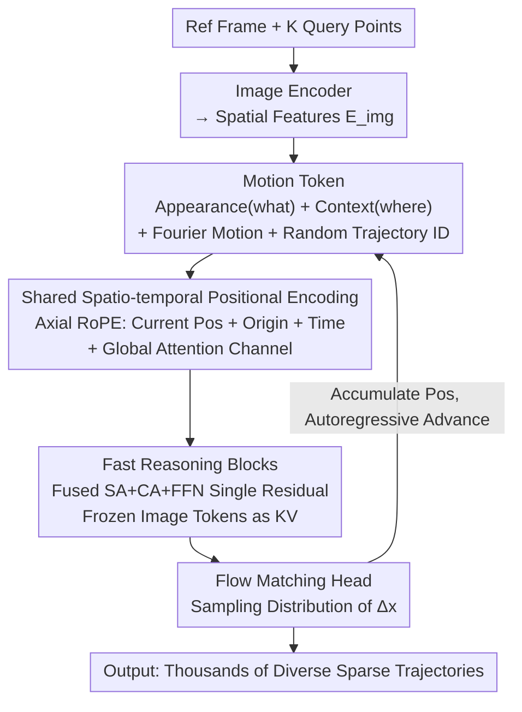

# Envisioning the Future, One Step at a Time

**Conference**: CVPR 2026  
**arXiv**: [2604.09527](https://arxiv.org/abs/2604.09527)  
**Code**: [http://compvis.github.io/myriad](http://compvis.github.io/myriad)  
**Area**: Video Understanding/Motion Prediction  
**Keywords**: Open-set motion prediction, sparse trajectories, autoregressive diffusion models, future prediction, world models

## TL;DR

Ours models open-set future scene dynamic prediction as step-by-step reasoning on sparse point trajectories. Through an autoregressive diffusion model, it achieves rapid generation of thousands of diverse future hypotheses from a single image, at speeds several orders of magnitude faster than dense models.

## Background & Motivation

**Background**: Most future prediction methods rely on dense video or latent space prediction, consuming significant capacity on appearance rather than underlying motion trajectories, making large-scale exploration of future hypotheses extremely costly.

**Limitations of Prior Work**: (1) Dense video generation methods pay a "visual tax"—every pixel must be rendered to reason about motion; (2) Single-step prediction methods cannot handle multi-contact long-horizon scenarios; (3) Physics engine methods cannot generalize to open-set motion.

**Key Challenge**: Dynamics in the real world are highly complex and stochastic—requiring consideration of a vast number of possible futures, but dense prediction makes such exploration computationally infeasible.

**Goal**: To achieve open-set, step-by-step, and massively sampleable motion prediction without paying the visual tax.

**Key Insight**: Analogy to human cognition—humans do not "draw" pictures of the future; instead, they track important changes. Utilizing sparsity makes envisioning the future possible.

**Core Idea**: To model motion prediction as a step-by-step autoregressive diffusion process on user-defined sparse point trajectories.

## Method

### Overall Architecture

This paper proposes an intuitive approach: instead of "painting" future images, it only tracks a few sparse points in the frame. Given a reference frame $\mathcal{I}_0$ and $K$ user-specified visible query points, the model autoregressively generates incremental motion $\Delta x_t^{(i)}$ for each time step, transforming "future prediction" into step-by-step reasoning on sparse point trajectories. Each step is a small conditional diffusion model responsible for predicting local, short-range, and manageable displacements; complex long-term dynamics are concatenated from these short steps.

Formally, the model performs a causal decomposition of the joint distribution across time and trajectory dimensions:

$$p_\theta(\mathbf{x}_{1:T}\mid \mathbf{x}_0, \mathcal{I}_0) = \prod_t \prod_i p_\theta\!\left(x_t^{(i)} \mid \mathbf{x}_t^{(<i)}, \mathbf{x}_{<t}, \mathcal{I}_0\right)$$

That is, the position of the $i$-th trajectory at time $t$ depends on its own history and other trajectories generated within the same time step. Thousands of diverse future hypotheses can be generated by re-sampling with different diffusion noise set, with virtually no increase in rendering costs.

### Key Designs

**1. Motion Token: Simultaneous Representation of Identity and Environment**

Autoregressive reasoning requires each (time, trajectory) pair representation to contain both the identity of the tracked object and its current situation. Three types of information are fused into one token: appearance features sampled at the origin $x_0^{(i)}$ ("what"), local context features sampled at the current position $x_t^{(i)}$ ("where"), and motion information via Fourier-encoded displacement $\Delta x_t^{(i)}$. Dual-position sampling is critical. Additionally, each trajectory carries a random direction trajectory identifier $id_{traj}^{(i)} \sim \mathcal{U}(\mathbb{S}^{d-1})$ to distinguish trajectories without relying on fixed integer indices, allowing seamless scaling to any number of query points $K$.

**2. Shared Spatio-temporal Positional Encoding: Unified Coordinate System**

Motion tokens and image tokens use the same Axial RoPE-based positional encoding. Each motion token simultaneously encodes current position $x_t^{(i)}$, origin $x_0^{(i)}$, and time $t$; image tokens fill both 2D slots with $t=0$. During attention, motion tokens align with "what" features via origin coordinates and "where" features via current coordinates. A specific channel without positional encoding is reserved for global semantic attention.

**3. Fast Reasoning Blocks: Reducing Kernel Launch Overhead**

To address the bottleneck of repeated kernel launches during step-by-step decoding, Self-Attention (SA), Cross-Attention (CA), and FFN are fused into a single residual calculation:

$$\mathbf{h} \leftarrow \mathbf{h} + SA(\mathbf{h}) + CA(\mathbf{h}, \mathbf{h}_{cross}) + FFN(\mathbf{h})$$

They share a pre-normalization and fused projection. Combined with frozen image tokens (acting as fixed cross-attention KV), the number of required kernels per step is significantly reduced, accelerating sampling speeds by orders of magnitude compared to dense video models.

**4. Flow Matching Parameterization: Preserving Multi-modal Futures**

Future dynamics are stochastic. Direct deterministic regression leads to "mode averaging." Ours uses conditional Flow Matching to model the distribution of incremental motion $\Delta x_t^{(i)}$, naturally preserving multi-modality. Uncertainty in long-horizon prediction accumulates naturally across steps, aligning with the physical intuition that the distant future is harder to predict.

### Loss & Training

The model is trained on diverse in-the-wild videos using standard conditional probability flow matching loss. During inference, KV caching is utilized to reuse attention calculations from history tokens.

## Key Experimental Results

### Main Results

| Method Type | Prediction Accuracy | Sampling Speed | Diversity |
|---------|---------|---------|--------|
| Dense Video Models | High | Extremely Slow | Low (Cost Limited) |
| Physics-based Methods | High (In-domain) | Medium | Low (Domain Limited) |
| **Ours** | Comparable/Superior | **Orders of Magnitude Faster** | **High (K Hypotheses)** |

### Ablation Study

| Configuration | Key Metrics | Note |
|------|---------|------|
| w/o Trajectory ID | Significant Drop | Essential for multi-trajectory settings |
| w/o Fast Reasoning | Drastic Speed Drop | Fused blocks are critical |
| Single-step Predict | Long-horizon Decay | Step-by-step reasoning necessary |
| **Full Model** | **Optimal** | Synergistic components |

### Key Findings

- Accuracy matches or exceeds dense models on the OWM benchmark while being orders of magnitude faster.
- Random trajectory IDs are vital for multi-trajectory modeling; fixed IDs cause the model to memorize indices rather than learning dynamics.
- Step-by-step reasoning allows uncertainty to grow naturally over time, consistent with physical principles.

## Highlights & Insights

- **Philosophy of "Track motion, not the world"**: Completely avoids the visual tax, concentrating computation on essential motion dynamics.
- **Fast Reasoning Blocks Innovation**: The combination of fused projections, frozen image tokens, and prefix attention significantly increases throughput.
- **Introduction of OWM Benchmark**: Provides a standardized evaluation framework for open-set motion prediction.

## Limitations & Future Work

- Sparse trajectories cannot capture continuous dynamics such as deformation or rotation.
- Autoregressive methods may still accumulate errors over extremely long horizons.
- The gap between motion prediction and full scene semantic understanding remains to be bridged.

## Related Work & Insights

- **vs Video World Models**: These pay a massive visual tax to predict every pixel; ours demonstrates that sparse trajectories are sufficient to capture the essence of motion.
- **vs Physics-based Methods**: Physics engines are restricted to closed-set domains; ours achieves generalization through data-driven learning in open-set scenarios.

## Rating

- Novelty: ⭐⭐⭐⭐⭐ Paradigm shift to sparse trajectories + step-by-step autoregressive diffusion.
- Experimental Thoroughness: ⭐⭐⭐⭐ OWM benchmark + multi-scenario validation.
- Writing Quality: ⭐⭐⭐⭐⭐ Excellent motivation and profound analogies.
- Value: ⭐⭐⭐⭐⭐ Establishes a new, efficient, and scalable paradigm for future prediction.

<!-- RELATED:START -->

## Related Papers

- [\[CVPR 2026\] One-Shot Flow, Any-Time Frame: A Bidirectional Warping Framework for Event-Based Video Frame Interpolation](one-shot_flow_any-time_frame_a_bidirectional_warping_framework_for_event-based_v.md)
- [\[CVPR 2026\] Your One-Stop Solution for AI-Generated Video Detection](your_one-stop_solution_for_ai-generated_video_detection.md)
- [\[CVPR 2026\] StreamRAG: Enhancing Real-Time Video Understanding with Retrieval Augmentation](streamrag_enhancing_real-time_video_understanding_with_retrieval_augmentation.md)
- [\[CVPR 2026\] From Contrast to Consistency: Rethinking Event-based Continuous-Time Optical Flow Estimation](from_contrast_to_consistency_rethinking_event-based_continuous-time_optical_flow.md)
- [\[CVPR 2026\] Bootstrapping Video Semantic Segmentation Model via Distillation-assisted Test-Time Adaptation](bootstrapping_video_semantic_segmentation_model_via_distillation-assisted_test-t.md)

<!-- RELATED:END -->
