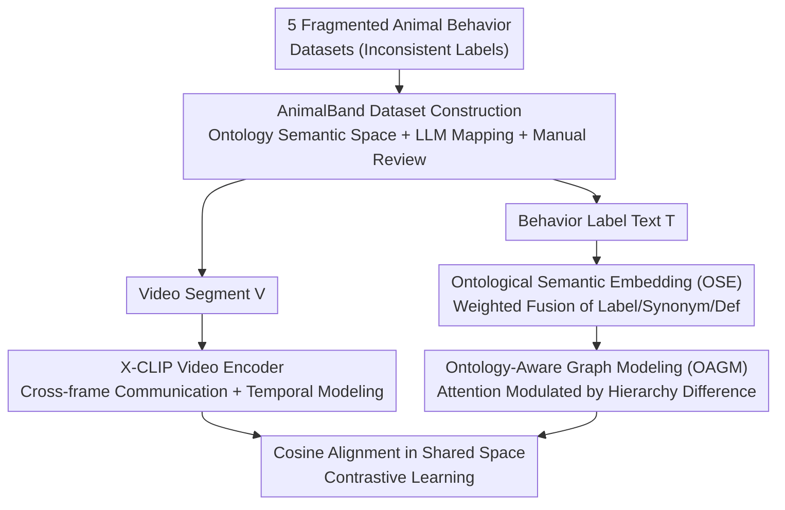

# EthoCLIP: Ontology-Enhanced Video-Language Pretraining for Animal Behavior Understanding

**Conference**: CVPR 2026  
**Paper**: [CVF Open Access](https://openaccess.thecvf.com/content/CVPR2026/html/Jing_EthoCLIP_Ontology-Enhanced_Video-Language_Pretraining_for_Animal_Behavior_Understanding_CVPR_2026_paper.html)  
**Code**: https://github.com/PRIS-CV/AnimalBand (Available)  
**Area**: Video Understanding  
**Keywords**: Animal behavior understanding, video-language contrastive learning, ontological knowledge, hierarchical graph attention, data scarcity  

## TL;DR
Addressing the "extreme data scarcity" in animal behavior videos, this paper injects the expert-constructed Neuro Behavior Ontology (NBO) as an inductive bias into CLIP-style video-language contrastive learning. The authors first construct the AnimalBand dataset (74,000 videos) using a unified ontological labeling scheme. They then explicitly encode "parent-child/synonym" relationships between behavioral labels using Ontological Semantic Embedding (OSE) and Ontology-Aware Graph Modeling (OAGM). EthoCLIP significantly outperforms traditional backbones and general VLMs in transfer and classification, approaching full-scale performance with only 40%–60% of the data.

## Background & Motivation
**Background**: Specialized large-scale models for animal behavior understanding are nearly non-existent. Prevailing approaches either utilize spatio-temporal backbones transferred from human actions (SlowFast, X3D, UniFormer V2) or video-language alignment methods like ActionCLIP, both of which assume the availability of massive pretraining data.

**Limitations of Prior Work**: Annotating animal behavior videos is exceptionally costly—requiring domain experts and long-term observation, while controlled filming conditions often interfere with natural behavior. Consequently, datasets remain small (Fig. 1: animal datasets average ~0.0168M samples, whereas general VLM pretraining data average ~145.79M, an ~8678x difference). Furthermore, behavioral labels across different datasets are heterogeneous—identical actions might be labeled as "Hunting other animal," "Eating food," or "Feeding." These inconsistent labels and hierarchical gaps introduce semantic noise when datasets are merged.

**Key Challenge**: Pure data-driven contrastive learning relies on massive samples to learn fine-grained behavioral distinctions and complex semantic relationships. However, this field cannot obtain such data. This creates a bottleneck where limited scale leads to poor generalization.

**Goal**: Enable the model to learn fine-grained semantic differences and hierarchical dependencies between behaviors without relying on large-scale data. This involves: (1) Unifying fragmented datasets into a single semantic space; (2) Explicitly Providing hierarchical priors to the model.

**Key Insight**: Instead of scaling data, the authors leverage expert knowledge. They introduce the **Neuro Behavior Ontology (NBO)**, constructed by animal behavior experts from the OBO Foundry, as an inductive bias. NBO provides professional labels (unifying synonyms like Diving/Drifting/Sinking into "aquatic locomotion"), multi-level structures (body part movement → mouth movement → jaw movement → biting), and definitions, filling the semantic information gap that small-scale data cannot bridge.

**Core Idea**: Replace "pure data expansion" with "ontological knowledge enhancement." Ontology is used both to standardize data (constructing AnimalBand) and to enhance text-side semantic representations (OSE + OAGM), thereby mitigating data scarcity.

## Method
The work consists of two parts: constructing the AnimalBand dataset (unifying labels via ontology) and training EthoCLIP on it (a CLIP-style dual-tower model with ontological semantic injection). The vision side utilizes X-CLIP; the core innovations lie in the data construction and the two text-side ontological enhancement modules.

### Overall Architecture
EthoCLIP follows a CLIP-style dual-tower contrastive learning framework. Videos are processed by the X-CLIP video encoder $f_v$ to obtain spatio-temporal features, while behavior labels are processed by the text encoder $f_t$ to obtain semantic features. Both are mapped to a shared $d$-dimensional space to maximize the cosine similarity of matched pairs. The key innovation is on the text side: labels are not directly encoded but are first processed via Ontological Semantic Embedding (OSE) to fuse "label + synonym + definition," followed by Ontology-Aware Graph Modeling (OAGM) to propagate information according to the ontological hierarchy.

### Key Designs

**1. AnimalBand: Unifying Multi-source Labels via Ontology**

To address the issue of inconsistent labels across datasets, the authors manually filtered 160 behavior labels from NBO (6 layers, 466 terms) based on two principles: **Observability** (excluding terms like fear conditioning or spatial memory that describe internal states) and **Generality** (excluding task-specific terms while retaining cross-species universal labels). Heterogeneous labels from five source datasets (Animal Kingdom, MammalNet, LoTE-Animal, MammAlps, PanAf20K) were mapped to these NBO labels using GPT-5, followed by manual verification. AnimalBand contains 74,671 videos of >800 species. t-SNE visualization confirms that AnimalBand provides a more consistent and comprehensive label space compared to the fragmented original data.

**2. Ontological Semantic Embedding (OSE): Incorporating Synonyms and Definitions**

To enrich label semantics under small-data regimes while preventing redundant information from overwhelming core semantics, the authors use a pretrained CLIP text encoder to encode the original label $\mathbf{l}$, $K$ synonyms $\{\mathbf{s}_k\}$, and the definition $\mathbf{d}$ separately, followed by weighted fusion:

$$\mathbf{t} = \alpha \mathbf{l} + \beta \frac{1}{K}\sum_{k=1}^{K}\mathbf{s}_k + \gamma \mathbf{d}, \quad \alpha > \beta,\gamma,\ \alpha+\beta+\gamma=1$$

By assigning the highest weight $\alpha$ to the original label, the model retains core semantics while benefiting from expansion. Ablation studies (Table 7) show that this weighted strategy (62.54 mAP) outperforms simple concatenation (61.40) or LLM-based keyword extraction (61.92).

**3. Ontology-Aware Graph Modeling (OAGM): Hierarchical Information Propagation**

To explicitly utilize the hierarchical structure of the ontology, the authors propose a hierarchy-aware graph attention mechanism. Unlike standard graphs, ontological nodes have specific positions: higher-level nodes (broad categories) should provide strong guidance to lower-level nodes (specific behaviors), while the reverse influence should be suppressed. For a node pair $(i,j)$, the hierarchy difference $\Delta l_{ij}=l_j-l_i$ is used to compute a modulation weight:

$$g_{ij}=\sigma(-\lambda\,\Delta l_{ij}),\qquad \tilde{e}_{ij}=e_{ij}\cdot g_{ij}$$

where $\lambda>0$ and $\sigma$ is the sigmoid function. When node $j$ is at a higher level than $i$ ($\Delta l_{ij}>0$), $g_{ij}$ is smaller, ensuring asymmetric transfer (stronger top-down, weaker bottom-up). This allows nodes on the same hierarchical chain to interact while preserving the semantic integrity of broad categories.

### Loss & Training
EthoCLIP utilizes CLIP-style video-text contrastive alignment. After pretraining, the backbone is frozen, and a lightweight learnable MLP is used for downstream classification. Temporal modeling transformers and prompt modules can also be partially unfrozen to further improve performance.

## Key Experimental Results

### Main Results
Transfer learning results on three unseen downstream datasets (Panda, SheepActivity, ChimpACT) representing wildlife, farms, and zoos:

| Method | Pretraining | Finetuning | Panda | SheepActivity | ChimpACT | Mean |
|------|--------|------|-------|---------------|----------|------|
| UniFormer V2 (Prev. SOTA) | Kinetics-710 | ✓ | 84.40 | 90.48 | 65.03 | 79.97 |
| ActionCLIP | JFT | ✓ | 80.80 | 92.86 | 67.23 | 80.30 |
| Qwen2.5-VL-7B (General VLM) | 4.1T tokens | × | 34.80 | 63.10 | 25.55 | 41.15 |
| X-CLIP-merge (Direct merge) | Direct merge | × | 73.60 | 79.76 | 53.75 | 69.04 |
| X-CLIP-AnimalBand | AnimalBand | × | 82.40 | 82.14 | 58.24 | 74.26 |
| **EthoCLIP** | AnimalBand | × | 84.80 | 85.71 | 63.82 | 78.11 |
| **EthoCLIP** | AnimalBand | ✓ | **92.40** | **96.43** | **74.32** | **87.72** |

Key observations: (1) Pretraining on AnimalBand outperforms direct merging by 7.56% (74.26 vs 69.04), validating ontological standardization. (2) General VLMs lag significantly behind despite being trained on billions of samples, highlighting the domain gap. EthoCLIP (finetuned) achieves a mean of 87.72, a 9.24% Gain over ActionCLIP.

### Ablation Study
Component ablation on the AnimalBand test set (categorized by frequency: head/medium/tail):

| Configuration | Head | Middle | Tail | Overall |
|------|------|--------|------|---------|
| baseline | 81.76 | 70.93 | 50.36 | 61.20 |
| + OSE | 81.55 | 70.95 | 52.73 | 62.54 |
| + OAGM | 82.61 | 71.35 | 51.66 | 62.25 |
| + OSE + OAGM (Full) | 82.54 | 71.12 | 53.27 | 62.98 |

OSE and OAGM provide significant gains, particularly for the **Tail category** (50.36 to 53.27), proving that ontological enhancement is most effective for long-tail behaviors where data is most scarce.

### Key Findings
- **Data Efficiency**: EthoCLIP achieves performance comparable to 100% directly merged data using only 40%–60% of AnimalBand's pretraining data.
- **Hierarchy Sensitivity**: OAGM performs best at 2 hops; at 3 hops, semantic representation becomes overly homogenized.
- **Weighted Fusion is Key**: OSE weighted fusion outperforms concatenation or keyword extraction, proving that *how* synonyms/definitions are used is more important than simply *that* they are used.

## Highlights & Insights
- **Ontology as Inductive Bias**: Rather than using ontology only for post-processing, this work encodes hierarchical structures directly into graph attention, allowing taxonomic levels to participate in representation learning.
- **Asymmetric Hierarchy Weights**: The design of $g_{ij}=\sigma(-\lambda\Delta l_{ij})$ creates a directional constraint that aligns with ontological semantics with zero additional parameters.
- **Controlled Semantic Expansion**: Use of OSE preserves core label semantics while leveraging external knowledge, a strategy transferable to any "label + description" scenario.
- **Contribution of AnimalBand**: By unifying 5 datasets through LLM mapping and expert review, the authors provide a standardized foundational dataset for the community.

## Limitations & Future Work
- **Ontology Coverage**: NBO does not cover all behaviors, and the manual filtering of terms may exclude specific fine-grained actions.
- **Mapping Costs**: Label mapping relies on strong LLMs and expert verification, which is costly when extending to new datasets.
- **Vision-side Innovation**: The model relies on the temporal modeling capabilities of X-CLIP and does not introduce specific visual innovations tightly coupled with the ontology.
- **Frozen vs. Finetuned Performance**: While EthoCLIP outperforms baselines when frozen, reaching SOTA still requires finetuning.

## Related Work & Insights
- **vs. X-CLIP**: EthoCLIP uses the same video encoder but adds OSE + OAGM on the text side, achieving superior frozen performance (78.11 vs 74.26).
- **vs. ActionCLIP**: EthoCLIP surpasses ActionCLIP—which relies on massive pretraining data like JFT—by using domain-specific ontological priors on small data.
- **vs. General VLMs**: The significant lag of models like Qwen-VL confirms that scale cannot replace domain specialization in animal behavior understanding.

## Rating
- Novelty: ⭐⭐⭐⭐ Explicitly injecting ontological hierarchical structures into video-language contrastive learning is a novel approach to addressing data scarcity.
- Experimental Thoroughness: ⭐⭐⭐⭐ Comprehensive transfer/in-domain testing and multi-dimensional ablations across three downstream datasets.
- Writing Quality: ⭐⭐⭐⭐ Clear motivation, complete formulas, and well-structured results.
- Value: ⭐⭐⭐⭐ Both the AnimalBand dataset and the EthoCLIP methodology provide substantive advancements for the field of animal behavior understanding.

<!-- RELATED:START -->

## Related Papers

- [\[CVPR 2026\] Cluster-Wise Spatio-Temporal Masking for Efficient Video-Language Pretraining](cluster-wise_spatio-temporal_masking_for_efficient_video-language_pretraining.md)
- [\[CVPR 2026\] MotionEnhancer: Leveraging Video Diffusion for Motion-Enhanced Vision-Language Models](motionenhancer_leveraging_video_diffusion_for_motion-enhanced_vision-language_mo.md)
- [\[CVPR 2026\] PyraTok: Language-Aligned Pyramidal Tokenizer for Video Understanding and Generation](pyratok_language-aligned_pyramidal_tokenizer_for_video_understanding_and_generat.md)
- [\[CVPR 2026\] Affordance-First Decomposition for Continual Learning in Video–Language Understanding](affordance-first_decomposition_for_continual_learning_in_video-language_understa.md)
- [\[CVPR 2026\] UFVideo: Towards Unified Fine-Grained Video Cooperative Understanding with Large Language Models](ufvideo_towards_unified_fine-grained_video_cooperative_understanding_with_large_.md)

<!-- RELATED:END -->
