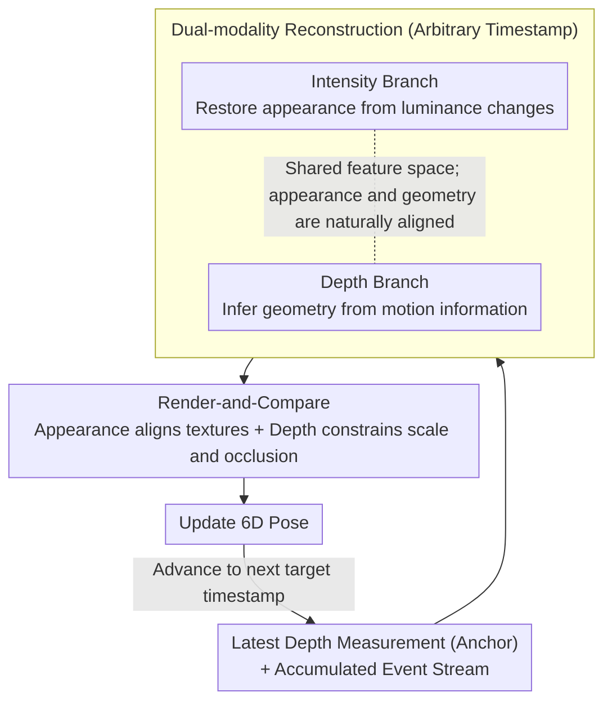

# Event6D: Event-based Novel Object 6D Pose Tracking

**Conference**: CVPR 2026  
**arXiv**: [2603.28045](https://arxiv.org/abs/2603.28045)  
**Code**: [https://chohoonhee.github.io/Event6D](https://chohoonhee.github.io/Event6D)  
**Area**: Video Understanding  
**Keywords**: Event camera, 6D pose tracking, Unseen object generalization, Dual-modality reconstruction, Sim-to-real transfer

## TL;DR

EventTrack6D proposes an event-depth fusion framework for 6D pose tracking. By reconstructing intensity and depth images at arbitrary timestamps, it bridges the gap between event cameras and low-frame-rate depth sensors. Trained exclusively on synthetic data, it achieves robust tracking of unseen objects at 120+ FPS.

## Background & Motivation

Event cameras provide microsecond-level latency, making them ideal for 6D object pose tracking in fast dynamic scenes—where traditional RGB-D solutions are limited by motion blur and large pixel displacements. However, the sparse asynchronous output of event cameras is incompatible with standard pose estimation frameworks, and existing event-based 6D pose datasets are small in scale with limited motion types.

**Key Challenge**: Depth frame rates are typically much lower than the temporal resolution of event streams, resulting in temporal gaps. There is a need to fill dense photometric and geometric information between depth frames.

## Method

### Overall Architecture

This paper addresses the temporal misalignment where event cameras provide microsecond resolution, but the depth maps required for pose tracking come from sensors with much lower frame rates. This creates a "blank" interval between depth frames lacking dense photometric and geometric information. Event6D fills this gap by using the most recent depth measurement as an anchor and utilizing the accumulated event stream to simultaneously reconstruct an intensity map and a depth map at any target timestamp. Consequently, the tracker receives dense appearance and geometric cues at every event interval, following a render-and-compare paradigm to iteratively update the 6D pose. The entire pipeline is trained only on synthetic data yet enables zero-shot transfer to unseen objects in real-world scenarios.

### Key Designs

**1. Dual-modality Reconstruction: Simultaneous recovery of intensity and depth at arbitrary timestamps to align sensor resolutions**

The tracker lacks dense information during the gaps between depth frames. The approach uses the last depth measurement as a condition to extrapolate the accumulated event stream to any target timestamp. The intensity branch recovers appearance from luminance changes, while the depth branch infers geometric changes from implicit motion information. Shared feature space ensures the reconstructed modalities are naturally aligned. Both modalities are essential: appearance aligns textures, while depth constrains scale and occlusion. Using depth frames as anchors provides a metric reference, making reconstruction significantly more stable than unconditional event-only methods.

**2. Large-scale Synthetic Benchmark: Generalization data with diverse objects and motions**

To enable zero-shot tracking of unseen objects, the model must be exposed to diverse appearances and motion patterns during training. Existing datasets (e.g., YCB-Ev with only 21 objects) are insufficient. The authors constructed a three-part benchmark: EventBlender6D (a synthetic training set with 495,840 samples and 1,033 objects), a simulated evaluation set, and a real-world event evaluation set. The synthetic pipeline bypasses the high cost of synchronizing and labeling real event, depth, and pose data. Scaling from 21 to 1,033 objects provides the data foundation for zero-shot transfer.

**3. Zero-shot Generalization to New Objects: Synthetic-only training without test-time fine-tuning**

Practical deployment cannot require data collection or retraining for every new object. Event6D ensures tracking is object-agnostic by training on a broad distribution. By learning from 1,033 objects and various motions, the model masters a universal "reconstruction + render-and-compare" mechanism rather than memorizing specific objects. It handles unseen objects in real scenes without fine-tuning, leveraging 120+ FPS inference to exploit the low-latency advantages of event cameras.

### Loss & Training

The training objective consists of three parts: intensity reconstruction loss, depth reconstruction loss, and a render-and-compare loss for pose estimation. The first two supervise dual-modality reconstruction, while the latter provides a closed-loop constraint on tracking accuracy. The model is trained entirely on synthetic data and transferred zero-shot to real scenes.

## Key Experimental Results

### Main Results

| Method | Data Type | FPS | New Object Gen. | Fast Motion Robustness |
|------|---------|-----|-----------|--------------|
| Traditional RGB-D | RGB-D | <30 | No | Poor (Motion Blur) |
| EventTrack6D | Event + Depth | **120+** | **Yes** | **Strong** |

Significantly outperforms traditional methods in high-dynamic scenarios.

### Ablation Study

| Configuration | Pose Accuracy | Description |
|------|---------|------|
| Intensity Only | Medium | Lacks geometric information |
| Depth Only | Medium | Lacks appearance information |
| Dual-modality | Optimal | Complementary photometric + geometric cues |
| No Depth Condition | Poor | Depth conditioning is critical |

### Key Findings

- Complementarity in dual-modality reconstruction is vital; performance drops significantly with only one modality.
- Strong zero-shot sim-to-real transfer performance indicates that 1,033 objects provide sufficient diversity for universal tracking.
- 120+ FPS allows the microsecond-level latency of event cameras to be fully utilized in tracking applications.

## Highlights & Insights

- **Event-based 6D Tracking Realization**: First systematic validation of the utility of event cameras for 6D tracking of novel objects; 120+ FPS is highly valuable for real-time applications like robotic manipulation.
- **Large-scale Synthetic Strategy**: Training a generalized model on 1,033 synthetic objects bypasses the real-world data labeling bottleneck.
- **Depth-conditioned Reconstruction**: Interpolated reconstruction anchored by depth frames is more stable than pure event-based reconstruction.

## Limitations & Future Work

- Cost and availability of event cameras still limit wide deployment.
- Depth camera frame rate remains a bottleneck; if depth intervals are too long, reconstruction quality degrades.
- Sim-to-real domain gaps may emerge in extreme scenarios.
- Future work could explore pure event-based (depth-free) tracking solutions.

## Related Work & Insights

- **vs. Traditional RGB-D Tracking (BundleSDF, etc.)**: Limited by frame rate and motion blur; EventTrack6D fundamentally addresses these via event cameras.
- **vs. YCB-Ev/E-POSE Datasets**: EventBlender6D provide a larger and more diverse benchmark compared to smaller existing datasets.
- **vs. FoundationPose**: While FoundationPose excels in static or slow scenarios, it degrades under fast motion.

## Rating

- Novelty: ⭐⭐⭐⭐ Combination of event cameras and 6D tracking is valuable; large-scale benchmark is a significant contribution.
- Experimental Thoroughness: ⭐⭐⭐⭐ Dual validation on synthetic and real data with thorough ablation.
- Writing Quality: ⭐⭐⭐⭐ Detailed description of the benchmark.
- Value: ⭐⭐⭐⭐ High application value for robotics and AR.

<!-- RELATED:START -->

## Related Papers

- [\[CVPR 2026\] SpikeTrack: High-performance and Energy-efficient Event-Based Object Tracking with Spiking Neural Network](spiketrack_high-performance_and_energy-efficient_event-based_object_tracking_wit.md)
- [\[CVPR 2026\] SDTrack: A Baseline for Event-based Tracking via Spiking Neural Networks](sdtrack_a_baseline_for_event-based_tracking_via_spiking_neural_networks.md)
- [\[CVPR 2026\] Tracking through Severe Occlusion via Event-Derived Transient Cues](tracking_through_severe_occlusion_via_event-derived_transient_cues.md)
- [\[CVPR 2026\] EgoXtreme: A Dataset for Robust Object Pose Estimation in Egocentric Views under Extreme Conditions](egoxtreme_a_dataset_for_robust_object_pose_estimation_in_egocentric_views_under_.md)
- [\[CVPR 2026\] MER-Tracker: Towards High-Speed 3D Point Tracking via Multi-View Event-RGB Hybrid Cameras](mer-tracker_towards_high-speed_3d_point_tracking_via_multi-view_event-rgb_hybrid.md)

<!-- RELATED:END -->
