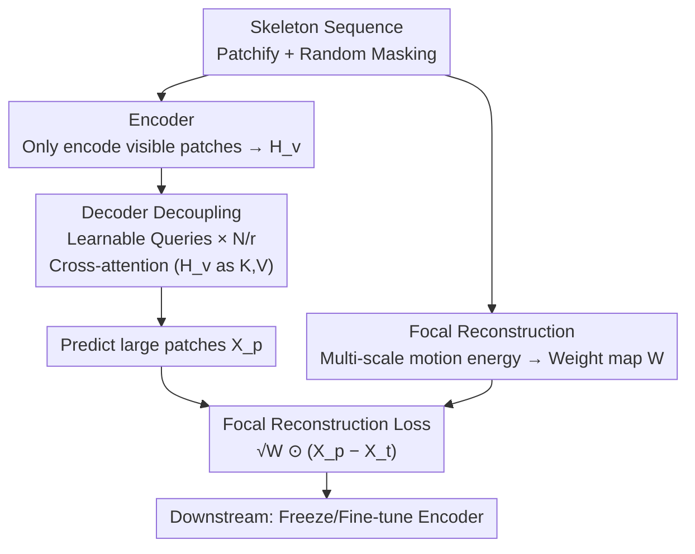

# Exploring Adaptive Masked Reconstruction for Self-Supervised Skeleton-Based Action Recognition

**Conference**: CVPR 2026  
**Paper**: [CVF Open Access](https://openaccess.thecvf.com/content/CVPR2026/html/Sun_Exploring_Adaptive_Masked_Reconstruction_for_Self-Supervised_Skeleton_Based_Action_Recognition_CVPR_2026_paper.html)  
**Code**: https://github.com/AshenOne1005/AMR  
**Area**: Video Understanding / Self-Supervised Learning  
**Keywords**: Skeleton-based action recognition, Masked reconstruction, Self-supervised pre-training, Cross-attention decoder, Motion energy guidance

## TL;DR
To address the issues of slow training and uniform treatment of all spatio-temporal regions in skeleton Masked Autoencoders (MAE), AMR utilizes a "decoupled cross-attention decoder" to achieve significant acceleration by "predicting fewer and larger patches." It then employs "motion energy-guided focal reconstruction" to concentrate the reconstruction focus of large patches on high-motion regions, achieving an 8x speedup and performance improvements on NTU-60/120 and PKU-II, surpassing existing SOTA.

## Background & Motivation
**Background**: Skeleton-based action recognition represents actions using human keypoints, which is lightweight and robust to lighting and background variations. Currently, self-supervised approaches mainly follow "contrastive learning" and "skeleton masked reconstruction." The latter draws from visual MAE by partitioning skeleton sequences into spatio-temporal patches, randomly masking a large majority (typically keeping 10%), and forcing the model to reconstruct masked patches from visible context to learn structural and semantic representations. Combined with the long-range spatio-temporal modeling of ViT, masked reconstruction has consistently achieved SOTA performance recently.

**Limitations of Prior Work**: Skeleton MAE suffers from two major drawbacks. First, it is **slow**: skeleton actions naturally have many frames, resulting in ultra-long sequences after patching (existing methods often need to predict 750 patches). Furthermore, skeleton decoders are much heavier than the lightweight decoders in visual MAE, and self-attention overhead on long sequences is immense, meaning **most training computation is consumed during decoding**. Second, it performs **undifferentiated reconstruction**: standard methods use a uniform MSE objective for all masked regions without distinguishing semantic importance. However, action semantics are concentrated in a few regions with intense motion. Averaging modeling capacity across redundant static regions increases reconstruction difficulty and weakens the modeling of critical motion dynamics.

**Key Challenge**: To accelerate, the most direct approach is to shorten the decoding sequence by "predicting fewer but larger patches." However, the information within large patches is more complex and dependencies are harder to capture; simply increasing patch size leads to a **significant performance drop**. Thus, "efficiency" and "performance" are in conflict regarding the patch scale dial.

**Goal**: Split into two sub-problems: (1) How to flexibly predict larger patches and eliminate redundant decoding computation without modifying the encoder; (2) How to reduce the difficulty of large patch reconstruction to approach small-patch performance.

**Key Insight**: The author observes that "self-attention between mask tokens" in standard decoders is redundant—randomly initialized mask tokens have no inherent semantics and only need cross-attention with visible patch features to become context-aware. Meanwhile, discriminative semantics in skeletons are highly concentrated in high-motion regions.

**Core Idea**: Utilize a "cross-attention decoder + learnable queries" to decouple the encoder and decoder, controlling predicted patch size by adjusting query counts (solving efficiency), and use a "motion energy-weighted focal reconstruction loss" to shift the modeling focus for large patches toward critical motion areas (solving the performance drop).

## Method

### Overall Architecture
AMR follows the two-stage paradigm of masked skeleton reconstruction: during pre-training, the skeleton sequence is patchified and randomly masked; the encoder processes only the visible patches, and the decoder reconstructs the masked parts. In the downstream stage, the encoder is frozen or fine-tuned with a classification head. Both AMR modifications reside in the "decoding + reconstruction loss" phase.

Input skeleton sequence $X \in \mathbb{R}^{T \times V \times C}$ ($T$ frames, $V$ joints, $C$ channels). First, $l$ consecutive frames of each joint are grouped into a spatio-temporal patch, yielding $X' \in \mathbb{R}^{T_e \times V \times (l \times C)}$ where $T_e = T/l$. These are embedded via linear projection and flattened into $E \in \mathbb{R}^{N \times C_e}$ ($N = T_e \times V$). After random masking, only the visible subset $E_v \in \mathbb{R}^{N_v \times C_e}$ is fed to the Transformer encoder to obtain $H_v$. The pipeline branches at the decoding end: **Decoder Decoupling** replaces the standard "concatenated mask token" decoding with a set of learnable queries, controlling the number and granularity of predicted patches by adjusting query counts. **Focal Reconstruction** quantifies motion energy for each spatio-temporal window to generate a weight map, which is then integrated into the reconstruction loss.

### Key Designs

**1. Decoder Decoupling: Controlling patch prediction via learnable queries**

The bottleneck is the self-attention overhead in standard decoders. While shortening the decoding sequence (predicting fewer, larger patches) is intuitive, standard decoders concatenate visible features and mask tokens $H_e=[H_v\Vert M]$, creating a **tight coupling** between decoder and encoder. One cannot flexibly change prediction granularity without altering encoder output $H_v$, and forced downsampling of $H_e$ leads to semantic loss.

The authors decouple the two components of decoding computation—mask token self-attention and cross-attention with visible features—and note that the former is redundant. The decoder is simplified to "cross-attention layers + FFN," taking learnable query vectors $H_q \in \mathbb{R}^{N_t \times C_e}$ (with learnable spatio-temporal positional embeddings) as input, while $H_v$ serves as both key and value:

$$H_q \leftarrow \mathrm{MCA}(H_q, H_v) + H_q, \qquad H_q \leftarrow \mathrm{FFN}(H_q) + H_q$$

The gain is **flexibility**: to increase patch size by $r$ times, one simply sets $N_t = N/r$ to generate predictions $X_p \in \mathbb{R}^{(N/r)\times(r\cdot l\cdot C)}$ without **modifying the encoder**. Shortened decoding sequences eliminate computational overhead—AMR only predicts 125 patches versus 750 in prior works, the main driver for the 8x speedup.

**2. Focal Reconstruction: Motion energy weighting for large patch modeling**

Decoupling enables large patch prediction, but large patches contain more noise and redundancy. To capture discriminative motion semantics, the authors use **local motion energy** as an importance metric to dynamically allocate reconstruction weights.

The sequence is divided into $T_w=T/n$ non-overlapping windows of $n$ frames. For a joint slice $S \in \mathbb{R}^{n \times C}$ within a window, motion energy is defined as the mean squared norm of the displacement relative to the window mean:

$$e_s = \frac{1}{n}\sum_{t=1}^{n}\lVert s_t - \mu\rVert_2^2, \quad \mu=\frac{1}{n}\sum_{t=1}^{n}s_t$$

Weight function $w(e_s)$ maps energy to coefficients in $[0,1]$:

$$w(e_s) = \frac{1}{1 + k\cdot e_t/(e_s+\epsilon)}$$

Where $e_t$ is an adaptive threshold (mean energy across all windows), and $k>0$ controls curvature. This suppresses static redundant areas ($w\to 0$) and preserves high-motion areas ($w\to 1$). Weights $W$ are broadcast to match $X_p$ for the focal reconstruction loss.

**3. Multi-scale Temporal Window Fusion**

A single window scale is biased: short windows miss slow details, while long windows miss fast movements. AMR calculates and fuses joint motion energy across multiple scales (e.g., $n=4,8,12$). Visualizations (of "taking off a hat") show that multi-scale fusion provides smoother, more continuous importance weights and reduces misidentification of non-discriminative joints.

### Loss & Training
The focal reconstruction loss applies motion energy weights to the standard MSE:

$$\mathcal{L} = \frac{1}{N}\left\lVert \sqrt{W}\odot(X_p - X_t)\right\rVert_F^2$$

$\odot$ denotes element-wise multiplication. Downstream evaluation encompasses linear evaluation (frozen encoder, 100 epochs, batch 256, initial LR 0.01 with cosine annealing), semi-supervised learning, and transfer learning protocols.

## Key Experimental Results

### Main Results
Linear evaluation on NTU-60 x-sub compared with other masked reconstruction methods (Single L20 GPU):

| Method | Patch Count | FLOPs | Training Time | Speedup | NTU-60 x-sub | NTU-60 x-view | PKU-II x-sub |
|------|---------|-------|---------|------|------|------|------|
| SkeletonMAE | 750 | 13.7G | 29.9h | 1× | 74.8 | 77.7 | 36.1 |
| MAMP | 750 | 13.7G | 29.9h | 1× | 84.9 | 89.1 | 53.8 |
| S-JEPA | 750 | 32.8G | 139.8h | 0.2× | 85.3 | 89.8 | 53.5 |
| GFP | 251 | 4.1G | 4.9h | 6.1× | 85.9 | 92.0 | 56.2 |
| NAT w/ Con | 750 | 32.8G | 46.6h | 0.6× | 86.9 | 91.0 | 55.3 |
| **AMR (Ours)** | **125** | **3.8G** | **3.7h** | **8.1×** | **87.4** | **92.3** | **60.3** |

AMR achieves the highest accuracy with the fewest patches (125) and shortest training time (3.7h). The gain on PKU-II x-sub (60.3 vs 56.2) validates the effectiveness of focal reconstruction on more challenging datasets.

### Ablation Study
Ablation of core components (125 patches; DD=Decoupled Decoder, FR=Focal Reconstruction):

| Config | NTU-60 | NTU-120 | Description |
|------|--------|---------|------|
| Baseline1 (Decoder Masking) | 84.8 | 76.3 | Standard SA decoder + decoder masking |
| Baseline2 (Downsampling) | 78.9 | 70.2 | Downsampling causes information loss |
| Baseline + DD | 86.0 | 80.1 | With Decoupled Cross-Attention Decoder |
| Baseline + DD + FR | **87.4** | **81.1** | Full AMR |

Decoder design ablation (Table 6): MCA alone yields 87.4/81.1. Adding self-attention (MCA+MSA) results in 87.2/81.2, showing **no statistically significant change**, confirming that mask token self-attention is redundant.

### Key Findings
- **Decoupled Decoder is inherently strong**: Under large-patch settings, standard decoding (Baseline 1/2) drops significantly, while DD recovers to 86.0. FR adds another +1.4.
- **Robustness to patch scaling**: As $r$ increases from 1 to 30, AMR consistently outperforms baseline decoders and peaks at $r=6$ (87.4), demonstrating a superior efficiency-performance trade-off.
- **Semi-supervised advantage**: With only 1% labels on NTU-60, AMR achieves 72.2/74.4, outperforming GFP (71.8/72.9), indicating strong representation generalization.

## Highlights & Insights
- **"Adjusting query count = Adjusting patch granularity" is a clean decoupling**: It reduces the problem of patch size to a hyperparameter without affecting the architecture, a strategy transferable to other masked reconstruction tasks.
- **Empirical proof of mask token self-attention redundancy**: Removing self-attention with zero performance loss is a crucial insight for reducing computational cost.
- **Injecting priors into loss, not masks**: Unlike MAMP (which decides what to mask based on motion), AMR embeds motion priors into the reconstruction loss to target large-patch redundancy.

## Limitations & Future Work
- Focal reconstruction depends on manually defined motion energy and fixed window scales $\{4, 8, 12\}$, which might require tuning for different frame rates or action tempos. ⚠️ Robustness across frame rates was not explicitly tested.
- Designed specifically for "large patch reconstruction," the gain in transfer learning is less pronounced compared to linear evaluation.
- Motion energy is a geometric displacement metric; it might underestimate the importance of subtle but semantically critical movements (e.g., finger movements).

## Related Work & Insights
- **vs MAMP**: MAMP uses displacement to decide **which patches to mask**, whereas AMR uses it to **weight the reconstruction loss** to handle large-patch redundancy.
- **vs S-JEPA / NAT**: Both are SOTA but predict 750 patches and take dozens of hours to train. AMR predicts 125 patches and finishes in 3.7h with higher accuracy.
- **vs GFP**: GFP also targets efficiency (6.1x speedup) but uses downsampling in the decoder, which loses information; AMR avoids this via query decoupling.

## Rating
- Novelty: ⭐⭐⭐⭐ 
- Experimental Thoroughness: ⭐⭐⭐⭐⭐ 
- Writing Quality: ⭐⭐⭐⭐ 
- Value: ⭐⭐⭐⭐⭐ 

<!-- RELATED:START -->

<!-- RELATED:END -->

## Related Papers

- [\[CVPR 2026\] Self-Paced and Self-Corrective Masked Prediction for Movie Trailer Generation](self-paced_and_self-corrective_masked_prediction_for_movie_trailer_generation.md)
- [\[CVPR 2026\] SkeletonContext: Skeleton-side Context Prompt Learning for Zero-Shot Skeleton-based Action Recognition](skeletoncontext_skeleton-side_context_prompt_learning_for_zero-shot_skeleton-bas.md)
- [\[CVPR 2026\] Boosting Self-Supervised Tracking with Contextual Prompts and Noise Learning](boosting_self-supervised_tracking_with_contextual_prompts_and_noise_learning.md)
- [\[ICCV 2025\] Adaptive Hyper-Graph Convolution Network for Skeleton-Based Human Action Recognition](../../ICCV2025/video_understanding/adaptive_hyper-graph_convolution_network_for_skeleton-based_human_action_recogni.md)
- [\[ICCV 2025\] Adaptive Hyper-Graph Convolution Network for Skeleton-based Human Action Recognition with Virtual Connections](../../ICCV2025/video_understanding/adaptive_hyper_graph_convolution_network_skeleton_action_recognition.md)

<!-- RELATED:END -->
