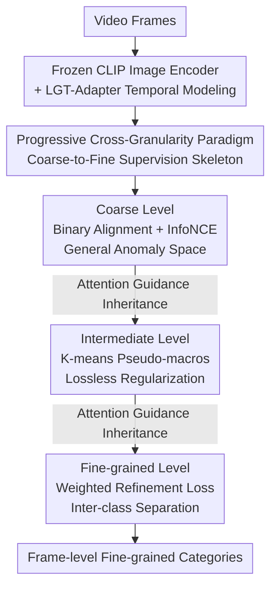

# Fine-VAD: Towards Fine-Grained Video Anomaly Detection via Progressive Cross-Granularity Learning

**Conference**: CVPR 2026  
**Paper**: [CVF Open Access](https://openaccess.thecvf.com/content/CVPR2026/html/Zhang_Fine-VAD_Towards_Fine-Grained_Video_Anomaly_Detection_via_Progressive_Cross-Granularity_Learning_CVPR_2026_paper.html)  
**Code**: Not public (No repository link provided in paper)  
**Area**: Video Understanding  
**Keywords**: Fine-grained Video Anomaly Detection, Progressive Cross-Granularity Learning, CLIP Alignment, Weakly Supervised, Pseudo-macro Clustering  

## TL;DR
Addressing the challenge of scarce samples per anomaly class in fine-grained video anomaly detection, this paper proposes a progressive cross-granularity learning paradigm: first learning general anomaly representations with abundant binary labels, then constructing an intermediate semantic skeleton via K-means pseudo-macro clustering, and finally refining with sparse category labels. Implemented as Fine-VAD with CLIP alignment, it achieves a relative improvement of 47.7% in mean AVG mAP on UCF-Crime and XD-Violence.

## Background & Motivation
**Background**: Traditional Video Anomaly Detection (VAD) only determines the presence of an anomaly. However, real-world public safety scenarios require specific responses for different types. Consequently, research is shifting toward **fine-grained VAD**, which must both detect and categorize anomalies (e.g., Arson, Fighting, Accident). Mainstream approaches leverage pre-trained representations from vision-language models like CLIP to mitigate data scarcity.

**Limitations of Prior Work**: Fine-grained VAD faces two major hurdles due to the context-dependent nature of anomalies. First is **inter-class confusion**: semantically different anomalies often consist of similar visual primitives (e.g., flames and smoke in both arson and explosions), leading to entangled features and blurred boundaries. Second is **intra-class variation**: the same anomaly type can vary drastically across scenes (e.g., arson ranging from a small spark to a massive fire), making consistent representation learning difficult.

**Key Challenge**: The direct solution is training on large-scale datasets, but collecting sufficient samples for every category is nearly impossible. Early works using video-level labels for supervision struggled with sparse samples per category. While CLIP-based methods mitigate scarcity, they lack fine-grained understanding of object attributes, dynamics, and interactions, often confusing visually similar anomalies. **The fundamental contradiction lies in the scarcity of fine-grained labels versus the requirement for the model to learn discriminative features for each category.**

**Key Insight**: The authors leverage a critical observation: **while fine-grained labels are scarce, coarse-grained labels (binary anomaly/normal) are relatively abundant**. Rather than forcing the model to learn each class directly, supervision should be "progressive from coarse to fine." Coarse labels cover a wide range to learn stable anomaly representations (reducing intra-class variation), while fine labels carve semantic boundaries in this space (addressing inter-class confusion).

**Core Idea**: A three-level progressive cross-granularity supervision ("Binary → Pseudo-macro → Fine") is used to carve the feature space from general patterns into category-specific semantics, bypassing the bottleneck of fine-grained label scarcity.

## Method

### Overall Architecture
The input to Fine-VAD is a video, and the output is frame-level fine-grained categories. The pipeline is built on frozen CLIP (ViT-B/16): video frames (sampled every 16 frames) are fed into the frozen CLIP image encoder, followed by an **LGT-Adapter** (Local-Global Temporal Adapter) to model temporal dynamics missing in image CLIP, yielding video features $f_V$. Then, the **Progressive Cross-Granularity Learning** paradigm aligns $f_{video}$ with three levels of text embeddings to generate alignment maps $M_{coarse} \to M_{inter} \to M_{fine}$. Each level inherits attention guidance from the previous one, evolving the feature space: general patterns $\to$ coarse boundaries $\to$ category-specific semantics. Notably, the paradigm is **architecture-agnostic**.

### Key Designs

**1. Progressive Cross-Granularity Learning: Paving the way for rare fine labels with abundant coarse labels**

This is the core contribution. Learning is decomposed into three levels of increasing semantic granularity. The coarse level uses binary labels $y_b$ to anchor all anomalies to a shared representation (alleviating intra-class variation). The intermediate level clusters visually/semantically similar categories into $K$ macro-classes using pseudo-labels $y_p$, providing a structural skeleton to prevent collapse under sparse supervision. The fine level then introduces ground truth labels $y_m$ for refinement (solving inter-class confusion). Ablations show that using only fine labels yields 8.64% mAP, while adding coarse (+2.29%) and intermediate levels (+2.96%) reaches 14.99%.

**2. Coarse Level: Binary Alignment + Contrastive Loss for Stable Anomaly Space**

To handle intra-class variation, the coarse level uses abundant supervision to build the foundation. Temporally enhanced $f_V$ is projected to frame-level features $f_{video} \in \mathbb{R}^{n\times d}$. Text embeddings for "Normal/Anomaly" $E_{coarse}=[e_{norm}; e_{anom}]$ are used to calculate the coarse alignment map $M_{coarse}=\mathrm{sim}(f_{video}, E_{coarse}) \in \mathbb{R}^{n\times 2}$. The loss combines Binary Cross-Entropy with InfoNCE contrastive loss:

$$\mathcal{L}_{bce} = -\frac{1}{N}\sum_{i=1}^{N}\big[\, y_i \log s_{i,1} + (1-y_i)\log(1-s_{i,1})\,\big]$$

Where $s_{i,1}$ is the anomaly score after top-$T$ pooling. The contrastive term separates anomaly representations from the normal manifold.

**3. Intermediate Level: K-means Pseudo-macros + Cross-Attention Guidance**

This level bridges the gap to prevent training collapse. Ground truth category embeddings $\{e_1,\dots,e_M\}$ are clustered into $K$ pseudo-macro classes using K-means:

$$\arg\min_{\{C_k\}}\sum_{k=1}^{K}\sum_{e_i\in C_k}\|e_i-\mu_k\|^2,\quad \mu_k=\frac{1}{|C_k|}\sum_{e_i\in C_k}e_i$$

Cluster centroids $\mu_k$ serve as macro pseudo-embeddings $E^k_{pseudo}$. Coarse semantics are injected via cross-attention where $M_{coarse}$ is the query and $f_{video}$ is the key-value, yielding $E^{coarse}_{guide} = \text{Attention}(M_{coarse}, f_{video})$. This level **intentionally omits supervised losses**; since pseudo-labels are noisy, it acts as a structural regularizer via soft attention guidance.

**4. Fine-grained Level: Weighted Refinement Loss for Visual Similarity**

This level targets inter-class confusion. It inherits guidance from $M_{inter}$ to produce refined embeddings $\hat{E}_{fine}$ and the final alignment map $M_{fine}$. A **weighted cross-entropy loss** is used, assigning higher weights to similar categories within the same pseudo-macro class $C_p(i)$:

$$\mathcal{L}_{refine}=-\frac{1}{N}\sum_{i=1}^{N}\sum_{j=0}^{M}\alpha_{i,j}\,y_{i,j}\log s_{i,j},\quad \alpha_{i,j}=\begin{cases}\omega, & j\in C_p(i)\\ 1, & \text{otherwise}\end{cases}$$

This specifically forces separation between visually similar pairs (e.g., Arson vs. Explosion).

### Loss & Training
The CLIP encoders remain **frozen**. Top-$T$ pooling is applied to alignment maps $M$ to obtain category-level similarity vectors $S=\{s_0,\dots,s_m\}$ for MIL-style supervision. The total loss is $\mathcal{L}=\mathcal{L}_{bce}+\lambda_1\mathcal{L}_{cts}+\lambda_2\mathcal{L}_{refine}$. Training uses AdamW, batch size 64, learning rate $1\times10^{-5}$ for 10 epochs on an RTX 4090.

## Key Experimental Results

### Main Results
Evaluated using mAP@IoU (0.1~0.5) AVG on UCF-Crime and XD-Violence.

| Dataset | Metric | Ours | Prev. SOTA (ExVAD) | Gain |
|--------|------|------|----------|------|
| UCF-Crime | AVG mAP% | **14.99** | 10.15 | Relative +47.7% |
| UCF-Crime | mAP@0.1% | **21.43** | 16.51 | +4.92 (absolute) |
| XD-Violence | AVG mAP% | **31.87** | 28.23 | +3.64 (absolute) |
| XD-Violence | mAP@0.5% | **21.58** | 18.35 | +3.23 (absolute) |

**Architecture Adaptability**: The paradigm consistently improves various backbones:

| Backbone | Dataset | Gain |
|------|------|------|
| I3D | UCF-Crime | +2.97% |
| Qwen2.5-VL-7B | XD-Violence | +14.93% |

### Ablation Study

| Configuration | AVG mAP% | Note |
|------|---------|------|
| Fine-level only | 8.64 | Sparse labels insufficient |
| + Coarse-level | 10.93 | General patterns foundation (+2.29%) |
| + Intermediate-level | 11.60 | Coarse structure before refinement (+2.96%) |
| Full Three-level | **14.99** | Mutual reinforcement |
| w/o LGT-Adapter | 5.62 | Temporal reasoning is essential |

### Key Findings
- **Mutual Reinforcement**: Coarse levels stabilize the space, and the fine level refines it. t-SNE shows features become increasingly compact and separable through the stages.
- **"Lossless" Intermediate Layer**: Adding supervision to the intermediate level actually dropped performance by ~2.41%, confirming its role as a structural skeleton rather than a supervised branch.
- **Temporal Modeling**: Removing the temporal adapter results in a drop to 5.62%, emphasizing its necessity for fine-grained understanding.

## Highlights & Insights
- **Leveraging Label Asymmetry**: Efficiently uses abundant binary labels to structure the feature space for data-scarce tasks.
- **Pseudo-macros as "脚手架" (Scaffolding)**: Downgrading noisy pseudo-labels from supervision targets to attention skeletons avoids overfitting noise.
- **Targeted Refinement**: Weighted losses focus the discriminative "budget" on visually similar hard pairs rather than all classes equally.
- **Paradigm Generalization**: Gains are independent of the specific backbone, providing a plug-and-play training recipe.

## Limitations & Future Work
- **Single Anomaly Assumption**: Current work assumes one dominant anomaly per video; future work should explore multi-anomaly co-occurrence.
- **Semantic Dependency**: Heavy reliance on CLIP's text embedding quality may limit performance on rare categories.
- **Static K**: The number of pseudo-macros $K$ is fixed; adaptive $K$ based on categorical complexity could be more robust.

## Related Work & Insights
- **vs VadCLIP**: Fine-VAD evolves from single-level alignment to three-level progressive alignment, yielding a significant jump from 6.68% to 14.99% mAP on UCF-Crime.
- **vs ExVAD**: While ExVAD uses large LLaMA models, Fine-VAD outperforms it without heavy LLM dependency, proving that "good supervision structure" outweighs "model scaling."

## Rating
- Novelty: ⭐⭐⭐⭐ (Progressive paradigm with "lossless" intermediate regularization)
- Experimental Thoroughness: ⭐⭐⭐⭐ (Extensive ablations and cross-architecture validation)
- Writing Quality: ⭐⭐⭐⭐ (Clear logical flow between motivation and implementation)
- Value: ⭐⭐⭐⭐ (Strong baseline and universal training paradigm for fine-grained VAD)

<!-- RELATED:START -->

<!-- RELATED:END -->

## Related Papers

- [\[CVPR 2026\] Text-guided Fine-Grained Video Anomaly Understanding](text-guided_fine-grained_video_anomaly_understanding.md)
- [\[CVPR 2026\] Mistake Attribution: Fine-Grained Mistake Understanding in Egocentric Videos](mistake_attribution_fine-grained_mistake_understanding_in_egocentric_videos.md)
- [\[CVPR 2026\] UFVideo: Towards Unified Fine-Grained Video Cooperative Understanding with Large Language Models](ufvideo_towards_unified_fine-grained_video_cooperative_understanding_with_large_.md)
- [\[CVPR 2026\] Frame2Freq: Spectral Adapters for Fine-Grained Video Understanding](frame2freq_spectral_adapters_for_fine-grained_video_understanding.md)
- [\[AAAI 2026\] FineVAU: A Novel Human-Aligned Benchmark for Fine-Grained Video Anomaly Understanding](../../AAAI2026/video_understanding/finevau_a_novel_human-aligned_benchmark_for_fine-grained_video_anomaly_understan.md)

<!-- RELATED:END -->
