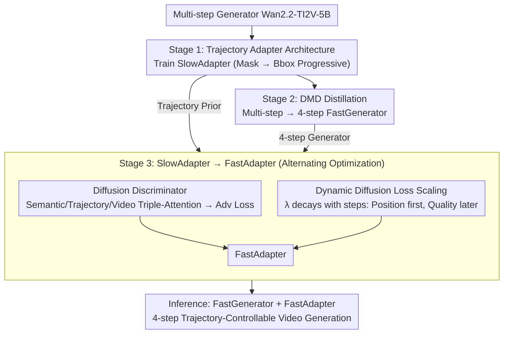

# FlashMotion: Few-Step Controllable Video Generation with Trajectory Guidance

**Conference**: CVPR 2026  
**arXiv**: [2603.12146](https://arxiv.org/abs/2603.12146)  
**Code**: [https://github.com/quanhaol/FlashMotion](https://github.com/quanhaol/FlashMotion)  
**Area**: Video Understanding / Video Generation  
**Keywords**: Trajectory-Controllable Video Generation, Few-Step Distillation, Adversarial Training, Diffusion Discriminator, Video Acceleration

## TL;DR

Ours proposes FlashMotion, the first three-stage training framework to achieve few-step (4-step) trajectory-controllable video generation. By employing a strategy of training a trajectory adapter $\rightarrow$ distilling a fast generator $\rightarrow$ fine-tuning the adapter with a hybrid adversarial-diffusion approach, it simultaneously outperforms existing multi-step methods in visual quality and trajectory accuracy with 4-step inference, achieving a 47x speedup.

## Background & Motivation

**Background**: Significant progress has been made in diffusion model-driven video generation, particularly in trajectory-controllable generation—where users specify movement paths for foreground objects (via bboxes or masks), and the model generates video accordingly. Methods like MagicMotion, Tora, and LeviTor achieve precise control by adding trajectory adapters to base video generation models.

**Limitations of Prior Work**: All existing trajectory-controllable methods rely on multi-step denoising inference (over 50 steps), taking approximately 1160 seconds (>19 minutes) to generate a 121-frame video. While video distillation methods (e.g., DMD, LCM, CausVid) can compress general video models into few-step versions, direct application of these methods to trajectory-controllable generation leads to significant degradation in visual quality and trajectory accuracy.

**Key Challenge**: Multi-step adapters (SlowAdapter) are trained on the progressive denoising paths of multi-step generators (SlowGenerator), where trajectory conditions guide noise through incremental refinement. Few-step generators (FastGenerator) utilize entirely different denoising paths—completing the process in only 4 steps. Thus, SlowAdapter and FastGenerator are inherently incompatible, leading to color shifts, blurring, and loss of trajectory control when combined.

**Goal**: Design a training framework that enables the trajectory adapter to function correctly with a few-step generator, maintaining both visual quality and trajectory accuracy within 4-step inference.

**Key Insight**: The authors discovered that fine-tuning the adapter with standard diffusion loss restores trajectory accuracy but causes severe blurring (as pixel-level supervision doesn't guarantee distribution consistency). Conversely, adversarial training eliminates blur but sacrifices trajectory accuracy. Therefore, both losses must be utilized and dynamically balanced.

**Core Idea**: A three-stage training process—first train a multi-step adapter, then distill the fast generator, and finally fine-tune the adapter using a hybrid strategy of diffusion and adversarial labels to adapt to the fast generator.

## Method

### Overall Architecture

The FlashMotion training pipeline consists of three stages: **Stage 1** trains a SlowAdapter on a multi-step video generator (Wan2.2-TI2V-5B) to learn trajectory control; **Stage 2** compresses the multi-step generator into a 4-step FastGenerator via DMD distillation; **Stage 3** fine-tunes the SlowAdapter into a FastAdapter tailored for the FastGenerator using a hybrid diffusion-adversarial strategy. At inference, the FastGenerator + FastAdapter combination requires only 4 denoising steps to generate high-quality, trajectory-accurate videos.

### Key Designs

**1. Trajectory Adapter Architecture: Injecting user-drawn trajectories without being locked to a specific backbone.**

The trajectory control is carried out by an adapter attached to the base DiT. The number of adapter blocks aligns exactly with the DiT, and each block output is added back to the corresponding DiT block via a zero-initialized convolution—this ensures the adapter does not disrupt the original model in early training while progressively learning control signals. Trajectory maps (bbox or mask) are encoded into the latent space $Z_{trajectory} \in \mathbb{R}^{T/4 \times H/16 \times W/16 \times 48}$ via a 3D VAE encoder before injection. Training follows a dense-to-sparse progressive strategy: starting with 4.6K steps using dense masks for foundation, followed by 5.4K steps of fine-tuning with sparse bboxes. The authors implemented two versions—ControlNet (10.28B parameters, more accurate) and a lightweight ResNet (5.02B parameters, faster inference)—demonstrating the framework’s flexibility.

**2. Diffusion Discriminator: Using a trajectory-aware discriminator to introduce adversarial signals and cure diffusion-induced blur.**

Relying solely on pixel-level diffusion loss $\mathcal{L}_{diffusion} = \|G_\theta(x_t, t) - x_0^{real}\|^2$ only approximates single-frame pixels and fails to maintain consistency between generated and real distributions, leading to blurry outputs. FlashMotion adds a discriminator to constrain generation quality at the distribution level. The discriminator backbone is a cloned and frozen Wan2.2-TI2V-5B, with only a new attention classifier being trained to minimize cost while leveraging the base model's video understanding. The classifier processes DiT intermediate features using a learnable query token through three layers: **semantic self-attention** (integrating text and first frame), **trajectory cross-attention** (aligning trajectory tokens), and **video cross-attention** (reading video tokens), finally outputting real/fake logits. This triple-attention design ensures the discriminator evaluates semantic, trajectory, and video dimensions simultaneously, suppressing blur without losing trajectory information.

**3. Dynamic Diffusion Loss Scaling: Scheduling "drawing correctly" and "drawing well" during training.**

The total loss in Stage 3 combines adversarial and diffusion losses: $\mathcal{L} = \mathcal{L}_{\mathcal{G}} + \lambda \mathcal{L}_{diffusion}$. The challenge is their differing scales—early in training, diffusion loss gradients are much larger than adversarial ones. Setting a fixed $\lambda=1$ allows diffusion loss to dominate throughout, resulting in persistent blur. The authors utilize a monotonically decaying weight relative to the training step:

$$\lambda = \frac{1}{4 \times 10^{-3} \times step + 0.1}$$

In early training, high $\lambda$ allows diffusion loss to lead, positioning objects and aligning trajectories; as steps progress, $\lambda$ decreases, allowing adversarial loss to take over and push visual quality. This ensures the model learns to "draw correctly" before focusing on "drawing well."

### Loss & Training

- **Stage 1** (SlowAdapter): Standard diffusion denoising loss, 16 GPUs × 10K steps.
- **Stage 2** (FastGenerator): DMD distribution matching loss $\nabla\mathcal{L}_{DMD} = \mathbb{E}[-(s_{real} - s_{fake})\frac{dG_\theta}{d\theta}]$, 16 GPUs × 5.5K steps.
- **Stage 3** (FastAdapter): Hybrid loss $\mathcal{L} = \mathcal{L}_{\mathcal{G}} + \lambda\mathcal{L}_{diffusion}$, with alternating optimization of discriminator and adapter (1:5 update ratio), requiring only **4 GPUs × 1K steps**.

## Key Experimental Results

### Main Results (FlashBench)

| Method | Steps | FID↓ | FVD↓ | M IoU↑ | B IoU↑ | Denoising Time(s) |
|--------|------|------|----------|------|------|------|
| MagicMotion | 50 | 20.03 | 138.83 | 68.10 | 73.68 | 1158.63 |
| Wan+ResNet | 50 | 19.03 | 139.61 | 52.19 | 57.76 | 333.00 |
| DMD (ResNet) | 4 | 24.38 | 228.33 | 43.24 | 52.61 | 11.72 |
| LCM (ResNet) | 4 | 26.79 | 462.09 | 55.31 | 60.80 | 11.72 |
| **Ours (ResNet)** | **4** | **15.81** | **108.96** | **63.96** | **70.01** | **11.72** |
| **Ours (ControlNet)** | **4** | **14.35** | **96.08** | **69.15** | **75.38** | **24.44** |

### Ablation Study (FlashBench, ResNet)

| Configuration | FID↓ | FVD↓ | M IoU↑ | B IoU↑ |
|------|---------|------|------|------|
| Direct use of Slow Adapter | 22.75 | 168.46 | 49.79 | 56.62 |
| w/o Diffusion Loss | 18.87 | 161.07 | 52.04 | 58.04 |
| w/o GAN Loss | 22.74 | 206.75 | 65.82 | 70.60 |
| w/o Dynamic Scaling | 26.32 | 210.93 | 65.54 | 69.77 |
| **Ours (Full)** | **15.81** | **108.96** | **63.96** | **70.01** |

### Key Findings

- **FlashMotion 4-step exceeds MagicMotion 50-step**: The ControlNet version achieves FID 14.35 vs 20.03 and FVD 96.08 vs 138.83, while providing **47x speedup** (24s vs 1158s).
- **GAN loss is critical for removing blur**: Removing GAN loss causes FVD to jump from 108.96 to 206.75 (~90% degradation), though trajectory accuracy remains stable, indicating GAN primary affects visual distribution.
- **Diffusion loss is critical for trajectory accuracy**: Removing it drops M IoU from 63.96 to 52.04, causing objects to deviate from intended paths.
- **Dynamic scaling is indispensable**: Fixing $\lambda=1$ results in FID rising from 15.81 to 26.32, proving the need to suppress diffusion gradients early in fine-tuning.
- ControlNet adapters consistently outperform ResNet in accuracy and quality but take roughly twice the inference time.

## Highlights & Insights

- **Elegant Three-Stage Decomposition**: Decoupling "high-speed + controllability" into learning control, learning speed, and then aligning the two. Stage 3 requires only 1K steps, demonstrating the value of the strong priors provided by the SlowAdapter.
- **Triple-Attention Diffusion Discriminator**: The separated injection of semantic, trajectory, and video information allows the discriminator to perceive multi-dimensional signals, making it more effective than standard CNN discriminators for conditional tasks.
- **Practicality of Dynamic Loss Scaling**: A simple but effective solution to the gradient imbalance between diffusion and adversarial losses, using a concise formula to handle phase transition.

## Limitations & Future Work

- FlashBench support is currently based on MagicData extensions; data diversity remains restricted.
- Stage 2 distillation depends on a specific DMD method; the impact of alternative distillation methods (e.g., CausVid) remains unexplored.
- Current support is limited to bbox/mask conditions; more flexible representations like point trajectories or semantic descriptions require further research.
- The ControlNet version, while superior, has 10.28B parameters, posing challenges for edge-side deployment.
- Technical constraints like OOM during DMD and GAN training for ControlNet prevented a wider range of distillation comparisons.

## Related Work & Insights

- **vs MagicMotion**: MagicMotion achieves precise control on CogVideoX but requires 50 steps; FlashMotion on Wan2.2 takes 4 steps with superior results.
- **vs APT/APT2**: APT series one-step adversarial distillation is effective for general video but lacks trajectory support; FlashMotion’s discriminator incorporates trajectory-awareness inspired by APT.
- **vs Tora/LeviTor**: Tora and LeviTor are based on CogVideoX and SVD respectively; both are outperformed by FlashMotion in quality and speed.

## Rating

- Novelty: ⭐⭐⭐⭐ First few-step trajectory-controllable video generation framework with a rational three-stage design.
- Experimental Thoroughness: ⭐⭐⭐⭐⭐ Conducted across three benchmarks with two adapter architectures and extensive ablations.
- Writing Quality: ⭐⭐⭐⭐ Clear structure and detailed methodological descriptions.
- Value: ⭐⭐⭐⭐⭐ 47x acceleration with better quality directly accelerates the practical application of controllable video generation.

<!-- RELATED:START -->

## Related Papers

- [\[CVPR 2026\] AutoCut: End-to-end Advertisement Video Editing Based on Multimodal Discretization and Controllable Generation](autocut_end-to-end_advertisement_video_editing_based_on_multimodal_discretizatio.md)
- [\[CVPR 2026\] DeRVOS: Decoupling Consistent Trajectory Generation and Multimodal Understanding for Referring Video Object Segmentation](dervos_decoupling_consistent_trajectory_generation_and_multimodal_understanding_.md)
- [\[CVPR 2026\] Envisioning the Future, One Step at a Time](envisioning_the_future_one_step_at_a_time.md)
- [\[CVPR 2026\] Learning from Synthetic Data via Provenance-Based Input Gradient Guidance](learning_from_synthetic_data_via_provenance-based_input_gradient_guidance.md)
- [\[CVPR 2026\] Gloria: Consistent Character Video Generation via Content Anchors](gloria_consistent_character_video_generation_via_content_anchors.md)

<!-- RELATED:END -->
