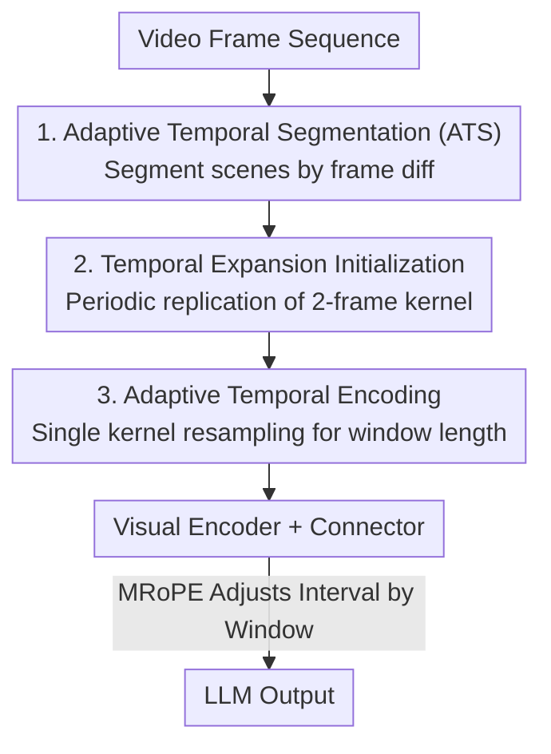

# FlexiVideo: Variation-Aware Temporal Dynamics Modeling for Efficient Video Understanding

**Conference**: CVPR 2026  
**Paper**: [CVF Open Access](https://openaccess.thecvf.com/content/CVPR2026/html/Peng_FlexiVideo_Variation-Aware_Temporal_Dynamics_Modeling_for_Efficient_Video_Understanding_CVPR_2026_paper.html)  
**Code**: https://github.com/AI9Stars/FlexiVideo  
**Area**: Video Understanding  
**Keywords**: Video MLLM, Temporal Dynamics Modeling, Efficient Encoding, Visual Confusion, Adaptive Segmentation

## TL;DR
FlexiVideo replaces the fixed multi-frame encoding window with a mechanism that first segments video into "internally stable" scene clips based on frame differencing. It then employs a shared 3D convolutional kernel with dynamic temporal window adjustment for scene-level encoding. This approach reduces visual tokens by 43.5% while consistently outperforming Qwen2.5-VL-3B across six video benchmarks.

## Background & Motivation

**Background**: Current video MLLMs generally follow a "perception-cognition" paradigm where a visual encoder compresses frames into compact representations before passing them to an LLM. To handle visual redundancy, mainstream methods follow two paths: spatiotemporal compression with fixed ratios after encoding, or pruning/merging tokens irrelevant to the query. The recent Qwen2.5-VL further optimizes this by packing **adjacent frame pairs** into single patches using 3D convolutions, halving the encoding overhead.

**Limitations of Prior Work**: While effective, the first two paths still rely on **frame-by-frame feature extraction**, failing to reduce computational costs during the visual encoding stage. For the fixed two-frame encoding in Qwen2.5-VL, pilot experiments reveal a hidden issue: when the two packed frames differ significantly (e.g., during scene cuts), the model suffers from **visual confusion**, leading to hallucinations or errors when describing actions and events.

**Key Challenge**: Temporal dynamics in natural videos are **heterogeneous**—long segments of low dynamics (minimal visual change) are punctuated by brief but semantically critical high-dynamic transitions. Fixed-window encoding treats this heterogeneity uniformly, leading to a dilemma: large windows mix high-dynamic frames together, causing visual confusion and performance degradation; small windows (approaching frame-by-frame) reduce confusion but cause token counts and computational costs to explode. Pilot experiments also reveal a second contradiction: high-dynamic sequences actually **contain richer semantic cues** (the model performs better after removing frame repetitions), indicating that dynamics are both a source of confusion and a wealth of semantics.

**Goal**: Design an encoding method that is "aware of informative visual changes and resistant to destructive visual fluctuations," allowing the encoding window to adaptively expand or shrink based on local visual variations.

**Core Idea**: Replace "treating every frame equally" with "segmenting scenes by visual change." Consecutive frames with stable visual changes are merged into long scenes for one-time scene-level compression, while regions with violent changes are cut into dense short scenes to preserve fine-grained motion. A shared resamplable convolutional kernel is then used to adapt to varying scene window lengths.

## Method

### Overall Architecture

FlexiVideo is initialized from Qwen2.5-VL. Its core involves inserting a lightweight preprocessing mechanism **before/during** the visual encoder to upgrade "image-level encoding" to "scene-level encoding." The pipeline is as follows: the video frame sequence first enters the **Adaptive Temporal Segmentation (ATS)** module, which segments the sequence into $K$ internally stable scenes based on frame differencing. Each scene is then passed to the **Dynamic Spatiotemporal Embedding (DSTE)** module. DSTE consists of two steps: first, **Temporal Expansion Initialization** extends the pre-trained two-frame patch embedding weights to a longer temporal receptive field; second, **Adaptive Temporal Encoding** allows a single 3D convolutional kernel to dynamically adapt to each scene's length, compressing a scene into a fixed number of tokens. Finally, these embeddings pass through the visual encoder and connector to produce the final visual tokens for the LLM. This mechanism introduces minimal trainable parameters without modifying the backbone.

### Key Designs

**1. Adaptive Temporal Segmentation (ATS): Segmenting videos into "internally stable" scenes based on visual change**

To address the "fixed window uniform treatment" issue, ATS borrows from the human eye's property of being "temporally sensitive to dynamic regions and integrating static regions over time." It re-segments the frame sequence based on local motion intensity **before** feature encoding. Specifically, frame differencing measures visual change: given frame $t$ as $f_t\in\mathbb{R}^{C_{in}\times H\times W}$ (normalized by ImageNet statistics), its change relative to reference frame $f_{t_0}$ is defined as the spatial average of pixel-wise L2 distances:

$$\Delta(f_t, f_{t_0}) = \frac{1}{H\times W}\sum_{i=1}^{H}\sum_{j=1}^{W}\left\|f_t(i,j)-f_{t_0}(i,j)\right\|_2$$

Given a temporal variation threshold $\tau$, starting from reference frame $t_0$, the length $l$ of a relatively static segment is the "longest continuous frames where the difference remains below $\tau$": $l=\max\{n \mid \Delta(f_{t_0+m}, f_{t_0})\le\tau,\ \forall m\in\{0,\dots,n-1\}\}$. Thus, $\{f_{t_0},\dots,f_{t_0+l-1}\}$ is segmented as one scene, and the next scene starts with $f_{t_0+l}$ as the new reference frame. This regroups $T$ frames into $K$ scenes of varying lengths $\{l_1,\dots,l_K\}$ such that $\sum_k l_k=T$. Smooth regions are merged into long scenes to exploit temporal redundancy, while violent regions are cut into dense short scenes to preserve motion detail—reallocating computational focus before feature extraction at nearly zero cost. The paper uses $\tau=0.2$.

**2. Temporal Expansion Initialization: Giving pre-trained two-frame kernels a long temporal receptive field "training-free"**

Scenes from ATS are often much longer than two frames, but Qwen2.5-VL's patch embeddings are trained for fixed two-frame 3D convolutions. Using longer windows directly causes behavioral drift due to weight mismatch. This step solves "how to expand short-temporal kernels into long-temporal ones without training from scratch." Given initial patch embedding weights $W_{old}\in\mathbb{R}^{C_{out}\times C_{in}\times T_{old}\times p\times p}$, and an expansion ratio $r=T_{init}/T_{old}$, the expanded kernel $W_{init}$ is created via **periodic replication + normalization** along the temporal dimension:

$$W_{init}[:,:,t,:,:] = \frac{1}{r}\cdot W_{old}[:,:,\,t \bmod T_{old},:,:],\quad t=0,\dots,T_{init}-1$$

This replicates the original kernel periodically and scales it by $1/r$ to maintain convolution response magnitude. This plug-and-play strategy allows the model to capture long-range dependencies early in fine-tuning, nearly eliminating the cost of training a long-temporal encoder from scratch. The paper claims negligible degradation in model behavior after expanding the Qwen2.5-VL window this way. FlexiVideo sets the temporal dimension to 6.

**3. Adaptive Temporal Encoding: Single 3D kernel dynamic resampling to adapt to arbitrary scene lengths**

Temporal expansion provides a fixed-length $T_{init}$ kernel, but scene lengths vary. Fixed windows neither achieve dynamic temporal modeling nor prevent visual confusion in highly volatile areas. A naive solution is training independent kernels for every length, but this is redundant and fails to learn shared temporal patterns. Inspired by FlexiViT's adaptive patch sizes in the **spatial** dimension, FlexiVideo extends this to the **temporal** dimension, allowing a single kernel to adapt to any temporal length.

Formally, for a temporal signal $u\in\mathbb{R}^{T_{init}}$ at a spatial location, when the input temporal resolution changes, the signal is resampled from $T_{init}$ to $T_{new}$, modeled as a linear transformation $u_{resized}=Bu$ (where $B\in\mathbb{R}^{T_{new}\times T_{init}}$ is a temporal interpolation matrix). The goal is to make the "adapted kernel $w_{new}$ acting on the resampled signal" approximate the "original kernel $w$ acting on $u$", i.e., $\langle u, w\rangle \approx \langle Bu, w_{new}\rangle$, formulated as a least-squares problem:

$$w_{new} = \arg\min_{w_{new}}\ \mathbb{E}_{u\sim\mathcal{U}}\big[(\langle u, w\rangle - \langle Bu, w_{new}\rangle)^2\big]$$

The closed-form solution is $w_{new}=Pw$, where $P=B(B^TB)^{-1}=(B^T)^{+}$ is the pseudo-inverse of $B^T$. This transformation is computed independently per channel and spatial location with negligible overhead. Consequently, for any scene of length $T_k$ produced by ATS, corresponding patch embedding kernels can be dynamically generated from shared pre-trained weights. The total visual embeddings $N=\sum_{k=1}^{K}\big(\tfrac{H}{p}\big)\times\big(\tfrac{W}{p}\big)$ **no longer depend on the total frame count**. Long scenes use large windows to reduce tokens, and short scenes use small windows to preserve details, achieving multi-granularity temporal awareness without increasing parameters.

### Loss & Training
After cascading the modules, position encodings are reset in the MRoPE temporal dimension: larger encoding intervals are assigned to stable scenes, while smaller intervals are assigned to violent regions, aligning the position encoding with each temporal window. The model undergoes full-parameter fine-tuning on 140k samples (35k images from PixMo + 105k videos, including 75k LLaVA-Video-178K + 30k ShareGPT4Video). The learning rate is $1\times10^{-5}$, with a global batch size of 64 and a warm-up of 0.03, utilizing 4 nodes $\times$ 8×A100-80GB. Image inputs use frame repetition to enhance static representation learning.

## Key Experimental Results

### Main Results

FlexiVideo-3B, initialized from Qwen2.5-VL-3B, shows an average improvement of 2.7% across 6 video benchmarks and achieves a new SOTA of 62.5% on Video-MME (w/o sub.):

| Benchmark | Metric | Qwen2.5-VL-3B | FlexiVideo (Ours) | Gain |
|------|------|---------------|-------------------|------|
| Video-MME (w/o sub.) | Acc | 61.5 | **62.5** | +1.0 |
| LongVideoBench | Acc | 54.2 | **57.0** | +2.8 |
| MLVU (M-Avg) | Acc | 68.2 | **69.6** | +1.4 |
| LVBench | Acc | 43.3 | **46.0** | +2.7 |
| MotionBench | Acc | 55.8† | **57.3** | +1.5 |
| FavorBench | Acc | 37.1 | **46.8** | +9.7 |

Gains are most significant on motion-related benchmarks (MotionBench / FavorBench), validating the benefits of ATS for fine-grained temporal dynamics. Improvements on long-video benchmarks (LongVideoBench / LVBench) primarily stem from DSTE's dynamic adjustment of scene-level windows.

### Ablation Study

Fixed vs. Dynamic Encoding (MotionBench @8fps, MLVU @576 frames, identical initialization, LM, and training config):

| Benchmark | Encoding | #Tokens | Peak VRAM | Acc |
|------|---------|---------|---------|------|
| MotionBench | Fixed 2-fr | 24097.9 | 15.7 GB | 55.5 |
| MotionBench | Fixed 6-fr | 7821.5 | 10.1 GB | 54.4 |
| MotionBench | **Dynamic (Ours)** | 14010.6 | 11.3 GB | **57.3** |
| MLVU | Fixed 2-fr | 38245.8 | 20.7 GB | 65.5 |
| MLVU | Fixed 6-fr | 12748.6 | 11.9 GB | 60.3 |
| MLVU | **Dynamic (Ours)** | 30722.3 | 16.2 GB | **69.6** |

### Key Findings
- **The Lose-Lose Trap of Fixed Windows is Validated**: Increasing the window from 2 to 6 reduces tokens and VRAM, but accuracy drops (MotionBench 55.5→54.4, MLVU 65.5→60.3). Large windows worsen visual confusion. FlexiVideo's dynamic window outperforms both extremes while maintaining intermediate token/VRAM counts, proving that "allocating windows by change" is the key to breaking the trade-off.
- **Efficiency Gains Scale with Frame Rate**: The authors define a new metric $\text{Kpixel Per TFLOPs}=\frac{H\times W\times T}{1000\times\text{TFLOPs}}$ (FLOPs alone do not account for the benefits of spatial resolution adaptation when the token budget is fixed). As frames increase and adjacent frames become more similar, FlexiVideo can jointly encode more frames at higher spatial resolutions. This metric rises significantly with frame count—cutting 43.5% of visual tokens compared to Qwen2.5-VL-3B on MotionBench@10FPS while still achieving +1.3% accuracy.
- **Smoother Feature Space**: Case analysis (dual baton performance + judges' scoring) shows that while both models are coherent within an event, Qwen2.5-VL exhibits visual confusion and hallucinations at event transitions due to indiscriminate encoding of highly different frames. FlexiVideo maintains smooth and stable transitions by keeping intra-window variation low through dynamic segmentation.

## Highlights & Insights
- **Migration of FlexiViT's spatial adaptive patch size to the temporal dimension** with a closed-form pseudo-inverse solution. This "weight resampling" approach is elegant, enabling multi-granularity temporal awareness with near-zero parameters or extra training. It is transferable to any video encoder using 3D patch embeddings.
- **Motivation rooted in rigorous pilot experiments**: Demonstrating that "high-dynamic frame pairs worsen visual confusion" and "removing frame-to-frame differences (frame repetition) actually improves scores" leads logically to "segmentation + dynamic windows." This motivation chain is complete and offers counter-intuitive insights.
- **Decoupling token count from frame count**: $N$ depends only on the number of scenes and spatial resolution. This prevents token counts from exploding linearly with frame count in high-fps or long-video scenarios, which is the root cause of its success on benchmarks like LVBench.

## Limitations & Future Work
- The authors admit that hyperparameters were not fully optimized; further tuning could yield better accuracy and efficiency. Segmentation quality relies heavily on the threshold $\tau$ (set to 0.2), and the robustness of $\tau$ across different frame rates/content was not fully explored. ⚠️ Frame differencing uses **pixel-level L2**, which might misinterpret global lighting changes, camera shake, or transition effects as "high dynamics," leading to over-segmentation.
- Validation was primarily at the 3B scale with Qwen2.5-VL as the sole backbone; generalization to larger models or different visual encoders (non-3D conv patchify) remains unknown.
- Future directions: Replace the fixed $\tau$ with a learnable or content-adaptive strategy, or use semantic rather than pure pixel differencing to define scene boundaries to mitigate pixel-level misjudgments.

## Related Work & Insights
- **vs Qwen2.5-VL (Fixed 2-frame 3D conv)**: Both aim to save tokens via joint multi-frame encoding. However, Qwen2.5-VL's fixed window fails during high-dynamic transitions. FlexiVideo is a direct improvement, using dynamic windows to preserve motion detail and suppress confusion.
- **vs Token Pruning/Merging (LLaMA-VID, LongVU, etc.)**: These methods prune tokens **after** encoding, still incurring per-frame encoding costs and potentially breaking temporal continuity. FlexiVideo shifts compression to the **embedding stage** for scene-level one-time compression, reducing the burden at the source.
- **vs Pixel-level Cropping/Fast-Slow Frames (Video-LLaMA3, Keye-VL 1.5)**: These crop patches or reduce resolution on slow frames. FlexiVideo instead adjusts the temporal window dynamically. The grains of these approaches (temporal aggregation vs. spatial downsampling) are orthogonal and could be combined.

## Rating
- Novelty: ⭐⭐⭐⭐ Elegantly moves FlexiViT's spatial adaptation to the temporal dimension, supported by pilot experiments defining the "visual confusion" problem.
- Experimental Thoroughness: ⭐⭐⭐⭐ Extensive benchmarks, fixed-window ablations, efficiency metrics, and case analyses, though limited to 3B/single backbone and lacking $\tau$ sensitivity curves.
- Writing Quality: ⭐⭐⭐⭐ Clear problem-motivation-method chain; formulas and figures are well-integrated.
- Value: ⭐⭐⭐⭐ Plug-and-play, near-zero extra parameters, high practical value for high-fps/long-video scenarios. Code and weights are open-sourced.

<!-- RELATED:START -->

## Related Papers

- [\[CVPR 2026\] Thinking with Drafts: Speculative Temporal Reasoning for Efficient Long Video Understanding](thinking_with_drafts_speculative_temporal_reasoning_for_efficient_long_video_und.md)
- [\[CVPR 2026\] CVA: Context-aware Video-text Alignment for Video Temporal Grounding](cva_context-aware_video-text_alignment_for_video_temporal_grounding.md)
- [\[AAAI 2026\] Explicit Temporal-Semantic Modeling for Dense Video Captioning via Context-Aware Cross-Modal Interaction](../../AAAI2026/video_understanding/explicit_temporal-semantic_modeling_for_dense_video_captioning_via_context-aware.md)
- [\[CVPR 2026\] Cluster-Wise Spatio-Temporal Masking for Efficient Video-Language Pretraining](cluster-wise_spatio-temporal_masking_for_efficient_video-language_pretraining.md)
- [\[CVPR 2026\] GIFT: Global Irreplaceability Frame Targeting for Efficient Video Understanding](gift_global_irreplaceability_frame_targeting_for_efficient_video_understanding.md)

<!-- RELATED:END -->
