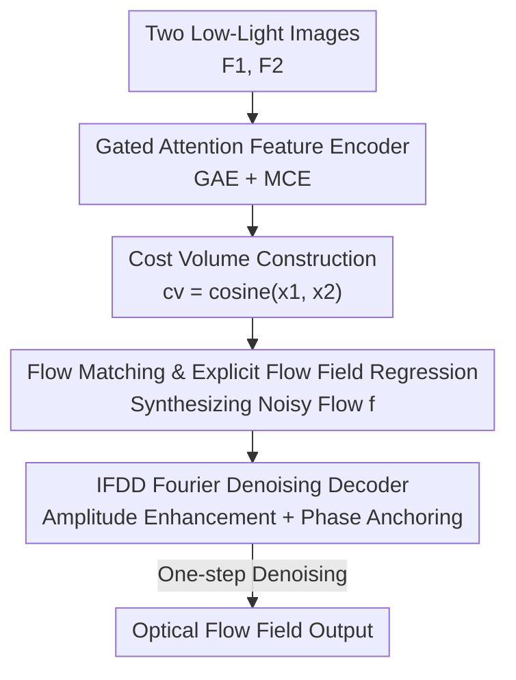

# FlowFM: Advancing Dark Optical Flow Estimation with Flow Matching

**Conference**: CVPR 2026  
**Paper**: [CVF Open Access](https://openaccess.thecvf.com/content/CVPR2026/html/Zuo_FlowFM_Advancing_Dark_Optical_Flow_Estimation_with_Flow_Matching_CVPR_2026_paper.html)  
**Code**: To be confirmed  
**Area**: Video Understanding / Optical Flow Estimation  
**Keywords**: Dark Optical Flow Estimation, Flow Matching, Fourier Denoising, One-step Denoising, Noise Robustness

## TL;DR
FlowFM introduces "flow matching" to dark optical flow estimation (DOFE) for the first time. By framing "noise $\rightarrow$ optical flow" as a transport path that can be traversed in a single step using explicit flow field regression, and equipping it with an Implicit Fourier Denoising Decoder (IFDD) that enhances amplitude and anchors phase in the frequency domain, FlowFM significantly lowers the EPE on two dark-light benchmarks (FCDN and VBOF, with a 35% reduction on VBOF compared to the runner-up). Furthermore, it requires only one inference step, achieving the fastest speed.

## Background & Motivation

**Background**: Dark optical flow estimation (DOFE) aims to establish pixel-wise correspondences between two consecutive low-light images and output a motion vector field of size $2\times H\times W$. The mainstream approach relies on discriminative models, which equip standard optical flow networks (such as the RAFT series) with dark-light-specific feature enhancement (e.g., contour enhancement, feature similarity metric reinforcement) to combat noise by "amplifying useful features".

**Limitations of Prior Work**: Discriminative enhancement is "one-sided"—simply amplifying certain features disrupts the underlying representation distribution. Moreover, these models lack explicit modeling of noise itself, failing to capture the generative "noise $\rightarrow$ data" path. Consequently, they struggle with weak motion patterns buried under low-light noise. Another avenue introduces diffusion models (DM) to optical flow (such as FlowDiffuser). While DMs excel at learning joint probabilities under conditional Gaussian distributions and are robust to noise, **their recursive denoising paradigm disrupts flow field continuity, resulting in "fractures" (cracks)**. Moreover, low-light scenes often exhibit motion inconsistencies due to luminance flickering, which further amplifies errors when combined with the recursive paradigm, and diffusion models suffer from slow inference.

**Key Challenge**: Discriminative methods lack explicit noise modeling, while diffusion-based methods sacrifice continuity and efficiency due to recursive denoising. Achieving noise robustness, flow field continuity, and high computational efficiency simultaneously is a dilemma that neither of the current approaches resolves.

**Key Insight**: Flow Matching (FM) is an emerging generative paradigm that directly regresses a vector field inducing an ODE, continuously transporting a noise distribution to a target distribution. It is simpler and numerically more stable than diffusion models. However, FM remains largely unexplored in conditional generation, especially in heavy-noise scenarios like dark optical flow. The authors observe that optical flow is governed by physical constraints (objects, geometry, occlusion) and inherently possesses smooth, consistent structural priors. However, the original target vector field $u_t$ in FM is highly variable and does not carry such complete priors, making direct regression on DOFE extremely difficult to converge.

**Core Idea**: Replace "vector field regression" with "explicit flow field regression"—instead of learning the highly variable $u_t$, the network is trained to directly predict the ground-truth optical flow $f_{gt}$ from the noisy flow. The authors prove that this direct supervision satisfies the marginal conditions of FM in expectation, allowing the entire "noise $\rightarrow$ data" path to be compressed into a **one-step denoising** process. Additionally, a Fourier decoder is used to restore the motion amplitude corrupted by dark conditions in the frequency domain.

## Method

### Overall Architecture
FlowFM retains the RAFT-style backbone but reconstructs the decoding paradigm. The input consists of two low-light images $F_1, F_2$. First, a dual-branch encoder extracts basic features $(x_1, x_2)$ and context features $C$. A 4D correlation volume $cv$ is then constructed via the dot product of $x_1$ and $x_2$. Inside the Flow Matching module, during training, Gaussian noise $\varepsilon$ is linearly blended with the ground truth $f_{gt}$ and superimposed onto the initial flow $f_0$ to synthesize the noisy flow $f$. During inference, noise is directly injected into $f_0$ to obtain $f$. Finally, the Implicit Fourier Denoising Decoder (IFDD) denoises the noisy flow into the optical flow field in a **single step**, conditioned on $x_t, cv, C$, instead of recursively updating residual flows as in traditional methods. The three contributing components of the pipeline—feature encoding, explicit regression via flow matching, and IFDD—are chained together from top to bottom as shown in the diagram below.

### Key Designs

**1. Flow Matching and Explicit Flow Field Regression: Compressing "Noise $\rightarrow$ Optical Flow" into a One-Step Learnable Transport Path**

To address the lack of noise modeling in discriminative models and the slow, fractured nature of recursive denoising in diffusion models, FlowFM reformulates DOFE as a Flow Matching generative process. At any time $t\in[0,1]$, Flow Matching defines a probability path using a linear combination of the ground-truth optical flow $f_{gt}$ and Gaussian noise $\varepsilon\sim\mathcal{N}(0,I)$:

$$x_t = (1-t)\cdot\varepsilon + t\cdot f_{gt},\qquad u_t = f_{gt}-\varepsilon$$

The conventional approach forces the network $v_\Theta(x_t, cv, C, t)$ to regress the target vector field $u_t$ (using loss $L_v$). However, the authors point out that directly learning $u_t$ is problematic in DOFE: superimposing noise $\varepsilon$ onto already degraded features and unreliable motion similarities introduces domain shifts, causing the learned transport path to deviate from the ideal trajectory. Moreover, $u_t$ itself does not carry the smoothness or sharp-edge structural priors that optical flow should have, making convergence particularly difficult in early training (as shown in paper Fig.2, where $L_v$ converges slowly and leads to higher EPE). FlowFM's solution is **direct supervision**: the network is trained to directly predict the ground-truth optical flow from the noisy flow, replacing the loss with:

$$L_1 := \mathbb{E}_{x_t, f_{gt}, t}\big[\,\lVert v_\Theta(x_t, cv, C, t) - f_{gt}\rVert_1\,\big]$$

The authors also provide a theoretical justification: the network defines an ODE $\frac{dx}{dt}=v_\Theta$, and integrating it from $t{=}0$ to $1$ yields $\varepsilon + \int_0^1 v_\Theta\,dt = f_{gt}$. Taking the expectation of both sides, since $\mathbb{E}[\varepsilon]=0$ and $\mathbb{E}[u_t]=\mathbb{E}[f_{gt}]$, we obtain $\int_0^1 \mathbb{E}[v_\Theta]\,dt = \mathbb{E}[u_t]$. In other words, minimizing $L_1$ satisfies the marginal conditions of Flow Matching for $v_\Theta$ in expectation. Consequently, $t$ is only used to sample the noisy flow and **does not enter the decoding phase**. The model can directly reconstruct data from arbitrary noise, compressing the entire noise-to-data path into a single step. This preserves the theoretical consistency of FM while achieving strong regularization effects (⚠️ please refer to Sec.3.2 of the original paper for precise derivation details). This forms the core of "one-step denoising".

**2. IFDD Implicit Fourier Denoising Decoder: Enhancing Amplitude in the Frequency Domain and Anchoring Motion Position with Phase**

One-step denoising alone is not enough; low-light conditions bury weak motion signals under heavy noise, requiring a dedicated decoder to retrieve them. The authors' key observation is that when applying the Fourier transform to optical flow fields, **the amplitude captures the presence and intensity of motion, while the phase encodes the spatial location of motion**. Meanwhile, low-light conditions (essentially random intensity interference) disturb the amplitude far more than the phase—as shown in Fig.4, under low-light conditions, the amplitude spectrum changes dramatically and its histogram shifts, whereas the phase spectrum remains nearly unchanged, producing a smooth difference map. Therefore, the strategy of FreEnc is to **enhance amplitude while retaining the original phase**: the input is transformed to the frequency domain using FFT to extract amplitude and phase. The amplitude is passed through a $1\times1$ convolution + LeakyReLU for enhancement. The enhanced amplitude and the original phase are then reconstructed into real and imaginary parts of the spectrum via polar coordinate transformation, and converted back to the spatial domain using IFFT. The phase acts as an anchor to ensure spatial consistency of the same object across adjacent frames, while the amplitude enhancement restores the motion intensity disrupted by noise in degraded or textureless regions.

IFDD embeds this Fourier Motion Refactor (FMR) into a GRU cell to infer hidden states. FMR consists of a Spatial Attention Module (SAM) and a Frequency-domain Enhancer (FreEnc) connected in series: $x_{sam}=\mathrm{SAM}(\mathrm{LN}([f_{head}, C]))$, $x_{fre}=\mathrm{FreEnc}(\mathrm{LN}(x_{sam}))$. SAM utilizes an inverted residual block + simplified spatial attention, replacing activation functions with gating to extract meaningful spatial information for frequency enhancement. The entire GRU update is formulated as $z, r=\sigma(\mathrm{FMR}(\cdot))$, $q=\tanh(\mathrm{FMR}(\cdot))$, $h_i=(1-z)\ast h_{i-1}+z\ast q$, and finally, the optical flow is obtained via upsampling: $v_f=\mathrm{conv}(C[h_i, f_0])\uparrow$. In the first calculation, the context feature is set to $C=h_0$, and the number of iterations is set to $i{=}2$ (experiments demonstrate that $i{=}2$ is optimal; larger values lead to overfitting, while smaller values offer insufficient noise resistance). This is the first decoder to apply frequency-domain concepts to dark optical flow, outperforming purely spatial-domain methods.

**3. Gated Attention Feature Encoder: Extracting Clean Underlying Representations under Dark Degradation**

Under low signal-to-noise ratio conditions, conventional encoders hook onto "attention sinks" and suffer from local degradation. FlowFM designs a Gated Attention Encoder (GAE) and an MLP Context Encoder (MCE) on top of the RAFT backbone: $x_1, x_2=\mathrm{GAE}(F_1, F_2)$, $C=\mathrm{MCE}(F_1)$. Centered around gated blocks, GAE first captures key information in queries $Q$ and keys $K$, then introduces multiple top-k operators and mask matrices to filter out irrelevant, noise-sensitive similarities between $Q$ and $K^\top$. This can dynamically focus on meaningful feature interactions and avoid attention sinks caused by dark degradation. MCE consists of a LayerNorm, two MLPs, a depthwise convolution, and an optional stochastic depth layer. It performs cross-dimensional context extraction and dynamic enhancement through the interaction of channel-wise MLP transforms and spatial-wise depthwise convolutions. The features extracted by both encoders construct the cost volume via cosine similarity $cv=\mathrm{cosine}(x_1, x_2)$, which is then fed to the subsequent flow matching and IFDD modules. Ablation studies show that removing GAE/MCE leads to a significant regression in EPE, indicating the necessity of this encoding scheme for robust representations under dark conditions.

### Loss & Training
Ultimately, only a directly constrained L1 loss is used: $L_1=\gamma\cdot\lVert v_f-f_{gt}\rVert_1$ with weight $\gamma=0.8$, allowing the model to explore a flexible and effective transport path from "noise to ground truth". Training uses AdamW with gradient clipping $[-1,1]$, a one-cycle learning rate scheduler, and random initialization on inputs of size $368\times496$. The model is trained on the full FCDN (350k iterations) and the full Mix (400k iterations) datasets with a batch size of 4 and a learning rate of $2.5\mathrm{e}{-4}$.

## Key Experimental Results

### Main Results (Trained on FCDN, EPE↓)

| Method | Source | FCDN | VBOF (Gen.) |
|------|------|------|------|
| RAFT | ECCV-20 | 1.23 | 21.84 |
| FlowDiffuser | CVPR-24 | 1.09 | 20.77 |
| CEDFlow | AAAI-24 | 1.08 | 20.89 |
| CEDFlow++ | IJCV-25 | 1.01 | 20.56 |
| **FlowFM (Ours)** | - | **0.87** | **13.28** |

FlowFM achieves an EPE of 0.87 on FCDN, which is 19.4% lower than CEDFlow (1.08 $\rightarrow$ 0.87) and 13.9% lower than CEDFlow++ (1.01 $\rightarrow$ 0.87). On the unseen VBOF dataset, it achieves an EPE of 13.28, which is a massive 35.4% reduction (20.56 $\rightarrow$ 13.28) compared to the runner-up CEDFlow++, highlighting a particularly remarkable advantage in generalization. When trained on the more complex Mix dataset, FlowFM still scores 1.06 on FCDN (runner-up CEDFlow++: 1.14) and 5.24 on VBOF (runner-up: 6.25), achieving state-of-the-art results across all subsets.

### Ablation Study (Trained on FCDN, EPE↓)

| Configuration | Params (M) | FCDN | VBOF | Description |
|------|---------|------|------|------|
| Baseline | 5.26 | 1.23 | 21.84 | Baseline backbone |
| w/o GAE & MCE | 7.84 | 1.02 | 15.37 | w/o gated/context encoding |
| w/o IFDD | 9.46 | 1.09 | 16.32 | w/o Fourier decoder |
| w/o FMR | 10.83 | 1.02 | 15.09 | w/o Fourier reconstruction core |
| w/o FM | 12.22 | 1.23 | 20.47 | w/o Flow Matching |
| w/o Eq.11 (using $L_v$) | 12.22 | 1.07 | 16.77 | Implicit constraint instead of explicit |
| $i=1$ | 10.98 | 0.93 | 13.70 | Insufficient IFDD iterations |
| **FlowFM ($i=2$)** | 12.22 | **0.87** | **13.28** | Full model |
| $i=3$ | 13.38 | 0.89 | 13.25 | Too many iterations lead to overfitting |

### Computational Overhead ($736\times480$ input)

| Method | Params (M) | Time (ms) | VRAM (GB) | FLOPs (G) |
|------|---------|----------|----------|----------|
| FlowDiffuser | 16.32 | 133 | 5.1 | 87.1 |
| CEDFlow++ | 6.78 | 57 | 1.9 | 26.3 |
| **FlowFM** | 12.22 | **28** | **1.3** | **19.6** |

### Key Findings
- **Flow Matching + Explicit Constraint is the Linchpin**: Removing Flow Matching (w/o FM) drops the EPE directly back to baseline levels (1.23 / 20.47). Setting the explicit constraint to implicit $L_v$ (w/o Eq.11) also degrades performance significantly (1.07 / 16.77), proving that "explicit flow field regression" is the true source of noise robustness and transport path flexibility.
- **Fourier Enhancement is Crucial for Dark Conditions**: Removing FMR causes FCDN EPE to rise from 0.87 to 1.02, and VBOF to rise from 13.28 to 15.09, validating that frequency-domain amplitude enhancement effectively mitigates motion intensity degradation. Ablation studies also show that FreEnc is more critical than SAM; replacing the $1\times1$ convolution with attention/MLP introduces redundant computation and yields inferior performance.
- **One-Step Denoising Yields Efficiency Dividend**: FlowFM requires only 1 inference step (whereas other methods typically require 12 iterations). Although FlowFM has ~4M more parameters than CEDFlow++, it outperforms all in execution time (28ms), VRAM footprint (1.3GB), and FLOPs (19.6G), showing that "less is more".
- **Optimal IFDD Iterations Sweet Spot is $i=2$**: $i=1$ provides insufficient noise resistance, while $i=3$ leads to overfitting. $i=2$ strikes the best balance between accuracy and robustness.

## Highlights & Insights
- **Converting "Discriminative vs Generative" Dilemma into a Linear Transport Path**: Replacing the recursive denoising of diffusion models with Flow Matching preserves the noise-robustness of generative paradigms. Meanwhile, the explicit regression + marginal proof compresses inference into a single step, simultaneously retaining continuity and efficiency. This is the most remarkable design.
- **Solid Physical Intuition behind Frequency Domain Division**: The observation that "low-light mainly corrupts amplitude and leaves phase almost untouched" is well-supported by visualization (extreme changes in the amplitude spectrum vs. a stable phase spectrum). Consequently, "enhancing amplitude and anchoring phase" serves as a precise surgical operation for low light, rather than a generic feature enhancement.
- **Transferable Concepts**: First, the trick of "explicitly predicting the target instead of the vector field + satisfying marginal conditions in expectation" can be extended to other regression tasks requiring fast, one-step generation (e.g., depth estimation, stereo matching). Second, the "frequency-domain amplitude enhancement + phase anchoring" technique can be directly applied to other low-level vision tasks under low-light conditions, such as denoising and deblurring.

## Limitations & Future Work
- The authors envision extending FlowFM to other vision tasks and further optimizing its efficiency and accuracy, implying that the current focus is constrained to the single task of DOFE.
- Evaluation primarily relies on synthetic low-light datasets (FCDN/Mix) for quantitative results. Real-world scenarios (FLIR ADAS, SDSD, GOF) lack ground truth and can only be evaluated qualitatively. Quantitative generalization under real-world dark conditions remains to be fully validated.
- Although one-step denoising is fast, compressing the entire noise-to-data path into a single step places high demands on the decoder capacity. The observation that slightly increasing IFDD iterations $i$ leads to overfitting suggests the model is sensitive to training configurations, and whether $i=2$ remains optimal across different dataset scales may require retuning (⚠️ subject to the original text).
- The specific architectures of GAE/MCE are deferred to the supplementary materials; the main paper only provides qualitative explanations for "why gating avoids attention sinks."

## Related Work & Insights
- **vs FlowDiffuser (CVPR-24, Diffusion-based Optical Flow)**: Both treat optical flow as conditional generation, but FlowDiffuser utilizes recursive denoising, leading to flow field fractures and slow inference (133ms / 12 steps). FlowFM adopts Flow Matching + explicit regression to produce results in a single step (28ms / 1 step), achieving comprehensively better EPE.
- **vs CEDFlow / CEDFlow++ (AAAI-24 / IJCV-25, Discriminative Low-Light Enhancement)**: These methods rely on modified image encoders to amplify specific features like contours for enhanced discriminability. However, they neglect heavy noise suppression and lack explicit noise modeling. FlowFM explicitly models the noise-data path via a generative paradigm, achieving a 35% EPE reduction on VBOF compared to CEDFlow++.
- **vs RAFT (ECCV-20, Optical Flow Baseline)**: FlowFM inherits its dual-branch backbone and cost volume, but replaces the recursive residual flow updates with a one-step Flow Matching denoising decoder, representing a paradigm-level overhaul rather than an incremental change.

## Rating
- Novelty: ⭐⭐⭐⭐⭐ First to introduce flow matching to low-light optical flow. Both explicit flow field regression and the frequency-domain denoising decoder are original designs supported by theoretical and physical insights.
- Experimental Thoroughness: ⭐⭐⭐⭐ Dual training sets + multiple camera subsets + real-world scenes + detailed ablation + compute overhead analysis are thoroughly presented, though quantitative ground truth for real-world low light is lacking.
- Writing Quality: ⭐⭐⭐⭐ Motives and derivations are clear, backed by theoretical proofs and visualizations. Some architectural details of GAE/MCE are deferred to the supplementary materials.
- Value: ⭐⭐⭐⭐⭐ Simultaneously refreshes SOTA performance and efficiency in DOFE, and the "one-step generation + frequency-domain enhancement" concept is transferable to broader low-light low-level vision tasks.

<!-- RELATED:START -->

## Related Papers

- [\[CVPR 2026\] From Contrast to Consistency: Rethinking Event-based Continuous-Time Optical Flow Estimation](from_contrast_to_consistency_rethinking_event-based_continuous-time_optical_flow.md)
- [\[CVPR 2026\] Efficient All-Pairs Correlation Volume Sampling for Optical Flow Estimation](efficient_all-pairs_correlation_volume_sampling_for_optical_flow_estimation.md)
- [\[CVPR 2026\] U2Flow: Uncertainty-Aware Unsupervised Optical Flow Estimation](u2flow_uncertainty_aware_unsupervised_optical_flow_estimation.md)
- [\[CVPR 2026\] LAOF: Robust Latent Action Learning with Optical Flow Constraints](laof_robust_latent_action_learning_with_optical_flow_constraints.md)
- [\[CVPR 2025\] DPFlow: Adaptive Optical Flow Estimation with a Dual-Pyramid Framework](../../CVPR2025/video_understanding/dpflow_adaptive_optical_flow_estimation_with_a_dual-pyramid_framework.md)

<!-- RELATED:END -->
