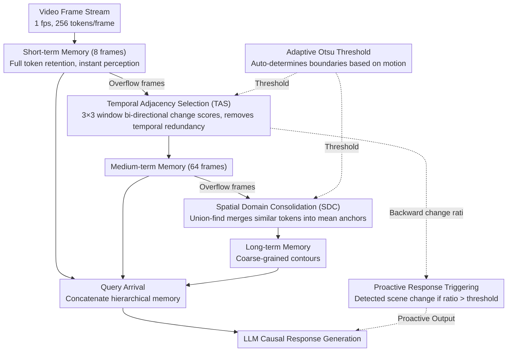

# FluxMem: Adaptive Hierarchical Memory for Streaming Video Understanding

**Conference**: CVPR 2026  
**arXiv**: [2603.02096](https://arxiv.org/abs/2603.02096)  
**Code**: [https://github.com/YiwengXie/FluxMem](https://github.com/YiwengXie/FluxMem)  
**Area**: Video Understanding  
**Keywords**: Streaming Video Understanding, Hierarchical Memory, Visual Token Compression, Adaptive Threshold, training-free

## TL;DR
FluxMem is a training-free streaming video understanding framework that utilizes a hierarchical memory design (Short/Medium/Long-term) and two adaptive token compression modules (TAS for temporal redundancy + SDC for spatial redundancy). It achieves new SOTA on StreamingBench and OVO-Bench while discarding 60-70% of visual tokens.

## Background & Motivation
Multimodal Large Models (MLLMs) excel in offline video understanding, but real-world applications (robotic manipulation, autonomous driving, smart glasses) require real-time processing of continuous video streams. The core challenge in streaming video understanding is effectively remembering long-term temporal context within limited compute/memory budgets and generating responses causally when queries arrive.

**Limitations of Prior Work**:

**KV cache management** (ReKV, LiveVLM): Deduplication occurs only during the LLM prefill stage, after significant computation has already been consumed by visual encoding.

**Query-guided filtering** (TimeChat-Online): Relies on text queries to select visual content. However, in streaming scenarios, queries may arrive after the video content, preventing pre-filtering.

**Fixed compression strategies**: Existing token compression methods apply uniform cropping/merged strategies to all frames, ignoring temporal dependency—recent frames require high-resolution detail for immediate inference, while distant frames can be compressed more aggressively.

**Core Idea**: Mimic the decay characteristics of human memory by designing hierarchical memory (Short/Medium/Long-term), where recent memories remain intact and distant memories are progressively compressed. Compression thresholds are determined adaptively using Otsu's method rather than manual tuning.

## Method

### Overall Architecture
FluxMem aims to enable streaming video models to retain long historical contexts under restricted memory/compute budgets. The approach categorizes visual memory into three tiers based on temporal proximity, following a decay rule where distant memories are compressed more heavily.

Frames flow through three memory tiers in a cascaded manner: incoming frames enter **Short-term Memory $\mathcal{M}^s$** (capacity $c_s=8$ frames), retaining all visual tokens for instantaneous perception. Overflowing frames from the short-term tier pass through TAS to remove temporal redundancy before downgrading to **Medium-term Memory $\mathcal{M}^m$** (capacity $c_m=64$ frames). Further overflows from the medium-term tier undergo SDC to merge spatial redundancy, settling into **Long-term Memory $\mathcal{M}^l$** as compact representations. The retention/discard boundaries in this process are automatically determined by an **Adaptive Otsu Threshold** based on visual motion. Statistics calculated by TAS are reused for **Proactive Response Triggering** to detect scene changes. When a query arrives, the three memory tiers are concatenated and fed into the LLM for causal response generation. The process is strictly unidirectional with no look-ahead, making it naturally suited for streaming.

### Key Designs

**1. Temporal Adjacency Selection (TAS): Removing temporal redundancy at the Short→Medium boundary**

Adjacent frames in streaming video are highly similar. TAS determines if a token provides new information relative to surrounding frames. For each spatial location $(h,w)$, it calculates forward/backward change scores by finding the minimum cosine distance in a $3\times 3$ window of the adjacent frame:

$$s_{t,h,w}^{-} = \min_{(i,j) \in \mathcal{N}_{3\times 3}(h,w)} d(v_{t,h,w}, v_{t-1,i,j}), \quad s_{t,h,w}^{+} = \min_{(i,j) \in \mathcal{N}_{3\times 3}(h,w)} d(v_{t,h,w}, v_{t+1,i,j})$$

Otsu's method is used to derive thresholds $\Theta_t^{-}$ and $\Theta_t^{+}$. A token is retained if it shows significant change relative to either the previous or next frame: $(s_{t,h,w}^{-} > \Theta_t^{-}) \lor (s_{t,h,w}^{+} > \Theta_t^{+})$. The $3\times 3$ window allows for slight motion/jitter, preventing false deletions due to minor shifts. The bi-directional approach preserves both newly appearing content and content about to disappear. The process maintains $\mathcal{O}(HW)$ complexity and preserves causality.

**2. Spatial Domain Consolidation (SDC): Merging spatial redundancy at the Medium→Long boundary**

While TAS addresses temporal redundancy, large similar regions (sky, walls) still occupy multiple tokens within a frame. SDC performs spatial merging on tokens retained by TAS. Within a $3\times 3$ neighborhood, tokens with a distance $\le \Theta_t$ (also via Otsu) are connected in a sparse graph. Union-find is used to extract connected components $\{C_{t,k}\}_k$, which are collapsed into mean anchors:

$$a_{t,k} = \frac{1}{|C_{t,k}|} \sum_{(i,j) \in C_{t,k}} v_{t,i,j}$$

Since the token set is already sparse after TAS, the union-find operation is near-linear. This compact representation preserves essential semantics while significantly reducing the token count for long-term storage.

**3. Adaptive Otsu Threshold: Automating TAS and SDC compression based on motion**

Both modules rely on thresholds to distinguish "keep" from "discard." Fixed thresholds are suboptimal: static scenes waste budget, while dynamic scenes suffer information loss. FluxMem treats token retention as a binary segmentation problem, applying Otsu's method to maximize inter-class variance:

$$\Theta_t = \arg\max_{\theta} \left[\omega_1(\theta)\,\omega_2(\theta)\,(\mu_1(\theta) - \mu_2(\theta))^2\right]$$

This requires zero additional learnable parameters. When motion is high, the threshold increases to retain more tokens; when static, the threshold decreases for aggressive compression. Results show this adaptive approach achieves equivalent accuracy to fixed thresholds with a 45% improvement in compression efficiency.

**4. Proactive Response Triggering: Reusing TAS statistics to detect scene changes**

Streaming assistants should respond proactively to scene changes. FluxMem reuses the backward change ratio calculated during TAS:

$$r_t^{-} = \frac{1}{HW}\sum_{h,w} \mathbf{1}[s_{t,h,w}^{-} > \Theta_t^{-}]$$

When $r_t^{-} > \gamma$, a scene change is detected, triggering an output. This provides scene change detection with near-zero extra computational cost.

### Case Example: Frame Compression Process
Assuming an online setup with 256 tokens/frame and a short-term capacity of 8 frames:

- **Entering Short-term**: As the 9th frame arrives, the oldest frame overflows. While in short-term memory, all 256 tokens are retained to ensure no loss of detail for immediate perception.
- **Passing TAS to Medium-term**: The overflow frame is compared with neighbors. Static background tokens are discarded. Only tokens reflecting movement (e.g., a hand moving) are kept (~43.2% discard rate for Medium-only), reducing the count to roughly 145 tokens.
- **Passing SDC to Long-term**: When the medium-term memory reaches 64 frames, the frame sinks further. SDC merges remaining spatially similar tokens (e.g., sky patches) into anchors. The count drops significantly (~85.1% cumulative discard rate), leaving only coarse-grained contours.
- **Query Time**: If a user asks a question, the detail of current frames, the motion of medium-term frames, and the scene structure of long-term frames are combined for the LLM.

## Loss & Training
- **Training-free**: FluxMem is a plug-and-play inference-time module.
- Based on Qwen2.5-VL-7B.
- Online setup: 1 fps, 256 tokens/frame, max 256 frames.
- Offline setup: 1 fps, 64 tokens/frame, max 1024 frames.

## Key Experimental Results

### Main Results

| Method | Type | StreamingBench (real-time) | OVO-Bench (real-time) | OVO-Bench (overall) | VideoMME | MLVU |
|------|------|--------------------------|----------------------|---------------------|----------|------|
| Qwen2.5-VL (baseline) | Offline | 73.9 | 63.3 | 49.8 | 63.3 | 67.9 |
| TimeChat-Online | Training-based | 75.3 | 61.4 | 47.6 | 63.3 | 65.4 |
| StreamForest | Training-based | 77.3 | 61.2 | 55.6 | 61.9 | 69.6 |
| ViSpeak | Training-based | 74.4 | 66.3 | — | — | — |
| **FluxMem** | **Training-free** | **76.4** | **67.2** | **53.3** | **65.3** | **73.1** |

FluxMem outperforms all training-based methods on online tasks (76.4 on StreamingBench, 67.2 on OVO-Bench) and surpasses the baseline by +5.2 on the offline MLVU benchmark.

### Ablation Study

| Memory Config | Token Discard Rate | MLVU | VideoMME | StreamingBench | Avg. |
|---------|-------------|------|---------|---------------|------|
| S only | 0% | 67.8 | 63.3 | 73.9 | 68.3 |
| M only | 43.2% | 69.9 | 65.5 | 74.7 | 70.0 |
| L only | 85.1% | 70.9 | 62.0 | 75.9 | 69.6 |
| S+M+L (Full) | **64.3%** | **73.1** | **65.3** | **76.4** | **71.6** |

| Metric | Dataset | Baseline | FluxMem | Gain |
|---------|--------|----------|---------|------|
| Latency (ms) | OVO-Bench | 2701 | 812 | ↓69.9% |
| Peak Memory (GB) | OVO-Bench | 35.8 | 23.5 | ↓34.5% |
| Latency (ms) | MLVU | 3614 | 2014 | ↓44.3% |
| Accuracy | OVO-Bench | 49.8 | 53.3 | +3.5 |

### Key Findings
- **Hierarchical Complementarity**: The M+L combination (73.1 on MLVU) significantly outperforms using M (69.9) or L (70.9) alone. TAS and SDC capture temporal changes and spatial structures respectively.
- **Short-term Criticality**: S+L reaches 77.0 on StreamingBench, higher than S alone (73.9) or L alone (75.9), proving recent detail is essential.
- **Adaptive > Fixed**: Adaptive thresholds achieve the same accuracy as fixed ones with 45% better compression efficiency.
- FluxMem consistently outperforms all baselines (FIFO, Uniform, Random, DTD) within the 50-70% token discard range.

## Highlights & Insights
- The **training-free** design is the primary highlight—it is plug-and-play for any MLLM, eliminating SFT data and training costs.
- Using Otsu's method for token compression is a clever analogy: it transforms "what to keep" into a classic binary segmentation problem.
- The hierarchical design elegantly maps to the temporal decay of video information.
- TAS and SDC add only 4.1ms of overhead per frame.

## Limitations & Future Work
- Capacity settings (8/64 frames) are manual and may vary across tasks.
- Otsu assumes a bimodal distribution, which may be suboptimal for monotonic or multimodal score distributions.
- Testing is limited to Qwen2.5-VL; compatibility with other MLLMs (e.g., LLaVA, InternVL) remains unverified.
- Performance at high frame rates (e.g., 30 fps) is unknown.
- Using mean anchors in spatial merging may lose fine textures, potentially affecting tasks like OCR.

## Related Work & Insights
- **vs LiveVLM / ReKV**: These deduplicate during LLM prefill, wasting visual encoding compute. FluxMem compresses before the LLM, reducing latency at the source.
- **vs TimeChat-Online**: Dependent on text queries for filtering. FluxMem's TAS/SDC are based on visual information density and do not require pre-existing queries.
- **vs StreamForest**: While StreamForest is slightly higher on StreamingBench (77.3 vs 76.4), it requires training. FluxMem is training-free and performs better on OVO-Bench and MLVU.
- **vs FastV / DTD**: These apply uniform strategies. FluxMem's hierarchical approach aligns better with temporal information decay.
- **vs StreamMem**: StreamMem requires a learnable memory controller, whereas FluxMem uses the elegant, generalized Otsu threshold.

## Rating
- Novelty: ⭐⭐⭐⭐
- Experimental Thoroughness: ⭐⭐⭐⭐⭐
- Writing Quality: ⭐⭐⭐⭐⭐
- Value: ⭐⭐⭐⭐⭐

## Related Papers

- [\[CVPR 2026\] OASIS: On-Demand Hierarchical Event Memory for Streaming Video Reasoning](oasis_on-demand_hierarchical_event_memory_for_streaming_video_reasoning.md)
- [\[ACL 2026\] HERMES: KV Cache as Hierarchical Memory for Efficient Streaming Video Understanding](../../ACL2026/video_understanding/hermes_kv_cache_as_hierarchical_memory_for_efficient_streaming_video_understandi.md)
- [\[CVPR 2026\] VideoARM: Agentic Reasoning over Hierarchical Memory for Long-Form Video Understanding](videoarm_agentic_reasoning_over_hierarchical_memory_for_long-form_video_understa.md)
- [\[CVPR 2026\] StreamingTOM: Streaming Token Compression for Efficient Video Understanding](streamingtom_streaming_token_compression_for_efficient_video_understanding.md)
- [\[CVPR 2026\] Streaming Video Crime Anticipation with Spatio-Temporal Causal Reasoning](streaming_video_crime_anticipation_with_spatio-temporal_causal_reasoning.md)

<!-- RELATED:END -->

<!-- RELATED:START -->

## Related Papers

- [\[CVPR 2026\] StreamingTOM: Streaming Token Compression for Efficient Video Understanding](streamingtom_streaming_token_compression_for_efficient_video_understanding.md)
- [\[NeurIPS 2025\] InfiniPot-V: Memory-Constrained KV Cache Compression for Streaming Video Understanding](../../NeurIPS2025/video_understanding/infinipot-v_memory-constrained_kv_cache_compression_for_streaming_video_understa.md)
- [\[CVPR 2026\] EarlyTom: Early Token Compression Completes Fast Video Understanding](earlytom_early_token_compression_completes_fast_video_understanding.md)
- [\[ICLR 2026\] QueryStream: Advancing Streaming Video Understanding with Query-Aware Pruning and Proactive Response](../../ICLR2026/video_understanding/querystream_advancing_streaming_video_understanding_with_query-aware_pruning_and.md)
- [\[ICCV 2025\] VideoLLaMB: Long Streaming Video Understanding with Recurrent Memory Bridges](../../ICCV2025/video_understanding/videollamb_long_streaming_video_understanding_with_recurrent_memory_bridges.md)

<!-- RELATED:END -->
