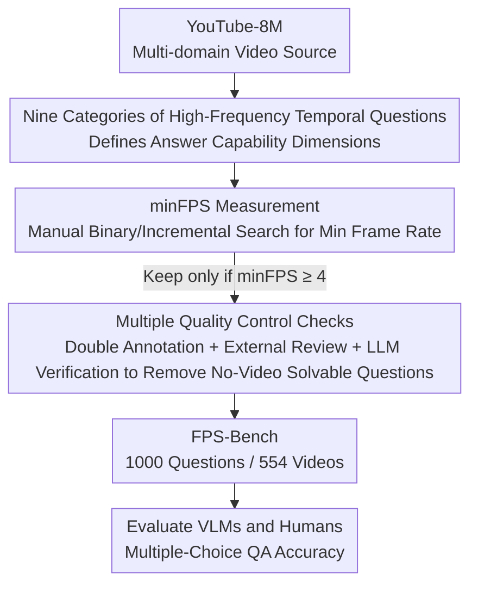

# FPS-Bench: A Benchmark for High Frame-Rate Video Understanding

**Conference**: CVPR 2026  
**Paper**: [CVF Open Access](https://openaccess.thecvf.com/content/CVPR2026/html/Choudhury_FPS-Bench_A_Benchmark_for_High_Frame-Rate_Video_Understanding_CVPR_2026_paper.html)  
**Code**: None (The paper states that data and code will be released; refer to the official repository for the exact URL)  
**Area**: Video Understanding  
**Keywords**: High frame-rate video understanding, video question answering benchmark, minFPS, temporal reasoning, VLM evaluation  

## TL;DR
Addressing the blind spot where almost all current large video models violently downsample videos to <1 FPS, the authors construct FPS-Bench—a video question answering benchmark (1,000 questions / 554 video clips) composed entirely of questions that "require high-frame-rate viewing to answer correctly." They also propose the minFPS metric to quantify the minimum frame rate requirement for each question. The results show that SOTA VLMs achieve an accuracy of only about 30% (with a random baseline of 25%), whereas humans achieve over 70%, exposing fundamental deficiencies of models in perceiving fast temporal events.

## Background & Motivation
**Background**: Driven by GPU memory and token cost considerations, modern Video-Language Models (VLMs) commonly downsample input videos from the native 30 FPS to 1 FPS or even lower (Gemini downsamples to 1 FPS, while GPT-4o simply samples a fixed 8–16 frames). This is supported by a widely accepted assumption—video temporal redundancy is high, and "viewing more frames does not bring more information."

**Limitations of Prior Work**: This assumption has led almost all mainstream evaluation benchmarks to become "self-fulfilling." Early benchmarks like Kinetics, ActivityNet, and MSR-VTT can be solved by randomly sampling a few frames. Even newer benchmarks like MVBench and Video-MME have many questions where answers can be found in a single frame, or are solvable with just 0.1 FPS. MotionBench (which claims to focus on fine-grained motion) and EgoSchema (for long videos) can also be solved with very low frame rates. Consequently, "low frame rate is sufficient" has become a circular argument: models are only trained and evaluated on low frame rates, and no study has systematically examined **what capabilities are lost during downsampling**.

**Key Challenge**: Vision tasks that genuinely require high frame rates (such as object tracking, video segmentation, and robotics perception) are usually relegated to specialized models, falling outside the evaluation scope of general VLMs. Meanwhile, questions that "general VLMs are destined to answer incorrectly under low frame rates"—for instance, "did the camera flash in the video?", which cannot be seen at 2 FPS or 4 FPS, but only captured at 14 FPS—are neither covered by benchmarks nor addressed, representing a systematic blind spot in the current evaluation paradigm.

**Goal**: To construct a general VLM benchmark **composed entirely of high-frame-rate questions**, and provide a quantitative standard to objectively depict "how high of a frame rate a given question actually requires," thereby putting the "capabilities lost to downsampling" under quantitative scrutiny.

**Key Insight**: Instead of using "how long the video is" (like EgoSchema's temporal certificate) to measure difficulty, it is better to directly ask "how high of a sampling frame rate is required." A 10-minute video sampled at 1 FPS versus 30 FPS has the same certificate duration, but the former completely flattens instantaneous high-frequency events.

**Core Idea**: Define **minFPS (minimum necessary frame rate)** as the temporal difficulty metric for each question, strictly filter all questions to have minFPS ≥ 4, and build a QA benchmark that "cannot be solved without a high frame rate" to expose the true bottlenecks of VLMs.

## Method

### Overall Architecture
This is a **benchmark/dataset paper**, where the "method" consists of two main lines: data construction and evaluation protocols. The first line revolves around the new metric minFPS: first defining it, then using a manual binary/incremental procedure to measure the minFPS for each question, using minFPS ≥ 4 as a hard threshold for filtering questions. The second line involves the design of nine categories of high-frequency temporal question types, fully manual annotation, and multiple quality checks to ensure that the questions are "easy for humans, hard for machines, and strictly require watching the video." The process yields a benchmark of 1,000 questions across 554 videos, upon which open-source/closed-source/image-based VLMs and humans are systematically evaluated.

The following diagram encapsulates the pipeline from data collection to evaluation:

### Key Designs

**1. minFPS: Quantifying the Temporal Difficulty of a Question using the "Minimum Necessary Frame Rate"**

The pain point of past metrics measuring video difficulty (such as EgoSchema's temporal certificate, i.e., how long a video a human needs to watch to verify the answer) is that they only capture "temporal span" but are oblivious to "sampling density." For the same certificate duration, the number of frames sampled at 30 FPS is dozens of times that of 1 FPS, where the latter causes rapid events to disappear. The authors define minFPS as the **minimum integer frame rate** at which human annotators can consistently obtain the correct answer for a video-question pair. Crucially, any sampling rate below this threshold must make the correct answer unverifiable. This precisely anchors the "must-see frame" at a specific frame rate threshold. The two metrics complement each other: total input frames $\approx$ minFPS $\times$ temporal certificate, where minFPS controls the "density" and certificate controls the "duration".

**2. Manual Measurement Flow of minFPS and the Hard Threshold of ≥4: Ensuring Each Question is "Unsolvable Without High Frame Rate"**

Having a definition is not enough; it must be consistently measurable. Annotators start by viewing the video, question, and answer at 1 FPS. If the answer cannot be determined at 1 FPS, the frame rate is incrementally increased by +1 FPS until the answer becomes clear and unambiguous. If the answer is already clear at 1 FPS, the frame rate is **halved** iteratively by factors of 2 until the question becomes unsolvable, thereby approaching the threshold. Downsampling during measurement simulates the frame-dropping behavior of modern VLMs. All questions admitted to the database are forced to have minFPS ≥ 4 (a threshold derived from real-world testing of other benchmarks, which mostly do not exceed 1–2). The final average minFPS of the database reaches 6.67, with a median of 6.0, which is far higher than Video-MME's 0.5. This workflow transforms "high frame rate necessity" from a subjective judgment into a reproducible operational definition.

**3. Nine Categories of High-Frequency Temporal Questions: Covering Capability Dimensions of "Fast, Fine, and Momentary" Without Becoming Narrow Tasks**

To ensure that the benchmark requires high frame rates while maintaining generality (unlike toy tasks such as DIVE which merely test subtitle recall), the authors define nine question categories, with approximately 110 questions each: Repetitive Motion Count (counting the frequency of fast periodic actions), Speed Recognition, Fine-Grained Motion (distinguishing subtle differences in motion forms), Action Order (determining which of almost simultaneous events occurred first), State at Event (the state of an object at the instant of interaction), Blink and Miss (extremely short events appearing in only one or two frames, such as a camera flash), Causality Detection, Synchronization Assessment, and Instance Count (counting the occurrences of rapid discrete events). These questions are simple for humans but challenging for models, and inherently require a high input FPS, thereby isolating the capability of "fast motion perception" from general QA.

**4. Pure Manual Annotation + Multiple Quality Checks: Ensuring "Solvable by Humans, Hard for Machines, and Requires Watching Videos"**

Since the target task exceeds VLM capabilities, the authors abandoned the "LLM auto-generated QA from subtitles" commonly used in MVBench/EgoSchema. Instead, they recruited annotators with VLM experience to **manually** find videos from YouTube-8M, formulate questions, and write four plausible options plus a "None of the above" option. Quality check follows a strict layer-by-layer protocol based on Video-MME/MVBench: each question is reviewed by at least two other annotators; minFPS is measured by both the original annotator and another annotator, taking the minimum of the two (conservative); separate annotators verify question clarity, option plausibility, and answer correctness; three external reviewers answer questions without seeing the ground truth, and questions answered incorrectly by all are flagged for re-evaluation; finally, spelling and grammar are checked with LLMs, and following the Video-MME protocol, Gemini-1.5 Pro is asked to answer the questions 4 times with randomly shuffled options **without the video** (after removing "None of the above"). If it answers correctly more than 3 out of 4 times, the question is flagged for review to eliminate questions that can be solved using prior knowledge without the video.

### A Complete Example
Let us walk through the camera flash question from Figure 1: "Did any camera flash in the video?" The annotator starts watching from 1 FPS—no flash is observed, and the correct answer "yes" cannot be verified. Progressively increasing by +1 FPS to 2 FPS and 4 FPS, the flash, which lasts only a frame or two, is still missed. Only at **14 FPS** is the flash first consistently visible, confirming the answer. Thus, the minFPS for this question is 14. This means any model that samples the video below 14 FPS **can never** answer correctly due to information loss—it simply has never seen that frame. This is precisely the failure FPS-Bench aims to expose: the model's error is not one of reasoning, but that key evidence was discarded during downsampling.

## Key Experimental Results

### Main Results
Benchmark scale: 1,000 questions, 554 videos, five main visual domains (Media & Entertainment / Hobbies & Games / Sports & Fitness / Vehicles / Others); average video duration is about 10 seconds, with an average temporal certificate of only 2.1 seconds—meaning "short and information-dense". In terms of minFPS, FPS-Bench averages nearly 7 FPS, which is an order of magnitude higher than Video-MME (0.5) and more than 2.5× higher than AirLetters and MotionBench (approx. 2), yet it still maintains diverse and general question domains.

Main Evaluation (Multiple-Choice QA Accuracy, Random Baseline 25%):

| Model | Overall | Instance Count | Action Order | Note |
|------|---------|----------------|--------------|------|
| GPT-4o | 31.8% | 32.1% | 35.8% | Best Closed-Source |
| Oryx (omni) | 31.3% | 11.6% | 48.6% | Best Open-Source, beats Gemini |
| Qwen-3-VL-32B | 30.7% | 18.8% | 39.4% | — |
| Gemini 2.5 Pro | 28.9% | 22.3% | 32.7% | Closed-Source |
| InternVL-3.5-8B | 28.7% | 15.2% | 34.9% | — |
| DeepSeek-VL2-Base | 24.0% | 7.1% | 32.1% | Near Random |
| **Human** | **72.2%** | **66.5%** | **73.1%** | Human-Machine Gap > 2× |

Key observations: All SOTA VLMs perform only slightly better than random and are far inferior to humans; **Instance Count is the hardest question category for models** (mostly between 7%–18%, as it requires both extremely high frame rates and continuous counting over a long certificate); the easiest categories are Action Order and Causality Detection, which also have the lowest average minFPS (approx. 5.3). Anomalous scaling laws also appeared: InternVL-14B performed worse than 8B, while Qwen-32B was stronger than 8B; open-source Oryx surpassed Gemini, indicating that the gap between open- and closed-source models is narrowing.

### Ablation Study
The authors dissected the sources of the gap using two "relaxed" experiments:

| Configuration | Meaning | Representative Results (Gemini-2.5-Pro / GPT-4o) | Conclusion |
|------|------|--------------------------------------|------|
| Default | Original 10s clip | 28.9% / 31.8% | Baseline |
| Temp. Cert. | Feed only the certificate segment (removes retrieval difficulty) | 29.7% / 32.2% | Almost no improvement |
| Temp. Cert. + minFPS (Slow-mo) | Slow down video so the model can see key frames | 33.7% / 32.1% | Slight increase but far below human performance |

Sensing frame count/FPS changes (Table 3): Qwen-3-VL monotonically increases as FPS goes from 1 to 30 (27.6% $\rightarrow$ 34.1%), but most models like InternVL and LLaVA-NeXT **actually degenerate** when the frame count/FPS increases (e.g., InternVL-3.5-8B drops from 33.1% at 16 frames to 26.5% at 512 frames), exposing defects in handling long contexts.

### Key Findings
- **Failure is not in token limits, but in capability**: Slowing down the video to guarantee that the model "sees" the key frames only yields a minor accuracy recovery, remaining far below human performance. This suggests that even when provided with sufficient context, models cannot reliably reason about fast events.
- **Not a retrieval issue**: Feeding only temporal certificate segments (removing the "needle in a haystack" difficulty) does not make the questions easier, refuting the hypothesis that "models just failed to locate the frame."
- **More frames $\neq$ Better**: Most models show stable or degraded performance under higher FPS/more frames. The authors hypothesize that at higher FPS, the difference between adjacent frames is extremely small while the context explodes, and VLMs are rarely trained on such data.
- **Qualitative failure modes** (Figure 5): Even after slowing down and providing all frames, Gemini still misses fleeting details like a "fast kick" or "ball bouncing off the post," or counts action orders incorrectly—implying errors in fine-grained perception rather than language reasoning.

## Highlights & Insights
- **minFPS is a concise yet complementary metric**: It precisely captures the "sampling density" dimension missed by the temporal certificate, and the definition of "unsolvable below this frame rate" makes difficulty operational and reproducible. Multiplying both metrics (frame count $\approx$ minFPS $\times$ certificate) forms an orthogonal coordinate system of difficulty.
- **The diagnosis of "circular reasoning" is sharp**: The paper points out that current low-frame-rate benchmarks are actually self-fulfilling traps that "evaluate with low frame rates, thereby proving low frame rates are sufficient." This reflection itself has methodological value.
- **Ingenious quality control using conservative minimums**: measuring minFPS by two people and taking the minimum, checking consistency in external reviews, and filtering via Gemini non-video responses—these overlapping safety valves prevent shortcuts of solving tasks via priors/option bias, which is transferable to any modality-required benchmark.
- **Exposing anomalous scaling laws**: One of the benchmark's values is to directly quantify phenomena masked by average metrics, such as "larger parameters are not necessarily stronger" or "more frames are not necessarily better," pointing out directions for subsequent high-frame-rate training.

## Limitations & Future Work
- The authors acknowledge that the question types and visual domains lean toward "high-speed, short-duration events," which may not cover the actual use cases of most VLM users (which are already covered by other benchmarks); additionally, compared to mainstream video benchmarks, FPS-Bench is relatively small (1,000 questions).
- Self-identified limitations: Pure manual annotation ensures quality but is hard to scale, and the YouTube-8M source introduces domain bias. The minFPS is measured manually per question, and although subjectivity is mitigated by taking the minimum among multiple annotators, the judgment of "consistently answering correctly" still relies on the annotators. In evaluations, different models handle frame inputs differently (some take raw MP4, some max out at 64 frames, and others at 512 frames), so fairness should be interpreted cautiously.
- Directions for improvement: The paper suggests that the annotation pipeline is scalable and plans to expand the database as models evolve. Additionally, minFPS can be utilized as a curricular difficulty signal or a sampling strategy signal during training, rather than just an evaluation yardstick.

## Related Work & Insights
- **vs Video-MME / MVBench**: They also use strict human review protocols, but their questions can be solved by sparse sampling (even 0.1 FPS), remaining low-frame-rate benchmarks at heart. FPS-Bench adopts their quality control framework but raises the minFPS threshold to ≥ 4, targeting their blind spots.
- **vs MotionBench / AirLetters**: Similarly focused on fast motion, but the former can still be solved at low frame rates, while the latter's task is too narrow (letter recognition). FPS-Bench has a minFPS 2.5× higher than theirs while maintaining cross-domain generality.
- **vs EgoSchema (temporal certificate)**: The certificate measures "how long to watch," while minFPS measures "how densely to sample." This paper shows that the two are orthogonal and provides their multiplicative relationship, directly completing this metric system.
- **vs DIVE**: DIVE also requires high frame rates but only tests toy tasks like subtitle recall. FPS-Bench avoids such narrowness by employing nine categories of general temporal question types.

## Rating
- Novelty: ⭐⭐⭐⭐ The minFPS metric + positioning the benchmark as "unsolvable without high frame rate" hit a genuine blind spot. The logic is clear, though it represents a "complementary" contribution rather than a paradigm shift.
- Experimental Thoroughness: ⭐⭐⭐⭐ Covers over ten open-source/closed-source/image-based VLMs, configured with three sets of dissection experiments (certificate, slow-mo, frame count scanning). The only limitation is the relatively small database scale.
- Writing Quality: ⭐⭐⭐⭐ Solid motivation derivation with insightful diagnosis of circular reasoning. The draft contains minor typos (such as "Figure Z") but they do not hinder comprehension.
- Value: ⭐⭐⭐⭐ Exposes systematic shortcomings in VLMs' high-frequency temporal perception, providing a reproducible yardstick for the training and evaluation of high-frame-rate video understanding.

<!-- RELATED:START -->

## Related Papers

- [\[CVPR 2026\] CoCoVideo: The High-Quality Commercial-Model-Based Contrastive Benchmark for AI-Generated Video Detection](cocovideo_the_high-quality_commercial-model-based_contrastive_benchmark_for_ai-g.md)
- [\[CVPR 2026\] MA-Bench: Towards Fine-grained Micro-Action Understanding](ma-bench_towards_fine-grained_micro-action_understanding.md)
- [\[CVPR 2025\] Q-Bench-Video: Benchmark the Video Quality Understanding of LMMs](../../CVPR2025/video_understanding/q-bench-video_benchmark_the_video_quality_understanding_of_lmms.md)
- [\[CVPR 2026\] HERBench: A Benchmark for Multi-Evidence Integration in Video Question Answering](herbench_a_benchmark_for_multi-evidence_integration_in_video_question_answering.md)
- [\[CVPR 2026\] Efficient Frame Selection for Long Video Understanding via Reinforcement Learning](efficient_frame_selection_for_long_video_understanding_via_reinforcement_learnin.md)

<!-- RELATED:END -->
