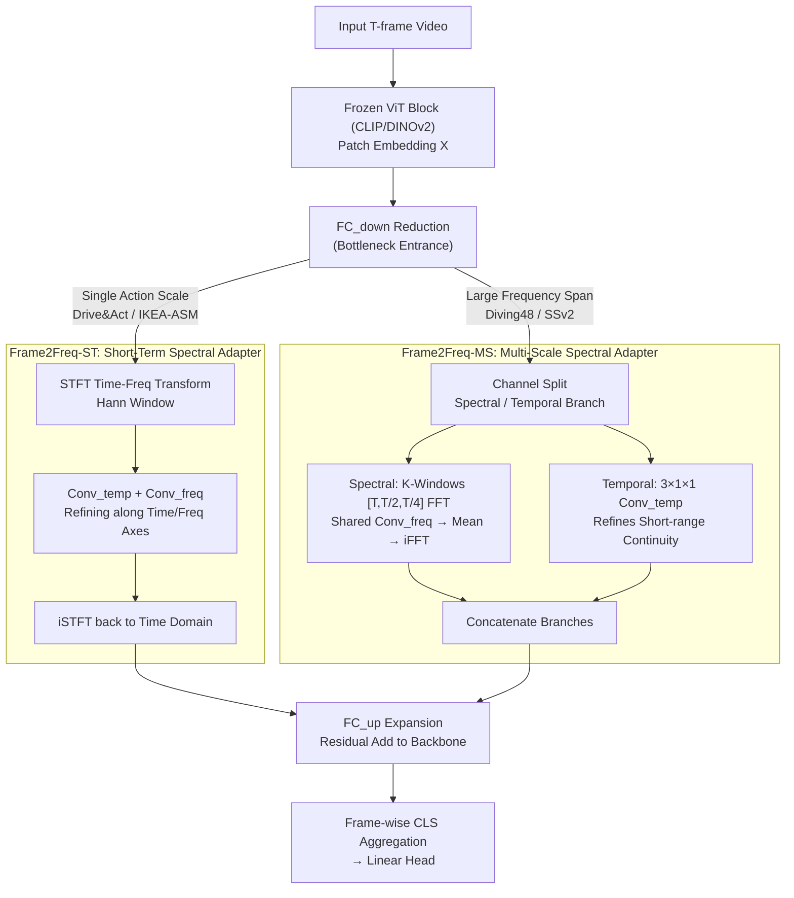

# Frame2Freq: Spectral Adapters for Fine-Grained Video Understanding

**Conference**: CVPR2026  
**arXiv**: [2602.18977](https://arxiv.org/abs/2602.18977)  
**Code**: [th-nesh/Frame2Freq](https://github.com/th-nesh/Frame2Freq)  
**Area**: Video Understanding  
**Keywords**: Spectral Adapters, Parameter-Efficient Fine-Tuning (PEFT), Image-to-Video Transfer, Fine-grained Action Recognition, Fast Fourier Transform, Vision Foundation Model

## TL;DR

Frame2Freq is proposed as the first family of PEFT adapters for temporal modeling in the frequency domain. By using FFT to transform frozen VFM patch embeddings into the spectral space and learning band-level filtering, it outperforms full fine-tuning models on five fine-grained action recognition benchmarks with <10% trainable parameters.

## Background & Motivation

1.  **Limitations of Prior Work in Image-to-Video Transfer**: Existing temporal adapters (convolution or attention) primarily capture static image cues and high-frequency flickering, neglecting mid-frequency motion signals essential for fine-grained actions (e.g., "opening" vs. "closing" a bottle).
2.  **Frequency Discriminability Analysis**: Inspired by ANOVA, a quantitative analysis reveals that traditional adapters like ST-Adapter concentrate discriminative energy at extreme low and high frequencies, with significant underutilization of the mid-frequency band.
3.  **Spectral Distinctiveness of Fine-Grained Actions**: 3D FFT on Diving48 videos shows distinct spectral patterns for different tumble counts and postures (e.g., more tumbles correspond to higher high-frequency energy), patterns which are difficult to observe in the RGB space.
4.  **Demand for Distinguishing Symmetric Action Pairs**: Datasets like Drive&Act and IKEA-ASM contain many near-symmetric pairs (e.g., "pick up" vs. "put down"). These cannot be distinguished by appearance alone and require precise capture of motion phase differences.
5.  **High Cost of Full Fine-Tuning**: VFMs possess hundreds of millions of parameters, making full fine-tuning impractical. Existing PEFT methods (AIM, DualPath, ST-Adapter) operate solely in the time domain.
6.  **Generalization Challenges in Small Datasets**: Scenarios such as driving monitoring and furniture assembly often have limited data, requiring efficient adapters to achieve strong generalization with minimal parameters.

## Method

### Overall Architecture

Frame2Freq addresses the omission of mid-frequency motion signals when adapting image-pre-trained VFMs to video. Lightweight adapters are inserted after each Transformer block of a frozen ViT backbone (CLIP/DINOv2). For $T$ input frames, patch embeddings $X \in \mathbb{R}^{T \times N \times D}$ are passed through a bottleneck structure: $\text{FC}_{down} \to \text{Spectral/Temporal Branch} \to \text{FC}_{up}$. Temporal information is moved to the spectral space for filtering and then residual-added to the backbone output. Two variants are implemented: Frame2Freq-ST and Frame2Freq-MS, targeting single-scale and multi-scale motion respectively.

### Key Designs

**1. Frame2Freq-ST: Short-Term Spectral Adapter for Targeted Domain Data**

For scenarios with limited motion frequency variance (Drive&Act, IKEA-ASM), STFT with a Hann window is applied to the reduced embeddings along the temporal axis. This yields a time-frequency representation $\tilde{X} \in \mathbb{C}^{B \times N \times F \times T' \times C_a}$. Two depthwise-separable 3D convolutions refine the representation along the temporal ($\text{Conv}_{temp}$) and frequency ($\text{Conv}_{freq}$) axes to capture short-term transitions and inter-band relationships. Diminished dimensions are restored via $\text{FC}_{up}$ after iSTFT. Only 3.5M trainable parameters are used.

**2. Frame2Freq-MS: Multi-Scale Spectral Adapter for Complex Scenarios**

For datasets like Diving48 and SSv2 which mix various motion speeds, the embeddings are split into a spectral branch $X_{freq}$ and a temporal branch $X_{temp}$. The spectral branch performs FFT across $K$ windows $\{w_k\} = [T, T/2, T/4]$. Each scale is refined by a shared $\text{Conv}_{freq}$, averaged, and transformed back via iFFT. The temporal branch uses a $(3\times1\times1)$ $\text{Conv}_{temp}$ to maintain short-range continuity. This multi-window approach allows the model to perceive motion phases across different timescales. Total trainable parameters: 7.3M.

### Loss & Training

A standard cross-entropy classification loss is employed without auxiliary losses. Models are trained for 60 epochs using 16 or 32 uniformly sampled frames.

## Key Experimental Results

### Main Results

| Dataset | Method | Backbone | Trainable Params | Top-1 Acc |
|---------|--------|----------|------------------|-----------|
| Diving48 | ST-Adapter | ViT-B/16 CLIP | 7M | 90.4% |
| Diving48 | **Frame2Freq-MS** | ViT-B/16 CLIP | 7.3M | **92.2%** (+1.8) |
| Diving48 | ORViT (Full) | ViT-B/16 | 160M | 88.0% |
| SSv2 | ST-Adapter | ViT-B/16 CLIP | 14M | 69.5% |
| SSv2 | **Frame2Freq-MS** | ViT-B/16 CLIP | 14M | **70.4%** (+0.9) |
| SSv2 | **Frame2Freq-MS** | ViT-L/14 CLIP | 19M | **72.1%** |
| Drive&Act | ST-Adapter | DINOv2 | 7.1M | 75.2% |
| Drive&Act | **Frame2Freq-ST** | DINOv2 | 3.5M | **82.0%** (+6.8) |
| IKEA-ASM | ST-Adapter | DINOv2 | 7.1M | 70.5% |
| IKEA-ASM | **Frame2Freq-ST** | DINOv2 | 3.5M | **78.1%** (+7.6) |
| HRI-30 | ST-Adapter | DINOv2 | 7.1M | 85.5% |
| HRI-30 | **Frame2Freq-MS** | DINOv2 | 7.3M | **89.8%** (+4.3) |

Improvements are particularly significant on symmetric action pairs: +10.5% on the Drive&Act symmetric subset and +11.8% on the IKEA-ASM symmetric subset.

### Ablation Study

| Ablation Item | Setting | SSv2 | Diving48 |
|---------------|---------|------|----------|
| Freq-only Conv | — | 67.5 | 90.9 |
| Time-only Conv | — | 69.1 | 90.4 |
| **Spectral+Temporal (Ours)** | — | **69.7** | **92.2** |
| Multi-scale window [T] | Single-scale | 69.0 | 91.5 |
| Multi-scale window [T, T/2, T/4]| Three-scale | **69.7** | **92.2** |
| Multi-scale window [T...T/8] | Four-scale | 69.4 | 91.0 |
| Adapter in layers 1-4 | Shallow | 55.8 | 67.6 |
| Adapter in all layers 1-12 | Full layers | **69.7** | **92.2** |

## Highlights & Insights

- **Pioneering Frequency-Domain PEFT**: This is the first work to utilize FFT/STFT for image-to-video temporal adaptation in frozen VFMs.
- **Theoretical Grounding**: Frequency Discriminability Analysis quantitatively identifies spectral biases in existing adapters, providing a strong motivation for the design.
- **Flexible Variants**: Frame2Freq-ST (3.5M params) is optimized for single-scale domain data, while Frame2Freq-MS (7.3M params) handles complex multi-scale scenes.
- **High Parameter Efficiency**: Outperforms full fine-tuning models while using less than 10% of the trainable parameters.
- **Symmetric Action Recognition**: Achieves a breakthrough of >10% improvement on challenging symmetric action pairs.

## Limitations & Future Work

- Marginal gains on SSv2 (+0.9%), suggesting limited spectral modeling advantages for coarse-grained labels.
- Frame2Freq-ST performs poorly on Diving48 (75.1%), indicating that variant selection requires prior knowledge of motion complexity.
- Lack of exploration in spectral contrastive losses or band-level supervision.
- Backbones are limited to ViT-B and ViT-L; evaluation on larger models like ViT-G is missing.
- STFT window sizes and multi-scale configurations are manually set rather than adaptively learned.
- Advanced time-frequency tools like wavelet transforms or multi-resolution filters remain unexplored.

## Related Work & Insights

- **vs. ST-Adapter**: Frame2Freq builds on the ST-Adapter framework but replaces/augments temporal depthwise convolution with FFT branches, yielding consistent gains (+0.9% to +7.6%).
- **vs. AIM / DualPath**: These PEFT methods operate only in the time domain; Frame2Freq-MS outperforms them by approximately 3.5% on Diving48.
- **vs. DTF-Transformer**: While DTF uses 1D FFT filters, it requires full fine-tuning (88M params). Frame2Freq achieves comparable performance with only 7.3M parameters.
- **vs. VFPT**: Unlike VFPT which uses the frequency domain for spatial adaptation, Frame2Freq is the first to apply it to the temporal dimension in a PEFT context.
- **vs. Full Fine-tuning**: Frame2Freq-MS exceeds ORViT by 4.2% on Diving48 using less than 1/10 of the parameters.

## Rating

- Novelty: ⭐⭐⭐⭐⭐ — The frequency-domain PEFT adapter introduces a new paradigm.
- Experimental Thoroughness: ⭐⭐⭐⭐⭐ — Comprehensive evaluation across 5 datasets, 2 backbones, and detailed ablations.
- Writing Quality: ⭐⭐⭐⭐ — Clear motivation and deep analysis, though some notation is slightly redundant.
- Value: ⭐⭐⭐⭐⭐ — Opens a spectral route for VFM video adaptation with immediate utility for fine-grained recognition.

<!-- RELATED:START -->

## Related Papers

- [\[CVPR 2026\] Text-guided Fine-Grained Video Anomaly Understanding](text-guided_fine-grained_video_anomaly_understanding.md)
- [\[CVPR 2026\] Mistake Attribution: Fine-Grained Mistake Understanding in Egocentric Videos](mistake_attribution_fine-grained_mistake_understanding_in_egocentric_videos.md)
- [\[CVPR 2026\] UFVideo: Towards Unified Fine-Grained Video Cooperative Understanding with Large Language Models](ufvideo_towards_unified_fine-grained_video_cooperative_understanding_with_large_.md)
- [\[CVPR 2026\] Fine-VAD: Towards Fine-Grained Video Anomaly Detection via Progressive Cross-Granularity Learning](fine-vad_towards_fine-grained_video_anomaly_detection_via_progressive_cross-gran.md)
- [\[AAAI 2026\] FineVAU: A Novel Human-Aligned Benchmark for Fine-Grained Video Anomaly Understanding](../../AAAI2026/video_understanding/finevau_a_novel_human-aligned_benchmark_for_fine-grained_video_anomaly_understan.md)

<!-- RELATED:END -->
