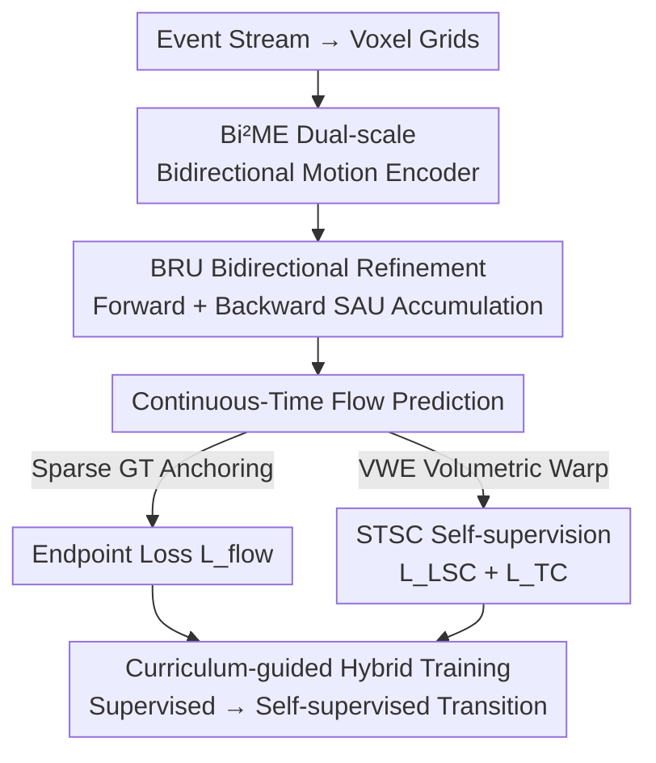

# From Contrast to Consistency: Rethinking Event-based Continuous-Time Optical Flow Estimation

**Conference**: CVPR 2026  
**arXiv**: [2605.25570](https://arxiv.org/abs/2605.25570)  
**Code**: To be confirmed  
**Area**: Video Understanding / Event Camera / Optical Flow Estimation  
**Keywords**: Event camera, continuous-time optical flow, spatio-temporal structural consistency, self-supervised, curriculum learning

## TL;DR
Addressing the lack of dense ground truth (GT) for continuous-time event flow and the limitation of Contrast Maximization (CM) focusing only on "alignment to a point" while ignoring trajectory continuity, this paper proposes the **Spatio-Temporal Structural Consistency (STSC)** self-supervised paradigm. It treats events as samples on a spatio-temporal manifold rather than discrete points to be aligned. Combined with a bidirectional multi-scale network and curriculum-guided hybrid supervision, it achieves SOTA results on DSEC-Flow and MVSEC for both standard and high temporal resolution (HTR) flow (DSEC EPE 0.663, an 11.6% reduction relative to BFlow).

## Background & Motivation
**Background**: Event cameras record brightness changes asynchronously with microsecond latency, making them naturally suited for HTR continuous-time optical flow. Current approaches follow two main paths: supervised learning (RAFT-based, such as E-RAFT, TMA, IDNet) using event voxel grids and iterative refinement, and self-supervised Contrast Maximization (CM), which recovers motion by sharpening the Image of Warped Events (IWE).

**Limitations of Prior Work**: The fundamental bottleneck for continuous-time flow is the **lack of temporally dense GT annotations**. Real-world datasets only provide sparse trajectory endpoints (LTR-GT), preventing supervised learning from fully utilizing event temporal precision. Meanwhile, the objective of CM self-supervision is to warp all events to a single reference time to maximize IWE sharpness. This objective **only focuses on endpoint alignment and completely discards the temporal continuity and structural coherence of the motion trajectory**. Under complex or non-linear motion, events are forcibly flattened into a single frame, distorting trajectories and risking "Projection Collapse." Even methods like BFlow, which explicitly parameterize trajectories using Bézier curves, still lack intermediate trajectory priors on real data due to sparse endpoint constraints.

**Key Challenge**: There is a misalignment between the CM target (sharp IWE) and the physically real continuous motion field—sharpness does not equate to trajectory correctness.

**Key Insight & Core Idea**: The authors observe that events triggered by the same physical surface naturally maintain local structures and form a temporally stable spatio-temporal manifold during motion. Therefore, they shift the perspective: instead of aligning events as discrete points, they treat them as **samples on an inherently structured spatio-temporal manifold**. From this, they propose **Spatio-Temporal Structural Consistency (STSC)**, which constrains learning from two complementary angles—local structural stability and trajectory continuity—guiding the network to reconstruct the true motion field rather than merely optimizing for endpoint alignment.

## Method

### Overall Architecture
The input to STSC-Flow is an event stream (converted to voxel grids), and the output is continuous-time optical flow. The pipeline consists of two parts: the **Self-supervised Objective (STSC)** providing "dense motion priors," and the **Network Architecture (Bi²ME + BRU)** responsible for extracting and refining multi-scale, bidirectional temporal motion features. These are integrated via **Anchored Hybrid Training**, where sparse GT anchors the motion scale in early training before gradually transitioning to STSC self-supervision.

The key vehicle for STSC is **Volumetric Warped Events (VWE)**. Unlike traditional CM that warps events to a single reference time (IWE, losing the temporal dimension), VWE aligns each temporal bin to a common reference center while **preserving the relative temporal structure within the bins**, resulting in a 3D spatio-temporal volume in a shared reference frame. Two self-supervised losses are applied to this volume: Local Structural Consistency $\mathcal{L}_{\mathrm{LSC}}$ (preserving structural stability at the same spatial position across different relative times) and Trajectory Consistency $\mathcal{L}_{\mathrm{TC}}$ (ensuring consistent trajectories across different source bins).

Network Side: The voxel grid is processed by the **Bi²ME** dual-scale bidirectional encoder to extract motion features, followed by the **BRU** (containing two reverse-traversed SAUs) for forward/backward temporal accumulation. The bidirectional states are then aggregated to produce the final continuous flow.

### Key Designs

**1. STSC: Replacing Sharpness with Manifold Priors**

This is the foundation of the work, directly addressing the lack of trajectory continuity in CM. The authors first construct VWE: given a reference time $t_0$, each bin center $c_b$ has a time shift $\Delta_b = t_0 - c_b$. Intra-bin events retain their relative time $\xi_i = t_i - c_b$, yielding $\mathrm{VWE}_b(\mathbf{x},\xi)=\sum_{i}\sigma_i\,\kappa_s(\mathbf{x}-\mathcal{W}_{t_i\to t_i+\Delta_b}(\mathbf{x}_i))\,\kappa_t(\xi-\xi_i)$. Summing over all bins creates a complete VWE volume that preserves both **cross-bin alignment** and **intra-bin temporal microstructure**.

Two complementary constraints are applied to the VWE. **Local Structural Consistency** ($\mathcal{L}_{\mathrm{LSC}}$) computes the mean structure $\overline{\mathcal{V}}(\mathbf{x})$ across relative times $\xi$ and penalizes deviations: $\mathcal{L}_{\mathrm{LSC}}=\frac{1}{K}\sum_k\sum_{\mathbf{x}}\|\mathcal{V}(\mathbf{x},\xi_k)-\overline{\mathcal{V}}(\mathbf{x})\|_2^2$. This forces the warped volume to maintain stable local structures along the time axis. **Trajectory Consistency** ($\mathcal{L}_{\mathrm{TC}}$) calculates the spatio-temporal gradient field $\mathcal{G}_b$ for each normalized bin volume and minimizes its variance across bins: $\mathcal{L}_{\mathrm{TC}}=\frac{1}{K}\sum_k\sum_{\mathbf{x}}\mathrm{Var}_b(\mathcal{G}_b(\mathbf{x},\xi_k))$. This ensures events move along smooth, consistent trajectories. Together, these provide the dense physical priors missing in CM.

**2. Bi²ME: Anchoring Motion to Temporal Boundaries**

To address spatial heterogeneity in motion, **Bi²ME** uses dual-resolution branches: low-res $\{F_L^t\}$ for global context and high-res $\{F_H^t\}$ for structural details. It **anchors motion to the start and end boundaries** of the window, constructing bidirectional correlation volumes ($C_f^t, C_b^t$) using the first and last bin features. Simultaneously, Motion-Aware Differencing (MADiff) is applied to high-res features to enhance sensitivity to fine structures, which is critical for LSC.

**3. BRU and SAU: Unbiased Temporal Features via Central Difference**

Unidirectional recursive updates (first-order difference) are non-robust to occlusions and acceleration. The authors prove that combining past and future is equivalent to a **second-order central difference approximation**. The **BRU** utilizes two reverse-traversing **SAUs** for symmetric forward and backward accumulation, merging bidirectional hidden states for an unbiased estimate. Each **SAU (Scale Alternating Unit)** is a dual-branch recursive structure: a 1/8 resolution Global Memory Unit (GMU) and a 1/4 resolution Detail Refinement Unit (DRU), fused via a **Weaving Gate** to adaptively couple temporal motion and spatial details.

**4. Anchored Curriculum-guided Hybrid Training**

While STSC can theoretically learn continuous flow in a purely self-supervised manner, optimizing from scratch is often unstable. The authors use sparse GT as an "initial anchor" with a linear decay: supervised weight $\lambda_{flow}(e)$ decreases while self-supervised weights $\lambda_{LSC}(e)$ and $\lambda_{TC}(e)$ increase. This allows the model to lock in the motion scale and global structure early on before leveraging dense temporal consistency cues for intermediate trajectories.

### Loss & Training
The total loss is a weighted sum controlled by the curriculum $\lambda$. Supervised endpoint loss prioritizes fine scales ($\gamma_2=0.75$). Optimizer: Adam with One-Cycle LR ($1.3\times10^{-4}$). DSEC-Flow is trained for 200 epochs ($B=15$ bins); MVSEC for 30 epochs. Continuous motion is modeled using quadratic Bézier trajectories with 4 iterative updates.

## Key Experimental Results

### Main Results
DSEC-Flow (HTR indicates High Temporal Resolution methods):

| Method | EPE↓ | 3PE↓ | 2PE↓ | 1PE↓ | AE↓ | FWL↑ | HTR |
|------|------|------|------|------|------|------|-----|
| BFlow (Prev best HTR) | 0.750 | 2.44 | 4.41 | 11.90 | 2.68 | 1.98 | ✓ |
| ResFlow | 0.754 | 2.50 | 4.24 | 11.22 | 2.73 | 2.14 | ✓ |
| IDNet (Prev best LTR) | 0.719 | 2.04 | 3.50 | 10.07 | 2.72 | 1.97 | |
| EDCFlow | 0.720 | 2.10 | 3.60 | 10.00 | 2.65 | – | |
| **Ours** | **0.663** | **1.60** | **2.67** | **7.94** | **2.53** | **2.18** | ✓ |

- **Gain**: EPE 0.663 is 7.8% lower than IDNet and 11.6% lower than BFlow.
- Robustness metrics show even larger gains: 3PE improved by 21.6% over IDNet and 34.4% over BFlow.
- FWL (2.18) surpasses the previous best HTR method, ResFlow (2.14).

MVSEC:
- At dt=4, EPE/%Out improved by 7.5%/8.2% relative to EDCFlow.

### Ablation Study
Ablation on components (DSEC-Flow, starting from IDNet backbone):

| Configuration | EPE↓ | 3PE↓ | 1PE↓ | FWL↑ |
|------|------|------|------|------|
| Baseline | 0.728 | 2.11 | 10.03 | 1.97 |
| + Bi²ME | 0.703 | 1.92 | 9.15 | 1.97 |
| + Bi²ME + SAU | 0.688 | 1.73 | 8.65 | 1.99 |
| + Bi²ME + SAU + BRU | 0.672 | 1.62 | 8.22 | 2.04 |
| + Full (incl. STSC) | **0.663** | **1.60** | **7.94** | **2.18** |

### Key Findings
- **STSC is crucial for HTR quality**: Without STSC, FWL degrades or plateaus as sampling rates increase. With STSC, FWL increases monotonically (2.07 → 2.18), proving STSC correctly constrains intermediate physical trajectories.
- **Structural Contributions**: The architecture (Bi²ME/SAU/BRU) primarily reduces EPE, while STSC primarily enhances trajectory quality (FWL).
- **Bidirectional Benefits**: BRU's bidirectional accumulation is most effective in occlusion and motion boundary regions, producing sharper and more coherent estimates.

## Highlights & Insights
- **Paradigm Shift**: Redefining events as "manifold samples" rather than "points to align" resolves the fundamental misalignment between CM sharpness and physical trajectory truth.
- **Clever VWE Design**: Preserving intra-bin temporal microstructures while aligning bin centers allows for consistency constraints that traditional IWE-based methods cannot support.
- **Curriculum Learning for Sparse Data**: Seamlessly bridging sparse supervision and dense self-supervision is a practical engineering strategy for data-scarce scenarios.
- **Theoretical Grounding**: Interpreting bidirectional recursion as a second-order central difference provides a solid mathematical justification for the architectural design.

## Limitations & Future Work
- **Computational Overhead**: Operations on 3D VWE volumes (neighborhood aggregation, cross-bin variance) are likely more expensive than 2D IWE; the paper lacks explicit latency and memory reports.
- **GT Dependency**: The model still requires sparse GT for anchoring in early training; its purely unsupervised performance on new sensors is unverified.
- **Trajectory Modeling**: Quadratic Bézier trajectories might be insufficient for highly non-linear or complex multi-phase motions.

## Related Work & Insights
- **Compared to CM**: CM focuses on endpoint alignment and risks "projection collapse." STSC provides dense priors missing in CM via structural and trajectory consistency.
- **Compared to BFlow**: While both use Bézier curves, BFlow lacks intermediate priors, whereas STSC ensures physical plausibility throughout the trajectory.
- **Compared to EVA-Flow / ResFlow**: These use implicit supervision for HTR; STSC introduces explicit structural and physical consistency losses.

## Rating
- Novelty: ⭐⭐⭐⭐⭐ 
- Experimental Thoroughness: ⭐⭐⭐⭐ 
- Writing Quality: ⭐⭐⭐⭐ 
- Value: ⭐⭐⭐⭐⭐ 

<!-- RELATED:START -->

## Related Papers

- [\[ECCV 2024\] Motion-prior Contrast Maximization for Dense Continuous-Time Motion Estimation](../../ECCV2024/video_understanding/motion-prior_contrast_maximization_for_dense_continuous-time_motion_estimation.md)
- [\[CVPR 2026\] Efficient All-Pairs Correlation Volume Sampling for Optical Flow Estimation](efficient_all-pairs_correlation_volume_sampling_for_optical_flow_estimation.md)
- [\[CVPR 2026\] U2Flow: Uncertainty-Aware Unsupervised Optical Flow Estimation](u2flow_uncertainty_aware_unsupervised_optical_flow_estimation.md)
- [\[CVPR 2026\] One-Shot Flow, Any-Time Frame: A Bidirectional Warping Framework for Event-Based Video Frame Interpolation](one-shot_flow_any-time_frame_a_bidirectional_warping_framework_for_event-based_v.md)
- [\[CVPR 2025\] EDCFlow: Exploring Temporally Dense Difference Maps for Event-based Optical Flow Estimation](../../CVPR2025/video_understanding/edcflow_exploring_temporally_dense_difference_maps_for_event-based_optical_flow_.md)

<!-- RELATED:END -->
