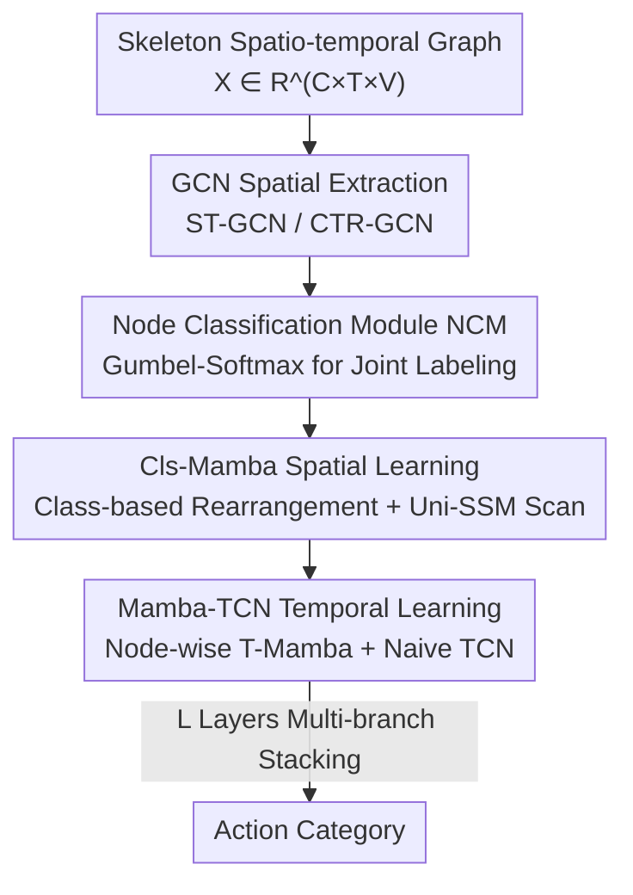

# Gamba: Mamba-based Graph Convolutional Network with Dynamic Graph Topology Learning for Action Recognition

**Conference**: CVPR 2026  
**Paper**: [CVF Open Access](https://openaccess.thecvf.com/content/CVPR2026/html/Zhou_Gamba_Mamba-based_graph_convolutional_network_with_dynamic_graph_topology_learning_CVPR_2026_paper.html)  
**Code**: https://github.com/RCEricZhou/Gamba  
**Area**: Video Understanding  
**Keywords**: Skeleton action recognition, Mamba, Graph Convolutional Network, Dynamic graph topology, State Space Models  

## TL;DR
To address the issue where directly stacking GCN and Mamba causes Mamba to scan along physically non-adjacent joint sequences, Gamba uses a node classification module to rearrange joints into Mamba-friendly sequences based on motion categories. It then employs a unidirectional State Space Model (SSM) to simultaneously model intra-class local and inter-class global relationships, paired with Mamba-TCN for temporal modeling, achieving SOTA on NTU RGB+D 60/120 and NW-UCLA with lower self-attention overhead.

## Background & Motivation

**Background**: Skeleton-based Human Action Recognition (HAR) is currently dominated by Graph Convolutional Networks (GCNs). Since ST-GCN established the spatio-temporal graph paradigm (joints as nodes, bones/motion as edges), subsequent works have followed two lines: static topology (e.g., MS-G3D, HD-GCN using predefined structures) and dynamic topology (e.g., 2s-AGCN, CTR-GCN, InfoGCN using self-attention for adaptive adjacency matrices).

**Limitations of Prior Work**: The authors identify three specific issues. First, static topologies adhere strictly to physical connections, failing to capture non-physical correlations like cross-joint coordination in complex actions; dynamic topologies can learn these but suffer from high computational overhead due to global pairwise similarity calculations in self-attention. Second, temporal TCNs have limited receptive fields—single-scale kernels fail to capture multi-granularity patterns, while multi-scale TCNs use simple linear weighting or concatenation, failing to express non-linear coupling between fine-grained short-term and global long-term temporal features. Third, existing works integrating Mamba into GCNs (e.g., dual-stream frameworks, Simba) simply stack the modules, overlooking the **inherent contradiction between graph-structured data and Mamba sequence modeling**.

**Key Challenge**: Mamba is essentially a variant of RNN, which requires 1D sequences and is sensitive to token order. However, skeletons are graphs described by adjacency matrices; joints may be "contiguous" in memory but are not necessarily physically adjacent. Feeding the raw node order directly into Mamba causes the sequential learning mechanism to learn spurious correlations from joints that are memory-adjacent but physically unrelated. Forcing multi-directional scanning (like 8-way scanning in Vision Mamba) onto graph data lacks physical basis and introduces redundant computation.

**Goal**: To develop a unified framework that retains the structural representation of GCNs while leveraging the efficiency of Mamba for long-range dependency modeling, ensuring the scanning order aligns with the motion semantics of the skeleton.

**Core Idea**: Replace blind multi-directional scanning with "semantic-guided node classification and rearrangement." By assigning category labels to each joint and grouping similar joints together, the model creates sequences friendly to State Space Models, enabling the capture of intra-class local and inter-class global relationships in a single unidirectional scan.

## Method

### Overall Architecture
The backbone of Gamba follows the multi-branch structure of DeGCN ($L_2$ symmetric mirrored branches in parallel, with $L_1$ basic units in series per branch). Each unit consists of two serial parts: a **Mamba-GCN module** (GCN + classification-guided Cls-Mamba) for spatial modeling, followed by a **Mamba-TCN module** for temporal modeling.

The data flow is as follows: The raw skeleton first passes through a GCN for spatial feature extraction (ST-GCN for the first layer, CTR-GCN for subsequent layers) to aggregate neighbor information via the adjacency matrix. The GCN output is fed into the **Node Classification Module (NCM)** to assign category labels to each joint. Nodes are rearranged based on these labels into a sequence optimized for the State Space Model, then processed by **S-Mamba** to extract local motion and global spatio-temporal features potentially missed by the GCN—the NCM and S-Mamba together form **Cls-Mamba**. On the temporal side, **T-Mamba** captures long-range dependencies for each joint across frames, followed by a **Naive TCN** for local aggregation, forming the **Mamba-TCN**.

The GCN uses standard spectral graph convolution:

$$H^{(l+1)} = \sigma\!\left(\hat{D}^{-\frac{1}{2}}\hat{A}\hat{D}^{-\frac{1}{2}}H^{(l)}W^{(l)}\right)$$

where $\hat{A}=A+I$ is the adjacency matrix with self-loops and $\hat{D}$ is the degree matrix. Mamba utilizes the discretized State Space Model (SSM): $h_k = \bar{A}h_{k-1} + \bar{B}x_k,\; y_k = \bar{C}h_k + \bar{D}x_k$, with $\bar{A}=\exp(\Delta A)$ and $\bar{B}=((\Delta A)^{-1}(\exp(\Delta A)-I))\cdot\Delta B$, modeling long-range dependencies with linear complexity via a selection mechanism.

### Key Designs

**1. Node Classification Module (NCM): Assigning "motion categories" to rearrange graph sequences for Mamba**

This step addresses the issue that raw node orders have no physical meaning for Mamba. The observation is that joint correlation is strongly tied to its motion category—e.g., in a "touching head" action, the right and left hands are key coordinated nodes, but they may not be adjacent in the original indexing. NCM uses an MLP to score each node $Y = \text{LogSoftmax}(\text{MLP}(X))$, then applies Gumbel-Softmax for discrete category sampling:

$$g_i = -\log(-\log(u_i)),\quad y_i = \frac{\exp((\log x_i + g_i)/\tau)}{\sum_{j=1}^{k}\exp((\log x_j + g_j)/\tau)}$$

where $u_i \sim \text{Uniform}(0,1)$ provides noise $g_i$, and $\tau$ is the temperature controlling smoothness. Gumbel noise prevents nodes from being permanently fixed to a class, increasing diversity and suppressing overfitting. This is the **first work to assign category labels to joints to assist correlation learning**. NCM is unsupervised and optimized jointly with the model. Rearrangement groups similar joints, aligning the SSM hidden state evolution with skeleton physical/semantic connectivity.

**2. Cls-Mamba Dynamic Graph Spatial Learning: Unidirectional scanning for local and global relationships**

This design captures both local and global features without multi-directional scanning. After NCM classification, nodes of the same class are grouped, and optimized sequences are generated for the SSM. For the $i$-th class (with $n_i$ nodes), intra-class scanning is performed:

$$y_j^i = \bar{C}(\bar{A}h_{j-1} + \bar{B}x_j^i) + \bar{D}x_j^i,\quad i\in[1,k],\, j\in[1,n_i]$$

Since all nodes are eventually concatenated into one sequence, the model captures inter-class global correlations through hierarchical processing: $y = \text{SSM}(\text{Concat}(\text{SSM}(x_{i-1}),\, x_i))$. Thus, intra-class SSM handles local details while inter-class SSM handles global dependencies. This **single unidirectional scan** covers both levels, avoiding the redundant computation of Vision Mamba-style scanning. Cls-Mamba can be stacked as deeply as the GCN, providing stronger expressive power.

**3. Mamba-TCN (MTCN): Node-wise temporal modeling via Mamba and TCN**

This targets the limited receptive field and simple local fusion of traditional TCNs. Skeletons naturally contain temporal features for each joint across $T$ frames, ideal for Mamba. The input tensor $X \in \mathbb{R}^{B \times C \times T \times V}$ is reshaped to $X_t \in \mathbb{R}^{(B \cdot V) \times T \times C}$ to process the $T$-frame sequence for **each node individually**, preventing interference between different joints during temporal modeling:

$$H_t = \text{SSM}(X_t),\qquad Y = \text{TCN}(H_t)$$

Mamba captures long-range dependencies adaptively, followed by a Naive TCN for local aggregation along the $T$ dimension. This "global then local" hierarchical design overcomes the inability of single-scale kernels to capture non-linear cross-granularity coupling.

### Loss & Training
Four data streams (joint, bone, joint motion, bone motion) are fused for a final vote. The optimizer is SGD with a weight decay of 0.0005. Training lasts 80 epochs with a 5-epoch linear warmup. The initial learning rate is 0.1, decaying by 0.2 at epochs 35, 55, and 75 (NW-UCLA uses an additional 10x scaling). The number of joint categories $k=64$, and model depth $L=10$.

## Key Experimental Results

### Main Results
Comparison with SOTA on NTU RGB+D 60/120 and NW-UCLA (Top-1 Accuracy %, all with four-stream fusion):

| Method | Year | NTU60 X-Sub | NTU60 X-View | NTU120 X-Sub | NTU120 X-Set | NW-UCLA |
|------|------|------|------|------|------|------|
| CTR-GCN | ICCV 2021 | 92.4 | 96.8 | 88.9 | 90.6 | 96.5 |
| HD-GCN | ICCV 2023 | 93.0 | 97.0 | 89.8 | 91.2 | 96.9 |
| BlockGCN | CVPR 2024 | 93.1 | 97.0 | **90.3** | 91.5 | 96.9 |
| Skeleton MixFormer | ACMMM 2023 | 93.0 | 97.0 | 90.0 | 91.3 | 97.2 |
| **Gamba (Ours)** | CVPR 2026 | **93.4** | **97.3** | 90.1 | **91.9** | **97.3** |

Gamba achieves the best results on both NTU60 benchmarks, NTU120 X-Set, and NW-UCLA, ranking second only on NTU120 X-Sub (90.1 vs 90.3).

### Ablation Study
Tested on the joint modality of NTU60 X-View:

| GCN | NCM | S-Mamba | T-Mamba | TCN | Acc(%) | Description |
|-----|-----|---------|---------|-----|--------|------|
| ✓ | | | | ✓ | 95.8 | Baseline (No Mamba) |
| ✓ | ✓ | ✓ | | ✓ | 96.0 | Added Cls-Mamba, +0.2 |
| ✓ | | ✓ | ✓ | ✓ | 95.7 | Added T-Mamba only, no gain |
| ✓ | | ✓ | | ✓ | 95.8 | S-Mamba only (No NCM), no gain |
| ✓ | ✓ | ✓ | ✓ | ✓ | **96.5** | Full Model |

### Key Findings
- **NCM is critical for Cls-Mamba gain**: Adding NCM within Cls-Mamba improved accuracy by 0.8%, showing that rearrangement is prerequisite for Mamba to learn valid features. Adding T-Mamba alone or S-Mamba without NCM showed no improvement, verifying that "naive Mamba stacking is ineffective."
- **More Mamba is better**: Accuracy increased from 95.4% to 96.5% as Mamba layers rose from 3 to 9, indicating Mamba consistently complements global sequence features missed by GCN.
- **Hyperparameter Robustness**: TCN kernel size 5 was optimal; category count $k=64$ provided stability.
- **Efficiency and Interpretability**: Gamba has 4.5M parameters and 11.1G FLOPs, lower than BlockGCN (11.9G) and CTR-GCN (14.4G). Qualitative analysis showed NCM correctly highlights correlations between hands in "touching head" actions.

## Highlights & Insights
- **Rearrangement Strategy**: It converts Mamba's sensitivity to order from a weakness into a controllable variable. Using a learnable classifier to determine order is more efficient than multi-directional scanning and more flexible than fixed topologies.
- **Gumbel-Softmax Utility**: It achieves differentiable sampling of discrete categories while providing regularization via noise, preventing overfitting to specific classifications.
- **Differentiated Spatial-Temporal Units**: Cls-Mamba addresses graph-sequence structural contradictions in space, while Mamba-TCN addresses long-range receptive field issues in time. This specialized division of labor is superior to forcing a single Mamba module to handle everything.

## Limitations & Future Work
- Parameters (4.5M) are significantly higher than CTR-GCN (1.2M), suggesting questioned cost-effectiveness for edge deployment despite lower FLOPs.
- Performance on NTU120 X-Sub trailed BlockGCN, indicating that benefits of rearrangement might be diluted in large-scale cross-subject settings.
- Hyperparameters like $k$ and $\tau$ require manual tuning, and NCM lacks explicit semantic supervision.
- Reliability against noisy/occluded skeletons and cross-dataset generalization remains untested.

## Related Work & Insights
- **vs CTR-GCN/InfoGCN**: These use self-attention for adaptive adjacency, which is computationally expensive and spatial-only. Gamba uses unidirectional SSMs for linear complexity and explicitly includes temporal long-range dependencies (Mamba-TCN).
- **vs Direct Mamba Stacks (Simba)**: Previous works treat Mamba as a cheap Transformer substitute without addressing joint order. Gamba's NCM reordering ensures hides state evolution aligns with physical connectivity.
- **vs Multi-scale TCN (MS-G3D)**: Multi-scale TCNs use linear fusion which misses non-linear coupling. Mamba-TCN uses Mamba’s selection mechanism for global capture complemented by TCN’s local aggregation.

## Rating
- Novelty: ⭐⭐⭐⭐ First to use node classification reordering to make graphs Mamba-friendly.
- Experimental Thoroughness: ⭐⭐⭐⭐ Solid multi-benchmark and hyperparameter ablation, though lacking cross-dataset tests.
- Writing Quality: ⭐⭐⭐⭐ Clear motivation-solution chain and good visualization.
- Value: ⭐⭐⭐⭐ Provides a scalable paradigm for "Graph Data + Sequence Model" integration beyond skeleton HAR.

## Related Papers

- [\[ICCV 2025\] Adaptive Hyper-Graph Convolution Network for Skeleton-Based Human Action Recognition](../../ICCV2025/video_understanding/adaptive_hyper-graph_convolution_network_for_skeleton-based_human_action_recogni.md)
- [\[ICCV 2025\] Adaptive Hyper-Graph Convolution Network for Skeleton-based Human Action Recognition with Virtual Connections](../../ICCV2025/video_understanding/adaptive_hyper_graph_convolution_network_skeleton_action_recognition.md)
- [\[CVPR 2026\] HieraMamba: Video Temporal Grounding via Hierarchical Anchor-Mamba Pooling](hieramamba_video_temporal_grounding_via_hierarchical_anchor-mamba_pooling.md)
- [\[CVPR 2026\] MS-Temba: Multi-Scale Temporal Mamba for Understanding Long Untrimmed Videos](ms-temba_multi-scale_temporal_mamba_for_understanding_long_untrimmed_videos.md)
- [\[CVPR 2026\] Towards Spatio-Temporal World Scene Graph Generation from Monocular Videos](towards_spatio-temporal_world_scene_graph_generation_from_monocular_videos.md)

<!-- RELATED:END -->

<!-- RELATED:START -->

## Related Papers

- [\[CVPR 2026\] HieraMamba: Video Temporal Grounding via Hierarchical Anchor-Mamba Pooling](hieramamba_video_temporal_grounding_via_hierarchical_anchor-mamba_pooling.md)
- [\[CVPR 2026\] MS-Temba: Multi-Scale Temporal Mamba for Understanding Long Untrimmed Videos](ms-temba_multi-scale_temporal_mamba_for_understanding_long_untrimmed_videos.md)
- [\[CVPR 2026\] MPL: Match-guided Prototype Learning for Few-shot Action Recognition](mpl_match-guided_prototype_learning_for_few-shot_action_recognition.md)
- [\[CVPR 2026\] Hypergraph-State Collaborative Reasoning for Multi-Object Tracking](hypergraph-state_collaborative_reasoning_for_multi-object_tracking.md)
- [\[CVPR 2026\] SkeletonContext: Skeleton-side Context Prompt Learning for Zero-Shot Skeleton-based Action Recognition](skeletoncontext_skeleton-side_context_prompt_learning_for_zero-shot_skeleton-bas.md)

<!-- RELATED:END -->
