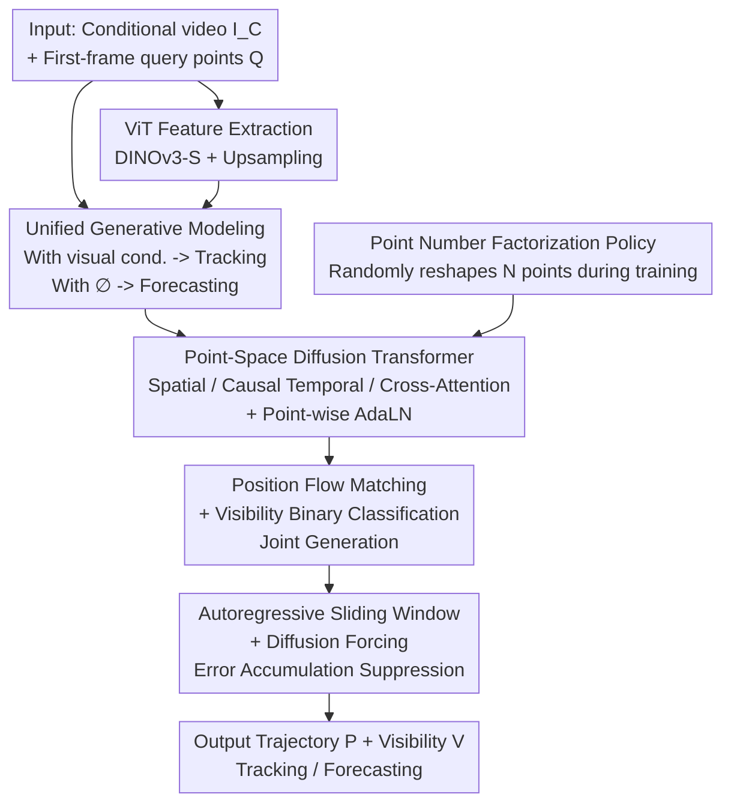

# Generative Point Tracking and Forecasting

**Conference**: CVPR 2026  
**Paper**: [CVF Open Access](https://openaccess.thecvf.com/content/CVPR2026/html/Lu_Generative_Point_Tracking_and_Forecasting_CVPR_2026_paper.html)  
**Code**: None  
**Area**: Video Understanding  
**Keywords**: Point Tracking, Trajectory Forecasting, Flow Matching, Diffusion Transformer, Unified Modeling

## TL;DR
Unifies "point tracking" (predicting where points are now) and "trajectory forecasting" (predicting where points go in the future) into a single task of **video-conditioned point generation**. By training a causal Flow Matching Diffusion Transformer conditioned on video features, the model tracks when visual conditions are present, and naturally transitions to forecasting when visual conditions are removed. It outperforms all previous methods on point forecasting benchmarks, while achieving tracking accuracy close to highly-tuned regression-based SOTA methods.

## Background & Motivation
**Background**: Estimating how points move over time is the shared core of motion tracking (present) and motion forecasting (future). However, historically, these two tasks have been treated separately: contemporary point tracking methods (CoTracker, TAPIR, Track-On, etc.) are almost entirely **regression-based**—relying on specialized network architectures, iterative refinements, cost volumes, and robust loss functions. Meanwhile, trajectory forecasting commonly models multi-modal future distributions using generative latent space diffusion.

**Limitations of Prior Work**: Regression-based trackers treat "where the point is now" as a deterministic problem, and thus **fail to learn motion priors**—they do not know how a ball might fly when occluded, or how an object bounces after landing. This is precisely the capability most needed for forecasting tasks. Conversely, forecasting-specific models (such as the latent space diffusion by Boduljak et al.) rely on grid-based VAE encoding that assumes a regular grid input, making them **unable to directly track arbitrary query points**. The incompatible architectures prevent a single model from performing both tasks.

**Key Challenge**: Tracking requires "aligning with visual evidence" (deterministic, high precision), while forecasting requires "sampling plausible futures" (uncertainty, multi-modal priors). Though seemingly conflictual, this paper observes that **the only difference lies in the availability of "visual conditions"**. With visual features of the current frame, the model should follow the evidence (tracking); without visual features of future frames, it should sample from the learned motion priors (forecasting).

**Goal**: Solve both tasks simultaneously using a **single** generative model without any specialized architectural modifications for either task, while satisfying real-world tracking constraints: online execution, interaction between points, and high localization accuracy.

**Core Idea**: Formulate both tasks under the same conditional probability distribution $p_\theta(P, V \mid I_C, Q)$, and generate point trajectories using a **video-conditioned Flow Matching DiT**. Tracking is treated as conditional generation with visual conditions, and forecasting is treated as unconditional generation by replacing visual conditions with a null embedding $\varnothing$. The task switch relies solely on altering the visual signals, without changing a single line of the architecture.

## Method

### Overall Architecture
The model learns to generate the complete trajectory $P \in \mathbb{R}^{T \times N \times 2}$ and the corresponding visibility $V \in [0,1]^{T \times N}$ (target duration $T \ge T_C$), given the conditional video $I_C \in \mathbb{R}^{T_C \times H \times W \times 3}$ and $N$ query points $Q \in \mathbb{R}^{N \times 2}$ provided in the first frame. The key lies in **determining the behavior frame-by-frame based on the "presence of visual conditions"**: for frames $t \le T_C$, the ViT features of the frame are fed in, allowing the model to adhere to the visual evidence (tracking); for frames $t > T_C$, the visual conditions are replaced with a learnable null embedding $\varnothing$, and the model transitions to sampling from internal motion priors (forecasting). Thus, $T_C = T$ corresponds to pure tracking, $T_C = 1$ to pure forecasting, and $1 < T_C < T$ to "tracking first, then extrapolating the future."

The entire pipeline: extract video features via a pre-trained ViT $\rightarrow$ construct each query point at each frame as a token (totaling $T \times N$ tokens), initialized with noisy point coordinates $\rightarrow$ feed into a point-space DiT, where three types of attention model "inter-point spatial interaction / single-point temporal history / point-to-image feature alignment" $\rightarrow$ denoise noise into positions via Flow Matching and predict visibility using BCE $\rightarrow$ autoregressively generate long sequences using a causal sliding window paired with diffusion forcing to suppress error accumulation $\rightarrow$ output trajectories (conditional leads to tracking, unconditional leads to forecasting).

### Key Designs

**1. Unified Generative Modeling: Compressing Tracking and Forecasting into the Same "Video-Conditioned Point Generation"**

The prior pain point is that tracking and forecasting historically used separate architectures, rooted in treating one as deterministic regression and the other as generative sampling. This work addresses this by recognizing that both tasks are fundamentally "generating trajectories in point space," with the only difference being the presence of conditioning signals. Formalized as learning $p_\theta(P, V \mid I_C, Q)$, the condition $C = (Q, I_C)$ of the denoising function $F_\theta(x_k, k, C)$ provides the visual part $I_t$ during tracking frames, and replaces it with a null embedding $\varnothing$ during forecasting frames. This allows the same set of weights to perform conditional generation aligned with evidence (tracking) when fed visual features, and unconditional sampling from learned motion priors (forecasting) when visual features are removed, while also allowing "tracking for $T_C$ frames first, then predicting." This is cleaner than training two separate models or heavily modifying forecasting architectures for tracking—task switching is done by changing inputs at inference, not the network.

**2. Point-space Diffusion Transformer: Three Types of Attention + Point-wise AdaLN, Denoising Directly on Point Coordinates**

Forecasting-specific methods rely on grid-based VAEs to encode image patches into latent codes, assuming regular grid inputs, which does not generalize well to "arbitrary scattered query points." This paper transitions to a **point-space DiT**: representing the entire trajectory (positions $P$ + visibility $V$) as $T \times N$ tokens, learning a mapping from a Gaussian distribution to the data distribution $x=(P,V)$, and **denoising directly in the point coordinate space**. This bypasses complex grid VAE encoders/decoders and tracking-specific components like cost volumes. Each DiT block contains three types of attention, each serving a distinct purpose: **spatial attention** allows all point tokens within the same frame to attend to each other (modeling joint motion of points), **causal temporal attention** restricts each point to attend only to its own past $\{x_k^{(t',n)} \mid t' < t\}$ (enabling online tracking and building single-point motion history), and **cross-attention** aligns point tokens with the corresponding frame's visual features $C_t$ (injecting localization and semantics, which is also where supplying $C_t$ or $\varnothing$ switches between tracking and forecasting). Rather than adopting the standard DiT approach of using a global vector to modulate all tokens, the condition injection uses **point-wise AdaLN**: bilinear sampling visual features at the query position $Q_n$, concatenating them with the positional encoding of $Q_n$ and the embedding of the global timestep $k$, to give each trajectory an **exclusive initial context** for modulating the Transformer. This informs the model which query point each token belongs to and the current noise level.

**3. Joint Generation of Trajectory and Occlusion Labels via Flow Matching for Position and Binary Classification for Visibility**

Since position is continuous and visibility is a discrete label, they must be handled separately. For positions, Conditional Flow Matching (CFM) is used: defining a probability path $p_k(x)=\mathcal{N}(x \mid (1-k)x_0 + kx_1, \sigma^2)$, forcing the network to predict flow vectors $v_k(x)=x_1 - x_0$, and minimizing:

$$\mathcal{L}_{\text{position}} = \mathbb{E}_{k, p_k(x|x_1), c}\big[\,\|F_\theta(x_k, k, c) - (x_1 - x_0)\|_2^2\,\big]$$

where $x_1$ represents the ground-truth trajectory and $x_0 \sim \mathcal{N}(0,I)$ is noise. The authors highlight an easily overlooked detail: **the sampling distribution of noise levels $k$ during training is crucial** (consistent with findings in pixel-space high-resolution diffusion). They normalize the trajectory to zero mean and unit variance, sample $k$ using a logits-normal distribution (loc=-1, scale=1.5), and search for the optimal location and scale. Visibility is treated as **binary classification**: the network directly predicts the clean ground-truth $V_1$ at each diffusion step, supervised by BCE:

$$\mathcal{L}_{\text{visibility}} = \mathbb{E}_{k, x_k, c, V_1}\big[\,\text{BCE}(\hat{V}_1, V_1)\,\big]$$

The prediction at the final sampling step is taken as the final visibility. **Jointly generating** position and visibility (rather than predicting them independently) yields benefits—the paper finds that this improves tracking performance, as visibility prediction leverages the context of the spatial trajectory.

**4. Autoregressive Sliding Window + Diffusion Forcing: Preventing Cumulative Errors in Long-Sequence Predictions**

Since long trajectories of length $T$ cannot fit in VPU/GPU memory, they are generated **autoregressively over time**: during inference, the first window of $W$ frames is generated, followed by a sliding window with stride $S$. The last $W-S$ frames of the previous window (including predicted positions and visibility) serve as the causal prefix condition for the next $S$ frames, requiring a total of $\frac{T-W}{S}+1$ windows to cover the full duration. However, autoregressive generation of continuous data is notoriously prone to **error accumulation** (exposure bias)—the model continues to extrapolate based on its own potentially biased history, compounding errors. Traditional solutions (feeding predictions back during training, distillation) complicate training or hinder parallelization. This paper employs **diffusion forcing**: supplying **independent noise levels $k$** to each frame during training, breaking the assumption of a "perfect ground-truth history context," and forcing the model to learn to denoise given contexts with arbitrary noise levels; during sliding-window inference, a **small amount of noise is injected** into the $W-S$ prefix from the previous window (0.15 for tracking, 0.02 for forecasting) to prevent the model from over-relying on its own past predictions.

**5. Point Number Factorization Strategy: Immunizing the Model Against Query Count Discrepancies at Test Time**

Tracking applications must support an arbitrary number of user-specified points, but diffusion models are sensitive to token counts—denoising quality suffers when the number of query points $N$ at test time is much smaller than that used during training. This paper presents an surprisingly simple and effective **factorization** strategy: given $N_{\text{train}}$ points in a training sample, find all factor pairs $(a,b)$ such that $a \times b = N_{\text{train}}$, randomly select a pair at each training step, and reshape the $N_{\text{train}}$ points into $a$ samples, each with $b$ points—equivalent to teaching the model to "denoise $a$ groups of $b$ points independently" in a single forward pass, adapting to variable point counts. This also balances the computational load across GPUs in parallel training. Ablations reveal that this technique contributes significantly to performance (see below).

### Loss & Training
Total Loss = Position Flow Matching $\mathcal{L}_{\text{position}}$ + Visibility BCE $\mathcal{L}_{\text{visibility}}$. The visual backbone employs a pre-trained DINOv3-S. The shorter side of the input is resized to 768 pixels, and the feature maps are upsampled by 2× (the authors found that high-resolution visual features benefit both tracking and forecasting). The DiT in the main experiments contains 6 blocks with a hidden dimension of 384; temporal attention uses RoPE, and spatial attention uses axial RoPE indexed by query positions, accompanied by RMSNorm and QK-norm. Optimization uses AdamW + gradient accumulation + gradient clipping + EMA, trained for 200k steps in the main experiments. The training protocols for the three variants differ: pure tracking always supplies visual conditions; pure forecasting only provides the query-frame visual condition; the unified model randomly selects a frame index and masks all subsequent visual inputs. For unified modeling, the target forecasting dataset and the MOVi-E tracking dataset are mixed in a 50/50 ratio.

## Key Experimental Results

### Main Results

**Kubric Motion Forecasting** (following the protocol of Boduljak et al., lower represents better for all three metrics; FVMD measures the Fréchet distance between generated and ground-truth trajectory distributions, Best of K measures the lowest MSE among K predictions, and LRTL measures physical plausibility/rigidity):

| Method | FVMD (Scene) ↓ | Best of K ↓ | LRTL ↓ |
|------|------|------|------|
| WAN 1.3B† (Video Gen Baseline) | 20010 | 162.8 | 26.6 |
| Track2Act (Trajectory Gen) | 22509 | 250.8 | 15.8 |
| Boduljak et al. (Prev. SOTA) | 17838 | 127.0 | 14.1 |
| **Ours (Forecasting Only)** | **17786** | **95.6** | 14.6 |
| **Ours (Unified)** | 18091 | 98.6 | **13.9** |

Best of K is directly reduced from 127.0 to 95.6 (−25%), indicating that the generated trajectories are much closer to the true motion distribution; it also leads comprehensively on the O.O.D. subset (Best of K 127.2 → 82.3).

**Physics101 Real-world Physical Forecasting** (MSE, lower is better): The Overall score is reduced from WAN's 30.08 / Boduljak's 28.62 to **21.41**, especially in the Spring category where it drops sharply from 65~70 to 25.76, demonstrating strong predictive capabilities for complex non-linear dynamics.

**TAP-Vid Tracking** (AJ / δ_avg / OA, higher is better):

| Method | DAVIS AJ↑ | DAVIS δ↑ | DAVIS OA↑ |
|------|------|------|------|
| CoTracker3 (SOTA, Tracking-specific) | 64.5 | 76.7 | 89.7 |
| Track-On | 65.0 | 78.0 | 90.8 |
| **Ours (Tracking Only)** | 61.7 | 75.6 | 90.6 |
| **Ours (Unified)** | 59.9 | 73.8 | 89.7 |

Although it does not set a new tracking SOTA, the fact that a general generative model **without any tracking-specific designs** can closely approach highly-tuned regression-based tracking specialists (with OA even tying/leading) is strong evidence supporting the core thesis.

### Ablation Study

| Configuration | AJ | δ_avg | OA | Description |
|------|------|------|------|------|
| L2 Regression | 30.2 | 42.5 | 85.5 | Replaced with deterministic regression loss |
| L1 Regression | 43.3 | 58.2 | 86.7 | Same as above, L1 |
| **Diffusion (Ours)** | **53.7** | **67.3** | **89.3** | Flow matching/diffusion objective |
| w/o factorization | 36.6 | 46.4 | 72.3 | Removed point count factorization |
| w/o noise schedule | 51.6 | 65.7 | 89.3 | Removed logits-normal noise schedule |

### Key Findings
- **Diffusion objective is also effective for tracking**: Under a fixed architecture, merely changing the training objective from regression to diffusion jumps AJ from 30.2 (L2) / 43.3 (L1) to 53.7—proving that performance gains stem from the generative objective itself rather than the architecture. This is counter-intuitive, as tracking is normally treated as a deterministic task.
- **Point factorization is a major contributor**: Removing it causes AJ to plunge from 53.7 to 36.6 (−17.1) and OA to drop from 89.3 to 72.3, making it the single most impactful design component.
- **Longer tracking context yields more accurate forecasting**: When the number of context frames is increased from 1 to 8, the Kubric error drops from 1059 to 174, and Physics101 drops from 18.99 to 11.42. This demonstrates that the unified model successfully propagates motion patterns accumulated during the tracking phase into the forecasting phase—a "motion prompt" capability that neither pure trackers nor pure forecasters can achieve.
- **Motion priors help tracking withstand occlusions**: Under an occlusion setup with a 25% black square centered in the frame, when the motion prior is in-domain, the unified model's occluded-point accuracy $\delta_{\text{occ}}$ increases by +13.4 on Physics101 and +14.3 on DriveTrack—the model can "fill-in" plausible trajectories behind the occlusion; however, an out-of-domain prior (trained on Kubric $\rightarrow$ evaluated on DAVIS) yields a −1.8 decrease, showing that priors are only beneficial when they are relevant.

## Highlights & Insights
- **A single switch on "visual conditions" unifies two tasks**: Attributing the difference between tracking and forecasting to the presence or absence of conditional signals, rather than using two different architectures, is a highly elegant and powerful perspective. Task switching is downgraded from "altering the network" to "altering the input," which can be directly generalized to any pair of "present vs. future" estimation problems (e.g., action recognition vs. action anticipation).
- **Denoising directly in point-space**: Bypassing grid VAEs to generate points as tokens in the coordinate space allows the model to naturally support arbitrary scattered, variable-sized query points, liberating the method from the grid constraints of typical forecasting pipelines.
- **Clear division of labor among three attention mechanisms**: Spatial (inter-point), causal temporal (single-point history), and cross (point-image) dimensions are orthogonally decoupled, with the cross-attention block serving as the ideal physical junction to toggle between tracking and forecasting.
- **The point factorization trick is highly reusable**: Resolving the sensitivity of diffusion models to token counts via factorized reshaping yields the largest single-item ablation gain at near-zero cost, promising transferability to other diffusion tasks involving variable token counts.

## Limitations & Future Work
- **Tracking accuracy falls short of SOTA**: AJ on DAVIS/Kinetics still lags behind CoTracker3 and Track-On by a few points, with performance on the Kinetics subset being particularly weak; the unified model drops slightly more compared to the pure tracking variant (a trade-off under parameter constraints).
- **Motion priors depend heavily on distribution matching**: The occlusion robustness dividend is only observed for in-domain priors, whereas out-of-domain priors lead to drops. This implies that the benefits of unified training are highly sensitive to the training distribution, making generalization to arbitrary real-world scenarios questionable.
- **Inherent ambiguity in forecasting hinders evaluation**: Trajectory forecasting is multi-modal with no unique ground truth, forcing the authors to rely on distribution-level proxy metrics like FVMD, Best of K, and LRTL; they even point out a bug in the widely used Best of K implementation (which overestimates distance, though without altering relative rankings)—highlighting the instability of the evaluation ecosystem.
- **Real-world video results are mostly qualitative**: Forecasting on Kinetics/DAVIS primarily relies on qualitative visualizations and requires at least 8 context frames to stabilize camera motion and prevent static generation, leaving quantitative proof from real-world datasets limited.
- **Future directions**: Introduce tracking-specific inductive biases (without disrupting the unified formulation), scale model capacity to close the gap with specialized trackers, and design more stable multi-modal forecasting evaluation protocols.

## Related Work & Insights
- **vs. Boduljak et al. (Previous Forecasting SOTA)**: They train an approximate image-based latent space diffusion model, using a VAE to assign latent codes to points within image patches, which assumes a grid structure. This paper treats points as tokens without assuming a grid structure, and handles both tracking and forecasting with a single model via conditional switching—which their architecture cannot do without major modifications. This paper also outperforms them on all forecasting metrics.
- **vs. Zholus et al. (TAPNext, Generative Tracking)**: They also employ generative modeling for tracking, but use **autoregressive next-token** generation rather than Flow Matching, while performing parallel decoding across all points (points are conditionally independent given images and history). They **do not model joint point distributions**, and thus cannot perform forecasting directly (restricted to tracking). This work uses Flow Matching + spatial attention to explicitly model joint motion across points, mastering both tracking and forecasting.
- **vs. CoTracker / TAPIR / Track-On (SOTA Regression Trackers)**: They rely on **tracking-specific designs** like cost volumes, iterative refinement, and robust loss functions to push accuracy to the limit, but lack motion priors and cannot forecast. This model achieves comparable accuracy without any tracking-specific architectures, while gaining forecasting capabilities and occlusion robustness.
- **Insights**: Unifying a pair of "symmetric tasks" (present/future, current/future, recognition/anticipation) into a single generation problem toggled by conditional indicators is a highly generalizable modeling paradigm. The combination of point-space denoising, three orthogonal attention structures, and error-suppressing diffusion forcing can serve as a universal skeleton for video temporal generation.

## Rating
- Novelty: ⭐⭐⭐⭐⭐ Unifying tracking and forecasting using the "presence of visual conditions" is clean and powerful; point-space generative tracking is a highly unique path.
- Experimental Thoroughness: ⭐⭐⭐⭐ Solid coverage of both tasks, multiple synthetic and real-world benchmarks, and thorough ablations. However, tracking falls short of SOTA, and real-world forecasting is heavily qualitative.
- Writing Quality: ⭐⭐⭐⭐⭐ Highly clear motivations, progressive methodology, question-oriented ablations, and explicit mappings between equations and designs.
- Value: ⭐⭐⭐⭐ Provides a clean paradigm for the unified modeling of motion estimation with highly reusable tricks (point factorization, diffusion forcing). However, the remaining gap in tracking accuracy limits immediate production deployment.

<!-- RELATED:START -->

## Related Papers

- [\[CVPR 2026\] TGTrack: Temporal Generative Learning for Unified Single Object Tracking](tgtrack_temporal_generative_learning_for_unified_single_object_tracking.md)
- [\[CVPR 2026\] Real-World Point Tracking with Verifier-Guided Pseudo-Labeling](realworld_point_tracking_with_verifierguided_pseud.md)
- [\[CVPR 2026\] MV-TAP: Tracking Any Point in Multi-View Videos](mv-tap_tracking_any_point_in_multi-view_videos.md)
- [\[CVPR 2026\] TAPFormer: Robust Arbitrary Point Tracking via Transient Asynchronous Fusion of Frames and Events](ttapformer_robust_arbitrary_point_tracking_via_transient_asynchronous_fusion_of_.md)
- [\[ICLR 2026\] Point Prompting: Counterfactual Tracking with Video Diffusion Models](../../ICLR2026/video_understanding/point_prompting_counterfactual_tracking_with_video_diffusion_models.md)

<!-- RELATED:END -->
