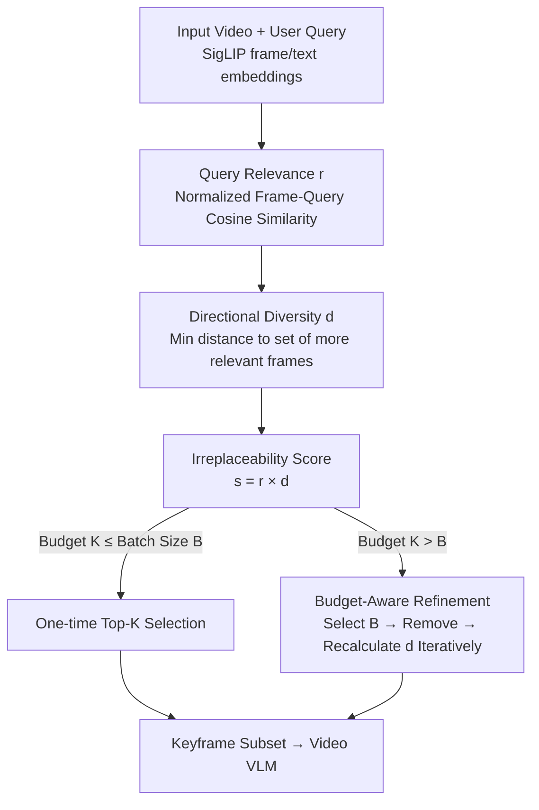

# GIFT: Global Irreplaceability Frame Targeting for Efficient Video Understanding

**Conference**: CVPR 2026  
**Paper**: [CVF Open Access](https://openaccess.thecvf.com/content/CVPR2026/html/Ma_GIFT_Global_Irreplaceability_Frame_Targeting_for_Efficient_Video_Understanding_CVPR_2026_paper.html)  
**Code**: None (Repository not publicly released)  
**Area**: Video Understanding / Video Large Language Model Efficiency  
**Keywords**: Keyframe Selection, Video VLM, Training-free, Global Irreplaceability, Long Video Understanding

## TL;DR
GIFT is a training-free keyframe selection framework that reformulates the problem of "which frames to feed into a Video VLM" from a greedy frame-by-frame addition to a global evaluation of each frame's "irreplaceability" (high relevance $\times$ visual isolation among more relevant frames). Utilizing "Budget-Aware Refinement," it gradually recovers temporal context as the frame budget increases, achieving a maximum average improvement of 12.5% over uniform sampling on LLaVA-Video-7B.

## Background & Motivation
**Background**: Video Large Language Models (Video VLMs, such as LLaVA-Video, Qwen2.5-VL) decompose videos into a sequence of images to be processed by an LLM. However, dense sampling generates a massive amount of visual tokens, leading to an explosion in memory consumption and latency due to the quadratic complexity of self-attention. To reduce costs, the majority of models employ **uniform sampling** (selecting frames at equal time intervals) to decrease the number of input frames.

**Limitations of Prior Work**: Uniform sampling treats all frames equally, ignoring the fact that "key information is often concentrated in a few moments." Consequently, a large number of redundant or query-irrelevant frames are included—wasting computational budget and distracting the model's attention from critical information, which often leads to performance degradation. While keyframe selection has become a research focus, existing training-free methods (e.g., BOLT, AKS, MDP3) suffer from two fundamental flaws.

**Key Challenge**: The authors categorize these issues as "philosophical design flaws." First is the **Myopia of greedy decision-making**: Current methods make locally optimal and irrevocable choices at each step based on the current state. Lacking a global perspective, an early sub-optimal decision propagates and amplifies through the selection sequence, eventually trapping the system in a local optimum. Second is the **Fragility of Decoupled Criteria**: "Query relevance" and "content diversity" are treated as independent objectives balanced by a manually tuned hyperparameter $\lambda$. Pursuing diversity often sacrifices temporal coherence and introduces noisy frames. More critically, once a sub-optimal frame is incorrectly selected due to a slight diversity advantage, the truly optimal frame may be permanently excluded by the diversity mechanism because it is "too similar to the sub-optimal frame."

**Goal**: To find a unified criterion that measures the value of each frame from a global perspective, simultaneously accounting for relevance, diversity, and temporal coherence, while remaining training-free and plug-and-play for various VLMs.

**Key Insight**: The authors change the question. While greedy methods ask, "Which frame is the best to add next?", GIFT asks a stronger question: "Does a better substitute exist for this frame?". For a frame $F_i$, a "better substitute" is any frame $F_j$ that is **visually similar and more query-relevant**; if such an $F_j$ exists, the contribution of $F_i$ is essentially redundant.

**Core Idea**: Quantify the **global irreplaceability** of each frame by determining "if a better substitute exists." This redefines diversity as a **directional concept conditioned on relevance**, thereby transforming the "balancing of two metrics" into "maximizing a single unified attribute."

## Method

### Overall Architecture
GIFT takes a video and a user query as input and outputs a subset of keyframes within a budget $K$. The entire pipeline is training-free. First, a pre-trained SigLIP extracts visual embeddings $f_i$ for each frame and a text embedding $q$ for the query (128 candidate frames are uniformly sampled initially for efficiency). The process then operates in two stages:

**Stage 1 (Initial Selection)**: Two quantities are calculated for each candidate frame—query relevance $r_i$ (normalized cosine similarity with the query) and **directional diversity** $d_i$ (the minimum distance to the set of "all frames more relevant than it"). Their product yields the irreplaceability score $s_i = r_i \times d_i$. The frames with the highest scores are selected.

**Stage 2 (Budget-Aware Refinement, BAR)**: If the frame budget $K$ exceeds the batch size $B$, iterative refinement is triggered. In each round, a small batch of $B$ frames is selected and removed from the candidate pool; $d_i$ is then recalculated for the remaining frames. This cycles until $K$ frames are selected. Removing selected frames releases their "suppression" of neighboring frames, allowing adjacent frames that are critical for temporal context to emerge.

The workflow is illustrated below:

### Key Designs

**1. Directional Diversity: Transforming Diversity into a Relevance-Conditioned "Search for Substitutes"**

This is the core innovation addressing the "decoupled criteria" issue. Traditional diversity measures the (average or minimum) distance from one frame to **all** other frames, aiming for "visual novelty." This often results in noisy, query-irrelevant frames (e.g., static empty shots, blurred frames) being selected as "diverse." GIFT redefines diversity as **unidirectional and directional**: it only measures the minimum distance from a frame $F_i$ to its "set of potential substitutes" $C_i$, where $C_i$ is defined as **all frames with higher query relevance than $F_i$**. Formally:

$$d_i = \begin{cases} \min_{j \in C_i}\ \lVert f_i - f_j\rVert_2^2, & C_i \neq \varnothing \\ \max_{F_j,F_k \in F_v}\ \lVert f_j - f_k\rVert_2^2, & C_i = \varnothing \end{cases}, \quad C_i = \{j \mid r_j > r_i\}$$

where $r_i$ is the normalized relevance. This conditional formula is highly discriminative: a small $d_i$ indicates that a "better substitute" $F_j$ with higher relevance exists in its visual vicinity, making $F_i$ redundant and resulting in a strong penalty. A large $d_i$ indicates that either the frame is the most relevant in the video ($C_i = \varnothing$, no one can challenge it) or that more relevant frames are visually far away, meaning it carries unique information. The key difference is that while traditional diversity seeks "visual novelty," directional diversity seeks "true informational uniqueness" by anchoring diversity with relevance.

**2. Irreplaceability Score and Global Selection: Collapsing Combinatorial Optimization into Top-K Ranking**

To address the "greedy myopia," the authors multiply the two components of frame importance to obtain a global static score:

$$s_i = r_i \times d_i$$

Multiplication ensures that only frames that are **both highly relevant (large $r_i$) and unique relative to potential substitutes (large $d_i$)** receive the highest priority. If either component is low, the score is suppressed. The elegance lies in the fact that because the irreplaceability of each frame is a **static score** calculated based on a global evaluation, the NP-hard combinatorial optimization problem of "maximizing subset total score" **collapses into simply picking the $K$ highest-scoring frames**. This provides a global perspective while avoiding error accumulation from greedy selection.

**3. Budget-Aware Refinement (BAR): Recovering Temporal Context via "Select-Remove-Re-evaluate" Iteration**

While the irreplaceability score excels at identifying the most critical moments, its inherent suppression of visually similar frames can **harm temporal context**. Tasks requiring fine-grained temporal reasoning, such as a "goal-scoring moment," need consecutive frames of the shooting action. Frames adjacent to a keyframe might be suppressed due to being "too similar to the keyframe." Furthermore, as the budget increases, the algorithm might be forced to select isolated, low-relevance noisy frames with "artificially high directional diversity" instead of secondary frames that are more relevant but suppressed.

The core principle of BAR is to **shift the selection focus as the budget increases**: at low budgets, it prioritizes maximizing key information coverage; as the budget grows, the focus shifts toward supplementing temporal context around selected keyframes. This is implemented via a `select → remove → re-evaluate` iteration: in each round, the top $B$ frames $\mathcal{B} = \arg\max^b_{i \in I_{cand}} s_i$ are selected and removed from the candidate pool, and **$d_i$ and $s_i$ are recalculated for all remaining frames** before the next round. Removing a selected keyframe releases its suppression of neighboring frames, allowing those critical to context to rise in score in subsequent rounds.

### An Example: A Goal Segment
Suppose the query is "Who scored the third goal?". In the first round, the frame where "the ball crosses the goal line" is selected due to extremely high query relevance. Without refinement, other frames of the shooting action would be suppressed by this keyframe (visual similarity $\rightarrow$ low $d$ $\rightarrow$ low $s$). The model might see the ball entering the net but not the player who shot it. With BAR, as the budget allows, the "goal line frame" is removed from candidates, releasing suppression. The $d_i$ for adjacent frames (jumping, kicking) increases upon recalculation, leading to their selection in later rounds. Ultimately, the model receives the complete action sequence to answer "white jersey number 10."

## Key Experimental Results

### Main Results
Using LLaVA-Video-7B as the base model, GIFT was compared against uniform sampling, BOLT (CVPR2025), and AKS (CVPR2025) across four benchmarks (MVBench / LongVideoBench / MLVU / VideoMME). The table below shows the average scores (%, normalized to LLaVA-Video with 64 frames = 100%):

| Frame Budget | Uniform Sampling | BOLT | AKS | GIFT (Ours) |
|--------------|------------------|------|-----|-------------|
| 32           | 96.5             | 100.0| 98.9| **100.6**   |
| 16           | 93.4             | 97.8 | 97.0| **99.2**    |
| 8            | 90.6             | 93.9 | 94.9| **97.3**    |
| 4            | 85.6             | 89.6 | 91.7| **93.9**    |

GIFT leads across all budgets, with the advantage becoming more pronounced as the budget tightens. At only 4 frames, it retains 93.9% of the 64-frame performance, outperforming uniform sampling by 8.3%.

Plug-and-play across models (8-frame budget, absolute improvement indicated by $\rightarrow$):

| Model | LongVideoBench | MLVU | VideoMME-Overall |
|-------|----------------|------|------------------|
| VILA-V1.5 + GIFT | 47.1→50.9 (+3.8) | 49.8→56.7 (+6.9) | 48.4→52.8 (+4.4) |
| LLaVA-OneVision + GIFT | 54.3→59.6 (+5.3) | 58.5→67.3 (+8.8) | 53.9→58.8 (+4.9) |
| Qwen2.5-VL + GIFT | 52.7→58.3 (+5.6) | 53.8→62.8 (+9.0) | 53.6→58.1 (+4.5) |
| VideoLLaMA3 + GIFT | 54.8→59.2 (+4.4) | 59.1→70.7 (+11.6) | 59.1→63.6 (+4.5) |

Even on stronger baselines like Qwen2.5-VL and VideoLLaMA3, GIFT provides significant gains, proving it is a model-agnostic module.

### Ablation Study
Breakdown of two core modules (LLaVA-Video, 32 frames) and sensitivity of batch size $B$ in BAR:

| Configuration / Setting | Key Metric | Description |
|-------------------------|------------|-------------|
| Full GIFT | LVB 103.8% | Complete model |
| Standard Diversity replacing Directional Diversity | LVB 101.7% | Reverting to mean distance; prone to noisy frames |
| Without BAR (Static One-time Scoring) | MLVU −2.7% | Initial suppression is fixed; forced to select isolated noise |
| BAR $B=6$ | Avg 62.5 | Re-evaluation too frequent; over-concentrates on early context |
| BAR $B=9$ (Default) | Avg **62.6** | Optimal granularity |
| BAR $B=12$ | Avg 61.9 | Approximates one-time selection; suppression release is delayed |

### Key Findings
- **Directional Diversity is the primary engine**: Changing to relevance-independent standard diversity causes performance on LongVideoBench to drop from 103.8% to 101.7%. Traditional diversity selects noise; conditioning diversity on relevance is key to robustness.
- **BAR primarily assists temporal tasks**: Removing it drops MLVU by 2.7%. It solves the problem where static scoring over-suppresses neighbors, forcing the selection of noisy frames.
- **越缺帧越占便宜 (Higher relative gain at low budgets)**: At 4 frames, GIFT retains 93.9% performance because its global perspective is naturally robust to redundancy and noise.

## Highlights & Insights
- **"Directionalizing" diversity is the true turning point**: Traditional methods aim for "being different from everyone." GIFT changes this to "I only look for substitutes among those more relevant than me," cleanly separating visual novelty from informational uniqueness.
- **Multiplication + Global Static Score simplifies complexity**: $s = r \times d$ allows the NP-hard optimization to collapse into a Top-K ranking, saving computation and avoiding greedy error propagation.
- **"Remove-to-De-suppress" achieves budget adaptation**: Iteratively removing selected frames dynamically releases suppression on neighbors, allowing the algorithm to transition from "capturing key points" to "restructuring narrative chains" without extra hyperparameters.
- **Completely training-free and plug-and-play**: It relies solely on off-the-shelf SigLIP features and can be applied to any VLM with nearly zero integration cost.

## Limitations & Future Work
- **Dependency on SigLIP feature quality**: Relevance and diversity are entirely built on SigLIP's embeddings. If the encoder has weak alignment for specific video types (e.g., poor quality), the irreplaceability score may be distorted.
- **128-frame candidate cap**: For efficiency, it samples 128 frames first. For ultra-long videos (hours), this first step might miss critical moments.
- **Isolated noisy frame risk**: In Phase 1, an isolated low-relevance frame might still be selected due to an artificially high $d$. BAR mitigates but does not fully eliminate this mechanism-level weakness.

## Related Work & Insights
- **vs. Uniform Sampling**: GIFT selects frames based on importance rather than fixed intervals, performing stronger across all budgets, especially when frames are scarce.
- **vs. BOLT (CVPR2025)**: BOLT uses inverse transform sampling from a cumulative distribution of query relevance; GIFT uses deterministic global scoring, avoiding the variance of probabilistic sampling.
- **vs. AKS (CVPR2025)**: AKS uses recursive partitioning to balance relevance and temporal coverage via local decisions; GIFT unifies these into a single score using relevance-conditioned directional diversity.

## Rating
- Novelty: ⭐⭐⭐⭐⭐ "Directionalizing" diversity and collapsing combinatorial optimization into ranking is a significant perspective-level innovation.
- Experimental Thoroughness: ⭐⭐⭐⭐ Extensive coverage of 4 benchmarks, 4 budgets, and 5 VLMs, though direct comparisons with more SOTAs (e.g., MDP3) in the same table are missing.
- Writing Quality: ⭐⭐⭐⭐⭐ Motivation, formulas, algorithms, and ablations are logically linked; the goal-scoring example is intuitive.
- Value: ⭐⭐⭐⭐⭐ Training-free, plug-and-play, and significant gains in low-frame scenarios make it highly practical for long-video deployment.

<!-- RELATED:START -->

## Related Papers

- [\[CVPR 2026\] Efficient Frame Selection for Long Video Understanding via Reinforcement Learning](efficient_frame_selection_for_long_video_understanding_via_reinforcement_learnin.md)
- [\[ACL 2026\] CRAFT: Critic-Refined Adaptive Key-Frame Targeting for Multimodal Video Question Answering](../../ACL2026/video_understanding/craft_critic-refined_adaptive_key-frame_targeting_for_multimodal_video_question_.md)
- [\[CVPR 2026\] DIvide, then Ground: Adapting Frame Selection to Query Types for Long-Form Video Understanding](divide_then_ground_adapting_frame_selection_to_query_types_for_long-form_video_u.md)
- [\[CVPR 2026\] Thinking with Drafts: Speculative Temporal Reasoning for Efficient Long Video Understanding](thinking_with_drafts_speculative_temporal_reasoning_for_efficient_long_video_und.md)
- [\[CVPR 2026\] Token Reduction via Local and Global Contexts Optimization for Efficient Video Large Language Models](token_reduction_via_local_and_global_contexts_optimization_for_efficient_video_l.md)

<!-- RELATED:END -->
