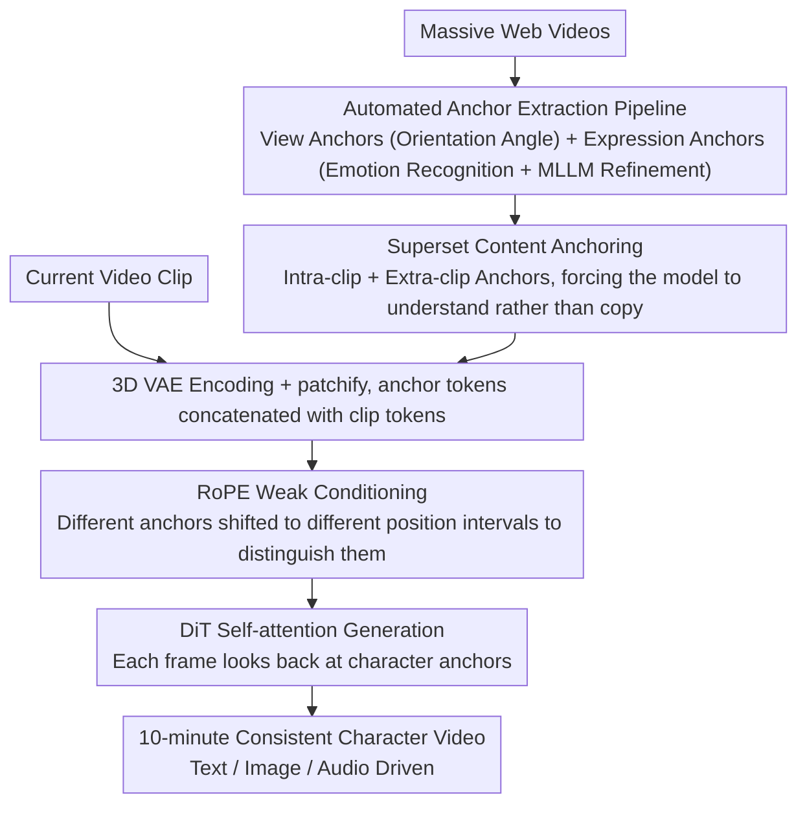

# Gloria: Consistent Character Video Generation via Content Anchors

**Conference**: CVPR 2026  
**arXiv**: [2603.29931](https://arxiv.org/abs/2603.29931)  
**Code**: [https://yyvhang.github.io/Gloria_Page/](https://yyvhang.github.io/Gloria_Page/)  
**Area**: Video Understanding / Video Generation  
**Keywords**: Character Video Generation, Consistency, Content Anchors, Diffusion Models, Long Video

## TL;DR

Gloria proposes using a compact set of "Content Anchors" to represent the multi-view appearance and expression identity of a character. Through two mechanisms—superset content anchoring (to prevent copy-pasting) and RoPE weak conditioning (to distinguish multiple anchors)—it achieves consistent character video generation exceeding 10 minutes.

## Background & Motivation

Digital character video generation faces a triple challenge: long-term consistency, multi-view appearance consistency, and expression identity consistency. Existing methods use a single reference image or text prompts, but these inputs contain insufficient character information to maintain long-term consistency. Some methods introduce pre-selected or generated frames as "memory," but these frames are often not character-centric and lack a semantic basis.

**Key Insight**: Character video generation is essentially a "look-at-appearance" scenario—character visual attributes can be compactly represented by a structured set of anchor frames, while motion is learned from short video clips.

**Key Challenge**: (1) How to inject anchor frames to avoid simple copy-pasting; (2) How to use multiple anchor frames simultaneously to avoid conflict; (3) How to efficiently extract anchor frames from large volumes of video.

## Method

### Overall Architecture

Gloria aims to solve the problem of a digital character "looking the same and matching expressions" consistently across long videos at the 10-minute level. The approach first decomposes the character into a small set of **Content Anchors**—representative images covering the overall scene, different perspectives, and different expressions, serving as the character's "visual ID card." Movement is handled by a video diffusion model learning from short segments. The pipeline consists of three stages: first, an **automated anchor frame extraction pipeline** automatically selects view anchors and expression anchors from massive video data; during training, these anchors and the current video clip are encoded into tokens via a 3D VAE and concatenated into the same sequence for the DiT self-attention, allowing the model to "look back" at the character's appearance while generating each frame. Here, **Superset Content Anchoring** and **RoPE Weak Conditioning** are used to manage injection quality. During inference, the injection mechanism remains the same, while inputs can be text, reference images, or audio for driving the generation. The difficulty lies not in the "injection" itself, but in injecting such that the model does not lazily copy and multiple anchors do not conflict.

### Key Designs

**1. Automated Anchor Frame Extraction Pipeline: Enabling Scalable "Anchor Selection"**

The subsequent two mechanisms are built on the premise of having "a set of good anchors." Manually selecting representative frames with varied views and expressions from videos cannot scale to the data volume required for training. Thus, this offline pipeline is the starting point of the data flow and the prerequisite for making the method practical. It automatically produces anchors via two paths: *View anchors* use GVHMR to estimate the character's orientation relative to the camera, categorizing views (front, back, left, right) based on angular thresholds. *Expression anchors* first use emotion recognition (EmotiEffLib) to detect candidate frames, then employ an MLLM (Gemini) for refinement to filter frames inconsistent with the target emotion (improving accuracy from 66% to 82%). Additionally, global anchors capturing the overall scene are randomly sampled. The entire process requires no human intervention, allowing it to be directly applied to large-scale video for training set construction.

**2. Superset Content Anchoring: Forcing the Model to Understand Anchors Rather Than Copy**

Once anchors are obtained, the most direct injection method is providing an anchor highly corresponding to the current clip during training. However, this allows the model to take a shortcut—it discovers that "output ≈ copy the most similar anchor" reduces loss, leading to a degradation into nearest-neighbor search and texture pasting; consistency collapses once the view or expression deviates from the anchor. Gloria's strategy is to provide a **superset**: the anchors given for each training clip include both "intra-clip" frames (which are relevant) and "extra-clip" frames sampled from different moments of the same character in the original long video (relevant but not matching). By mixing redundant information that cannot be directly copied, the model must truly understand the semantics of "this is the same character's face/clothing" rather than staying at pixel-level alignment. This step is the key to preventing copy-pasting in the method; removing it causes consistency to collapse and copy artifacts to become severe in ablation studies.

**3. RoPE Weak Conditioning: Preventing Conflict Among Multiple Anchors**

Anchors encoded by 3D VAE and patchified are concatenated with video clip tokens into a sequence for self-attention. A new problem is that the model cannot distinguish between them once concatenated, and conflicting appearance information mixed together creates confusion. Gloria does not add a set of strong constraints (e.g., separate cross-attention heads for each anchor). Instead, it leverages the model's existing Rotary Positional Encoding (RoPE): different types of anchors are assigned different temporal offsets, shifting them into different intervals of RoPE position coordinates. The model can then reliably distinguish them based on positional cues. It is called "weak" conditioning because it only provides hints that "these are from different sources" without mandating which anchor must correspond to which part of the output, leaving room for adaptive utilization. Combined with mixed-ratio training (randomly providing 0 to N anchors), the model learns to use a single anchor as well as coordinate multiple ones. Experiments show this weak distinction performs better than strong constraints, which limit flexibility.

### Loss & Training

Training follows the standard denoising loss of video diffusion models, fine-tuning on a pre-trained video diffusion backbone without introducing auxiliary objectives. A key technique is the mixed-ratio training mentioned above: each sample randomly samples 0 to N anchor frames as conditions, allowing the same model to smoothly cover the range from "no-anchor text-to-video" to "multi-anchor strong constraint," enabling flexible adaptation to different inputs during inference.

## Key Experimental Results

### Main Results

| Method | Max Duration | Multi-view Consistency | Expression Consistency | Identity Preservation |
|------|---------|------------|-----------|---------|
| WanS2V/FramePack | ~1 min | Fair | Fair | Fair |
| Gloria | **10+ min** | **Excellent** | **Excellent** | **Excellent** |

The generated character videos exceed 10 minutes, surpassing existing methods in multi-view appearance and expression identity consistency.

### Ablation Study

| Configuration | Consistency | Copy-Paste Problem | Description |
|------|-------|-------------|------|
| w/o Superset Anchoring | Poor | Severe | Directly copies the most similar anchor |
| w/o RoPE Weak Conditioning | Moderate | Moderate | Confusion between multiple anchors |
| Full Gloria | Optimal | None | Two mechanisms work synergistically |

### Key Findings

- Superset anchoring is the key to preventing copy-pasting—without it, the model degenerates into nearest-neighbor search and copying.
- The positional distinction of RoPE weak conditioning is more effective than strong conditions (such as different cross-attention heads), as the latter limit flexibility.
- The automated anchor extraction pipeline makes the construction of large-scale training data possible.

## Highlights & Insights

- **Anchors as Character "ID Cards"**: Using a small number of representative frames to capture all visual attributes of a character is more intuitive than embeddings and more compact than full videos.
- **Superset Avoids Shortcut Learning**: By providing redundant and non-matching conditions, the model is forced to learn semantic-level understanding rather than pixel-level copying.
- **10-minute Long Video**: This represents a significant duration breakthrough in current character video generation.

## Limitations & Future Work

- The number of anchors is limited; it may be insufficient for extremely complex clothing details (e.g., changing patterns).
- Currently primarily oriented towards single characters; multi-character scenarios have not been fully explored.
- Audio-driven lip-sync quality is limited by the underlying model.
- Future work could explore 3D-aware anchor representations.

## Related Work & Insights

- **vs WanS2V (FramePack)**: WanS2V aggregates multiple frames but lacks a structured character representation; Gloria proposes the concept of semantically clear anchors.
- **vs Animate Anyone/MagicAnimate**: These methods rely on a single reference image, which provides insufficient information to maintain long-term consistency.
- **vs ConsisID/UniAnimate**: These focus on short-term consistency, while Gloria achieves long-term consistency at a 10-minute scale.

## Rating

- Novelty: ⭐⭐⭐⭐ The content anchor concept and superset anchoring mechanism are creative.
- Experimental Thoroughness: ⭐⭐⭐⭐ Qualitative results are rich, though quantitative evaluation could be more comprehensive.
- Writing Quality: ⭐⭐⭐⭐ Concept explanations are clear.
- Value: ⭐⭐⭐⭐⭐ Direct application value for the digital human and virtual character industries.

<!-- RELATED:START -->

## Related Papers

- [\[CVPR 2026\] DeRVOS: Decoupling Consistent Trajectory Generation and Multimodal Understanding for Referring Video Object Segmentation](dervos_decoupling_consistent_trajectory_generation_and_multimodal_understanding_.md)
- [\[CVPR 2026\] First Frame Is the Place to Go for Video Content Customization](first_frame_is_the_place_to_go_for_video_content_customization.md)
- [\[CVPR 2026\] Image Guides Images: Consistent Video Amodal Completion with Rectified In-Context Exemplar Guidance](image_guides_images_consistent_video_amodal_completion_with_rectified_in-context.md)
- [\[CVPR 2026\] FlashMotion: Few-Step Controllable Video Generation with Trajectory Guidance](flashmotion_fewstep_controllable_video_generation.md)
- [\[CVPR 2026\] PyraTok: Language-Aligned Pyramidal Tokenizer for Video Understanding and Generation](pyratok_language-aligned_pyramidal_tokenizer_for_video_understanding_and_generat.md)

<!-- RELATED:END -->
