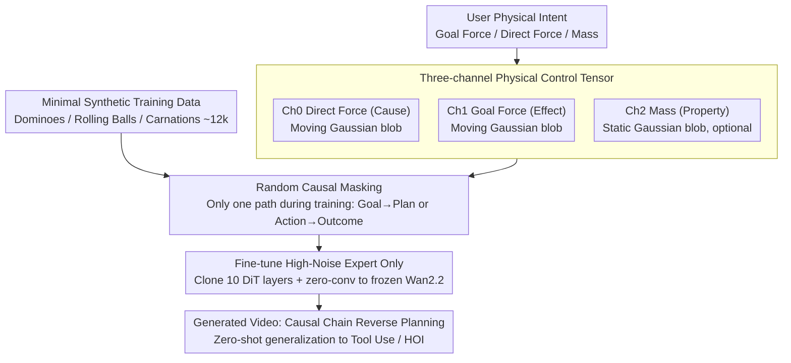

# GoalForce: Teaching Video Models to Accomplish Physics-Conditioned Goals

**Conference**: CVPR 2026  
**arXiv**: [2601.05848](https://arxiv.org/abs/2601.05848)  
**Code**: [goal-force.github.io](https://goal-force.github.io/)  
**Area**: Video Understanding  
**Keywords**: Video Generation, Physics-Conditioned Goals, world model, Force Prompting, Causal Reasoning

## TL;DR

Proposes the Goal Force framework which trains video generation models on simple synthetic data using multi-channel physical control signals (goal force, direct force, mass). This enables models to learn reverse planning of causal chains from target effects, achieving zero-shot generalization to complex real-world scenarios such as tool use and human-object interaction.

## Background & Motivation

Video generation models can serve as "world models" for planning and simulation, but existing goal specification methods have limitations:
- **Text instructions** are too abstract to describe precise physical details (e.g., a soccer player does not just "shoot," but kicks with a specific force and angle).
- **Target images** are often difficult to obtain or unrealistic (e.g., impossible to render precise lighting of a ball entering a net beforehand).
- Existing force-conditioned methods (PhysGen, Force Prompting) only support "direct force" (apply force $\rightarrow$ observe result) and cannot perform "goal force" (specify desired result $\rightarrow$ plan causal action).

Human reasoning for physical tasks is closer to **goal force**: during a penalty kick, one thinks of the specific trajectory and speed of the ball rather than precise pixel coordinates. Inspired by this, this paper proposes a paradigm shift from "specifying effects" to "generating causes."

## Method

### Overall Architecture

GoalForce aims to let video generation models reason about physical tasks like humans: instead of passively executing "how much force to apply," it takes a "desired result" (goal force) and back-infers the necessary causal actions. Based on Wan2.2 (MoE Diffusion) + ControlNet, it encodes physical intent into multi-channel control signals and employs a "random causal masking" training strategy to force the model to learn causal chain planning on simple synthetic data, which then generalizes zero-shot to complex scenarios.

### Key Designs

**1. Three-channel Physical Control Tensor: Orthogonal signals for causes, effects, and properties**

Since text is too abstract and target images are hard to acquire, GoalForce uses a control tensor $\tilde{\pi} \in \mathbb{R}^{f \times 3 \times h \times w}$ to express physical intent. Channel 0 (Direct Force) encodes the applied force as the "cause," represented by a moving Gaussian blob whose trajectory and duration are proportional to the force vector. Channel 1 (Goal Force) encodes the desired "effect," using a moving blob to represent the target object's desired motion. Channel 2 (Mass) encodes properties like mass using static blobs with radii proportional to the mass. These three orthogonal channels correspond to the dimensions of "cause, effect, and property."

**2. Random Causal Masking: Forcing the model to learn bidirectional reasoning**

If both cause and effect are provided during training, the model may simply copy the signals without learning to plan. The key training strategy involves randomly keeping only one path for videos involving collisions: either providing the direct force (Ch0) or the goal force (Ch1), while zeroing the other. The mass channel is also randomly masked. Consequently, the model is forced to perform bidirectional reasoning—planning (Goal $\rightarrow$ Plan) to infer the causal direct force when given a goal, or predicting outcomes (Action $\rightarrow$ Outcome) when given a direct force.

**3. Minimal Synthetic Training Data: Causal understanding from ~12k simple videos**

GoalForce does not require complex real-world scenes. It uses three categories of Blender synthetic data: 3k dominoes (direct force $\rightarrow$ chain reaction $\rightarrow$ goal force), 6k rolling balls (4.5k collisions + 1.5k non-collisions), and 3k PhysDreamer carnations (non-rigid dynamics). Despite the simplicity, the clean causal structures combined with the masking strategy allow physical planning capabilities to emerge and generalize.

**4. Fine-tuning High-Noise Expert: Injecting control into global dynamics**

ControlNet only fine-tunes the High-Noise Expert responsible for global structure and low-frequency dynamics by cloning the first 10 DiT layers and connecting them to the frozen base model via zero-convolutions. Since causal planning primarily affects global motion trends rather than texture details, targeting this specific branch is efficient. Training is completed in only 3000 steps using $4 \times A100$ GPUs in under 48 hours.

### Loss & Training

The ControlNet is trained using standard diffusion loss on videos of 81 frames @ 16 FPS. Text prompts only provide semantic context (e.g., "a pool table") without specifying low-level causal plans. Force and mass values use relative normalization instead of absolute physical scales.

## Key Experimental Results

### Main Results

Human study (N=40, 2AFC) comparing Goal Force vs. text-only baselines:

| Benchmark Category | Force Adh. | Realism | Visual Qual. |
|---------|-----------|---------|-------------|
| Two-object collision | **73.4%** | 67.2% | 66.0% |
| Multi-object collision | **72.0%** | 69.0% | 66.8% |
| Human-Object Interaction | **70.5%** | 47.5% | 48.9% |
| Tool-Object Interaction | **74.5%** | 61.6% | 58.7% |

(Percentages indicate the preference rate for Goal Force)

Physical planning accuracy (50 generations/scenario):

| Scenario | Valid Count | Success Count | Accuracy |
|------|--------|--------|--------|
| Pool | 49 | 48 | 97.96% |
| Paper Balls | 50 | 49 | 98.00% |
| Kitchen Lemon | 50 | 50 | 100.00% |
| Coffee Cups | 44 | 41 | 93.18% |
| Duckie | 40 | 34 | 85.00% |
| Rubik's Cube | 49 | 46 | 93.88% |

The model significantly outperforms the random baseline (max 33.3%).

### Ablation Study

Planning diversity experiment (6 dominoes, 5 possible initiators):

| Distribution | Diversity Score $\delta(p)$ |
|------|-----------------|
| **Goal Force Model** | **0.6577** |
| Unif{0..4} (Max Diversity) | 1.0000 |
| Unif{0..1} | 0.6042 |
| Deterministic Baseline | 0.3900 |

The model samples among multiple valid plans, avoiding mode collapse.

Mass-aware experiment: By changing the mass of the projectile and the target ball, the model correctly adjusts the projectile's velocity (satisfying 4/4 relations in-distribution and 3/4 relations out-of-distribution).

### Key Findings

- **Surprising Zero-Shot Generalization**: Despite training only on synthetic balls, dominoes, and a single flower, the model generalizes to complex scenarios like hitting a golf ball with a club or holding a rose.
- The model learns to pick up a rose by the stem rather than the petals and selects initiators not blocked by obstacles.
- Text prompts are insufficient for specifying goal forces—the fine-tuned text-only baseline significantly lags in Force Adherence.
- Prior force-conditioned methods (PhysGen, PhysDreamer, Force Prompting) misinterpret goal force as direct force and fail to plan causal chains.

## Highlights & Insights

1. The **paradigm shift from "specifying causes" to "specifying effects"** is highly insightful: Goal Force enables effect-oriented planning where the model autonomously reasons about causal chains.
2. The emergence of complex planning from **minimal synthetic data (~12k videos) and short training (3000 steps)** suggests that physical causality is highly efficient to learn given the correct inductive bias.
3. The **multi-channel control signal design** is elegant, decomposing physical control into orthogonal dimensions and enabling bidirectional reasoning via masking.
4. Concept of an **Implicit Neural Physics Simulator**: The model acts as an approximate physical planner during inference without relying on external physics engines.

## Limitations & Future Work

- Force and mass use relative normalization, making it difficult to unify physical scales across different domains.
- Training data only covers simple collisions and non-rigid dynamics; generalization to complex phenomena like fluids or large deformations remains unverified.
- Limitations in video resolution and length (81 frames) restrict the exploration of long-horizon causal chains.
- Lower Motion Realism (47.5%) and Visual Quality (48.9%) in human-object interaction scenarios highlight challenges in generalizing to human motion.
- Integration with actual robotic control has not yet been explored.

## Related Work & Insights

- Complementary to video planning methods like UniPi and Adapt2Act by providing physical goal specification beyond text.
- The paradigm of "synthetic simple data $\rightarrow$ complex generalization" can be extended to other video generation tasks requiring physical understanding.
- Concurrent works (Learning 3D Trajectories, Freefall fine-tuning) focus on local physical properties, whereas GoalForce focuses on causal interaction chains.

## Rating

- Novelty: ⭐⭐⭐⭐⭐ — The shift from "applied force" to "goal force" is highly original.
- Experimental Thoroughness: ⭐⭐⭐⭐ — Comprehensive validation via human studies, accuracy, diversity, and mass awareness.
- Writing Quality: ⭐⭐⭐⭐⭐ — Precise analogies (e.g., soccer penalty kick) and clear visual comparisons.
- Value: ⭐⭐⭐⭐⭐ — Opens a new direction for physics-conditioned video planning with broad potential applications.

<!-- RELATED:START -->

## Related Papers

- [\[CVPR 2026\] Hear What Matters! Text-conditioned Selective Video-to-Audio Generation](hear_what_matters_text-conditioned_selective_video-to-audio_generation.md)
- [\[CVPR 2026\] MaskAdapt: Learning Flexible Motion Adaptation via Mask-Invariant Prior for Physics-Based Characters](maskadapt_learning_flexible_motion_adaptation_via_mask-invariant_prior_for_physi.md)
- [\[CVPR 2026\] Learning to Assist: Physics-Grounded Human-Human Control via Multi-Agent Reinforcement Learning](learning_to_assist_physics-grounded_human-human_control_via_multi-agent_reinforc.md)
- [\[CVPR 2026\] UniVBench: Towards Unified Evaluation for Video Foundation Models](univbench_towards_unified_evaluation_for_video_foundation_models.md)
- [\[CVPR 2026\] InternVideo-Next: Towards World-Understanding Video Models](internvideo-next_towards_world-understanding_video_models.md)

<!-- RELATED:END -->
