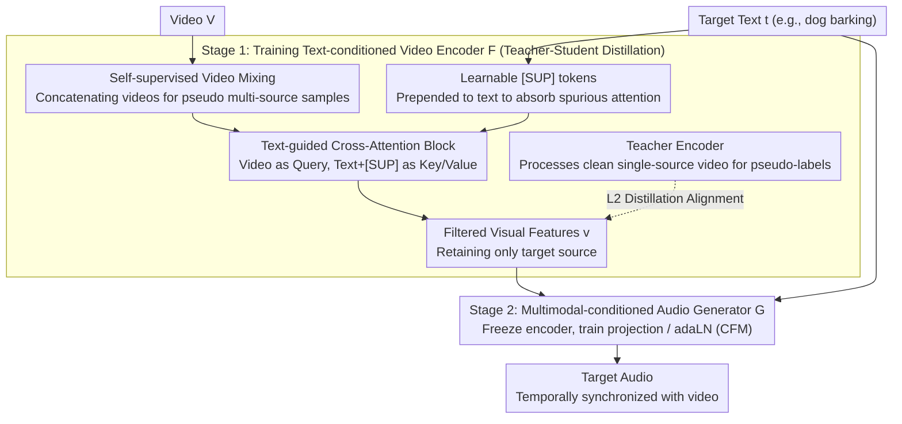

# Hear What Matters! Text-conditioned Selective Video-to-Audio Generation

**Conference**: CVPR 2026  
**arXiv**: [2512.02650](https://arxiv.org/abs/2512.02650)  
**Code**: [https://jnwnlee.github.io/selva-demo/](https://jnwnlee.github.io/selva-demo/)  
**Area**: Video Understanding / Audio Generation  
**Keywords**: Selective Audio Generation, Video-to-Audio, Text-conditioned, Cross-modal Attention, Self-supervised Video Mixing

## TL;DR

SelVA introduces a text-conditioned selective video-to-audio (V2A) generation task. By utilizing learnable supplementary tokens [SUP] and a self-supervised video mixing strategy, the model selectively generates target sounds specified by text prompts from multi-source videos, outperforming existing methods in audio quality, semantic alignment, and temporal synchronization.

## Background & Motivation

1. **Background**: Substantial progress has been made in V2A generation, with models like MMAudio and ReWaS producing synchronized audio from video content. However, these methods typically generate a monolithic audio track containing all sound sources simultaneously.

2. **Limitations of Prior Work**: In professional audio production (Foley), designers require individual tracks for each sound source to facilitate separate mixing. Current V2A models only produce a single mixed track, necessitating a complete re-synthesis even for minor adjustments to a single sound, which limits practical utility.

3. **Key Challenge**: Existing approaches utilize frozen visual encoders that extract features representing all objects (including those irrelevant to the target sound), preventing the generator from selectively producing only the target audio. Text is treated as an auxiliary semantic supplement rather than an explicit selector for sound sources.

4. **Goal**: (1) How to use text as an explicit selector to extract only target-related visual features from multi-source videos? (2) How to train selective generation capabilities without single-source labeled data? (3) How to design efficient encoder fine-tuning strategies to avoid spurious correlations in attention mechanisms?

5. **Key Insight**: Inspired by human selective auditory attention, models should focus on specific sound sources guided by text. Furthermore, observing the high-norm artifact issue in ViT (where attention clusters on irrelevant tokens), the authors propose using extra tokens to absorb these spurious attentions.

6. **Core Idea**: Reposition text prompts as explicit modulators of visual features. By suppressing irrelevant visual activations via learnable [SUP] tokens and employing a self-supervised video mixing strategy, the model achieves selective audio generation without requiring single-source annotations.

## Method

### Overall Architecture

SelVA aims to isolate specific sounds from a video with multiple sources (e.g., generating only "dog barking" from a video containing both a cat and a dog). The pipeline consists of two modules: a **text-conditioned video encoder** $\mathcal{F}$ filters irrelevant visual information, and a **multimodal-conditioned audio generator** $\mathcal{G}$ synthesizes audio from the filtered features, formulated as $A_i = \mathcal{G}(\mathcal{F}(V, \mathbf{t}_i), \mathbf{t}_i)$. Text $\mathbf{t}_i$ serves as a dual input to both the encoder (determining what to see) and the generator (determining what to produce). Training is decoupled into two stages: Stage 1 involves teacher-student distillation for the encoder, and Stage 2 freezes the encoder to train the generator.

### Key Designs

**1. Text-guided Cross-Attention Block: Enabling "Selective Vision"**

Traditional V2A methods extract all object features indiscriminately. SelVA inserts a lightweight cross-attention layer after the frozen Synchformer spatio-temporal attention blocks. Using video hidden vectors $\mathbf{h_v}$ as Query and text embeddings $\bar{\mathbf{t}}$ as Key/Value ($\mathbf{h_{vt}} = \text{Cross-Attn}(Q=\mathbf{h_v}, K=\bar{\mathbf{t}}, V=\bar{\mathbf{t}})$), followed by learnable spatial attention pooling, the text becomes an explicit modulator. This parameter-efficient fine-tuning allows the encoder to filter the scene and retain only semantics relevant to the target sound.

**2. Learnable [SUP] Tokens: "Trash Can Tokens" for Attention Artifacts**

To prevent the model from tracking non-target movements, SelVA addresses high-norm artifacts in ViT where high-norm tokens attract excessive attention. By prepending $N=5$ learnable tokens $\mathbf{t}_{\texttt{[SUP]}} = [\texttt{[SUP]} \oplus \mathbf{t}]$ to the text sequence for cross-attention, these tokens "absorb" spurious attention that would otherwise fall on non-target visual patches. Placing these tokens in the text domain minimizes computational overhead compared to the visual domain.

**3. Self-supervised Video Mixing Strategy: Training without Clean Labels**

Due to the lack of videos with separated audio-visual labels, SelVA employs a self-supervised approach. Two videos $V_{\text{tar}}$ and $V_{\text{pair}}$ are horizontally concatenated with a ratio $\lambda \sim \text{Beta}(\alpha, \alpha)$ to form a mixed video $V = [V_{\text{tar}} \oplus V_{\text{pair}}]$. The model is then tasked to generate audio for only one of the sources using text cues. This forces the model to localize and extract visual features from only one half of the "pseudo-multi-source" scene, utilizing datasets like VGGSound without specialized annotations.

### Loss & Training

- **Stage 1 (Video Encoder Training)**: Teacher-student distillation. The Teacher (original Synchformer) generates pseudo-labels $\mathbf{v}_{\text{tar}}$ from single-source $V_{\text{tar}}$. The Student minimizes L2 loss: $\|\mathcal{F}_S([V_{\text{tar}} \oplus V_{\text{pair}}], \mathbf{t}_{\text{tar}}) - \mathcal{F}_T(V_{\text{tar}})\|^2$.
- **Stage 2 (Generator Training)**: The video encoder is frozen. Only the video feature projection $W_{\mathbf{v}}$ and adaLN modules $W_\gamma, W_\beta$ of the MM-DiT generator are fine-tuned using the Conditional Flow Matching (CFM) objective. 
- Both stages involve fine-tuning only a small fraction of parameters (19M for encoder, 22M for generator), with the remaining weights frozen.

## Key Experimental Results

### Main Results

Evaluated on the VGG-MonoAudio benchmark (67 single-source videos, 1071 mixed pairs):

| Method | FAD↓ | KAD↓ | IS↑ | CLAP↑ | IB↑ | DeSync↓ |
|------|------|------|-----|-------|-----|---------|
| ReWaS | 70.4 | 4.937 | 6.23 | 0.200 | 0.2454 | 1.364 |
| VinTAGe | 50.5 | 1.309 | 11.51 | 0.283 | 0.2850 | 1.292 |
| MMAudio-S-16k | 56.7 | 0.874 | 11.54 | 0.270 | 0.3135 | 0.802 |
| VOS + MMAudio | 60.0 | 0.878 | 12.11 | 0.291 | 0.3010 | 0.991 |
| **Ours (SelVA)** | **51.7** | **0.676** | **13.07** | **0.292** | **0.3251** | **0.721** |

Ours achieves state-of-the-art or competitive performance across all metrics, particularly in temporal synchronization (DeSync 0.721) and audio quality (KAD 0.676).

### Ablation Study

| Configuration | DeSync↓ (Inter) | DeSync↓ (Intra) | Notes |
|------|-----------------|-----------------|------|
| Ours (Full) | 0.721 | 0.639 | Full model |
| w/o Video Enc. FT | 0.868 | 0.734 | Synchronization significantly degrades |
| w/o V2A Gen. FT | 0.736 | 0.651 | Audio quality degrades |
| w/o [SUP] tokens | 0.756 | 0.676 | Temporal alignment worsens |
| w/o Two-stage | 0.823 | 0.777 | Joint training degrades semantic/temporal alignment |

### Key Findings

- Fine-tuning the video encoder is the primary factor for temporal synchronization; without it, DeSync rises from 0.721 to 0.868.
- [SUP] tokens primarily improve temporal alignment by suppressing incorrect tracking of non-target movements.
- Joint training (avoiding the two-stage approach) causes the model to "shortcut" via text semantics rather than visual cues, undermining temporal synchronization.

## Highlights & Insights

- **Efficient [SUP] Token Design**: By placing tokens in the text domain rather than the visual sequence, the model absorbs "attention noise" with negligible computational cost.
- **Scalable Self-Supervision**: The mixing strategy bypasses the need for clean, single-source labels, allowing direct training on "in-the-wild" datasets like VGGSound.
- **Decoupled Training**: Separating feature selection from sound generation prevents unstable training dynamics and circular dependencies between modules.

## Limitations & Future Work

- **Data Noise**: VGGSound contains significant background and off-screen noise; cleaner data or better filtering could further enhance performance.
- **Complex Text Understanding**: The model currently struggles with complex text descriptions (e.g., distinguishing "male singing" from "male burping").
- **Tracking Persistence**: The video encoder occasionally fails to track target motion changes consistently throughout a long sequence.
- **Benchmark Scale**: The VGG-MonoAudio benchmark is relatively small; more extensive validation is required for broader generalization.

## Related Work & Insights

- **vs MMAudio**: While MMAudio lacks textual control, SelVA integrates a text-conditioned encoder while maintaining MMAudio's high-fidelity generation.
- **vs VOS-based Methods**: Methods relying on Video Object Segmentation (VOS) struggle with diffuse sounds (wind, rain) and have high computational costs. SelVA provides more flexible control using only text.
- **vs ReWaS/VinTAGe**: These methods use text for semantics but fail to modulate visual features, resulting in poor temporal alignment.

## Rating

- Novelty: ⭐⭐⭐⭐ (First V2A method using pure text for explicit source selection; clever [SUP] token design)
- Experimental Thoroughness: ⭐⭐⭐⭐ (Strong metrics/ablation; benchmark size is a minor limitation)
- Writing Quality: ⭐⭐⭐⭐ (Clear motivation and detailed methodology)
- Value: ⭐⭐⭐⭐ (Addresses real-world Foley production needs)

<!-- RELATED:START -->

## Related Papers

- [\[CVPR 2026\] GoalForce: Teaching Video Models to Accomplish Physics-Conditioned Goals](goal_force_teaching_video_models_to_accomplish_physics-conditioned_goals.md)
- [\[ICLR 2026\] OmniCVR: A Benchmark for Omni-Composed Video Retrieval with Vision, Audio, and Text](../../ICLR2026/video_understanding/omnicvr_a_benchmark_for_omni-composed_video_retrieval_with_vision_audio_and_text.md)
- [\[CVPR 2026\] Gloria: Consistent Character Video Generation via Content Anchors](gloria_consistent_character_video_generation_via_content_anchors.md)
- [\[CVPR 2025\] Learning Audio-Guided Video Representation with Gated Attention for Video-Text Retrieval](../../CVPR2025/video_understanding/learning_audio-guided_video_representation_with_gated_attention_for_video-text_r.md)
- [\[CVPR 2026\] CVA: Context-aware Video-text Alignment for Video Temporal Grounding](cva_context-aware_video-text_alignment_for_video_temporal_grounding.md)

<!-- RELATED:END -->
