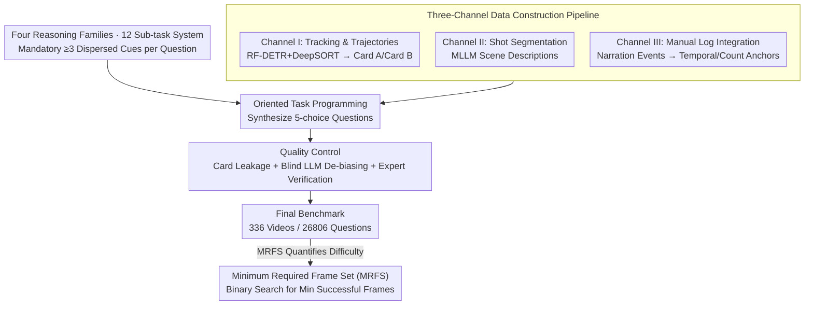

# HERBench: A Benchmark for Multi-Evidence Integration in Video Question Answering

**Conference**: CVPR 2026  
**arXiv**: [2512.14870](https://arxiv.org/abs/2512.14870)  
**Code**: None  
**Area**: Video Understanding / Multimodal VLM  
**Keywords**: VideoQA Benchmark, Multi-evidence Integration, Frame Selection, Long Video Understanding, Temporal Reasoning

## TL;DR

HERBench is a VideoQA benchmark specifically designed for multi-evidence integration, consisting of 26,806 five-choice multiple-choice questions. Each question structurally necessitates the fusion of $\ge 3$ temporally dispersed, non-overlapping visual cues. By introducing the Minimum Required Frame Set (MRFS) metric, it identifies two critical bottlenecks in current Video-LLMs: insufficient frame retrieval and evidence fusion failure.

## Background & Motivation

1. **Background**: Video-LLMs (e.g., GPT-4o, Gemini, Qwen2.5-VL) have achieved high scores on existing VideoQA benchmarks, suggesting rapid progress in video understanding capabilities.

2. **Limitations of Prior Work**: Recent audit studies reveal that these high scores often stem from language priors or single-cue shortcuts rather than genuine temporal reasoning. Models can answer questions correctly by viewing a single frame or exploiting linguistic biases; existing benchmarks fail to distinguish "true video understanding" from "shortcut exploitation."

3. **Key Challenge**: The problem design of existing VideoQA benchmarks allows for single-cue shortcuts—a single keyframe or textual common sense is often sufficient. Consequently, it remains uncertain whether models actually possess the ability to integrate multiple pieces of evidence across time.

4. **Goal**: (1) Design a benchmark that structurally requires multi-evidence integration ($\ge 3$ dispersed cues); (2) Propose the MRFS quantitative metric to measure "evidential requirements"; (3) Diagnose specific failure modes in current Video-LLMs—distinguishing between frame selection issues and information fusion failures.

5. **Key Insight**: The authors define the concept of "Evidential Requirement" (ER)—the minimum number of non-redundant visual evidences required to answer a question. By enforcing $ER \ge 3$, single-cue shortcuts are fundamentally eliminated, making multi-evidence reasoning an unavoidable requirement.

6. **Core Idea**: Through structural design, each question is guaranteed to require at least 3 temporally dispersed visual cues. Combined with the MRFS metric to quantify frame fusion difficulty, the benchmark systematically reveals the dual shortcomings of Video-LLMs in frame retrieval and evidence fusion.

## Method

### Overall Architecture

HERBench is not a new model but an evaluation benchmark designed to "force out" genuine video understanding capabilities. It seeks to answer whether modern Video-LLMs can perform when a question structurally requires at least 3 dispersed cues. The construction follows four steps: first, a taxonomy of 12 sub-tasks across 4 reasoning families embeds the "$\ge 3$ dispersed cues" requirement into the question structure; second, a three-channel data pipeline extracts spatio-temporal information at the trajectory, shot, and manual log granularities; third, oriented task programming synthesizes five-choice questions; fourth, a quality control stage filters card leakage and linguistic shortcuts to ensure answers depend on visual evidence; finally, the MRFS metric quantifies the "evidence demand" of each question. The final benchmark comprises 336 long videos (average 395 seconds) and 26,806 questions.

### Key Designs

**1. Four Reasoning Families and 12 Sub-tasks: Embedding "Multi-evidence" into Structure**

A critical weakness of existing VideoQA benchmarks is the single-cue shortcut. HERBench addresses this by redesigning tasks to structurally enforce $k \ge 3$: the correct answer must be assembled from multiple cues at different timestamps. The 12 sub-tasks are grouped into four families: Temporal Reasoning & Chaining (TR&C, including Temporal Sequence Ordering TSO, Multi-Person Duration Reasoning MPDR, Action Sequence Integrity Identification ASII) requires understanding event order and duration; Referencing & Tracking (R&T, including Appearance-Grounded Behavior Interaction AGBI, Appearance-Grounded Attribute Recognition AGAR, Appearance-Grounded Localization Trajectory AGLT) forces identity binding across time; Global Consistency & Verification (GC&V, including False Action Memory FAM, Scene Verification Arrangement SVA, False Object Memory FOM) requires scanning the full video for verification; Multi-Entity Aggregation & Navigation (MEA&N, including Multi-Entity Grounded Localization MEGL, Action Counting AC, Region-Limited People Counting RLPC) requires cross-time de-duplication and aggregation.

**2. Three-Channel Data Construction Pipeline: Multi-granular Information Extraction**

To generate "mandatory multi-frame" questions at scale, three complementary pipelines are used. Channel I performs object tracking and trajectory analysis: using RF-DETR + DeepSORT to obtain trajectories, and generating non-overlapping A-cards (appearance) and B-cards (behavior/trajectory) for each track. Crucially, "appearance" and "behavior" are placed at different timestamps—the model must locate the person via A-card appearance and then track them to the B-card behavior timestamp, making identity binding an unavoidable multi-frame reasoning task. Channel II performs shot segmentation and uses MLLMs to generate scene cards for macro-structure. Channel III integrates manually verified narration logs to provide factual anchors for temporal sequences and counts.

**3. Quality Control: Blocking Information Leakage and Linguistic Shortcuts**

To ensure the validity of the "mandatory multi-frame" design, two shortcuts are blocked. First, card leakage: if A/B cards use similar phrasing, models might infer answers from text alone; token-level similarity checks and manual reviews eliminate such overlaps. Second, linguistic bias: questions answered correctly by $\ge 3/4$ "blind" (text-only) LLMs are discarded. Furthermore, 15% of questions undergo expert verification to confirm $k \ge 3$ compliance and answer uniqueness. Human performance (88.8% on full videos, 95.7% with oracle frames) confirms the benchmark is solvable but challenging.

**4. Minimum Required Frame Set (MRFS) Metric: Quantifying Evidential Requirements**

To quantify difficulty, MRFS is introduced. Given an MLLM $f$, a frame selector $r$, and a frame budget $x$, the "minimum number of frames $k$ required for the model to transition from incorrect to correct" is defined as the MRFS size. In implementation, text-solvable questions are excluded (where $E(f(q, \varnothing), y) = 0$), and an adaptive binary search is performed over $k \in [1, x]$ to find the minimum frames for success. Unlike existing metrics, MRFS is automated, model-centric, and directly measures the difficulty of multi-evidence integration.

## Key Experimental Results

### Main Results

Evaluation of 13 SOTA Video-LLMs shows an overall accuracy of only 31-42% (random guessing is 20%):

| Model | TR&C Avg. | R&T Avg. | GC&V Avg. | MEA&N Avg. | Overall |
|-------|-----------|----------|-----------|------------|---------|
| GPT-4.1 | 25.4 | 66.0 | 37.1 | 29.0 | 39.4 |
| Gemini-2.5-Flash | 29.7 | 69.9 | 34.9 | 26.8 | 40.3 |
| Qwen2.5-VL-72B | 26.9 | 70.9 | 36.6 | 24.4 | 39.7 |
| Ovis-2.5-9B | 18.9 | 73.5 | 46.8 | 29.2 | **42.1** |
| InternVL3.5-8B | 33.6 | 70.2 | 29.7 | 30.8 | 41.1 |

### Across-Benchmark MRFS Comparison

| Benchmark | Videos | Questions | MRFS↑ | Language De-biasing | Mandatory Fusion |
|-----------|--------|-----------|-------|---------------------|-----------------|
| MVBench | 4,000 | 4,000 | 3.52 | ✗ | ✗ |
| Video-MME | 900 | 2,700 | 5.31 | ✗ | ✗ |
| MINERVA | 223 | 1,515 | 5.14 | ✓ | ✗ |
| **HERBench** | **336** | **26,806** | **5.49** | **✓** | **✓** |

### Key Findings

- **Frame Retrieval Bottleneck (Finding 1)**: Although adaptive frame selectors outperform uniform sampling, a significant gap remains compared to oracle keyframes—models fundamentally fail to retrieve the critical evidence frames.
- **Fusion Bottleneck (Finding 2)**: Even when provided with oracle frames, models show only modest accuracy gains, indicating an inability to correctly allocate attention across all keyframes and integrate the information.
- The R&T family scores relatively high (~60-73%) because appearance descriptions provide strong visual anchors; the TR&C and MEA&N families score lowest (<30%), reflecting severe deficiencies in temporal reasoning and multi-entity aggregation.
- Smaller models (e.g., Ovis-2.5-9B) sometimes outperform larger ones (GPT-4.1), suggesting the problem is not purely a matter of model scale.

## Highlights & Insights

- **Elegant Design of the MRFS Metric**: It isn't just a simple frame count; by using binary search with a fixed selector and excluding text-solvable cases, it provides a fair and computationally efficient measurement across benchmarks.
- **A/B Card Separation**: Deliberately placing appearance descriptions and behavior queries in different timeframes forces the model to perform identity binding through temporal tracking, turning it into a mandatory multi-frame task.
- **Dual Bottleneck Diagnostic Framework**: Decoupling frame selection from fusion reasoning via oracle experiments clearly identifies that "finding frames" and "using frames" are distinct challenges, providing a roadmap for future research.

## Limitations & Future Work

- Parts of the benchmark are generated via automated pipelines, which may contain residual systematic biases.
- With only 336 videos, the scene diversity may not represent all real-world scenarios.
- MRFS depends on specific frame selectors and models; different combinations might yield different rankings.
- The focus is on diagnosing current failures rather than providing specific architectural solutions.
- High accuracy in R&T tasks may suggest that the ER requirements for these tasks could be stricter.

## Related Work & Insights

- **vs Video-MME**: Video-MME focuses on longer contexts but does not control evidential requirement; HERBench ensures high ER through structural design, making evidence density rather than duration the primary difficulty.
- **vs MINERVA**: MINERVA also uses language de-biasing and has high MRFS but focuses on multi-step reasoning and reasoning chain auditing rather than mandatory multi-frame integration.
- **vs MVBench**: MVBench covers various temporal tasks but uses short videos, and questions can often be solved via single frames.

## Rating

- Novelty: ⭐⭐⭐⭐ First VideoQA benchmark centered on evidential requirement; innovative MRFS metric.
- Experimental Thoroughness: ⭐⭐⭐⭐⭐ Evaluation of 13 models, cross-benchmark MRFS comparison, multi-dimensional diagnostic analysis.
- Writing Quality: ⭐⭐⭐⭐ Clear framework and comprehensive task taxonomy, though the paper is extensive.
- Value: ⭐⭐⭐⭐ Provides a critical diagnostic of Video-LLM shortfalls, offering significant reference for field advancement.

<!-- RELATED:START -->

## Related Papers

- [\[CVPR 2026\] MovieRecapsQA: A Multimodal Open-Ended Video Question-Answering Benchmark](movierecapsqa_a_multimodal_open-ended_video_question-answering_benchmark.md)
- [\[CVPR 2026\] MuKV: Multi-Grained KV Cache Compression for Long Streaming Video Question-Answering](mukv_multi-grained_kv_cache_compression_for_long_streaming_video_question-answer.md)
- [\[CVPR 2026\] Ego-Grounding for Personalized Question-Answering in Egocentric Videos](ego-grounding_for_personalized_question-answering_in_egocentric_videos.md)
- [\[CVPR 2026\] Do You See What I Am Pointing At? Gesture-Based Egocentric Video Question Answering](do_you_see_what_i_am_pointing_at_gesture-based_egocentric_video_question_answeri.md)
- [\[CVPR 2026\] CaST-Bench: Benchmarking Causal Chain-Grounded Spatio-Temporal Reasoning for Video Question Answering](cast-bench_benchmarking_causal_chain-grounded_spatio-temporal_reasoning_for_vide.md)

<!-- RELATED:END -->
