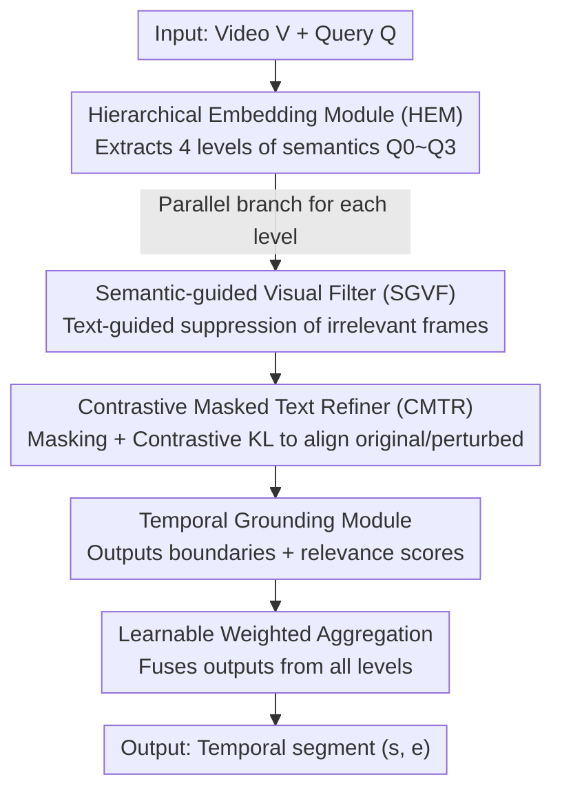

# HERO: Hierarchical Embedding-Refinement for Open-Vocabulary Temporal Sentence Grounding in Videos

**Conference**: CVPR 2026  
**Paper**: [CVF Open Access](https://openaccess.thecvf.com/content/CVPR2026/html/Han_HERO_Hierarchical_Embedding_Refinement_for_Open-Vocabulary_Temporal_Sentence_Grounding_in_Videos_CVPR_2026_paper.html)  
**Code**: https://github.com/TTingHan-HDU/HERO  
**Area**: Video Understanding  
**Keywords**: Temporal Sentence Grounding, Open-Vocabulary, Hierarchical Text Embedding, Cross-modal Refinement, Contrastive Learning  

## TL;DR
This paper proposes the new task of "Open-Vocabulary Temporal Sentence Grounding in Videos" (OV-TSGV) and constructs two benchmarks, Charades-OV and ActivityNet-OV. It introduces HERO, a plug-and-play framework that captures multi-granularity semantics via hierarchical text embeddings and enhances alignment through parallel semantic-guided visual filtering and contrastive masked text refinement, achieving SOTA performance on both standard and open-vocabulary benchmarks.

## Background & Motivation
**Background**: The goal of Temporal Sentence Grounding (TSGV) is to localize a corresponding temporal segment $(s, e)$ in untrimmed long videos given a natural language query. Mainstream approaches are categorized into proposal-based (generating and scoring candidates) and proposal-free (direct boundary regression), with recent DETR-style models performing better in the latter.

**Limitations of Prior Work**: Existing models are almost exclusively trained and evaluated under a **closed-vocabulary** setting, where the vocabulary of test queries highly overlaps with the training set. Studies indicate these models tend to overfit dataset biases (segment position, duration distribution) rather than learning robust video-language alignment. Even Charades-CD and ActivityNet-CD, designed to mitigate bias, reveal that **96.06% (Charades) and 86.73% (ActivityNet) of test sentences in the test-ood split consist entirely of words seen in the training vocabulary**, remaining essentially closed-vocabulary.

**Key Challenge**: Real-world queries introduce "vocabulary drift." For instance, replacing "person" with the semantically equivalent but unseen "human" in "person holds a box" significantly degrades the localization performance of strong baselines like EMB. The root cause is that token-level encoding fails to capture semantic equivalence between different wordings (e.g., "boy grabs skateboard" vs. "kid picks up object"), causing models to memorize training patterns rather than performing semantic abstraction.

**Goal**: To generalize the task from closed-vocabulary to open-vocabulary, requiring models to accurately localize when a test query contains **at least one unseen word** (novel object/action/synonym paraphrase), and to provide benchmarks that rigorously test this generalization capability.

**Key Insight**: The authors formalize the fuzzy concept of "categories" in TSGV. The category set of query $q$ is defined as the set of all its tokens $C(q) \triangleq \{ w \mid w \text{ is a token in } q \}$. Thus, "person hold a box" corresponds to $\{person, hold, box\}$. An open-vocabulary sample is defined as any query where at least one word is not in the training vocabulary.

**Core Idea**: Replace single-layer token encoding with "hierarchical semantic embedding + parallel cross-modal refinement," allowing the model to align video and text across multiple granules from lexical to conceptual, thereby remaining robust to unseen expressions.

## Method

### Overall Architecture
HERO is a **plug-and-play** enhancement framework adaptable to any two-stage TSG model consisting of a "feature fuser + span predictor" (instantiated with EMB as the base in the paper). Given video features $V=\{v_t\}_{t=1}^T$ and query features $Q=\{q_i\}_{i=1}^L$, the pipeline is: The **Hierarchical Embedding Module (HEM)** extracts $N$ semantic levels $\{Q_i\}$ from lexical to conceptual; these levels are fed **in parallel** into the **Cross-modal Filtering and Refinement Engine (CFRE)**. Each branch utilizes a **Semantic-guided Visual Filter (SGVF)** to suppress irrelevant frames and a **Contrastive Masked Text Refiner (CMTR)** to enhance text robustness. Refined features are passed to the **Temporal Grounding Module**, producing boundary predictions $(P_i^s, P_i^e)$ and relevance scores $RS_i, RS_i^m$ for each layer. Finally, a **Learnable Weighted Aggregation** fuses the outputs of all levels into the final segment $(s, e)$.

### Key Designs

**1. Hierarchical Text Embedding (HEM): Resisting Unseen Wording with Multi-granularity Semantics**

To address the limitation where token-level encoding fails to capture paraphrases, HEM uses a 6-layer Transformer encoder to extract the **input embedding + outputs of the 2nd/4th/6th layers**, resulting in four levels of representation: $Q_0 = Q$, $Q_1 = \text{TransformerEncoder}_2(Q_0)$, and $Q_i = \text{TransformerEncoder}_{2i}(Q_{i-1})$ for $i=2,3$. Lower layers retain "how words are expressed" (lexical/syntactic cues), while higher layers encode "what words mean" (semantic concepts). When a test query contains an unseen synonym, higher-level abstractions can still fall within the learned conceptual space. Ablation studies show that 4 parallel layers are optimal: 2 layers focus too much on literal tokens, while 8 layers lose fine-grained information due to over-abstraction.

**2. Semantic-guided Visual Filter (SGVF): Suppressing Irrelevant Frames via Text Cues**

Long videos contain many frames irrelevant to the query, which introduce noise during fusion. SGVF performs soft filtering using cross-attention: using video features $V$ as queries and a specific text level $Q_i$ as keys/values to calculate attention, followed by a sigmoid function to obtain relevance coefficients $[0, 1]$ for element-wise modulation:

$$V_i^{attn} = \text{Softmax}\!\left(\frac{V Q_i^T}{\sqrt{d_k}}\right) Q_i, \qquad \hat{V}_i = V \odot \text{Sigmoid}(V_i^{attn})$$

The softmax normalizes attention, while sigmoid clamps coefficients to $[0, 1]$, and $\odot$ denotes element-wise multiplication. This attenuates background noise and amplifies semantically relevant visual signals, ensuring alignment is based on cleaner visual evidence. This is performed independently at each semantic level.

**3. Contrastive Masked Text Refiner (CMTR): Robust Text Representation via Masking and Contrast**

To maintain stability when queries are paraphrased or missing words, CMTR adopts contrastive learning. For each layer, a portion of tokens is randomly masked to obtain a perturbed version $Q_i^m = \text{RandomMask}(Q_i)$, which is processed by SGVF to get a perturbed visual representation $\hat{V}_i^m$. Relevance scores $RS_i, RS_i^m$ are calculated for the original pair $\{Q_i, \hat{V}_i\}$ and the perturbed pair $\{Q_i^m, \hat{V}_i^m\}$, respectively. These are aggregated across layers as $RS, RS^m$, and consistency is enforced using KL divergence:

$$\mathcal{L}_{CL} = D_{KL}(RS \,\|\, RS^m)$$

The intuition is that even if some words are missing, the model's judgment of "which frames are relevant" should remain unchanged, forcing it to capture the semantic skeleton rather than relying on specific words.

**4. Learnable Weighted Aggregation: Adaptive Contribution of Semantic Levels**

The four parallel branches represent different levels of abstraction, and their influence should not be fixed. HERO uses a set of learnable scalar weights $\{W_i\}$ for fusion: a randomly initialized vector $T_i \in \mathbb{R}^d$ is fed into a lightweight MLP to obtain $W_i = \text{MLP}(T_i)$. The final output is the weighted sum of outputs from all levels: $O = \sum_{i=1}^{N} W_i O_i$. This allows the model to adaptively trust lexical or conceptual layers based on the specific query.

### Loss & Training
The total loss is a weighted sum: $\mathcal{L} = \mathcal{L}_{TSGV} + \lambda_1 \mathcal{L}_{RS} + \lambda_2 \mathcal{L}_{CL}$. Here, $\mathcal{L}_{TSGV}$ is the main grounding loss of the base (EMB); $\mathcal{L}_{CL}$ is the KL contrastive consistency loss; $\mathcal{L}_{RS}$ is the relevance score loss, calculated as the average binary cross-entropy for original and masked paths: $\mathcal{L}_{RS} = \tfrac{1}{2}\big(\mathcal{L}_{BCE}(V, RS) + \mathcal{L}_{BCE}(V, RS^m)\big)$, where $p(v_t)$ is the ground truth frame relevance and $RS(v_t)$ is the predicted relevance. Training involves 20 epochs, batch size 16, Adam optimizer, an initial learning rate of 0.0005 with linear decay, and gradient clipping at 1.0. Hyperparameters are set as $\lambda_1 = \lambda_2 = 0.1$. Videos use I3D features, queries use 300D GloVe, and the hidden dimension is unified at 128.

## Key Experimental Results

### Main Results
On the test-ov splits of two open-vocabulary benchmarks, HERO outperforms five SOTA methods (higher R1@m is better):

| Dataset | Metric | EMB (Base) | Prev. SOTA | HERO | Gain |
|--------|------|-----------|----------|------|------|
| Charades-OV | R1@0.3 | 61.54 | 61.87 (TR-DETR) | **64.74** | +2.87 |
| Charades-OV | R1@0.7 | 25.99 | 25.99 (EMB) | **27.20** | +1.21 |
| ActivityNet-OV | R1@0.3 | 40.22 | 40.22 (EMB) | **42.78** | +2.56 |
| ActivityNet-OV | R1@0.5 | 21.70 | 21.70 (EMB) | **25.23** | +3.53 |
| ActivityNet-OV | R1@0.7 | 10.78 | 10.78 (EMB) | **12.18** | +1.40 |

On the standard closed-vocabulary Charades-STA, HERO also sets a new SOTA: R1@0.5 improves from 58.33 (EMB) to **61.05**, and R1@0.7 improves from 39.25 to **41.29**, outperforming recent methods like FlashVTG (60.11 / 38.01). This proves the module's effectiveness beyond just the OV setting.

### Ablation Study
Component-wise ablation on Charades-OV test-ov (HEM; CFRE = SGVF + CMTR):

| HEM | SGVF | CMTR | R1@0.5 | R1@0.7 | mIoU | Note |
|-----|------|------|--------|--------|------|------|
| - | - | - | 42.31 | 25.22 | 41.93 | Base baseline |
| ✓ | - | - | 42.64 | 24.89 | 42.03 | HEM only |
| - | ✓ | - | 43.58 | 25.72 | 43.24 | SGVF only |
| ✓ | ✓ | - | 45.10 | 26.70 | 44.00 | HEM+SGVF |
| - | ✓ | ✓ | 44.82 | 25.21 | 43.39 | Full CFRE |
| ✓ | ✓ | ✓ | **45.51** | **27.20** | **44.86** | Full HERO |

### Key Findings
- **Complementary Components**: The full model achieves the best performance across all metrics. Individually, SGVF is more effective than HEM alone (R1@0.5 43.58 vs 42.64), but the combination of HEM+SGVF is required to significantly boost performance (45.10), indicating that hierarchical embeddings require cross-modal refinement to be fully utilized.
- **Optimal Number of Parallel Layers**: 4 layers in HEM are optimal. Fewer layers overemphasize literal wording, while more layers result in over-abstraction and loss of fine-grained details.
- **Stronger Cross-dataset Generalization**: When trained on Charades-CD and tested on ActivityNet-CD, HERO outperforms previous methods by +3.3% R1@0.3, +1.36% R1@0.5, and +1.27% R1@0.7, indicating gains stem from semantic abstraction rather than memorizing dataset biases.

## Highlights & Insights
- **Formalizing the OV-TSGV Task**: The authors demonstrate statistically that existing CD benchmarks are essentially closed-vocabulary (96% of sentences contain only seen words). By using LLM paraphrasing and manual verification to create Charades-OV / ActivityNet-OV, the task definition itself becomes a major contribution.
- **Clever "Tokens as Categories" Formalization**: Since TSGV lacks predefined categories, defining OV samples based on unseen tokens allows for operationalizing open-vocabulary evaluation in free-text tasks.
- **Plug-and-play**: HERO is not bound to a specific TSG implementation; it serves as an auxiliary module for two-stage architectures, making it easily transferable to other cross-modal alignment tasks requiring semantic robustness.
- **Masking + KL Consistency**: This approach explicitly enforces the training objective that word omissions should not alter frame relevance judgments, serving as a lightweight and effective regularizer for open-vocabulary robustness.

## Limitations & Future Work
- The authors suggest future directions such as few-shot adaptation and continual learning, implying HERO currently focuses on "one-time training" and does not cover online adaptation to entirely new concepts.
- The parallel architecture of HEM and multi-layer copies of SGVF/CMTR introduce computational and memory overhead, which is not quantified in the paper.
- Since OV benchmarks rely on LLM-generated paraphrases, there is a risk of bias if the distribution of LLM rewrites differs from real-world vocabulary drift.
- The base model is fixed as EMB. While claimed to be plug-and-play, systematic verification across multiple different bases is lacking.

## Related Work & Insights
- **vs. EMB (Base)**: EMB is a strong proposal-free baseline but suffers in closed-vocabulary settings. HERO adds hierarchical embedding and refinement, improving R1@0.3 from 61.54 to 64.74 on Charades-OV.
- **vs. DETR-style (Moment-DETR / QD-DETR / TR-DETR)**: These rely on transformer matching and auxiliary tasks but remain limited to a closed vocabulary. HERO differs by explicitly modeling multi-granularity semantics and using contrastive consistency to resist vocabulary drift.
- **vs. CD De-biasing Methods**: Prior methods assume shared vocabularies and address distribution bias via causal intervention or video shuffling. HERO identifies unseen words as the critical gap and shifts the focus from "de-biasing" to "open-vocabulary generalization."

## Rating
- Novelty: ⭐⭐⭐⭐⭐ First to push TSGV to the open-vocabulary realm with a complete set of task definitions, benchmarks, and methods.
- Experimental Thoroughness: ⭐⭐⭐⭐ Comprehensive evaluation on standard and OV benchmarks, including ablation and cross-dataset analysis, though lacking multi-base verification and overhead quantification.
- Writing Quality: ⭐⭐⭐⭐ Clear motivation and complete formulas; some nuances in specific metrics require cross-referencing with the original text.
- Value: ⭐⭐⭐⭐⭐ The plug-and-play nature and provided benchmarks directly advance video localization for real-world scenarios.

<!-- RELATED:START -->

## Related Papers

- [\[CVPR 2026\] HieraMamba: Video Temporal Grounding via Hierarchical Anchor-Mamba Pooling](hieramamba_video_temporal_grounding_via_hierarchical_anchor-mamba_pooling.md)
- [\[CVPR 2026\] OmniVTG: A Large-Scale Dataset and Training Paradigm for Open-World Video Temporal Grounding](omnivtg_a_large-scale_dataset_and_training_paradigm_for_open-world_video_tempora.md)
- [\[CVPR 2026\] CVA: Context-aware Video-text Alignment for Video Temporal Grounding](cva_context-aware_video-text_alignment_for_video_temporal_grounding.md)
- [\[NeurIPS 2025\] DualGround: Structured Phrase and Sentence-Level Temporal Grounding](../../NeurIPS2025/video_understanding/dualground_phrase_temporal.md)
- [\[CVPR 2026\] Ego-Grounding for Personalized Question-Answering in Egocentric Videos](ego-grounding_for_personalized_question-answering_in_egocentric_videos.md)

<!-- RELATED:END -->
