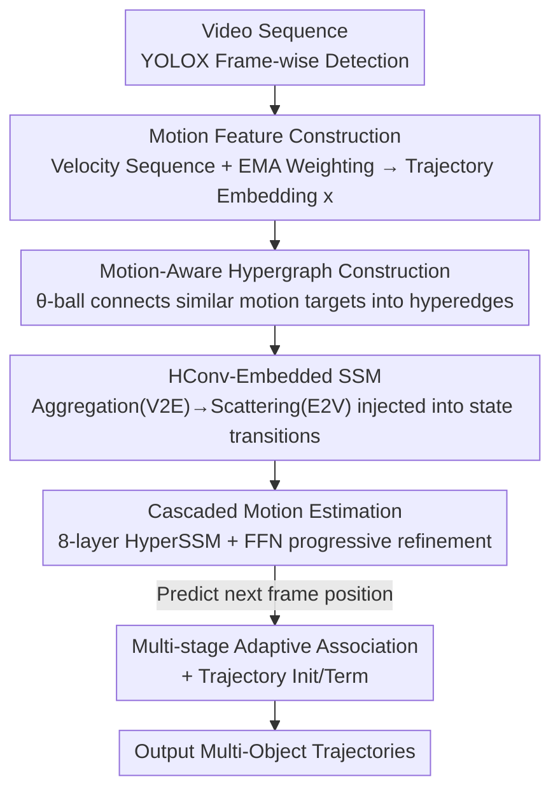

# Hypergraph-State Collaborative Reasoning for Multi-Object Tracking

**Conference**: CVPR 2026  
**Paper**: [CVF Open Access](https://openaccess.thecvf.com/content/CVPR2026/html/Song_Hypergraph-State_Collaborative_Reasoning_for_Multi-Object_Tracking_CVPR_2026_paper.html)  
**Code**: https://github.com/SkyeSong38/HyperMOT (Available)  
**Area**: Video Understanding / Multi-Object Tracking  
**Keywords**: Multi-Object Tracking, Motion Estimation, Hypergraph, State Space Model, Collaborative Reasoning

## TL;DR
Addressing the long-standing issues of independent prediction, jitter, and fragmentation under occlusion in motion estimation for multi-object tracking, this paper proposes HyperSSM. It utilizes hypergraphs to connect targets with similar motion states into hyperedges to achieve "group consensus," and embeds hypergraph convolutions directly into the state transitions of a State Space Model (SSM) to maintain temporal smoothness. This allows correlated targets to mutually constrain and complement each other's motion. HyperSSM achieves SOTA performance across four linear and non-linear benchmarks: MOT17, MOT20, DanceTrack, and SportsMOT.

## Background & Motivation
**Background**: The mainstream paradigm for Multi-Object Tracking (MOT) is "tracking-by-detection," where a detector generates boxes per frame, a motion estimator predicts the next position of existing trajectories, and an association module links detections to trajectories. Motion estimation is the cornerstone of this pipeline, as accurate cross-frame displacement calculation is essential for stable identity preservation. Existing motion estimators fall into two categories: manual Kalman Filters (KF) and their variants, which assume constant velocity linear motion, and recent learnable motion estimators (e.g., TrackSSM, DiffMOT), which use data-driven networks to fit complex non-linear dynamics.

**Limitations of Prior Work**: The authors highlight two unresolved challenges. First (C1), **motion noise and instability**: paradoxically, manual KF remains the most stable on simple linear trajectories like MOT17, whereas learnable estimators, despite modeling non-linearity, often introduce jitter and fluctuations due to their probabilistic nature, underperforming KF in linear scenarios. Second (C2), **robustness under occlusion**: once a target is severely occluded and visual evidence disappears, both KF and learnable methods struggle to maintain temporal continuity, leading to fragmented trajectories and identity switches.

**Key Challenge**: The root cause of these issues is that **existing methods estimate motion for each target independently**. Each trajectory relies solely on its limited history to infer the future, lacking external information to suppress prediction noise; once a target becomes invisible, its information source is completely severed. The more learnable methods attempt to fit complex dynamics, the more pronounced the probabilistic fluctuations appear from a single-target perspective.

**Goal**: To transition motion estimation from "solo efforts" to collaborative reasoning by grouping targets with motion correlations. The objective is to use the consensus of correlated targets to correct a noisy trajectory (addressing C1) and to use the motion patterns of visible targets to probabilistically complete the trajectory of an occluded target (addressing C2).

**Key Insight**: Targets with similar motion directions and velocities (e.g., a crowd of pedestrians walking together) provide strong constraints. If one person is occluded, their trajectory can be reasonably inferred from the movement trends of nearby companions. However, arbitrary aggregation must be avoided to preserve individual motion characteristics. Thus, it is necessary to **selectively** associate only targets with highly correlated motion states. Such "many-to-many, high-order" relationships are beyond the expressive capacity of simple graphs (where edges connect only two points), making **hypergraphs** (where a hyperedge can connect multiple vertices) a natural fit.

**Core Idea**: HyperSSM integrates "spatial collaboration via hypergraphs + temporal smoothing via SSM" into a unified architecture. Hypergraph convolutions are embedded directly into the state transition rules of the SSM, allowing spatial consensus and temporal continuity to be optimized simultaneously.

## Method

### Overall Architecture
HyperSSM follows a five-stage "tracking-by-detection" pipeline: a YOLOX detector produces candidate boxes per frame → the HyperSSM motion estimation module predicts the next position of existing trajectories → multi-stage adaptive association matches detections to trajectories → trajectory initialization/termination. The **motion estimation module is the core innovation**: it encodes the historical trajectories of each target into motion features, dynamically builds a hypergraph based on motion similarity, allows related targets to refine each other via "aggregation and scattering" on the hypergraph, and embeds this spatial collaboration into the SSM's temporal recursion. The module consists of cascaded HyperSSM blocks, where each layer takes the output of the previous layer and passes information via hidden states to progressively regress trajectories toward the ground truth.

The input consists of position information $P^N_L \in \mathbb{R}^{N\times L\times 4}$ for $N$ targets within a window of $L$ frames (each box being $(x,y,w,h)$), and the output is the next window position $P^N_{L_{t+1}}$ shifted by one frame.

### Key Designs

**1. Motion-aware hypergraph construction: Connecting "true co-directional" targets via θ-balls**

The first step in collaborative reasoning is determining "which targets should constrain each other." Each target is treated as a vertex, and its motion feature $x\in\mathbb{R}^d$ forms the vertex set $V$. To compute these features, the velocity sequence $v_t = p_t - p_{t-1}$ is derived from the historical trajectory $p_L\in\mathbb{R}^{L\times 4}$. An Exponential Moving Average (EMA) $\hat v = \sum_{t=1}^{L}\alpha(1-\alpha)^{L-t}v_t$ is applied to prioritize recent frames and suppress distant noise. Finally, a trajectory embedding module generates $x$. Hyperedges are constructed not by indiscriminate aggregation, but by creating an $\epsilon$-ball around each motion feature with a threshold $\theta$: $\text{ball}(v,e)=\{u\mid \|x_u-x_v\|_d<\theta,\ u\in V\}$. The hyperedge set $E=\{\text{ball}(v,e)\mid v\in V\}$ is represented by an $|V|\times|E|$ incidence matrix $H$.

This design addresses the pain points: only targets with sufficiently similar directions and speeds are grouped into the same hyperedge, preserving individual characteristics while making the "group" meaningful—a prerequisite for consensus-based noise reduction and cross-target completion. Ablations show $\theta=0.8$ is optimal.

**2. HConv-embedded SSM: Injecting hypergraph "aggregation-scattering" into SSM transitions for spatial-temporal control**

Simply having a hypergraph is insufficient; if spatial collaboration (hypergraph) and temporal smoothing (SSM) are performed separately, they cannot constrain each other. The core mechanism of this paper is welding hypergraph convolution (HConv) directly into the SSM recursion. HConv performs two steps: the aggregation stage collects vertex information into hyperedges $x_e=\frac{1}{|N_v(e)|}\sum_{v\in N_v(e)} x_v\Theta$ (V2E, forming group consensus), and the scattering stage distributes hyperedge features back to vertices with a residual connection $x'_v = x_v + \frac{1}{|N_e(v)|}\sum_{e\in N_e(v)} x_e$ (E2V, for individual refinement). The matrix form is $\text{HConv}(X)=\sigma(D_v^{-1}HWD_e^{-1}H^{T}X\Theta)$.

The standard SSM (S4) recursion is $h_t=Ah_{t-1}+Bx_t,\ y_t=Ch_t+Dx_t$. HyperSSM introduces three modifications: (1) Applying HConv to the input during the state transition phase so that hidden states carry multi-object interaction information from the start; (2) Removing the redundant $D$ parameter to prevent over-parameterization, instead reusing the learnable hypergraph parameter $\Theta$ from the HConv; (3) Adding a residual connection to merge original inputs with transformed hidden states, preserving critical motion features. The final operator is:

$$h_t = A h_{t-1} + B\cdot\text{HConv}(X_t), \qquad Y_t = X_t + C h_t + \text{HConv}(X_t).$$

Mechanism of effectiveness: The hypergraph's "who should be inferred together" constraints are injected as relational constraints into the SSM's temporal propagation. Thus, spatial group consistency and temporal trajectory smoothness are jointly optimized by the **same set of recursions**. When a trajectory becomes noisy, consensus from other targets in the hyperedge enters the state transition via $\text{HConv}$ to stabilize it; when a target is occluded, its hidden state still receives updates from the dynamics of visible targets in the same hyperedge, completing cross-target motion.

**3. Cascaded motion estimation + collaborative tracking pipeline**

A single HyperSSM block performs one round of collaboration. The authors cascade these into a multi-layer motion estimation module. Position data of $N$ targets over $L$ frames is encoded as trajectory embeddings $T^N_L$, which act as guidance for each layer. The output of each layer feeds the next, and the hidden state $h$ acts as a "messenger" passing information between layers, allowing trajectories to approach ground truth progressively. The final output is generated via an FFN.

In the global tracking pipeline, association utilizes a multi-stage adaptive approach emphasizing trajectory-level consistency rather than the classic Hungarian algorithm. Detections are categorized into high-confidence, low-confidence (for recovering missed detections), and NMS-suppressed high-confidence. Joint motion/spatial/appearance costs are calculated for each trajectory-detection pair, and matches are selected iteratively using adaptive thresholds. Initialization uses a "spatial-aware" strategy, treating the latest positions of matched trajectories as anchors for NMS with remaining detections, ensuring only truly new targets form trajectories and avoiding redundancy.

### Loss & Training
The model is trained using a joint smooth L1 and GIoU loss over all frames in the sliding window: $L=\lambda_1\sum_t^L L_{L1}(P^t,P^t_{gt})+\lambda_2\sum_t^L L_{GIoU}(P^t,P^t_{gt})$. Training uses trajectory fragments (rather than full images), with input consisting of positions and motion data from 5-frame segments. The setup includes batch=128, Adam optimizer (lr=1e-4), and 8 decoder layers. MOT17/MOT20/SportsMOT are trained for 360 epochs, and DanceTrack for 260 epochs. SportsMOT includes GIoU to accelerate convergence due to larger inter-frame displacements.

## Key Experimental Results

### Main Results
SOTA performance is achieved across four linear and non-linear benchmarks (private protocol, HOTA as primary metric):

| Dataset | Motion Type | Ours HOTA | Previous best motion-based | Notes |
| :--- | :--- | :--- | :--- | :--- |
| MOT17 | Linear | **66.9** | DiffMOT 64.5 | IDF1 83.1 / MOTA 81.5 |
| MOT20 | Linear | **65.2** | HybridSORT 63.9 | MOTA 80.0 / AssA 66.3 |
| DanceTrack | Non-linear | **65.7** | DiffMOT 62.3 | AssA 52.6 (far exceeds DiffMOT 47.2) |
| SportsMOT | Non-linear | **78.5** | DiffMOT 76.2 | IDF1 80.0 / AssA 69.2 |

On MOT17, it even outperforms KF-based methods (e.g., SparseTrack 65.1), breaking the trend of learnable estimators struggling against KF in linear scenarios.

### Ablation Study
Fixed detection and association strategy, replacing only the motion estimation module (Table 5):

| Motion Model | MOT17 HOTA | DanceTrack HOTA | Description |
| :--- | :--- | :--- | :--- |
| Kalman | 64.5 | 47.0 | Strong linear, fails non-linear |
| OC-Kalman | 64.6 | 52.5 | Improved KF |
| SSM (TrackSSM) | 63.4 | 53.7 | Learnable but single-target |
| **HyperSSM** | **65.5** | **59.7** | Competitive with KF (linear), leading in non-linear |

Ablation of hyperparameter $\theta$ (motion similarity threshold for hyperedge construction) on MOT17 (Table 6):

| θ | 0.5 | 0.7 | **0.8** | 0.9 | 0.95 | 0.98 |
| :--- | :--- | :--- | :--- | :--- | :--- | :--- |
| HOTA | 47.7 | 62.1 | **65.5** | 65.3 | 64.8 | 64.7 |
| IDF1 | 47.3 | 68.8 | **75.9** | 75.5 | 73.4 | 72.9 |

### Key Findings
- **Collaborative reasoning gains are most evident in non-linear/occluded scenes**: Compared to pure SSM, HyperSSM improves HOTA by ~2 points on MOT17 (linear) but by 6 points on DanceTrack (non-linear, severe occlusion, frequent crossovers), verifying the effectiveness of cross-target consensus.
- **$\theta$ exhibits an inverted U-shape and is highly sensitive at small values**: At $\theta=0.5$, HOTA plummets to 47.7 because a loose threshold links unrelated targets, polluting the consensus. A value of 0.8 is the "sweet spot."
- **Optimal "field of view" for layers and window length**: Performance gains diminish or decline beyond 8 layers or 5-frame segments, indicating that collaborative refinement and historical utilization have marginal effects.
- **Efficiency is adjustable**: Using different YOLOX variants (Table 7), the largest model achieves high precision (17.5 fps) while smaller models (YOLOX-S) offer 28.8 fps.

## Highlights & Insights
- **Innovation in structure**: Welding "hypergraph spatial consensus" into "SSM temporal recursion" is a genuine structural advancement. Rather than simply stacking modules, the hypergraph convolution is integrated into the state transition term $B\cdot\text{HConv}(X_t)$, ensuring spatial constraints are naturally propagated through time.
- **Paradigm shift**: Moving from "independent per-target prediction" to "high-order multi-target collaboration" is a transferable principle. This approach can be applied to trajectory prediction, pedestrian intent estimation, or any task where individuals are constrained by the group.
- **Robustness groundworks**: The use of EMA-weighted motion features and $\theta$-ball construction ensures that hyperedges represent meaningful groups (targets moving together), which is the foundation of the successful collaboration.
- **Physical intuition for occlusion**: The intuitive concept of "inferring an occluded person's path using visible companions" is precisely encoded into the hypergraph structure.

## Limitations & Future Work
- **Dependence on motion correlation**: The method assumes that targets with similar motion states exist in the scene. In sparse scenarios where targets move independently, hyperedges may degenerate, and collaborative gains may vanish.
- **Sensitivity of $\theta$ as a global hyperparameter**: HOTA fluctuates by nearly 18 points between $\theta=0.5$ and $0.8$, and it requires tuning per dataset. An adaptive threshold mechanism is currently missing.
- **Reliance on YOLOX detection quality**: As shown in Table 7, switching to smaller detectors causes significant performance drops, which the motion module cannot fully recover.
- **Future Work**: The authors suggest extending this to broader tracking scenarios or integrating richer modalities (appearance, depth) to further enhance collaborative motion reasoning.

## Related Work & Insights
- **vs Query-based methods (MOTR series / MOTIP / SAMBA)**: These methods encode targets into persistent queries. While strong in non-linear scenes like DanceTrack, they struggle with target entry/exit and exhibit box jitter in linear benchmarks like MOT17/20. HyperSSM avoids these issues through explicit motion estimation while suppressing jitter via collaboration.
- **vs Kalman-based methods (ByteTrack / BoT-SORT / OC-SORT)**: KF is extremely stable in linear surveillance scenes but fails in non-linear scenarios (e.g., dancing/sports). HyperSSM matches or exceeds KF on MOT17 while dominating in non-linear scenes, offering both stability and expressiveness.
- **vs Single-target learnable motion estimation (TrackSSM / DiffMOT)**: These predict for each target independently. HyperSSM's superiority in Table 5 over pure SSM directly proves the benefit of multi-target collaborative reasoning.
- **vs Graph learning for MOT**: Previous GNN-MOT methods used graphs for cross-frame association. HyperSSM uses hypergraphs to model **intra-frame multi-target motion correlation**, capturing high-order interactions—a paradigm extension for graph-based MOT.

## Rating
- Novelty: ⭐⭐⭐⭐⭐ High-order motion correlation as a first-class citizen in motion estimation via Hypergraph + SSM.
- Experimental Thoroughness: ⭐⭐⭐⭐ SOTA across four benchmarks with detailed ablations, though lacking quantitative analysis of failure cases in extremely sparse scenes.
- Writing Quality: ⭐⭐⭐⭐ Clear alignment between motivation and mechanism; helpful visualizations.
- Value: ⭐⭐⭐⭐ Shift to group collaboration is transferable to other tracking/prediction tasks.

<!-- RELATED:START -->

## Related Papers

- [\[CVPR 2026\] ProgTrack: A Multi-Object Tracking Algorithm with Progressive Matching Strategy](progtrack_a_multi-object_tracking_algorithm_with_progressive_matching_strategy.md)
- [\[CVPR 2026\] Out of Sight, Out of Track: Adversarial Attacks on Propagation-based Multi-Object Trackers via Query State Manipulation](out_of_sight_out_of_track_adversarial_attacks_on_propagation-based_multi-object_.md)
- [\[CVPR 2026\] Occlusion-Aware SORT: Observing Occlusion for Robust Multi-Object Tracking](occlusion-aware_sort_observing_occlusion_for_robust_multi-object_tracking.md)
- [\[CVPR 2026\] Dual-level Adaptation for Multi-Object Tracking: Building Test-Time Calibration from Experience and Intuition](tcei_test_time_calibration_experience_intuition_mot.md)
- [\[CVPR 2026\] VideoChat-M1: Collaborative Policy Planning for Video Understanding via Multi-Agent Reinforcement Learning](videochatm1_collaborative_policy_planning_for_vide.md)

<!-- RELATED:END -->
