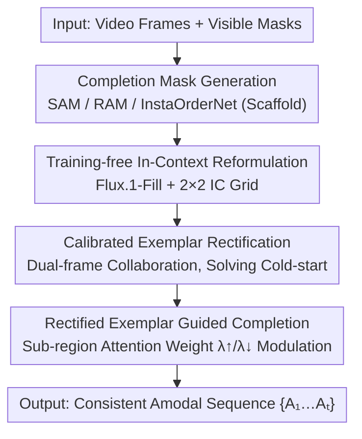

# Image Guides Images: Consistent Video Amodal Completion with Rectified In-Context Exemplar Guidance

**Conference**: CVPR 2026  
**Paper**: [CVF Open Access](https://openaccess.thecvf.com/content/CVPR2026/html/Kong_Image_Guides_Images_Consistent_Video_Amodal_Completion_with_Rectified_In-Context_CVPR_2026_paper.html)  
**Code**: https://github.com/xxyCSCV/IC-Amodal (Available)  
**Area**: Video Understanding / Diffusion Models / Video Completion  
**Keywords**: Video amodal completion, training-free, visual in-context, attention modulation, diffusion completion  

## TL;DR
IC-Amodal proposes a **training-free** framework for Video Amodal Completion (VAC). By leveraging a pre-trained image inpainting model (Flux.1-Fill), it reformulates VAC as "rectified in-context learning." It utilizes dual-frame collaboration to construct reliable exemplars to address the cold-start problem, followed by sub-region attention weight modulation to anchor the model's focus on the exemplars. This achieves both open-world generalization and temporal consistency without fine-tuning, outperforming state-of-the-art (SOTA) models fine-tuned on synthetic data.

## Background & Motivation
**Background**: Amodal completion, rooted in Gestalt psychology, aims to infer the complete shape and appearance of an occluded object from its visible parts. Extending this to the video domain (VAC) requires both spatial plausibility and inter-frame consistency. Current SOTA methods (e.g., TACO, Diffusion-VAS) typically involve **fine-tuning specialized video generation models** on meticulously constructed amodal datasets.

**Limitations of Prior Work**: Real-world amodal data pairs (occluded vs. unoccluded) are extremely difficult to collect. These datasets are often small-scale and lack realistic distributions (mostly synthetic or simulated occlusions). This leads to two critical issues: high training costs and, more importantly, **limited generalization capability** in real-world, rare, or severe occlusion scenarios.

**Key Challenge**: Generalization requires the open-world knowledge of pre-trained large models, but applying pre-trained image inpainting models frame-by-frame lacks cross-frame information propagation, leading to flickering artifacts and inconsistent completions. There is a direct conflict between "generalization (using image priors)" and "temporal consistency."

**Goal**: To retain the generalization of pre-trained models while ensuring the spatio-temporal consistency of VAC. The authors decompose this into two sub-problems: (1) How to construct exemplars for in-context learning when no ground-truth amodal samples are available? (2) How to design an inference-time mechanism that forces the model to explicitly focus on the features of the object to be completed and anchor its semantics to the exemplar?

**Key Insight**: Visual in-context (IC) learning can inject task priors into pre-trained models without fine-tuning. However, two obstacles exist: standard global attention cannot distinguish between "task-critical amodal cues" and "irrelevant context," even with ground-truth exemplars. Furthermore, IC learning suffers from a **cold-start** problem—the amodal exemplar itself must be generated via inpainting, and inpainting models tend to generate artifacts that are "complete-looking but structurally inconsistent with the visible regions."

**Core Idea**: Use "rectified in-context exemplar guidance"—specifically, dual-frame collaboration to construct reliable exemplars (solving cold-start) and sub-region attention weight modulation (solving context interference) to transform a training-free image inpainting model into a consistent VAC engine.

## Method

### Overall Architecture
IC-Amodal uses the pre-trained inpainting model **Flux.1-Fill** as its backbone (a Flux variant fine-tuned for completion). The input consists of a video frame sequence $\{X_1,\dots,X_T\}$ and visible object masks $\{M_1,\dots,M_T\}$, outputting the complete object appearance sequence $\{A_1,\dots,A_T\}$. The pipeline proceeds as follows: First, completion masks are automatically generated (following OW-Amodal using SAM/RAM/InstaOrderNet). In the **first stage**, information from the two most reliable frames is fused via dual-frame collaboration to rectify a high-quality exemplar pair $(X_{ex},A_{ex})$. In the **second stage**, the exemplar pair and each target frame are concatenated into a $2\times2$ IC grid $G_k=[X_{ex},A_{ex};X_k,I_{m,k}]$. The base model learns the $X_{ex}\to A_{ex}$ transformation via its inherent all-to-all attention and transfers it to $X_k\to A_k$. Simultaneously, attention modulation anchors the focus on the exemplar, generating a consistent amodal sequence frame-by-frame.

### Key Designs

**1. Training-free In-Context Reformulation: Turning VAC into "Image Teaches Image" Analogous Learning**  
To address the "fine-tuned video model $\to$ poor generalization" bottleneck, the authors skip training entirely and reformulate VAC as visual in-context learning. Specifically, the exemplar pair $(X_{ex},A_{ex})$ and the target frame pair $(X_k,I_{m,k})$ are arranged into a $2\times2$ grid $G_k=[X_{ex},A_{ex};X_k,I_{m,k}]$, where $I_{m,k}=M_k\odot X_k$ represents the visible portion of the target frame. This grid structure explicitly guides the base model to learn the "incomplete $\to$ complete" transformation from $X_{ex}\to A_{ex}$ and apply it to $X_k\to A_k$, implicitly maintaining temporal consistency through the DiT's inherent global attention. This inherits the open-world generalization of Flux.1-Fill while injecting consistency constraints into the frame-wise completion process.

**2. Calibrated Exemplar Rectification: Solving Cold-start Artifacts via Dual-frame Collaboration**  
IC learning requires reliable exemplars. However, VAC is an ill-posed problem, and initial exemplars can only be generated via inpainting. Inpainting models often suffer from a tendency to "create a complete object from thin air" based on text prompts while ignoring structural consistency with the visible region. A bad exemplar propagates errors across the entire sequence. The authors exploit a key property of VAC—**different frames contain complementary information about the target object**. They select the frame with the largest visible mask area as the exemplar frame $X_{ex}$ and another frame with the second-largest area and **sufficient temporal distance** as the collaborative frame $X_{ex\text{-}p}$. By completing both frames simultaneously in a $2\times2$ grid, the object information undergoes self-rectification, avoiding artifacts and producing reliable exemplars.

**3. Rectified Exemplar Guided Completion: Anchoring Task Cues via Sub-region Attention Modulation**  
While DiT self-attention captures global info, vanilla attention cannot distinguish task-critical cues. The authors apply **sub-region level** modulation to attention weights within the multimodal blocks. Query/key indices are partitioned into the text token set $\Omega_T$ and four sub-image token sets $\Omega_i$ ($i\in\{1,2,3,4\}$). The global attention is treated as a block matrix, where $A_{i,j}$ is the attention from sub-image $j$ to sub-image $i$. Focus is placed on three blocks related to the completion region $I_{m,k}$: $A_{1,4}$ ($X_{ex}\to I_{m,k}$), $A_{2,4}$ ($A_{ex}\to I_{m,k}$), and $A_{3,4}$ ($X_k\to I_{m,k}$). Rectification involves: **amplifying positive guidance** by multiplying attention from the task-critical exemplar $A_{ex}$ by $\lambda^{\uparrow}$, and **suppressing irrelevant interference** by multiplying attention from irrelevant regions $X_{ex}, X_k$ by $\lambda^{\downarrow}$:

$$\text{Attn}_{A_{ex}}=\lambda^{\uparrow}\cdot\text{Attn}_{A_{ex}},\quad \text{Attn}_{X_{ex}}=\lambda^{\downarrow}\cdot\text{Attn}_{X_{ex}},\quad \text{Attn}_{X_k}=\lambda^{\downarrow}\cdot\text{Attn}_{X_k}.$$

Other attention weights remain unchanged. This redirects the model's global attention to the most relevant exemplar $A_{ex}$, ensuring it prioritizes amodal completion over irrelevant context.

### Loss & Training
This method **requires no training or fine-tuning**. It uses the public pre-trained Flux.1-Fill model directly. Inference is performed on NVIDIA A6000 GPUs. Rectification is driven by inference-time attention scaling ($\lambda^{\uparrow}/\lambda^{\downarrow}$) and frame selection rules with no learnable parameters.

## Key Experimental Results

Metrics: **PSNR/SSIM/LPIPS** measure fidelity and perceptual quality against ground-truth amodal references; **IoU** measures amodal mask alignment accuracy; **FVD** measures temporal consistency (lower is better). **IC-Amodal+** refers to the enhanced version where the completed output is blended with the original visible regions following the OW-Amodal approach.

### Main Results
Comparison with image, video, and amodal baselines on Kubric-Static/Dynamic datasets:

| Dataset | Method | PSNR↑ | SSIM↑ | LPIPS↓ | IoU↑ | FVD↓ |
|--------|------|-------|-------|--------|------|------|
| Kubric-Static | Diffusion-VAS (CVPR25) | 21.358 | 0.845 | 0.101 | 84.3 | 228.05 |
| Kubric-Static | TACO (ICCV25) | 23.963 | 0.891 | **0.073** | 83.9 | **162.91** |
| Kubric-Static | IC-Amodal | 24.043 | 0.898 | 0.081 | 86.7 | 184.10 |
| Kubric-Static | IC-Amodal+ | **29.480** | **0.903** | **0.070** | **87.9** | 163.84 |
| Kubric-Dynamic | Diffusion-VAS (CVPR25) | 21.067 | 0.859 | 0.096 | 77.8 | 230.02 |
| Kubric-Dynamic | TACO (ICCV25) | 23.054 | 0.886 | 0.080 | 77.4 | 209.28 |
| Kubric-Dynamic | IC-Amodal | 24.705 | 0.910 | 0.070 | 85.5 | 188.81 |
| Kubric-Dynamic | IC-Amodal+ | **30.091** | 0.901 | **0.060** | **86.6** | **174.45** |

Key Observation: On Kubric-Dynamic, the **training-free** IC-Amodal outperforms fine-tuned Diffusion-VAS and TACO. With blending, IC-Amodal+ further increases the margin, reducing FVD significantly. Video-specific methods like E2FGVI fall behind, likely due to a lack of amodal awareness.

### Ablation Study
Incremental impact of In-Context (IC), Sec 3.2 (Calibrated Rectification), and Sec 3.3 (Rectified Guidance):

| Config | IC | Sec 3.2 | Sec 3.3 | PSNR↑ | SSIM↑ | LPIPS↓ | IoU↑ | FVD↓ |
|------|----|---------|---------|-------|-------|--------|------|------|
| A-I | - | - | - | 23.69 | 0.845 | 0.099 | 81.2 | 278.25 |
| A-II | ✓ | - | - | 23.43 | 0.857 | 0.088 | 79.2 | 301.83 |
| A-III | ✓ | ✓ | - | 24.50 | 0.884 | 0.074 | 84.4 | 219.37 |
| Ours | ✓ | ✓ | ✓ | **24.71** | **0.910** | **0.070** | **86.6** | **188.81** |

### Key Findings
- **Exemplar quality is critical**: Vanilla IC (A-II) without rectification performs worse than no IC (A-I) in terms of FVD (301.83 vs 278.25), confirming that bad exemplars propagate errors.
- **Calibrated Rectification is the primary contributor**: Adding Sec 3.2 (A-III) drops FVD from 301.83 to 219.37, showing that dual-frame collaboration is key to making IC useful.
- **Attention Rectification fixes the last mile**: Adding Sec 3.3 (Ours) further improves consistency (FVD 188.81).
- IC-Amodal shows robustness in severe occlusion and learns the "incomplete $\to$ complete" mapping rather than simple copying.

## Highlights & Insights
- **Training-free excels beyond SOTA**: Repurposing image inpainting priors with inference-time mechanisms bypasses the data scarcity bottleneck.
- **Diagnosing ICL Traps**: The authors didn't just apply IC; they identified the failure modes (attention noise and cold-start artifacts) and designed specific fixes.
- **Transferable Sub-region Modulation**: The strategy of modulating DiT attention by sub-image blocks is applicable to other grid-based IC tasks like personalization or controlled editing.
- **Effective Frame Selection**: The simple rule of using visibility sorting and temporal spacing is low-cost yet powerful for exemplar reliability.

## Limitations & Future Work
- Strong dependence on the base model (Flux.1-Fill); if the base model fails on certain textures, rectification cannot save it.
- Frame selection assumes the existence of at least one "good frame" with low occlusion; quality degrades if all frames are severely occluded.
- Quantitative results for real-world data and user studies are relegated to the supplementary material.
- Sensitivity analysis for hyperparameters $\lambda^{\uparrow}/\lambda^{\downarrow}$ is needed to confirm stability across datasets.

## Related Work & Insights
- **vs. TACO / Diffusion-VAS (Fine-tuning VAC)**: These rely on synthetic data which harms real-world generalization; IC-Amodal uses image priors to achieve better generalization and consistency.
- **vs. OW-Amodal (Training-free Image Amodal)**: OW-Amodal lacks temporal mechanisms, leading to high FVD; IC-Amodal's dual-frame rectification significantly leads in consistency.
- **vs. Analogist / JeDI (Visual ICL)**: These target generation/style transfer. VAC's ill-posed nature requires the explicit rectification and semantic anchoring proposed in IC-Amodal.

## Rating
- Novelty: ⭐⭐⭐⭐⭐ 
- Experimental Thoroughness: ⭐⭐⭐⭐ 
- Writing Quality: ⭐⭐⭐⭐ 
- Value: ⭐⭐⭐⭐⭐ 

<!-- RELATED:START -->

## Related Papers

- [\[CVPR 2026\] Seeing Conversations: Communication Context Identification in Egocentric Video](seeing_conversations_communication_context_identification_in_egocentric_video.md)
- [\[CVPR 2026\] CVA: Context-aware Video-text Alignment for Video Temporal Grounding](cva_context-aware_video-text_alignment_for_video_temporal_grounding.md)
- [\[CVPR 2026\] Towards Data-Efficient Video Pre-training with Frozen Image Foundation Models](towards_data-efficient_video_pre-training_with_frozen_image_foundation_models.md)
- [\[CVPR 2026\] SAIL: Similarity-Aware Guidance and Inter-Caption Augmentation-based Learning for Weakly-Supervised Dense Video Captioning](sail_similarity-aware_guidance_and_inter-caption_augmentation-based_learning_for.md)
- [\[CVPR 2026\] VecAttention: Vector-wise Sparse Attention for Accelerating Long Context Inference](vecattention_vector-wise_sparse_attention_for_accelerating_long_context_inferenc.md)

<!-- RELATED:END -->
