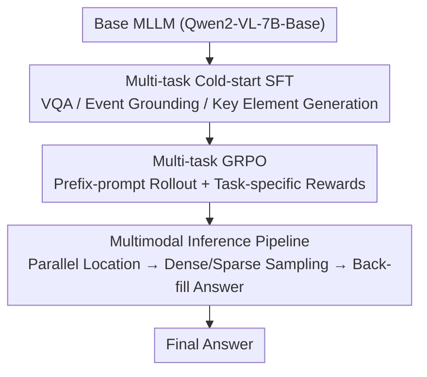

# Incentivizing Versatile Video Reasoning in MLLMs via Data-Efficient Reinforcement Learning

**Conference**: CVPR 2026  
**Paper**: [CVF Open Access](https://openaccess.thecvf.com/content/CVPR2026/html/Wang_Incentivizing_Versatile_Video_Reasoning_in_MLLMs_via_Data-Efficient_Reinforcement_Learning_CVPR_2026_paper.html)  
**Code**: https://github.com/Wang-Xiaodong1899/VideoReasoner  
**Area**: Video Understanding  
**Keywords**: Video Reasoning, Multimodal Large Language Models (MLLMs), Reinforcement Learning, GRPO, Data-Efficient, Multi-task

## TL;DR
This paper proposes VideoReasoner: by using only 3K cold-start data and 5K reinforcement learning data (8K in total) directly on a Base MLLM (Qwen2-VL-7B-Base), it trains three video reasoning capabilities—"event reasoning / keyframe reasoning / direct answering." During the inference phase, these are combined into a pipeline that "first locates key events and keyframes, then performs dense sampling for back-filling to generate answers." It significantly outperforms the Base model across 7 video benchmarks and matches or even surpasses Qwen2.5-VL-7B-Instruct trained on large-scale data.

## Background & Motivation
**Background**: Transferring reinforcement learning (especially DeepSeek-R1-style verifiable reward GRPO) from language reasoning to multimodality to enhance deep reasoning in video MLLMs is currently a hot research direction (e.g., Video-R1).

**Limitations of Prior Work**: (1) Existing video RL frameworks involve unstable training and high costs—Video-R1 requires 165K data for cold-start and 260K for RL. Moreover, they are generally built on Instruct models, which have a strong "direct short answer" prior after large-scale SFT that inhibits step-by-step reasoning, requiring more data to correct. (2) Existing methods rely on **text-only** reasoning paths; long-chain text reasoning struggles to guarantee long-term accuracy of visual information, leading to error accumulation and hallucinations. (3) Allocating longer text budgets (>1K tokens) may trigger self-reflection but slows down inference, creating a bottleneck for real-world applications.

**Key Challenge**: Video reasoning requires both "correct reasoning" and "accurate perception"—the longer a pure language reasoning chain grows, the more it deviates from visual evidence. Meanwhile, correcting the "direct answer" prior in Instruct models requires massive amounts of data. The combination of these factors makes existing solutions either expensive or unreliable.

**Goal**: (1) Build a stable and efficient video reasoning framework directly on a Base model rather than an Instruct model. (2) Extend reasoning from pure text to "multimodal elements" (events, keyframes) to reduce hallucinations. (3) Suppress data and training costs to an extremely low level (around 8K).

**Key Insight**: The authors argue that Base models, having only undergone multimodal pre-training without the inductive bias for "direct answering," are better suited for multi-task learning. Additionally, "events" and "keyframes" in videos express information more clearly than text and should serve as intermediate carriers for reasoning.

**Core Idea**: Use "multi-task cold-start + multi-task RL" to enable the Base model to learn three video reasoning capabilities. During inference, event reasoning and keyframe reasoning are performed in parallel, and the located visual information is fed back into the model to generate the direct answer—using multimodal elements instead of long text chains to support video reasoning.

## Method

### Overall Architecture
VideoReasoner is a framework consisting of a two-stage training process and an inference pipeline. First, multi-task SFT cold-start is used to adapt the Base MLLM to three output formats (Video QA, Event Grounding, Keyframe Detection → Key Element Generation). Then, multi-task GRPO is used to truly reinforce event grounding and video QA capabilities. Finally, in the inference phase, the three capabilities are chained into a "Parallel key event + keyframe location → Dense/Sparse sampling → Back-filling answer generation" process.

### Key Designs

**1. Multi-task Cold-start SFT: Teaching Output Formats via Unified Instructions**

The Base model lacks the "direct answer" prior but also does not know specific task formats. Thus, the first step is low-cost cold-starting. The authors design three core tasks—**Video QA**, **Video Event Grounding**, and **Keyframe Detection**. These are differentiated using a unified system prompt + different task prefixes (e.g., "The answer is:", "I want to locate the key event...", "I want to output the key elements:"). Two critical modifications: (i) **Keyframe detection is reconstructed as key element generation**—since "keyframes" are hard to define and MLLMs struggle to predict frame indices directly, the model outputs key element text, and a visual encoder is then used to retrieve the corresponding frames. (ii) **Event grounding uses relative value prediction**—absolute time prediction is highly dependent on the training distribution. Instead, the model predicts temporal ratios $[\text{start ratio}, \text{end ratio}]$ and uses two learnable special tokens `<|event_start|>` and `<|event_end|>` for more stable localization. The entire cold-start utilizes ~3K samples (~1K per task) with the goal of "learning the format" rather than "mastering the capability." The loss is standard next-token prediction: $p(X_a\mid X_v, X_{instruct})=\prod_{i=1}^{L}\pi_\theta(x_i\mid X_v, X_{instruct}, X_{a,<i})$.

**2. Multi-task GRPO: Multi-task Rollouts with Task-specific Rewards**

True capability enhancement comes from RL. The authors extend GRPO to multi-tasking. **At the data level**, different prefix prompts are used for the same video-query pair to allow the model to rollout different tasks (Event Grounding + Video QA), improving data utilization. Metadata with both answers and reference time intervals from [50] is reused without manual labeling. **At the model level**, the policy is optimized based on the group-relative advantage of rollouts for different tasks. The multi-task objective is:

$$J_{\text{M-GRPO}}(\theta)=\mathbb{E}\Big[\frac{1}{G}\sum_{i=1}^{G}\big(\min(\rho_i A_i, \text{clip}(\rho_i, 1-\epsilon, 1+\epsilon)A_i)-\beta D_{KL}(\pi_\theta\|\pi_{ref})\big)\Big],$$

where $m=[X_v, q, g, p]$ is the multimodal query with task prefix $p\in\{p_1,p_2\}$. Unlike cold-start, **prefix tokens are excluded from the loss** to prevent the model from over-fitting to a single format. Three rewards are designed: **IoU reward** (grounding: IoU between predicted ratio and ground truth), **Format reward** (grounding: correct prediction of special tokens), and **Accuracy reward** (VQA: 0/1). For the event grounding task, $r_{acc}$ is set to 0, while for VQA, $r_{form}$ and $r_{IoU}$ are set to 0, ensuring task objectives do not interfere. This stage uses 5K queries and avoids long rollouts, making it very efficient.

**3. Multimodal Inference Pipeline: Parallel Location and Evidence Back-filling**

After training, the model can perform event grounding, video understanding, and keyframe detection. The inference pipeline combines these to reduce hallucinations. The video is fed into the model with two task prefixes **in parallel**: one branch outputs the event interval $[S_r, E_r]$, while the other outputs key elements. Text embeddings of key elements and video embeddings of sampled frames are compared via a visual encoder to select keyframes. All key intervals are merged and sorted. **High FPS dense sampling** is applied to key intervals to capture visual detail, while **low FPS sparse sampling** is applied elsewhere to maintain global context. The sampled frames are merged and fed back into the model with a VQA prefix to generate the final answer. This "locate-then-focus" approach replaces "long text reasoning," ensuring answers are based on localized visual evidence.

## Key Experimental Results

### Main Results
The framework uses full-parameter tuning on Qwen2-VL-7B-Base, 3K cold-start samples, and 5K RL queries. Each video is sampled at 64 frames.

| Model | Video-MME Overall | MLVU | LVBench |
|------|-----------|------|---------|
| Qwen2-VL-7B-Instruct | 59.3 | 61.7 | 39.7 |
| Baseline: Qwen2.5-VL-7B-Instruct | 62.4 | 63.0 | 37.7 |
| Baseline: Qwen2-VL-7B-Base | 58.3 | 61.4 | 36.8 |
| + RL (Ours) | 60.8 | 63.0 | 38.4 |
| + VideoReasoner (Ours) | 62.0 | 64.6 | — |

Adding RL to the Base model improves performance across all benchmarks. With the inference pipeline, it matches or exceeds Qwen2.5-VL-7B-Instruct on several benchmarks using only 8K total data samples.

| Video Reasoning | VSI-Bench | MMVU |
|----------|-----------|------|
| Qwen2.5-VL-7B-Instruct | 38.1 | 67.5 |
| + Video-R1 | 37.8↓ | 64.3↓ |
| + RL (Ours) | **39.1**↑ | **68.0**↑ |
| Qwen2-VL-7B-Base | 28.9 | 61.1 |
| + RL (Ours) | 33.7↑ (+4.8) | 62.4↑ (+1.3) |

In temporal grounding (Charades-STA), the cold-started Base model already exceeds Qwen2.5-VL-7B-Instruct, with RL further improving metrics. On the VideoHallu hallucination benchmark, pure text CoT drops the score from 34.3 to 6.6, while the proposed method increases it to 39.0, validating the "multimodal reasoning reduces hallucination" motivation.

### Ablation Study
| Configuration | Key Metric | Description |
|------|---------|------|
| Baseline (Qwen2-VL-7B-Base) | Video-MME 58.3 | No cold-start |
| + Cold Start | Consistent improvement | Stabilizes baseline |
| + RL (Temporal Grounding only) | Gains in long video only | Harms accuracy without answer rewards |
| + RL (VQA + Temporal Grounding) | Superior to VQA only | Multi-task RL is effective |

### Key Findings
- **Pure text CoT hurts video reasoning**: Video-R1's performance dropped compared to the Instruct baseline on VSI-Bench/MMVU, and CoT caused a drastic drop on VideoHallu. This proves that long text chains detached from visual evidence exacerbate hallucinations.
- **Multi-task RL is superior to single-task RL**: Using only temporal grounding data for RL is only effective for long videos and can drag down other tasks; joint training with VQA is necessary for stable overall improvement.
- **Extreme Data Efficiency**: 8K data (3K+5K) allows the Base model to approach Instruct models trained on massive data, highlighting the efficiency of multi-task learning on Base models.

## Highlights & Insights
- **Counter-intuitive choice of "Base over Instruct"**: The authors demonstrate that the "direct answer" prior in Instruct models is a burden. Base models, without this bias, are better suited for multi-task reasoning learning—explaining the high efficiency with only 8K data.
- **Replacing text with visual elements as reasoning carriers**: Using event intervals and keyframes as localizable and back-fillable intermediate representations is closer to visual evidence.
- **Data reuse via prefix routing**: Generating different task rollouts from the same video-query pair via prefix routing, while excluding prefixes from the loss, is a transferable design for multi-skill RL training.
- **Pragmatic keyframe detection**: Avoiding the difficulty of absolute frame index prediction by generating text elements and using retrieval is a practical engineering solution.

## Limitations & Future Work
- The framework is intentionally built on **Base models** to avoid Instruct priors; how to bridge this gap for already-deployed Instruct models remains an open question.
- The inference pipeline introduces parallel localization and dual-path sampling, which **increases the inference chain length**. Although it avoids long text budgets, the total latency (including encoder retrieval) is not quantified.
- Multi-task GRPO only includes event grounding and VQA; keyframe reasoning is mainly learned during cold-start and not further reinforced.
- Keyframe selection depends on external encoder retrieval quality, which affects the effectiveness of back-filled frames.

## Related Work & Insights
- **vs Video-R1**: Video-R1 uses 165K+260K data and pure text CoT on Instruct models. This work uses 8K data and multimodal element reasoning on Base models, proving more efficient and hallucination-resistant.
- **vs Video-of-Thought**: VoT decomposes tasks into textual reasoning steps; this work uses visual intermediate elements instead of text steps.
- **vs Seed1.5-VL / InternVL3.5**: These cascaded RL frameworks still focus on language reasoning; this work emphasizes a multimodal element reasoning path with low data costs.

## Rating
- Novelty: ⭐⭐⭐⭐ The "multimodal element reasoning + multi-task GRPO + Base model" combination is novel and addresses the limitations of text chains.
- Experimental Thoroughness: ⭐⭐⭐⭐ Covers 7 video benchmarks plus grounding and hallucination; clear comparisons, though latency costs are less detailed.
- Writing Quality: ⭐⭐⭐⭐ Logical flow from motivation to method and experiments is clear.
- Value: ⭐⭐⭐⭐ Demonstrates how 8K data can rival large-scale Instruct models; code is open-source.

<!-- RELATED:START -->

## Related Papers

- [\[CVPR 2026\] Efficient Frame Selection for Long Video Understanding via Reinforcement Learning](efficient_frame_selection_for_long_video_understanding_via_reinforcement_learnin.md)
- [\[CVPR 2026\] VAST: Video Ability-Stratified Taxonomy for Data-Efficient Video Reasoning](vast_video_ability-stratified_taxonomy_for_data-efficient_video_reasoning.md)
- [\[CVPR 2026\] Learning Transferable Temporal Primitives for Video Reasoning via Synthetic Videos](learning_transferable_temporal_primitives_for_video_reasoning_via_synthetic_vide.md)
- [\[CVPR 2026\] Learning to Assist: Physics-Grounded Human-Human Control via Multi-Agent Reinforcement Learning](learning_to_assist_physics-grounded_human-human_control_via_multi-agent_reinforc.md)
- [\[CVPR 2026\] VideoChat-M1: Collaborative Policy Planning for Video Understanding via Multi-Agent Reinforcement Learning](videochatm1_collaborative_policy_planning_for_vide.md)

<!-- RELATED:END -->
