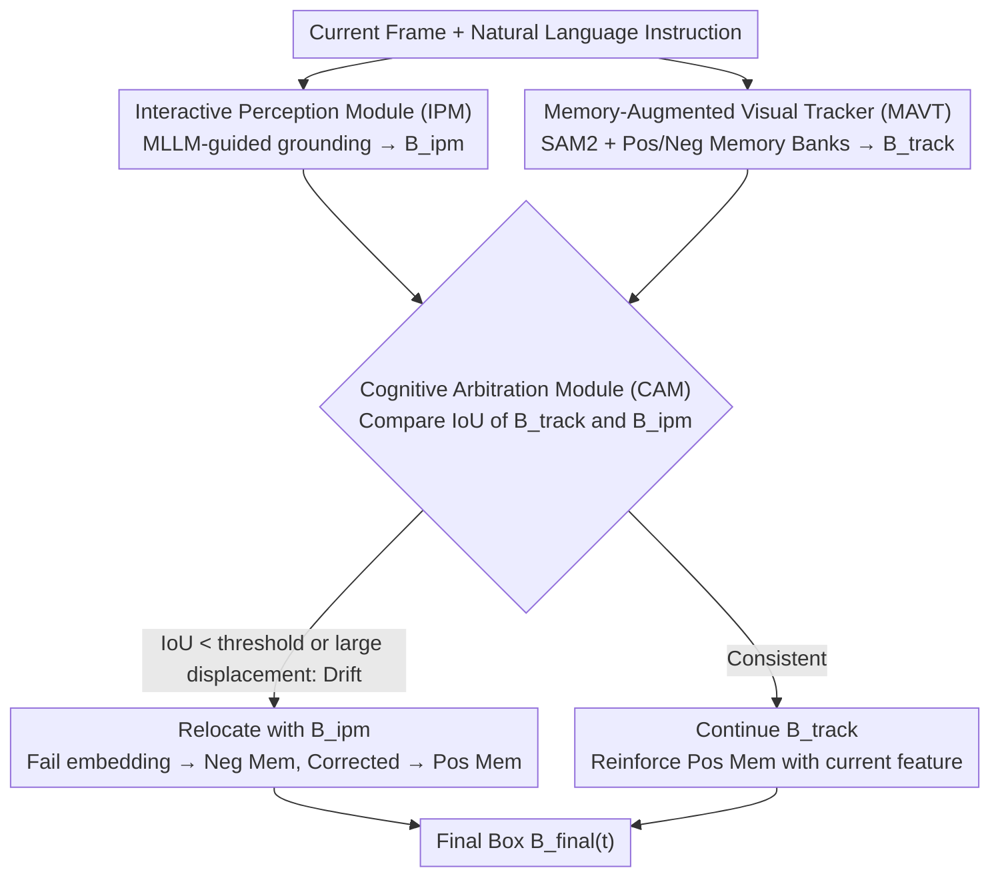

# Interactive Tracking: A Human-in-the-Loop Paradigm with Memory-Augmented Adaptation

**Conference**: CVPR 2026  
**Paper**: [CVF Open Access](https://openaccess.thecvf.com/content/CVPR2026/html/Huang_Interactive_Tracking_A_Human-in-the-Loop_Paradigm_with_Memory_Augmented_Adaptation_CVPR_2026_paper.html)  
**Code**: Benchmark/Results/Analysis available on the paper URL (subject to the original text ⚠️)  
**Area**: Video Understanding / Visual Object Tracking / Human-in-the-Loop  
**Keywords**: Interactive Tracking, Human-in-the-Loop, Natural Language Instructions, Memory Augmentation, InteractTrack Benchmark

## TL;DR
This paper proposes a new paradigm of "Interactive Tracking," where users can guide or correct the tracker using natural language instructions at any time. The authors release InteractTrack, the first large-scale interactive tracking benchmark (150 videos, 140,000 frames, 4D evaluation protocol), showing that 25 SOTA trackers fail in this setting. Finally, a strong baseline IMAT is introduced, featuring positive and negative memory banks.

## Background & Motivation

**Background**: Visual Object Tracking (VOT) is a cornerstone of computer vision, aiming to continuously locate a target given its initial bounding box. It is widely used in surveillance, autonomous driving, and robotics. Technologies have evolved from Siamese networks (SiamFC, SiamRPN) to Transformer-based architectures (TransT, STARK, MixFormer, OSTrack) and pixel-level VOS (XMem, SAM2). Integrating language has further led to Visual-Language Tracking (VLT) and Referring Video Object Segmentation (RVOS).

**Limitations of Prior Work**: Existing trackers mostly follow a "fire-and-forget" non-interactive mode. In reality, tracking is rarely a one-time setup. Taking a basketball video as an example (Fig. 1 in the paper), a viewer's focus naturally shifts from the player with the ball, to another player, to the fast-moving ball, and finally to a different ball handler. Such dynamic focus switching is intuitive for humans, but current systems support only automatic execution after initialization without user intervention. While VLT/RVOS utilize language, they typically **perform one-time grounding during initialization or run offline**, failing to handle sequential user instructions over time or support real-time human-in-the-loop interaction.

**Key Challenge**: Interactive tracking requires a model to **respond to user guidance in real-time, understand natural language, and dynamically switch focus**. This tightly couples perception, reasoning, and human-computer interaction within a continuous feedback loop, making it significantly more difficult than traditional tracking. Existing paradigms (appearance-only VOT, single-grounding VLT/RVOS) and benchmarks (VOT, LaSOT, VideoCube, TNL2K) are designed for **purely automatic** settings, lacking both interaction mechanisms and protocols to measure "responsiveness/adaptability."

**Goal**: ① Define the interactive tracking task; ② Create a benchmark to systematically evaluate the ability to "understand-respond-adapt" to human guidance; ③ Develop a baseline that learns from user feedback and dynamically updates tracking behavior.

**Key Insight**: Since the bottleneck lies in the absence of interactive supervision data and protocols, the authors focus on filling this gap—re-annotating 150 videos by inserting 4-5 timestamped language instructions per video (initialization, drift correction, focus refinement, intent switching) and designing a 4D evaluation protocol.

**Core Idea**: Treat human intelligence as a complement to automated perception. Users guide the tracker at any frame using natural language instructions, and the tracker learns from feedback and adjusts immediately via a dynamic memory mechanism with positive and negative memory banks.

## Method

The paper makes three contributions: the InteractTrack benchmark, a 4D evaluation protocol, and the IMAT baseline. The core method, IMAT, consists of three modules: the Interactive Perception Module (IPM) for language grounding, the Memory-Augmented Visual Tracker (MAVT) for stable propagation, and the Cognitive Arbitration Module (CAM) acting as a high-level decision controller to decide whether to "maintain or correct."

### Overall Architecture

IMAT unifies the "spatiotemporal consistency of visual tracking" with the "semantic reasoning of Multimodal Large Language Models (MLLM)." After user initialization, MAVT tracks continuously. At any frame, a user can provide a natural language instruction $P_t$ (e.g., "watch the black bear in the middle"). IPM then performs grounding based on the current frame $I_t$ and instruction to produce a semantically aligned box $B_{ipm}(t)$. During interaction frames (triggered by user input or detected motion inconsistency), CAM compares the tracker's prediction $B_{track}(t)$ with the IPM grounding box via IoU to determine whether to **confirm the current status** or **correct the trajectory and update memory**. If consistent, the positive memory is reinforced to continue propagation; if drift or mismatch occurs, $B_{ipm}(t)$ is used for relocation, the failed embedding is stored in negative memory, and the corrected embedding is stored in positive memory. This dual "positive feedback + negative learning" update allows IMAT to improve through continuous interaction.

### Key Designs

**1. Interactive Perception Module (IPM): The Semantic Gateway for HITL**  
Addressing the failure of existing trackers to understand user instructions, IPM acts as the human-in-the-loop interface. At any frame $t$, a user can input a natural language query $P_t$. IPM processes the current frame $I_t$ and query $P_t$ for vision-language grounding, outputting a semantically aligned box $B_{ipm}(t)$. This is implemented using the MLLM-based perception model **Rex-Omni**, which aligns visual features with user descriptions. The resulting box can be used to **re-initialize** the tracker or **verify** its state via CAM. This module translates "linguistic intent" into a "spatial box," serving as the semantic starting point of the interaction loop.

**2. Memory-Augmented Visual Tracker (MAVT): Adaptive Learning and Interference Suppression**  
Tracking usually relies on a fixed initial template, failing to adapt to feedback. MAVT extends SAM2 with two external memory banks: positive memory $M^+$ and negative memory $M^-$. The predicted box for each frame is conditioned on both: $B_{track}(t)=\mathrm{Tracker}(I_t; M^+, M^-)$. $M^+$ stores "validated target cues" to help the tracker adapt to legitimate changes in pose, lighting, and scale. $M^-$ stores "distractors, failed predictions, or discarded targets" to **suppress responses** in previously ambiguous regions. Both banks are dynamically updated under **novelty and diversity constraints** to remain compact yet expressive. Unlike the positive-only propagation in SAM2, negative memory is a crucial addition for avoiding re-tracking old targets after a focus switch.

**3. Cognitive Arbitration Module (CAM): Selective High-Level Decision Controller**  
To balance trust between the tracker and user semantics, CAM decides whether to maintain or correct. Activated during interaction frames (user instruction or motion inconsistency), it compares the IoU between $B_{track}(t)$ and $B_{ipm}(t)$: $\mathrm{IoU}=\frac{\mathrm{area}(B_{track}\cap B_{ipm})}{\mathrm{area}(B_{track}\cup B_{ipm})}$. If the IoU is below threshold $\tau_{iou}$ or center displacement exceeds $\delta_c$, a drift is identified. CAM then uses IPM to verify if the current prediction matches the intended target. If they mismatch, it re-initializes with $B_{ipm}(t)$, adds the failed embedding to $M^-$, and the corrected one to $M^+$. If consistent, it reinforces $M^+$ with current features. The final box $B_{final}(t)$ is $B_{ipm}(t)$ (upon drift detection) or $B_{track}(t)$ (otherwise). Thresholds are set at $\tau_{iou}^{init}=0.3$ and $\tau_{iou}^{reinit}=0.6$. This **selective arbitration** fuses spatial, semantic, and motion cues only when necessary, balancing efficiency and robustness.

### Mechanism

Consider a basketball scenario: The user initializes a player. MAVT tracks stably using SAM2 and positive memory. At frame #42, the user says "watch the black bear in the middle" (intent switch). IPM grounds this to a new box $B_{ipm}$. CAM calculates the IoU with $B_{track}$, finding it significantly below $0.6$ (pointing to different targets). It identifies a mismatch, re-initializes with $B_{ipm}$, stores the previous player's embedding in $M^-$ (to avoid switching back), and the "black bear" in $M^+$. If the bear is later occluded and the tracker drifts, CAM triggers IPM again for relocation. Throughout the process, positive memory accumulates appearance changes while negative memory avoids distractors, allowing tracking behavior to converge on the user's true intent.

## Key Experimental Results

InteractTrack contains 150 videos, >140,000 frames (avg. 947 frames/video), and >700 language descriptions across six categories (Daily Activities, Sports, UAV, Surveillance, Wildlife, Others). All sequences are **re-annotated** following the interaction protocol. Boxes were verified by multiple annotators, and language was generated via a "Human-GPT-Human" pipeline.

The 4D protocol includes: **Perception** (Accuracy and Precision of target localization on instruction frames); **Responsiveness** (Whether the prediction moves closer to the new target $G^{new}_t$ than the old $G^{old}_t$ with IoU > 0.5 during switches); **Tracking** (Standard AUC and Precision); and **Interactiveness** (Average IoU of segments split by user instructions).

### Main Results (InteractTrack Test Set)

⚠️ *Values are based on Table 2 in the original paper.*

| Method | Interactiveness↑ | Responsiveness↑ | Perception Acc↑ | Perception Prec↑ | Tracking AUC↑ | Tracking Prec↑ | NormPrec↑ |
| :--- | :--- | :--- | :--- | :--- | :--- | :--- | :--- |
| **Ours (IMAT)** | **45.25** | **41.20** | **52.78** | **49.63** | **45.86** | **49.63** | **60.90** |
| Sa2VA (RVOS) | 44.81 | 38.99 | 45.50 | 46.05 | 24.14 | 21.10 | 33.39 |
| VL-SAM2 (VOS) | 44.43 | 37.72 | 48.82 | 46.52 | 41.88 | 45.73 | 56.84 |
| SAMURAI (VOS) | 43.69 | 37.20 | 49.36 | 46.44 | 41.53 | 45.57 | 56.59 |
| DAM4SAM (VOS) | 43.19 | 37.62 | 49.89 | 46.58 | 43.79 | 48.74 | 59.72 |
| SUTrack (VLT) | 40.90 | 38.04 | 49.25 | 48.38 | 44.25 | 47.23 | 58.26 |
| MCITrack (VOT) | 40.38 | 37.93 | 47.97 | 47.48 | 44.98 | 47.92 | 59.61 |
| JointNLT (VLT) | 30.66 | 36.67 | 44.33 | 43.08 | 19.81 | 16.16 | 30.44 |

Ours (IMAT) leads in Interactiveness (45.25) and Responsiveness (41.20), demonstrating superior understanding of instructions and faster adaptation. Its NormPrec (60.90) also proves long-term stability.

### Key Findings
- **Traditional Strength $\neq$ Interactive Strength**: 25 representative trackers that perform well in automatic settings fail to generalize to user-driven interactive tasks, highlighting the gap InteractTrack intends to expose.
- **Negative Memory + Arbitration is Key**: The integration of IPM, MAVT, and CAM provides consistent leads in all 4 dimensions. Negative memory is particularly effective in preventing the tracker from reverting to old targets.
- **Good Scene Generalization**: In OPE success plots, IMAT excels in most environments (e.g., 0.488 in Daily Activities), maintaining stability in scenarios involving frequent target switches, scale changes, and long-term view shifts.

## Highlights & Insights
- **The Task Definition is the Primary Contribution**: Reformulating "fire-and-forget tracking" into "linguistically-intervenable HITL tracking" with a complete benchmark and protocol opens a new research sub-direction.
- **Clever 4D Evaluation**: Decoupling abilities into Perception, Responsiveness, Tracking, and Interactiveness allows for a nuanced characterization of interactive performance beyond simple AUC/Precision.
- **Transferable Dual Memory**: The logic of separating "cues to remember" from "interference to suppress" and updating based on novelty/diversity can be applied to any task requiring online adaptation while resisting distractors.
- **Selective Arbitration for Efficiency**: CAM only invokes multimodal fusion when necessary, avoiding the high computational cost of running MLLM grounding on every frame.

## Limitations & Future Work
- IMAT is a "strong baseline" utilizing off-the-shelf models (Rex-Omni, SAM2). Grounding quality and sensitivity to thresholds ($\tau_{iou}^{init}$, $\tau_{iou}^{reinit}$, $\delta_c$) need more systematic analysis ⚠️.
- The absolute scores (e.g., ~45 for IMAT) are relatively low, indicating that the task remains far from solved.
- The real-time feasibility of relying on MLLM grounding (Rex-Omni) has not been fully quantified for high-speed scenarios.
- Although it covers diverse scenes, the benchmark size (150 videos) is small compared to automated benchmarks (e.g., 700+ in TNL2K) due to the high cost of interactive annotation.

## Related Work & Insights
- **vs. Traditional VOT**: Those rely on fixed first-frame templates and are vision-only. Ours responds to language instructions and switches focus dynamically.
- **vs. VLT / RVOS**: Most prior works perform one-time or offline grounding. Ours supports serialized, runtime user instructions and context updates.
- **vs. SAM2**: While SAM2 unifies image/video interaction, its memory propagation is one-way. IMAT adds negative memory and cognitive arbitration to create a continuous feedback loop for learning from user feedback.

## Rating
- Novelty: ⭐⭐⭐⭐⭐ 
- Experimental Thoroughness: ⭐⭐⭐⭐ 
- Writing Quality: ⭐⭐⭐⭐ 
- Value: ⭐⭐⭐⭐⭐ 

<!-- RELATED:START -->

## Related Papers

- [\[CVPR 2026\] Dual-level Adaptation for Multi-Object Tracking: Building Test-Time Calibration from Experience and Intuition](tcei_test_time_calibration_experience_intuition_mot.md)
- [\[CVPR 2026\] RAGTrack: Language-aware RGBT Tracking with Retrieval-Augmented Generation](ragtrack_language-aware_rgbt_tracking_with_retrieval-augmented_generation.md)
- [\[CVPR 2026\] OmniVTG: A Large-Scale Dataset and Training Paradigm for Open-World Video Temporal Grounding](omnivtg_a_large-scale_dataset_and_training_paradigm_for_open-world_video_tempora.md)
- [\[CVPR 2026\] Learning to Assist: Physics-Grounded Human-Human Control via Multi-Agent Reinforcement Learning](learning_to_assist_physics-grounded_human-human_control_via_multi-agent_reinforc.md)
- [\[ECCV 2024\] Online Temporal Action Localization with Memory-Augmented Transformer](../../ECCV2024/video_understanding/online_temporal_action_localization_with_memory-augmented_transformer.md)

<!-- RELATED:END -->
