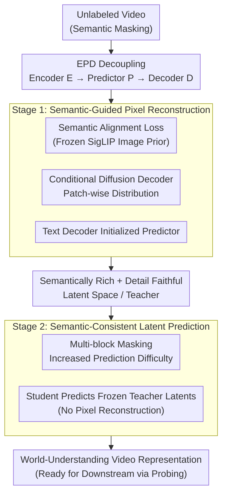

# InternVideo-Next: Towards World-Understanding Video Models

**Conference**: CVPR 2026  
**Paper**: [CVF Open Access](https://openaccess.thecvf.com/content/CVPR2026/html/Wang_InternVideo-Next_Towards_World-Understanding_Video_Models_CVPR_2026_paper.html)  
**Code**: https://github.com/OpenGVLab/InternVideo (to be released)  
**Area**: Video Understanding / Self-Supervised Representation Learning  
**Keywords**: Masked Video Modeling, Self-Supervised Pre-training, Latent World Model, Diffusion Decoder, Video Foundation Models

## TL;DR
InternVideo-Next decomposes the traditional "Encoder-Decoder" architecture of Masked Video Modeling (MVM) into a three-stage **Encoder-Predictor-Decoder (EPD)** framework. It utilizes a two-stage self-supervised pre-training strategy: Stage 1 constructs a latent space that is both detail-preserving and semantically rich using a conditional diffusion decoder and image-level semantic priors; Stage 2 performs latent space prediction toward a frozen teacher to learn world knowledge. Using only publicly available unlabeled videos, this model, which lacks **any video-text supervision**, outperforms video-text pre-trained competitors on benchmarks like K400 and SSv2 for the first time.

## Background & Motivation

**Background**: Large-scale video representation learning follows two main paths. One is **textual supervision** (CLIP-style video-text alignment, e.g., InternVideo2, VideoPrism), which excels in semantic or human-centric tasks like action recognition. The second is **self-supervised Masked Video Modeling (MVM)** (e.g., VideoMAE, V-JEPA), which learns directly from the spatiotemporal structure of videos.

**Limitations of Prior Work**: Textual supervision relies on expensive and noisy synthetic captions (often pieced together from titles and ASR), providing limited semantic coverage and struggling to capture **non-semantic implicit world knowledge** such as depth, fine-grained motion, and causal relationships. Conversely, while MVM leverages spatiotemporal structures, it consistently lags behind text-supervised methods on general tasks like K400 that depend heavily on subject semantics.

**Key Challenge**: The authors argue this gap is not an inherent limitation of MVM but an overlooked **architectural issue**: (1) **Pixel-level reconstruction** suffers from difficult convergence, and its low-level pixel requirements conflict with high-level semantic abstraction—linear decoders require predictor outputs to be linearly projectable to pixels (linearly separable in pixel space), forcing the latent space toward low-level details. (2) **Latent space prediction** (e.g., V-JEPA's symmetric teacher-student) is prone to shortcut learning, capturing superficial temporal statistics rather than true world knowledge.

**Goal**: Construct a unified framework that enables a self-supervised video model to simultaneously bridge pixel fidelity and high-level semantic abstraction, while learning robust spatiotemporal dynamics, causality, and 3D geometric priors through prediction without shortcuts.

**Key Insight**: Explicitly decouple the MVM encoder-decoder into **Encoder-Predictor-Decoder (EPD)** to individually examine the often-ignored **predictor output latent space**. The key insight is that the encoder and predictor should share a "semantically rich and detail-faithful" latent space, turning the predictor into a **Latent World Model** forced to complete missing content using real spatiotemporal relationships and implicit world knowledge rather than trivial correlations.

**Core Idea**: Establish this latent space using a "conditional diffusion decoder + image semantic priors" (Stage 1), then perform latent space prediction toward a frozen teacher on this space to learn world knowledge (Stage 2).

## Method

### Overall Architecture
The general approach of InternVideo-Next is to reformulate MVM into the EPD triad: **E** (ViT Encoder to extract spatiotemporal representations), **P** (lightweight Transformer to predict masked latent representations based on visible tokens), and **D** (reconstruction module to map predictor outputs to the target space, either pixels or target latents). This decoupling allows for the independent quality inspection of the "predictor output latent space." Building on this, training is split into two stages: **Stage 1** uses semantic-guided pixel reconstruction to shape the latent space into one that is semantically aligned, detail-faithful, and structurally consistent. **Stage 2** freezes the teacher obtained in Stage 1 and performs masked latent space prediction to learn spatiotemporal dynamics and causality. The entire process uses only unlabeled public videos.

### Key Designs

**1. EPD Decoupling: Splitting Encoder-Decoder into Encoder-Predictor-Decoder**

Traditional MVM (like MAE) uses an encoder-decoder where the ViT decoder generates reconstructed pixels directly from the encoder output, mixing the predictor and decoder. The predictor's output latent space is never examined in isolation. This work explicitly separates them: **E (Encoding) → P (Predicting masked latents) → D (Mapping to target space)**. The value of this decoupling lies in revealing the insight that the encoder and predictor should share a semantically rich yet detail-faithful latent space. Once this is enforced, the predictor becomes a **Latent World Model**, compelled to use real spatiotemporal relationships and implicit world knowledge (geometry, motion) to fill gaps, which in turn enhances the semantic abstraction of the encoder's representation.

**2. Stage 1 · Conditional Diffusion Decoder: Solving the "Pixel Separability vs. Semantic Abstraction" Conflict**

Linear decoders commonly used in pixel reconstruction require the predictor's output latents to be linearly projectable to pixels, which harms the balance between semantic information and fine-grained detail. This paper adopts a **lightweight conditional diffusion decoder**. It models the distribution of each patch independently using a small MLP composed of a few residual blocks for denoising. The condition vector $z$ is generated by the predictor, and the output corresponds to pixels, with a cosine noise schedule and 1000 training steps. Since it only models the latent distribution of a single patch, the small MLP is sufficient and computationally inexpensive. Ablations show that while naively adding semantic alignment to pixel reconstruction causes performance drops due to optimization conflict (K400 69.8 vs. 70.7 alone), the diffusion decoder **reverses this degradation into a +4.4% gain** (74.2).

**3. Stage 1 · Image-level Semantic Priors + Semantic Alignment Loss + Semantic Masking**

Video-text pre-training suffers from sparse and noisy captions, whereas **image-text** corpora are massive with cleaner, more comprehensive captions. Thus, image-level semantic priors are injected from a frozen image semantic model (SigLIP2-1B for the final version). Cosine similarity is used to align "the student's encoding of masked video" with "the teacher's encoding of visible video regions":

$$\mathcal{L}_{sem} = -\cos\big(E(X_{vis}),\ \text{vis}(\text{SigLIP}(X))\big)$$

Stage 1 jointly optimizes pixel reconstruction and semantic alignment with equal weighting. A complementary **semantic masking** strategy uses attention scores from the semantic teacher for top-k selection, prioritizing the occlusion of temporally informative regions. Predictor $P$ is also **initialized using a pre-trained text decoder (last 5 layers of ModernBert-L)**, providing better semantic priors and smoother translation between latent spaces.

**4. Stage 2 · Semantic-Consistent Latent Prediction toward Frozen Teacher to Prevent Shortcuts**

Stage 2 further learns spatiotemporal dynamics and causality on the aligned latent space from Stage 1. Both student and teacher are initialized with Stage 1 weights. **Multi-block masking** (occluding large contiguous spatiotemporal regions) is used to increase prediction difficulty and reduce information leakage, forcing the model to learn implicit world knowledge. The student predicts the teacher's latent representation in masked regions **without pixel reconstruction**, focusing on abstract semantics and temporal patterns. A key difference from V-JEPA is that the **teacher is frozen** (initialized from Stage 1), as the Stage 1 latent space is already detail-faithful and high-semantic; freezing it prevents shortcut learning or semantic drift typical of symmetric teacher-student setups.

### Loss & Training
Stage 1: Equal-weighted optimization of pixel reconstruction loss (diffusion denoising) and semantic alignment loss $\mathcal{L}_{sem}$ with an 80% mask rate and 1e-3 learning rate. Stage 2: Masked latent space prediction loss (student → frozen teacher). Ablations used 32×A100, batch size 1024, 30 epochs each; final training used 64×A100, batch size 2048, Stage 1 for 50 epochs and Stage 2 for 100 epochs. The predictor uses the last 5 layers of ModernBert-Large, and the semantic teacher is SigLIP2-1B. Stage 1 uses 16 frames; Stage 2 uses 32 frames for optimal accuracy-efficiency balance.

## Key Experimental Results

### Main Results
Top@1 accuracy using "Attentive Probing" (frozen backbone + single attention pooling head) on K400/SSv2/COIN.

| Model | ViT | Data | GPU-hrs | K400 ↑ | SSv2 ↑ | COIN ↑ |
|------|-----|------|---------|--------|--------|--------|
| **Video-Text Pre-training** | | | | | | |
| InternVideo2s2 | Large | 25.5M | - | 86.0 | 65.9 | 90.1 |
| InternVideo2s2 | 6B | 400M | 200K | 88.8 | 67.7 | 92.6 |
| VideoPrism | 1B | 618M | 250K | 87.2 | 68.5 | - |
| **Video-only (No Text)** | | | | | | |
| VideoMAEv2 | Large | 1.35M | - | 80.9 | 54.9 | 83.2 |
| V-JEPAv2 | Large | 22M | 10K | 83.3 | 72.0 | 85.9 |
| InternVideo2s1 | 6B | 2.1M | 110K | 86.0 | 59.0 | 90.3 |
| **InternVideo-Next s2** | Base | 1.1M | 3.4K | 85.9 | 70.1 | 91.4 |
| **InternVideo-Next s2** | Large | 1.1M | 9.7K | **88.4** | **73.0** | **93.6** |

Highlights: InternVideo-Next-Large, using only 1.1M public unlabeled videos and 9.7K A100 GPU-hours, exceeds InternVideo2-Large (trained on 25.5M video-text pairs) on K400 (88.4), SSv2 (73.0), and COIN (93.6). It is the **first video model without video-text supervision to outperform video-text competitors on both K400 and SSv2 simultaneously**.

### Ablation Study
Stage 1 components (K400/SSv2, Linear Probing):

| Configuration | K400 | SSv2 | Description |
|------|------|------|------|
| Pixel reconstruction baseline | 47.2 | 28.1 | Poor semantic abstraction |
| SigLIP alignment only | 70.7 | 32.1 | Significant gain with semantic prior |
| Pixel recon + Alignment | 69.8 | 31.8 | Naive merger causes drop (conflict) |
| + Diffusion Decoder | 74.2 | 35.4 | Reverses degradation, +4.4% Gain |
| + Text Decoder Init + Keep Both | 75.8 | 36.9 | Full Stage 1 |

Stage 2 components (K400/SSv2):

| Configuration | K400 | SSv2 | Description |
|------|------|------|------|
| Stage 1 Baseline | 75.8 | 36.9 | Starting point |
| Full Stage 2 | 76.9 | 56.9 | Massive SSv2 gain (temporal abstraction) |
| Zero-init V-JEPA Predictor | 74.8 | 53.8 | Performance drop |
| Unfrozen / SigLIP2 Teacher | 75.4 | 45.7 | Significant degradation |

### Key Findings
- **Diffusion decoder is critical for Stage 1**: It resolves the optimization conflict between semantic alignment and pixel reconstruction, allowing both to complement each other.
- **Frozen, semantically consistent teacher is critical for Stage 2**: Unfreezing the teacher or changing the target causes shortcuts/semantic drift. Freezing the high-quality Stage 1 latent space as a teacher forces the learning of predictive world knowledge, boosting SSv2 from 36.9 to 56.9.
- **Predictor depth has a sweet spot**: Using the last 5 layers of ModernBert-L with initialization is superior to a standard Depth-12 ViT, showing that semantic initialization reduces the required depth.
- **Stage 2 requires no pixel reconstruction**: The Stage 1 encoder output already contains sufficient detail; adding pixel reconstruction in Stage 2 yields only marginal gains.

## Highlights & Insights
- **Decoupling perspective redefines the pipeline**: Decoupling MVM into EPD and isolating the predictor output latent space reveals that the predictor serves as a latent world model.
- **Bypassing video captioning via image semantic priors**: Using frozen SigLIP to inject image-level semantics is more efficient than synthesizing noisy video captions.
- **Diffusion decoder resolves pixel vs. semantic conflicts**: Patch-wise diffusion modeling allows for detail preservation without forcing linear separability in the latent space.
- **Efficiency in data and compute**: Outperforming text-supervised models with only 1.1M videos and limited GPU hours is a significant milestone for scalable video foundation models.

## Limitations & Future Work
- **Dependency on strong image semantic teachers**: Performance is tied to the quality of the image teacher (e.g., SigLIP2-1B). ⚠️
- **Heavy two-stage pipeline**: The complexity of EPD, diffusion decoders, and specific initializations involves numerous hyperparameters.
- **Downstream evaluation mostly uses probing**: While probing shows representation quality, full capabilities in end-to-end fine-tuning or embodied AI require further exploration.

## Related Work & Insights
- **vs. VideoMAE / VideoMAEv2 (Pixel MVM)**: These focus on low-level appearance; InternVideo-Next adds high-level semantics through EPD and diffusion decoders.
- **vs. V-JEPA (Latent Prediction)**: V-JEPA is prone to shortcuts and semantic drift; InternVideo-Next fixes this by using a **frozen teacher** from an already aligned latent space.
- **vs. InternVideo / InternVideo2**: Previous versions relied on teacher-matching or ensemble-based alignment. InternVideo-Next integrates semantic priors directly into the reconstruction framework.

## Rating
- Novelty: ⭐⭐⭐⭐⭐ Systemic restructuring of MVM with EPD and diffusion decoders.
- Experimental Thoroughness: ⭐⭐⭐⭐⭐ Extensive cross-task evaluation and ablation studies.
- Writing Quality: ⭐⭐⭐⭐ Solid logic chain; clear motivation and insights.
- Value: ⭐⭐⭐⭐⭐ Provides a powerful path for reproducible, scalable video foundation models without text supervision.

## Related Papers

- [\[CVPR 2026\] UFVideo: Towards Unified Fine-Grained Video Cooperative Understanding with Large Language Models](ufvideo_towards_unified_fine-grained_video_cooperative_understanding_with_large_.md)
- [\[AAAI 2026\] UVLM: Benchmarking Video Language Model for Underwater World Understanding](../../AAAI2026/video_understanding/uvlm_benchmarking_video_language_model_for_underwater_world_understanding.md)
- [\[CVPR 2026\] Towards Data-Efficient Video Pre-training with Frozen Image Foundation Models](towards_data-efficient_video_pre-training_with_frozen_image_foundation_models.md)
- [\[CVPR 2026\] Understanding Temporal Logic Consistency in Video-Language Models through Cross-Modal Attention Discriminability](understanding_temporal_logic_consistency_in_video-language_models_through_cross-.md)
- [\[CVPR 2026\] OmniVTG: A Large-Scale Dataset and Training Paradigm for Open-World Video Temporal Grounding](omnivtg_a_large-scale_dataset_and_training_paradigm_for_open-world_video_tempora.md)

<!-- RELATED:END -->

<!-- RELATED:START -->

## Related Papers

- [\[CVPR 2026\] Understanding Temporal Logic Consistency in Video-Language Models through Cross-Modal Attention Discriminability](understanding_temporal_logic_consistency_in_video-language_models_through_cross-.md)
- [\[CVPR 2026\] UniVBench: Towards Unified Evaluation for Video Foundation Models](univbench_towards_unified_evaluation_for_video_foundation_models.md)
- [\[CVPR 2026\] CineSRD: Leveraging Visual, Acoustic, and Linguistic Cues for Open-World Visual Media Speaker Diarization](cinesrd_leveraging_visual_acoustic_and_linguistic_cues_for_open-world_visual_med.md)
- [\[CVPR 2026\] Video Panels for Long Video Understanding](video_panels_for_long_video_understanding.md)
- [\[CVPR 2026\] Towards Sparse Video Understanding and Reasoning](towards_sparse_video_understanding_and_reasoning.md)

<!-- RELATED:END -->
