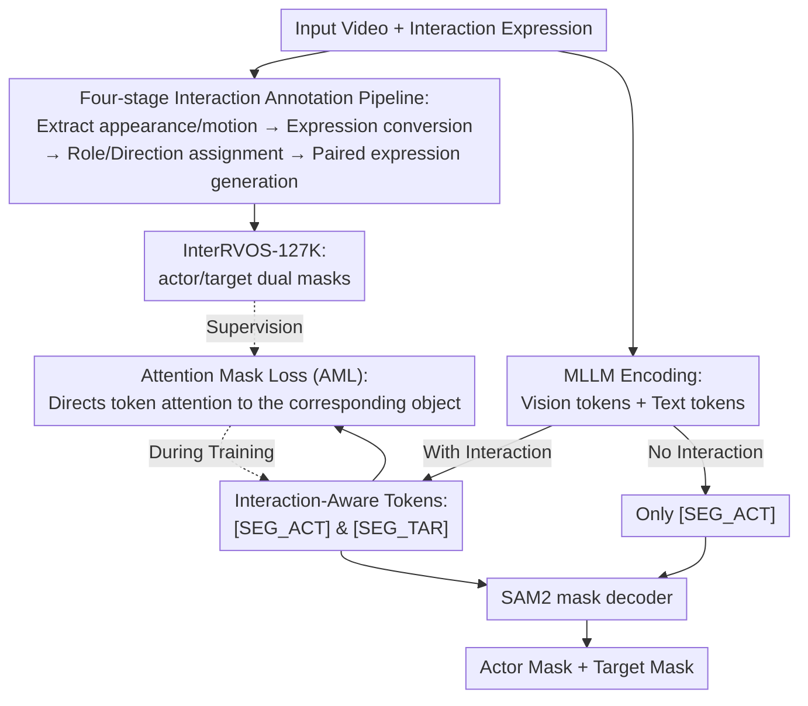

# InterRVOS: Interaction-Aware Referring Video Object Segmentation

**Conference**: CVPR 2026  
**Paper**: [CVF Open Access](https://openaccess.thecvf.com/content/CVPR2026/html/Jin_InterRVOS_Interaction-Aware_Referring_Video_Object_Segmentation_CVPR_2026_paper.html)  
**Area**: Video Understanding / Referring Segmentation  
**Keywords**: Referring Video Object Segmentation, Interaction Modeling, Actor-Target, Multimodal Large Language Models, Attention Supervision

## TL;DR
This work extends Referring Video Object Segmentation (RVOS) from segmenting only the referred subject (actor) to a new task, InterRVOS, which simultaneously segments both the actor and target in an interaction. The authors constructed InterRVOS-127K, a dataset with 127,000 actor-target dual-mask annotations, and proposed ReVIOSa, an MLLM-based architecture. ReVIOSa explicitly models interaction directionality using two role-specific tokens (`[SEG_ACT]` and `[SEG_TAR]`) combined with an Attention Mask Loss (AML), significantly outperforming existing methods on the new benchmark.

## Background & Motivation

**Background**: RVOS aims to segment specific objects in a video based on a natural language expression. Research has evolved from early appearance alignment to MeViS (introducing pure motion cues) and ReVOS (introducing reasoning-based segmentation), consistently moving toward "finer-grained temporal motion + more complex video-language alignment."

**Limitations of Prior Work**: Existing methods focus almost exclusively on "the referred actor." When an expression explicitly describes an **interaction**—such as "A reaches for B"—there are actually two roles involved: the actor (A) and the target (B). Current methods only segment A and ignore B. However, the semantics of many video events are defined by "who did what to whom" rather than the motion of a single object.

**Key Challenge**: Interactions naturally possess **role directionality**—the segmentation results for "A pushes B" and "B pushes A" should differ, as the semantic roles of A and B are **asymmetric**. Standard RVOS outputs a single mask (or a union of related objects), making it structurally incapable of expressing this asymmetric dual-role relationship. Furthermore, existing datasets only annotate the actor, lacking mask supervision for the target.

**Goal**: To redefine the task as "separately segmenting both actor and target masks from an interaction expression" while explicitly modeling their role direction. Simultaneously, the work aims to address implementation barriers: the lack of data and the lack of role representations in existing models.

**Key Insight**: The authors observe that distinguishing roles require intervention at two levels: the data level requires separate mask annotations for actor/target, and the model level requires an explicit, supervisable representation anchor for each role.

**Core Idea**: Use two role-specific special tokens (`[SEG_ACT]`, `[SEG_TAR]`) in an MLLM instead of a single `[SEG]` token to prompt the actor and target respectively. Then, use an Attention Mask Loss to pull the visual attention of each token directly onto its corresponding object region.

## Method

This work consists of two indispensable parts: first, **how to generate data with actor-target annotations** (InterRVOS-127K via a four-stage automated pipeline), and second, **how the model processes and distinguishes the two roles** (ReVIOSa = role-specific tokens + Attention Mask Loss).

### Overall Architecture

**Data Side**: Based on VidOR videos, SAM2 is used to generate candidate mask tracks for all objects. A four-stage pipeline is executed using GPT-4o and LLaMA-70B: extract single-object appearance/motion → convert to referring expressions (merging similar motions) → detect interactions and determine directionality/assign actor-target roles → generate interaction-rich expressions (including paired forward/inverse expressions by swapping roles). This yields 127,000 expressions, each with dual masks.

**Mechanism (ReVIOSa)**: Video frames and text are fed into a LLaVA-style MLLM. The MLLM dynamically outputs one or two special tokens based on whether the expression contains an interaction. The final hidden states of `[SEG_ACT]` and `[SEG_TAR]` are projected as prompts for the SAM2 mask decoder to solve for the actor and target masks. During training, AML is used to supervise the visual attention of these tokens at specific layers and heads toward the corresponding object regions.

### Key Designs

**1. InterRVOS Task and InterRVOS-127K Dataset: Providing the First Supervision for Dual-Role Interactions**

Existing RVOS datasets (A2D, Ref-DAVIS, MeViS, ReVOS, Ref-SAV) are all actor-only. To address this, the authors designed an automated pipeline for VidOR videos: **Stage 1** uses SAM2 to pre-calculate mask tracks and extract independent appearance/motion descriptions; **Stage 2** converts these into referring expressions; **Stage 3** detects interactions and directionality, assigning actor/target roles (e.g., generating paired "Object 0 touching Object 1" and "Object 1 being touched by Object 0" sentences); **Stage 4** fuses category and appearance cues to mass-produce interaction-rich expressions. This results in 8,738 videos and 127,236 expressions. The evaluation set of 5,048 expressions was manually corrected.

**2. Interaction-Aware Tokens (`[SEG_ACT]` / `[SEG_TAR]`): Explicit Representation Anchors for Asymmetric Roles**

Standard MLLM-RVOS models use a single `[SEG]` token, which is structurally limited to single-role output. This work introduces two role-specific tokens. The MLLM outputs a sequence like `"Sure, it's [SEG_ACT] and [SEG_TAR]"`. The final hidden states $\tilde{h}_{act}$, $\tilde{h}_{tar}$ are mapped to the SAM2 prompt embedding space via a projection layer:

$$p_{act} = \text{MLP}_{seg}(\tilde{h}_{act}), \quad p_{tar} = \text{MLP}_{seg}(\tilde{h}_{tar})$$

They are then fed into the mask decoder to obtain $\hat{M}_{act} = F_{dec}(v_{seg}, p_{act})$ and $\hat{M}_{tar} = F_{dec}(v_{seg}, p_{tar})$. The number of tokens is determined dynamically; during inference, if no interaction is detected, the model only outputs `[SEG_ACT]`, falling back to standard RVOS.

**3. Attention Mask Loss (AML): Anchoring Role Representations to Correct Object Regions**

To ensure each token "attends" to its corresponding object, the authors introduced explicit supervision. Initial motivation analysis showed that the stronger the `[SEG_ACT]` token's attention on the ground-truth mask, the higher the segmentation $\mathcal{J}\&\mathcal{F}$. AML extracts the self-attention weights from the special tokens (queries) to all visual tokens at specific layers/heads, reshaped into a spatio-temporal attention map $A^{(l,h)} \in [0,1]^{T'\times P\times P}$. Binary Cross-Entropy (BCE) is applied using the ground-truth mask $G'$ resized to patch resolution:

$$L_{AML} = \sum_{r\in\{act,tar\}} \sum_{(l,h)\in\mathcal{H}} \text{BCE}\!\left(A_r^{(l,h)}, G'_r\right)$$

Analysis revealed that applying AML to the top-3 layers with the highest visual attention (L21, L22, L23) is significantly more effective than bottom layers. AML and role tokens are complementary: tokens provide role identity, while AML anchors that identity to the correct visual region.

### Loss & Training

The total loss is a combination of segmentation loss, attention mask loss, and text loss:

$$L_{total} = L_{seg} + \lambda_{AML}\cdot L_{AML} + \lambda_{text}\cdot L_{text}$$

$L_{seg} = \sum_{r\in\{act,tar\}} L_{CE}(\hat{M}_r, M_r) + L_{Dice}(\hat{M}_r, M_r)$. The model uses InternVL-2.5 as the backbone with LoRA fine-tuning. For the segmentation head, SAM2 is used with the decoder fine-tuned and the image encoder frozen. Training is conducted for 10 epochs.

## Key Experimental Results

### Main Results

Comparison on InterRVOS-127K across three settings ($\mathcal{J}\&\mathcal{F}$ metric):

| Method | Actor | Target | RVOS |
|------|-------|--------|------|
| Referformer | 59.5 | — | 52.6 |
| VISA-7B | 57.7 | — | 49.8 |
| VideoLISA-3.8B | 68.2 | — | 61.7 |
| Sa2VA-1B | 71.3 | — | 57.0 |
| Sa2VA-4B | 71.0 | — | 59.5 |
| **Ours-1B** | 73.3 | 67.4 | 62.0 |
| **Ours-4B** | **74.5** | **68.3** | **64.5** |

Existing methods cannot perform the Target setting due to architectural constraints. Ours leads in both Actor and standard RVOS settings, showing that dual-role supervision provides positive transfer for conventional tasks.

### Ablation Study

Ablation results on InterRVOS-127K ($\mathcal{J}\&\mathcal{F}$):

| Configuration | Role Tokens | AML | J&F |
|------|-----------|-----|-----|
| (i) Baseline | ✗ | ✗ | 57.0 |
| (ii) | ✗ | ✓ | 58.5 |
| (iii) | ✓ | ✗ | 59.6 |
| (iv) Full | ✓ | ✓ | **62.0** |

Zero-shot experiments also demonstrated that forcing standard models (VISA, VideoLISA, Sa2VA) to segment targets via prompt engineering results in a performance collapse ($\mathcal{J}\&\mathcal{F}$ between 13.1–24.2), proving they lack interaction directionality understanding.

### Key Findings
- **Role tokens contribute more than AML** (+2.6 vs +1.5), but they are complementary, pushing the score from 57.0 to 62.0.
- **AML layer selection is critical**: Applying it to top-3 high-attention layers (L21–23) is much better than bottom layers, confirming that tokens dependent on visual information benefit most from supervision.
- **Dataset Transferability**: Models trained on InterRVOS-127K show superior zero-shot performance on MeViS and Ref-YouTube-VOS compared to those trained on ReVOS or Ref-SAV.

## Highlights & Insights
- **Explicit Actor-Target Decomposition**: Segmenting two roles with directionality is a clean extension of the RVOS task, bridging the gap in fine-grained video-language understanding.
- **Attention Map Supervision**: Using attention maps as explicit supervision targets (based on the observation that attention correlates with performance) is a clever design that could be applied to any MLLM using special tokens.
- **Automated Pipeline**: The four-stage pipeline generates high-quality directional interaction data at low cost, outperforming manual datasets in transferability.

## Limitations & Future Work
- **Reliance on Automated Labels**: The training data is generated by GPT-4o/LLaMA without manual correction, potentially introducing systematic biases or errors in directionality.
- **Binary Interactions Only**: The model is designed for actor-target pairs; how it scales to one-to-many or multi-step chain interactions (A to B to C) remains unexplored.
- **Backbone Dependency**: The layer selection for AML was analyzed specifically for InternVL-2.5; a more automated or universal layer selection protocol is not yet established.

## Related Work & Insights
- **Comparison with Standard RVOS**: Previous models use a single `[SEG]` token and cannot distinguish roles in an interaction.
- **Comparison with Reasoning RVOS**: While reasoning RVOS handles complex expressions, it still treats segmentation as a single-object or noun-grounding problem.
- **Comparison with Scene Graphs**: Scene graph datasets (VidOR, ActionGenome) use closed predicate sets; InterRVOS-127K uses open natural language, linking relationship labeling with segmentation.

## Rating
- Novelty: ⭐⭐⭐⭐⭐ (Clean extension of task and structural solution).
- Experimental Thoroughness: ⭐⭐⭐⭐ (Solid results and analysis, though limited to binary interactions).
- Writing Quality: ⭐⭐⭐⭐⭐ (Clear motivation and logical design).
- Value: ⭐⭐⭐⭐ (Task definition and attention supervision strategy are highly reusable).

<!-- RELATED:START -->

## Related Papers

- [\[CVPR 2026\] Long-RVOS: A Comprehensive Benchmark for Long-term Referring Video Object Segmentation](long-rvos_a_comprehensive_benchmark_for_long-term_referring_video_object_segment.md)
- [\[CVPR 2026\] DeRVOS: Decoupling Consistent Trajectory Generation and Multimodal Understanding for Referring Video Object Segmentation](dervos_decoupling_consistent_trajectory_generation_and_multimodal_understanding_.md)
- [\[CVPR 2026\] Towards Streaming Referring Video Segmentation via Large Language Model](towards_streaming_referring_video_segmentation_via_large_language_model.md)
- [\[CVPR 2026\] Robust Promptable Video Object Segmentation](robust_promptable_video_object_segmentation.md)
- [\[CVPR 2026\] Occlusion-Aware SORT: Observing Occlusion for Robust Multi-Object Tracking](occlusion-aware_sort_observing_occlusion_for_robust_multi-object_tracking.md)

<!-- RELATED:END -->
