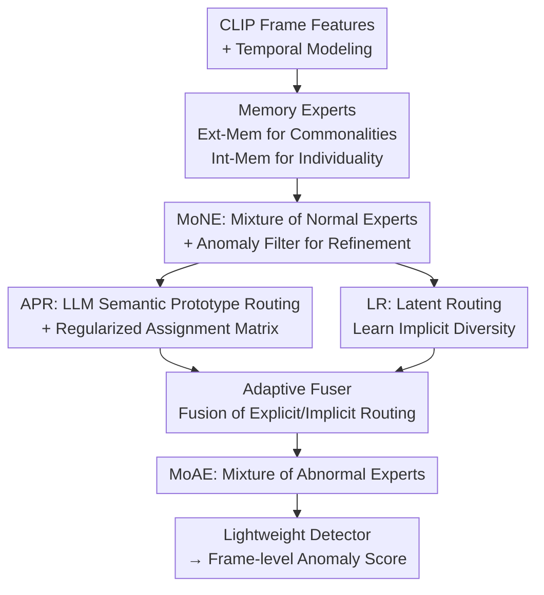

# Joint Learning of General and Diverse Patterns with Mixture of Memory Experts for Weakly-Supervised Video Anomaly Detection

**Conference**: CVPR 2026  
**Paper**: [CVF Open Access](https://openaccess.thecvf.com/content/CVPR2026/html/Sun_Joint_Learning_of_General_and_Diverse_Patterns_with_Mixture_of_CVPR_2026_paper.html)  
**Area**: Video Understanding  
**Keywords**: Weakly-Supervised Video Anomaly Detection, Memory Experts, Mixture of Experts (MoE), CLIP, LLM Semantic Prototypes

## TL;DR
MoME introduces a sparse Mixture of Experts framework with "Internal Memory + Shared External Memory," allowing normal/abnormal experts to learn commonalities in external memory and disparities in internal memory. Guided by LLM-generated semantic prototypes for expert routing, it balances generalization and discrimination, achieving SOTA results on UCF-Crime and XD-Violence (88.32% AUC / 86.15% AP).

## Background & Motivation
**Background**: Weakly-supervised video anomaly detection (wVAD) utilizes only video-level binary labels for training, aiming to localize anomalous segments without frame-level annotations. The mainstream approach is Multiple Instance Learning (MIL), treating videos as bags of segments and forcing the highest anomaly score in positive bags to exceed those in negative bags.

**Limitations of Prior Work**: Existing methods often force a choice between "generalization" and "discrimination." The first category (e.g., RTFM, UR-DMU) treats all anomalies as homogeneous, learning a single generic pattern. While this generalizes well across scenes, it lacks discriminative power—real-world anomalies vary significantly, from subtle shoplifting movements to violent explosions. The second category (e.g., GS-MoE, ITC) partitions the feature space by class labels and assigns specialized sub-networks to each. While more discriminative, they sacrifice generalization: models easily overfit to specific clusters (e.g., misclassifying normal actions like "picking up items" as anomalies due to visual similarity to shoplifting), and coarse class labels ignore intra-class variance and inter-class similarity.

**Key Challenge**: A trade-off exists between generic patterns and class-specific patterns, while class labels themselves are too coarse and lack the semantics required to guide "anomaly diversity."

**Goal**: To enable a single model to **simultaneously** learn generic patterns (for generalization) and diverse patterns (for discrimination), guided by **fine-grained semantics** rather than coarse labels.

**Key Insight**: Ours assigns "generality" and "diversity" to two types of memory—shared external memory aggregates universal knowledge, while private internal memory captures specialized patterns. Furthermore, the number of experts is not tied to the number of anomaly classes; instead, LLMs expand class names into more generalizable "anomaly prototypes" for semantic routing.

**Core Idea**: Utilizing Mixed Memory Experts (MoME)—where external memory learns commonalities, internal memory learns individuality, and LLM semantic prototypes guide sparse routing—to simultaneously model generic and diverse anomaly patterns.

## Method

### Overall Architecture
Given normal videos $V_n$ and abnormal videos $V_a$ of fixed length $T$, frame-level features are first extracted using a frozen CLIP (ViT-B/16) visual encoder, followed by temporal modeling to obtain $X_n, X_a \in \mathbb{R}^{T\times d}$. The core consists of two parallel sets of memory experts: the **Mixture of Normal Experts (MoNE)** for normal patterns and the **Mixture of Abnormal Experts (MoAE)** for abnormal patterns. Both utilize a "Shared External Memory (Commonality) + Multi-Expert Internal Memory (Diversity)" structure. Memory-augmented features are passed to a lightweight detector to calculate frame-level anomaly scores.

The workflow is sequential: abnormal features first pass through MoNE to filter the most likely anomalous segments (Anomaly Filter) based on the "least like normal" signal. These refined features are then sent to MoAE. MoAE routing consists of two paths—APR uses LLM semantic prototypes for explicit routing, and LR (Latent Router) learns implicit latent diversity. An Adaptive Fuser dynamically merges the two paths. Training is guided by a set of losses ensuring balanced routing, expert differentiation, and pattern discriminability.

### Key Designs

**1. Memory Experts: External for Commonality, Internal for Individuality**

To address the "generalization vs. diversity" trade-off, each expert is split into two memory components: a shared external memory $M_{ext}\in \mathbb{R}^{m\times d}$ encoding universal representations, and a private internal memory $M_{in}\in \mathbb{R}^{m\times d}$ capturing specialized patterns (with $m$ memory slots). During retrieval, input features and both memory sets are projected into the same space to calculate similarities $S_{in}=\sigma(QK_{in}^\top/\sqrt{d})$ and $S_{ext}=\sigma(QK_{ext}^\top/\sqrt{d})$ (where $\sigma$ is a sigmoid along the memory dimension rather than softmax, allowing independent slot scoring). The read-out features are concatenated as $H=\mathrm{concat}(S_{in}M_{in},\,S_{ext}M_{ext})\in \mathbb{R}^{T_i\times 2d}$, ensuring the output contains both generic and expert-specific knowledge.

Update mechanisms differ: internal memory is updated slowly via backpropagation. External memory uses an NTM-style erase-and-write dynamic update—calculating erase, gate, and add features $V_e, V_g, V_a$ (using $\sigma$ for selective erasing and $\tanh$ for positive/negative updates), which are weighted by $S_{ext}$: $M_{ext}=M_{ext}\odot(1-\alpha\bar V_E)+\alpha\bar V_A$. This allows external memory to accumulate "universal laws" across samples, while internal memory focuses on disparities. Ablation shows that removing $M_{ext}$ drops performance by 5.36% AP on XD, proving external memory is the key carrier for generalization.

**2. MoNE and Anomaly Filter: Filtering Anomaly Segments via Normal Patterns**

Since normal data lacks explicit supervision, how are diverse normal patterns assigned to experts? Ours uses a Latent Router (linear layer) to calculate routing scores $R_n^l=\mathrm{Softmax}(\mathrm{TopK}(W_lX_n^\top+b,\,k))$, assigning segments to the most relevant latent normal experts. These experts share an external normal memory $M_{ext}^N$ and aggregate normal representations $H_n^N$.

The "Anomaly Filter" is a clever step: abnormal video features $X_a$ are also fed into MoNE to calculate similarity $S_a^N$ with normal patterns. **Segments least similar to normal patterns are most likely true anomalies**. Indices $I_{\hat a}=\mathrm{TopK}(1-S_a^N,\,T_a)$ select the $T_a$ most anomalous segments, refining $X_{\hat a}$ for MoAE. This uses "normal-side memory" as an unsupervised anomaly localizer, preventing abnormal experts from being distracted by the vast amount of normal background frames in abnormal videos.

**3. APR: Replacing Coarse Labels with LLM Semantic Prototypes for Routing**

While labels exist for abnormal videos, strictly tying experts to categories (as in GS-MoE) is problematic because anomalies often overlap categories. APR uses multiple LLMs to expand original anomaly category names and manually selects the most generalizable outputs as **Anomaly Prototypes (AP)**. CLIP text/visual encoders extract prototype semantic features $T\in \mathbb{R}^{n\times d}$ and video features to compute cross-modal similarity distributions $S=\mathrm{Softmax}\big(\frac{1}{\tau}\cdot\hat V_{\hat a}\hat T^\top\big)\in \mathbb{R}^{T_a\times n}$.

A **learnable expert-prototype assignment matrix** $A\in \mathbb{R}^{E_e\times n}$ maps prototype similarities to explicit expert routing scores $G_{\hat a}^e=SA^\top$, followed by top-$k$ softmax. To prevent redundancy, $A$ is regularized via $L_{reg}$: an intra-class term $L_{intra}=-\frac{1}{N}\sum_i H(A_i)+\|AA^\top-I\|_F^2$ (entropy for sparsity, orthogonality for differentiation) and an inter-class term $L_{inter}$ for balanced utilization. Diversity is thus guided by "semantic prototypes" instead of discrete labels, capturing intra-class variance and aligning cross-class semantic similarities.

**4. Latent Router + Adaptive Fuser: Capturing Unseen Latent Patterns**

APR provides explicit semantic routing, but some latent anomaly patterns may not be covered by semantic prototypes. Thus, a parallel Latent Router learns implicit diversity $R_{\hat a}^l=\mathrm{Softmax}(\mathrm{TopK}(W_lX_{\hat a}^\top+b,\,k))$. The Adaptive Fuser (AF) is a conditional network: it $z$-score normalizes explicit routing scores $R_{\hat a}^e$ (aligning them with $R_{\hat a}^l$), concatenates them with expert identity embeddings $Z_i$ and auxiliary features $Z_x$, and re-estimates the final weights $F_{\hat a}^e, F_{\hat a}^l$. The final MoAE output is $H_{\hat a}^A=\sum_{j\in\{l,e\}}\sum_i F_{\hat a,i}^j\Phi_{a,i}^j(X_{\hat a}^i, M_{ext}^A)$. AF ensures the two paths are adaptively weighted rather than simply added, which is essential for balancing semantic and latent cues.

### Loss & Training
The detector is a shared lightweight MLP calculating frame scores for $H_n^N$ and $H_{\hat a}^A$. The primary loss is binary cross-entropy $L_{cls}=\mathrm{BCE}(y_n,0)+\mathrm{BCE}(y_{\hat a},1)$. Additionally: Reconstruction loss $L_{rec}$ guides MoNE/MoAE using two decoders; Memory supervision loss $L_m$ directly constrains four sets of memory similarities (e.g., $S_n^N\to 1$, $S_{\hat a}^N\to 0$); Expert balancing loss $L_b$ uses the squared coefficient of variation $\mathrm{CV}(\hat G)$ to prevent load collapse; Memory diversity loss $L_{div}=\sum_k \frac{2}{E_k(E_k-1)}\sum_{i<j}\|M_{in}^{k,i}-M_{in}^{k,j}\|_1$ maximizes the $\ell_1$ distance between expert internal memories to force different expertise.

## Key Experimental Results

### Main Results
Performance on UCF-Crime (13 categories, frame-level AUC) and XD-Violence (multi-modal, AP):

| Dataset | Metric | MoME | Prev. Best (CLIP-based) | Note |
|--------|------|------|----------|------|
| XD-Violence | AP % | **86.15** | DEN-VAD 86.13 / ITC 85.45 | Achieved Best AP |
| UCF-Crime | AUC % | 88.32 | ITC 89.04 / VadCLIP 88.02 | Highly competitive |

Notably, methods like ITC and GS-MoE that learn class-specific representations perform strongly on UCF-Crime (GS-MoE reaches 91.58 with I3D features) but drop significantly on XD-Violence; MoME is more **balanced** across both, confirming the value of joint "generic + diverse" modeling (high inter-class separability in UCF often masks the generalization flaws of class-specific methods).

### Ablation Study
Module and loss ablations (Table 3 & 4):

| Configuration | UCF AUC % | XD AP % | Note |
|------|---------|---------|------|
| Full MoME | **88.32** | **86.15** | All modules & losses |
| w/o $M_{ext}$ | 87.08 | 80.79 | No external memory (XD drops 5.36%) |
| w/o APR | 86.57 | 82.86 | No semantic routing |
| w/o LR | 86.78 | 80.49 | No latent routing |
| w/o AF | 87.69 | 81.94 | No Adaptive Fuser |
| $L_{cls}$ only | 63.73 | 26.11 | Severe supervision deficiency |
| $L_{cls}+L_m$ | 87.58 | 85.40 | Huge Gain from memory loss |

### Key Findings
- **$L_m$ is the most significant contributor**: Using only classification loss yields only 63.73/26.11. Adding $L_m$ boosts it to 87.58/85.40, showing that memory-guided signals are the backbone of the framework.
- **External memory is crucial for XD-Violence**: Removing $M_{ext}$ drops XD AP by 5.36% (vs. only 1.24% on UCF), indicating that high-diversity datasets rely more on universal memory for stable generalization.
- **Massive Gains in complex categories**: MoME improves AUC by 53.8% in Assault and 10.1% in Robbery compared to VadCLIP. These categories involve complex dynamics where semantic diversity is key.
- **Cross-dataset robustness**: MoME maintains higher performance than VadCLIP in UCF→XD and XD→UCF transfers.

## Highlights & Insights
- **The "Anomaly Filter" is elegant**: Converting the difficult anomaly localization problem under weak labels into an unsupervised distance-based search ("furthest from normal memory") provides clean inputs for abnormal experts.
- **Internal/External Memory decoupling**: Shared memory handles universal rules via erase-write updates, while private memory handles specialized data via backprop. This "shared vs. private" design is a more direct mapping to "generic vs. diverse" than standard MoE architectures.
- **LLM-expanded Semantic Prototypes**: Moving beyond "number of experts = number of classes" allows sparse MoE to decouple experts from discrete labels, providing a lightweight way to inject LLM semantic knowledge into detection pipelines.
- **$L_{div}$ addresses a common MoE pitfall**: Load balancing does not guarantee diversity. Directly maximizing the distance between expert memories effectively prevents expert collapse.

## Limitations & Future Work
- **Manual Prototype Selection**: Anomaly prototypes are filtered manually from LLM outputs, which is subjective and not fully automated. Sensitivity to LLM choice remains unexplored.
- **UCF-Crime Ranking**: Performance (88.32) is lower than ITC (89.04). In low-diversity scenarios, the "generic + diverse" joint modeling advantage is less pronounced.
- **Dense Multi-event Scenes**: Performance degrades slightly compared to VadCLIP in videos with $>9$ events, although such samples are rare in existing benchmarks.
- **System Complexity**: With 48 experts total, dual memory types, and 6 loss terms, the training complexity and hyperparameter tuning costs are high.

## Related Work & Insights
- **vs. GS-MoE**: Both use MoE, but GS-MoE is dense and tied to class labels. MoME uses sparse MoE with LLM prototypes, offering better generalization and flexibility.
- **vs. VadCLIP**: Uses similar temporal modeling, but VadCLIP focuses on a single generic pattern. MoME adds multi-expert diversity and memory structures for better robustness in complex categories.
- **vs. UR-DMU**: Both use memory for normal/abnormal patterns, but MoME expands this into a structured expert framework with "Internal + Shared External" components.

## Rating
- Novelty: ⭐⭐⭐⭐ Combines dual memories and LLM routing into MoE; while individual components exist, the combination is highly effective for the generic-diverse trade-off.
- Experimental Thoroughness: ⭐⭐⭐⭐ Strong across two benchmarks, transfer learning, and exhaustive ablations; lacks computation cost analysis.
- Writing Quality: ⭐⭐⭐⭐ Clear motivation, complete formulas, and intuitive diagrams.
- Value: ⭐⭐⭐⭐ SOTA on XD-Violence; the Anomaly Filter and dual-memory designs have high transfer value.

<!-- RELATED:START -->

## Related Papers

- [\[CVPR 2026\] Weakly Supervised Video Anomaly Detection with Anomaly-Connected Components and Intention Reasoning](weakly_supervised_video_anomaly_detection_with_anomaly-connected_components_and_.md)
- [\[CVPR 2026\] Learning from Noisy Supervision: A Denoising-Debiasing Framework for Weakly Supervised Video Anomaly Detection](learning_from_noisy_supervision_a_denoising-debiasing_framework_for_weakly_super.md)
- [\[CVPR 2026\] The Road Less Seen: Segment Exploration for Weakly Supervised Video Anomaly Detection](the_road_less_seen_segment_exploration_for_weakly_supervised_video_anomaly_detec.md)
- [\[AAAI 2026\] Learning to Tell Apart: Weakly Supervised Video Anomaly Detection via Disentangled Semantic Alignment](../../AAAI2026/video_understanding/learning_to_tell_apart_weakly_supervised_video_anomaly_detection_via_disentangle.md)
- [\[CVPR 2026\] M4-SAM: Multi-Modal Mixture-of-Experts with Memory-Augmented SAM for RGB-D Video Salient Object Detection](m4-sam_multi-modal_mixture-of-experts_with_memory-augmented_sam_for_rgb-d_video_.md)

<!-- RELATED:END -->
