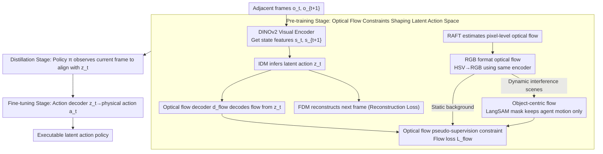

# LAOF: Robust Latent Action Learning with Optical Flow Constraints

**Conference**: CVPR 2026  
**arXiv**: [2511.16407](https://arxiv.org/abs/2511.16407)  
**Code**: [GitHub](https://github.com/XizoB/LAOF)  
**Area**: Video Understanding  
**Keywords**: Latent action learning, optical flow constraints, embodied AI, imitation learning, video pre-training

## TL;DR

The proposed LAOF framework utilizes the agent's optical flow as a pseudo-supervision signal to constrain latent action learning, making latent action representations more robust to interference. It significantly outperforms unsupervised baselines on LIBERO and PROCGEN and matches or exceeds supervised methods using 1% action labels under label-free conditions.

## Background & Motivation

Learning latent action representations from large-scale action-free videos is a critical path for building scalable embodied foundation models. The LAPO paradigm adopts a joint training auto-encoding framework consisting of an Inverse Dynamics Model (IDM) and a Forward Dynamics Model (FDM) to learn latent actions, which has been applied in large-scale embodied models such as LAPA and GR00T N1.

**Core Problem**: LAPO implicitly assumes that all changes between consecutive frames are caused by agent actions. However, real-world videos contain significant **action-irrelevant interference** (e.g., moving background objects, stochastic environmental changes), and pure reconstruction objectives may lead to entanglement between latent actions and visual appearances.

**Limitations of Prior Work**:
- Adding a small amount of action label supervision (LAOM, villa-X): Training is unstable during extreme label scarcity and prone to overfitting.
- Discrete VQ-VAE: Creates an information bottleneck but limits expressiveness.

**Key Insight**: **Optical flow provides pixel-level motion information between frames**, naturally suppressing static backgrounds and emphasizing moving objects. Pre-trained optical flow models already possess strong cross-scene generalization capabilities. Optical flow can serve as a pseudo-supervision signal highly correlated with actions without requiring manual annotation.

## Method

### Overall Architecture

LAOF follows the latent action auto-encoding backbone of LAPO—an IDM infers the latent action $z_t$ from adjacent frames $(s_t, s_{t+1})$, and an FDM reconstructs the next frame using $z_t$. Building upon this pure reconstruction framework, an additional optical flow decoding branch is attached, forcing the latent actions to explain real motion between frames rather than just appearance changes. The overall training proceeds in three stages: first, jointly train the IDM, FDM, and optical flow decoder on unlabeled videos to shape the latent action space via optical flow constraints; next, distill the IDM's knowledge into a latent action policy $\pi$ that observes only the current frame, removing the need for future frames during inference; finally, train an action decoder with a minimal amount of action labels to translate latent actions into executable physical actions. The pre-training stage is what truly determines representation quality, while the latter two stages ground the latent actions into executable policies.

### Key Designs

**1. Optical Flow Pseudo-supervision Constraint: Anchoring Latent Actions to Physical Motion via Pixel-level Motion**

The implicit assumption of LAPO is that "all changes in adjacent frames are caused by agent actions." In reality, background objects move and environments change randomly. Pure reconstruction objectives cause latent actions to encode these action-irrelevant interferences, potentially degrading into pure appearance representations. LAOF connects a dedicated optical flow decoder $d_{flow}: \mathcal{Z} \rightarrow \mathcal{F}_{rgb}$ to the IDM's latent action output, requiring the latent action to not only reconstruct the next frame but also decode the optical flow for that step. The pre-training loss becomes $\mathcal{L}_{pretrain} = \mathcal{L}_{reconstruction} + \mathcal{L}_{flow}$. Optical flow pseudo-labels are generated by a pre-trained RAFT model without manual annotation. Optical flow is chosen because it naturally suppresses the static background and amplifies moving objects—motion being the direct visual result of an action. Using it as auxiliary supervision imposes a hard constraint that latent actions "must correspond to real physical motion," pushing out appearance entanglement.

**2. RGB Format Optical Flow: Disguising Flow as Images to Reuse the Same Visual Encoder**

The raw form of optical flow is a 2D vector field $(u,v)$ per pixel, which is incompatible with the RGB images expected by DINOv2. Initializing a dedicated flow encoder would increase parameters and fragment the representation space. LAOF converts flow vectors to polar coordinates, mapping direction to HSV hue and magnitude to saturation and value, then standardly converting HSV back to RGB. Thus, a flow map becomes a standard color image fed directly into the same DINOv2. Magnitude normalization uses $m_{norm} = \min(1.0, m/(\sigma\sqrt{H^2+W^2}))$, scaling by the screen diagonal and clipping to 1 to prevent large displacements from saturating colors. This ensures observations and motion use the same encoding pipeline, aligning latent action and reconstruction constraints in the same feature space.

**3. Object-centric Optical Flow: Adaptively Retaining Only Agent-Related Motion**

Optical flow suppresses static backgrounds only if the background is truly static. In robot manipulation, global flow naturally focuses on the arm and manipulated objects. However, in game environments like PROCGEN, the background contains many action-irrelevant dynamic interferences (moving enemies, scrolling screens), where global flow treats noise as supervision. For the latter, LAOF uses LangSAM to generate an object mask for the agent, then element-wise multiplies the mask with the flow map $f_{rgb,t}^{sam} = mask_t \odot f_{rgb,t}^{all}$, leaving only motion caused by the agent. This adaptive rule—"global for static backgrounds, object-centric for dynamic interference"—provides clean pseudo-supervision across diverse environments.

### Loss & Training

In the pre-training stage, the pure unlabeled version consists of reconstruction loss plus flow loss: $\mathcal{L}_{pretrain} = \mathcal{L}_{reconstruction} + \mathcal{L}_{flow}$. If a few action labels are available, an action supervision term is added: $\mathcal{L}_{pretrain} = \mathcal{L}_{reconstruction} + (1-\lambda)\mathcal{L}_{flow} + \lambda\mathcal{L}_{action}$, where the weight $\lambda = M/(N+M)$ is automatically determined by the number of labeled samples $M$ and unlabeled samples $N$. The scarcer the labels, the more weight is given to optical flow pseudo-supervision. The distillation stage aligns the current-frame policy with the IDM's latent action: $\mathcal{L}_{distillation} = \|\pi(\hat{z}_t|s_t,l_t) - z_t\|_2$. The fine-tuning stage trains the action decoder with ground truth actions: $\mathcal{L}_{action} = \|d_{action}(\hat{a}_t|z_t) - a_t\|_2$.

## Key Experimental Results

### Main Results — LIBERO Imitation Learning

| Method | SPATIAL Success | OBJECT Success | GOAL Success | LONG Success | Avg. Gain |
|------|-------------|-------------|-----------|-----------|---------|
| LAPO | 80.4% | 81.2% | 84.0% | 44.7% | Baseline |
| CoMo | 74.1% | 87.6% | 80.8% | 49.9% | +0.5 |
| CoMo w/ OF | 76.2% | **89.7%** | 82.6% | **57.9%** | +4.0 |
| **Ours** | **82.5%** | 85.3% | **87.2%** | 52.0% | **+4.2** |
| LAOM-Action (1% Label) | 86.0% | 91.1% | 86.3% | 61.6% | +8.7 |
| **Ours (1% Label)** | **88.2%** | **95.9%** | **88.6%** | **63.7%** | **+11.5** |

### Ablation Study — Flow Constraint Position

| Configuration | Performance | Description |
|------|------|------|
| Direct connection to Latent Action | Optimal | Flow decoder decodes directly from $z$ |
| Constraint via FDM | Sub-optimal | Indirect constraint strength is weakened |
| No Flow Constraint | Baseline | Original LAPO method |

### Label Ratio Scaling Experiments

| Action Label Ratio | Ours vs LAOM-Action |
|-------------|---------------------------|
| 0% | Ours $\geq$ LAOM-Action@1% |
| 1% | Ours significantly outperforms |
| 5% | Still shows improvement |
| 10% | Flow constraint remains effective |

### Key Findings

- Unsupervised LAOF matches or exceeds LAOM-Action using 1% labels, proving the efficacy of flow pseudo-supervision.
- Flow constraints remain effective even as labels increase to 10%, indicating the signals are complementary rather than redundant.
- Continuous latent actions consistently outperform discrete VQ-VAE representations (verified on both benchmarks).
- The proposed latent action evaluation metrics correlate highly with downstream task performance (Pearson coefficients 0.83/0.73).

## Highlights & Insights

- Selecting optical flow as a pseudo-supervision signal is both natural and effective—pixel-level motion capture is the direct visual result of action.
- RGB-format optical flow unifies the processing of observations and motion, requiring only a single visual encoder.
- The adaptive weighting design of LAOF-Action ($\lambda=M/(N+M)$) automatically balances the two signals based on label ratios.
- As an extension of the LAPO paradigm, it can be directly integrated into existing embodied foundation model training pipelines.

## Limitations & Future Work

- Dependency on pre-trained optical flow models (RAFT); flow estimation errors propagate as noisy labels.
- Object-centric flow depends on LangSAM segmentation quality, which may fail in complex scenes.
- Validated only on LIBERO (robotic manipulation) and PROCGEN (2D games); real-world scenarios have not been tested.
- The three-stage training pipeline increases engineering complexity.

## Related Work & Insights

- **vs LAPO**: LAPO implicitly assumes static backgrounds; LAOF explicitly handles dynamic interference via optical flow.
- **vs LAOM**: LAOM requires action labels and suffers from unstable alternating training; LAOF achieves more stable training using unlabeled flow.
- **vs FlowVLA (Concurrent)**: FlowVLA discretizes flow into tokens for world model training; LAOF uses continuous flow constraints to learn latent actions, targeting different objectives.

## Rating

- Novelty: ⭐⭐⭐⭐ The idea of using optical flow as latent action pseudo-supervision is natural and effective, though the core contribution is experimental validation rather than conceptual breakthrough.
- Experimental Thoroughness: ⭐⭐⭐⭐⭐ LIBERO+PROCGEN, continuous vs. discrete, label ratio scans, and detailed ablations.
- Writing Quality: ⭐⭐⭐⭐ Clear method, precise problem definition, and well-structured three-stage process.
- Value: ⭐⭐⭐⭐ Provides practical guidance for the pre-training of embodied foundation models.

<!-- RELATED:START -->

## Related Papers

- [\[CVPR 2026\] From Contrast to Consistency: Rethinking Event-based Continuous-Time Optical Flow Estimation](from_contrast_to_consistency_rethinking_event-based_continuous-time_optical_flow.md)
- [\[CVPR 2026\] Efficient All-Pairs Correlation Volume Sampling for Optical Flow Estimation](efficient_all-pairs_correlation_volume_sampling_for_optical_flow_estimation.md)
- [\[AAAI 2026\] BAT: Learning Event-based Optical Flow with Bidirectional Adaptive Temporal Correlation](../../AAAI2026/video_understanding/bat_learning_event-based_optical_flow_with_bidirectional_adaptive_temporal_corre.md)
- [\[CVPR 2026\] U2Flow: Uncertainty-Aware Unsupervised Optical Flow Estimation](u2flow_uncertainty_aware_unsupervised_optical_flow_estimation.md)
- [\[ICCV 2025\] Unsupervised Joint Learning of Optical Flow and Intensity with Event Cameras](../../ICCV2025/video_understanding/unsupervised_joint_learning_of_optical_flow_and_intensity_with_event_cameras.md)

<!-- RELATED:END -->
