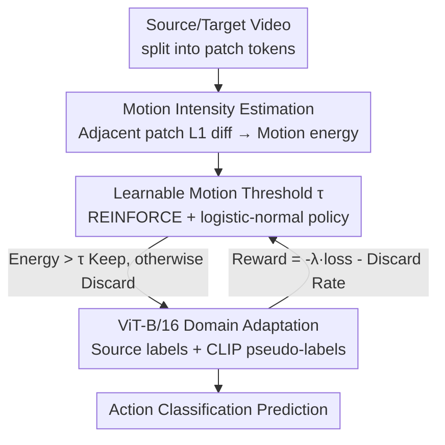

# Learnable Motion-Focused Tokenization for Effective and Efficient Video Unsupervised Domain Adaptation

**Conference**: CVPR 2026  
**Paper**: [CVF Open Access](https://openaccess.thecvf.com/content/CVPR2026/html/Liu_Learnable_Motion-Focused_Tokenization_for_Effective_and_Efficient_Video_Unsupervised_Domain_CVPR_2026_paper.html)  
**Code**: Not provided in the paper (⚠️ subject to the original text)  
**Area**: Video Understanding / Action Recognition / Unsupervised Domain Adaptation  
**Keywords**: Video Domain Adaptation, Action Recognition, Token Pruning, Motion-Focused, RL-based Thresholding

## TL;DR
LMFT quantifies the motion intensity of each patch using the "L1 motion difference of tokens from adjacent frames" in video domain adaptation. It then utilizes reinforcement learning to learn a fine-tunable motion threshold to discard low-motion (background) tokens, feeding only action-related tokens into the ViT. This simultaneously mitigates domain shift caused by labels/backgrounds and reduces training time by 10–20 times.

## Background & Motivation
**Background**: Video Unsupervised Domain Adaptation (VUDA) aims to transfer action recognition models trained on labeled source domains to unlabeled target domains. Recently, ViT-based methods (e.g., UDAVT, UNITE) have achieved SOTA performance through strong transformer representations.

**Limitations of Prior Work**: ViT feeds **every** spatiotemporal token from source/target videos into self-attention, leading to two issues. First, many tokens correspond to static or background regions irrelevant to the action—e.g., the same "running" action appearing indoors vs. outdoors. Background differences amplify domain shift and interfere with the transfer of "action-centric motion semantics." Second, self-attention costs grow quadratically with the number of tokens. Computing redundant background tokens is extremely inefficient; the computational efficiency of VUDA is mostly ignored by existing research, limiting practical deployment.

**Key Challenge**: Background tokens act as both **amplifiers of domain shift** and **sources of wasted compute**. These two problems share a common origin: the indiscriminate processing of all tokens.

**Goal**: (1) Identify and discard low-motion redundant tokens before feeding them into the ViT, retaining action-related tokens; (2) make this discarding process adaptive and learnable rather than using manually tuned thresholds.

**Key Insight**: The authors observe that "action-related equals motion-rich." Backgrounds are static while action regions exhibit motion. By quantifying the temporal motion intensity of each patch and discarding those below a certain threshold, one can simultaneously remove background shift and reduce token count. The difficulty lies in the fact that the "discard/keep" decision is a hard comparison and non-differentiable, making it impossible to learn the threshold directly via backpropagation.

**Core Idea**: Use the L1 difference between adjacent temporal patches as motion intensity and employ **Reinforcement Learning (REINFORCE) to learn a threshold** $\tau$ for non-differentiable token selection. The reward function encourages both accuracy and high discard rates, achieving "more effective + more efficient" processing simultaneously.

## Method

### Overall Architecture
LMFT is a **joint training framework**: given a labeled source domain and an unlabeled target domain, the goal is to adapt the ViT model $f_\phi$ to the target domain. Each input video (source or target) is first partitioned into patch tokens. The LMFT module estimates the motion intensity of each token and uses an RL-learned threshold $\tau$ to discard low-motion tokens. Only motion-rich tokens are fed into the ViT-B/16. The ViT is trained using source ground-truth labels and target CLIP pseudo-labels (filtered by confidence), while an "accuracy + discard rate" reward is backpropagated to update the policy for $\tau$. During inference, a deterministic threshold $\hat\tau$ is used for stable prediction. The entire pipeline is a closed-loop of "tokenize → motion intensity estimation → RL threshold token selection → ViT domain adaptation," where token selection and domain adaptation optimize each other.

### Key Designs

**1. Motion Intensity Estimation: Quantifying "Action-Relatedness" as Scalar Energy via L1 Temporal Difference**

This distinguishes motion regions without relying on optical flow or extra networks. For each spatiotemporal patch $P_t^{x,y}$, the frames are first averaged along the temporal dimension to obtain a representative frame $\bar P_t^{x,y}$. Then, the pixel-wise L1 difference between adjacent representative frames is calculated: $D_t^{x,y}=|\bar P_{t+1}^{x,y}-\bar P_t^{x,y}|$. Global average pooling is applied to the difference map to obtain the scalar "patch motion energy" $E_t^{x,y}=\frac{1}{C\cdot p\cdot p}\sum_{c,i,j} D_t^{x,y}[c,i,j]$. To ensure energy is comparable across videos, min-max normalization is applied within each video to obtain $\tilde E_t^{x,y} \in [0,1]$. Since the first temporal segment has no preceding frame for differencing, a constant 1 is padded to ensure it is always retained. Finally, energies across all spatial positions are gathered into a tensor $E_{\text{motion}}\in\mathbb{R}^{N_t\times N_x\times N_y}$. This estimation incurs nearly zero extra overhead while providing a dense map of "where the motion is."

**2. Learnable Motion Threshold $\tau$: Handling Non-differentiable "Discard/Keep" via Reinforcement Learning**

Token selection involves a hard comparison—tokens with energy $>\tau$ are kept, otherwise discarded, resulting in a binary mask $M_{t,x,y}$. Manually tuning $\tau$ is tedious and difficult to generalize across actions or domains, yet direct backpropagation is impossible due to the non-differentiability of hard comparisons. The authors treat $\tau$ as a learnable variable and learn it via policy gradient RL. The policy $\pi_\theta(\tau)$ uses a logistic-normal distribution (parameters $\theta=\{\mu,\log\sigma\}$) to ensure $\tau\in(0,1)$. The goal is to maximize the expected reward $J(\theta)=\mathbb{E}_{\tau\sim\pi_\theta}[R(\tau)]$. Gradients are estimated using REINFORCE: $\nabla_\theta J=\mathbb{E}[(R(\tau)-b)\nabla_\theta\log\pi_\theta(\tau)]$, where $b$ is a moving average baseline ($b\leftarrow 0.9b+0.1R(\tau)$) for variance reduction. During sampling, $u\sim\mathcal{N}(\mu,\sigma^2)$ is drawn and $\tau=\text{sigmoid}(u)$. The log-policy has a closed-form after variable substitution: $\log\pi_\theta(\tau)=\log\mathcal{N}(\text{logit}(\tau);\mu,\sigma^2)-\log\tau-\log(1-\tau)$. Sampling only one scalar $\tau$ and updating two parameters adds negligible overhead but allows the threshold to adapt to motion patterns and domains.

**3. Reward Design: Explicit Trade-off between Efficiency and Accuracy**

If solely rewarding accuracy, the model tends to discard fewer tokens to minimize risk. To enforce efficiency, "high discard rate" must be included in the reward. The authors define rewards for source and target domains as $R_{\text{src}}=-\lambda_{\mathcal{L}}\mathcal{L}_s-(1-\rho_s)$ and $R_{\text{tgt}}=-\lambda_{\mathcal{L}}\mathcal{L}_t-(1-\rho_t)$, where $\mathcal{L}_s, \mathcal{L}_t$ are the losses, $\rho_s, \rho_t$ are the discard rates (ratio of discarded tokens), and $\lambda_{\mathcal{L}}$ balances the two terms. The total reward is $R(\tau)=R_{\text{src}}+R_{\text{tgt}}$. The $-(1-\rho)$ term implies that **higher discard rates yield higher rewards**. This pushes the policy to be as aggressive as possible in discarding tokens without dropping accuracy—the mechanism behind simultaneous "effectiveness + efficiency."

**4. VUDA Domain Adaptation Framework: CLIP Pseudo-labels + Confidence Filtering + Block Diagonal Attention**

Retained tokens must be used for cross-domain training. Since the target domain lacks labels, zero-shot CLIP (ViT-B/16) is used with the template "a video of a person {action}" to generate pseudo-labels. Video frames are encoded, temporally average-pooled, and compared with text embeddings via cosine similarity + softmax to obtain class distribution $q_i^T$. Confidence filtering is applied: only samples with $\max(q_i^T)>\gamma_c$ are kept, using the argmax as pseudo-labels to obtain a high-quality subset. The training objective is a combination of source cross-entropy $\mathcal{L}_s$ and target pseudo-label cross-entropy $\mathcal{L}_t$: $\mathcal{L}_{\text{da}}=\mathcal{L}_s+\lambda_t\mathcal{L}_t$. Since LMFT results in variable token lengths per video, a **block diagonal attention mask** is used to concatenate sequences of different videos while strictly restricting attention within each video boundary, enabling batch processing without padding. For stability during testing, the policy expectation is estimated via Monte Carlo: $\hat\tau=\mathbb{E}_{\epsilon\sim\mathcal{N}(0,1)}[\text{sigmoid}(\mu+\sigma\epsilon)]$ (averaged over $K=100$ samples), which is pre-calculated after training for zero-overhead deployment.

### Loss & Training
ViT-B/16 is initialized with VideoMAE weights. 16 frames are sampled per video with tubelet size $t_p=2$ ($N_t=8$). Frames are resized to 224x224. AdamW is used for 20 epochs with weight decay 0.05 and batch size 32. Initial policy values: $\mu=0.01, \log\sigma=-1.0$. Confidence threshold $\gamma_c=0.8$, target loss weight $\lambda_t=0.5$, reward coefficient $\lambda_{\mathcal{L}}=10$.

## Key Experimental Results

### Main Results
Evaluated on three VUDA benchmarks across 21 domain adaptation settings. The following table shows Top-1 accuracy for UCF↔HMDB_full (12 classes) (⚠️ The original Table title was Daily-DA, but columns are H→U / U→H, likely UCF-HMDB; translated as per original context):

| Method | H→U | U→H | Avg. |
| :--- | :--- | :--- | :--- |
| Source Only | 93.3 | 81.9 | 87.6 |
| CO2A | 95.8 | 87.8 | 91.8 |
| UDAVT | 96.8 | 92.3 | 94.6 |
| UNITE | 92.5 | 95.0 | 93.8 |
| Ours w/o LMFT | 98.3 | 92.5 | 95.4 |
| **Ours (LMFT)** | **98.6** | **94.2** | **96.4** |
| Target Only (Upper Bound) | 98.9 | 97.2 | 98.1 |

Consistently outperforms SOTA across benchmarks: gains reported on Daily-DA and UCF-HMDB_full, and a gain of ~12% on ActorShift (Human→Animal, large semantic gap). "Ours w/o LMFT → Ours" proves that motion-focused selection improves accuracy while saving compute.

### Efficiency Analysis
Comparison of accuracy, throughput (Clips/s), GFLOPs, and relative compute for various token reduction methods on M→H:

| Method | Accuracy↑ | Clips/s↑ | GFLOPs↓ | Rel. Compute↓ |
| :--- | :--- | :--- | :--- | :--- |
| ViT-B/16 (Full tokens) | 72.1 | 3.8 | 266 | 1.00× |
| Random (Drop) | 71.7 | 3.6 | 216 | 0.81× |
| ToMe | 72.5 | 1.8 | 242 | 0.91× |
| PruMerge | 71.7 | 3.5 | 493 | 1.85× |
| DivPrune | 72.9 | 0.2 | 223 | 0.84× |
| **LMFT (Ours)** | **74.2** | **3.9** | 217 | 0.82× |

Compared to VUDA methods, LMFT achieves 74.2% accuracy on M→H with 2,784s training time, whereas UNITE takes 27,426s for 71.7%. Training is ~10–20 times faster than the strongest VUDA competitor, UNITE, with GFLOPs reduced from 358 to 217.

### Key Findings
- **Motion-focused > Random**: Randomly dropping the same ratio of tokens decreases accuracy (72.1→71.7), while LMFT increases it to 74.2, proving gains stem from "discarding the right tokens" (background).
- **Superiority over general token reduction**: ToMe/DivPrune suffer from poor throughput (DivPrune 0.2 Clips/s) or increased GFLOPs (PruMerge 493). LMFT excels across accuracy, throughput, and compute—general pruning methods are not designed for DA and rely on manual ratios.
- **Hyperparameter Sensitivity**: Confidence threshold $\gamma_c=0.8$ yields the best fidelity-accuracy trade-off (Table 7). Reward coefficient $\lambda_{\mathcal{L}}=10$ is optimal (Table 9). LMFT consistently outperforms full-token/random/UNITE across various temporal resolutions $N_t\in\{2,4,6,8\}$ (Table 8).
- **RL > Gumbel-softmax**: Selection via Gumbel-softmax results in lower accuracy and worse memory/time efficiency (Table 10), justifying the use of REINFORCE for learning a scalar threshold.

## Highlights & Insights
- **Unified Perspective on Backgrounds**: Viewing backgrounds simultaneously as the source of domain shift and compute waste allows a single action—token pruning—to solve both problems. This "common-origin solution" is highly insightful.
- **RL for a Scalar Threshold**: For non-differentiable hard choices, the method employs REINFORCE to learn a single scalar $\tau$ rather than complex differentiable approximations. This lightweight paradigm for discrete decision-making is transferable to many selection problems.
- **Block Diagonal Attention for Dynamic Batching**: Addressing the variable number of tokens per video using block diagonal masks for concatenated sequences allows efficient batching without padding.

## Limitations & Future Work
- Motion intensity relies on pixel L1 differences; camera shake or global motion (e.g., panning) might misidentify background regions as "high motion," a scenario not fully discussed.
- Pseudo-labels depend on zero-shot CLIP. For target domains with poor CLIP coverage (e.g., animal actions in ActorShift), pseudo-label quality remains a bottleneck that confidence filtering only partially mitigates.
- Validated primarily on ViT-B/16 + VideoMAE; generalizability to larger models or different architectures is unexplored.
- Future Work: Upgrade motion estimation to be robust against camera motion (e.g., registration-based) or allow fine-grained thresholds per spatial/temporal segment.

## Related Work & Insights
- **vs. ViT-based VUDA (UNITE, UDAVT)**: These process all tokens and ignore efficiency. LMFT discards background tokens first, reducing shift and cutting training time by 10–20x. It is the first VUDA work to treat efficiency as a first-class objective.
- **vs. Token Reduction (ToMe, PruMerge, DivPrune)**: These are designed for general ViT efficiency using manual ratios; LMFT learns thresholds via RL specifically for motion semantics and domain adaptation.
- **vs. RLT (Run-length Tokenization)**: RLT also uses temporal differences for deduplication but employs fixed rules; LMFT makes the threshold an RL-learnable variable for adaptation across actions and domains.

## Rating
- Novelty: ⭐⭐⭐⭐ The combination of "motion focusing + RL-learned threshold" is a fresh perspective in VUDA, especially in prioritizing efficiency.
- Experimental Thoroughness: ⭐⭐⭐⭐⭐ 21 settings across 3 benchmarks + dual training/inference efficiency analysis + extensive ablations.
- Writing Quality: ⭐⭐⭐⭐ Clear derivations and formulas, though some table titles have minor inconsistencies with the columns.
- Value: ⭐⭐⭐⭐ Significantly reduces training costs while maintaining accuracy, which is highly practical for VUDA deployment.

<!-- RELATED:START -->

## Related Papers

- [\[ICML 2026\] Return of Frustratingly Easy Unsupervised Video Domain Adaptation](../../ICML2026/video_understanding/return_of_frustratingly_easy_unsupervised_video_domain_adaptation.md)
- [\[CVPR 2026\] EVATok: Adaptive Length Video Tokenization for Efficient Visual Autoregressive Generation](evatok_adaptive_length_video_tokenization_for_eff.md)
- [\[CVPR 2026\] MaskAdapt: Learning Flexible Motion Adaptation via Mask-Invariant Prior for Physics-Based Characters](maskadapt_learning_flexible_motion_adaptation_via_mask-invariant_prior_for_physi.md)
- [\[CVPR 2026\] VideoNet: A Large-Scale Dataset for Domain-Specific Action Recognition](videonet_a_large-scale_dataset_for_domain-specific_action_recognition.md)
- [\[CVPR 2026\] Seeing Motion Through Polarity for Event-based Action Recognition](seeing_motion_through_polarity_for_event-based_action_recognition.md)

<!-- RELATED:END -->
