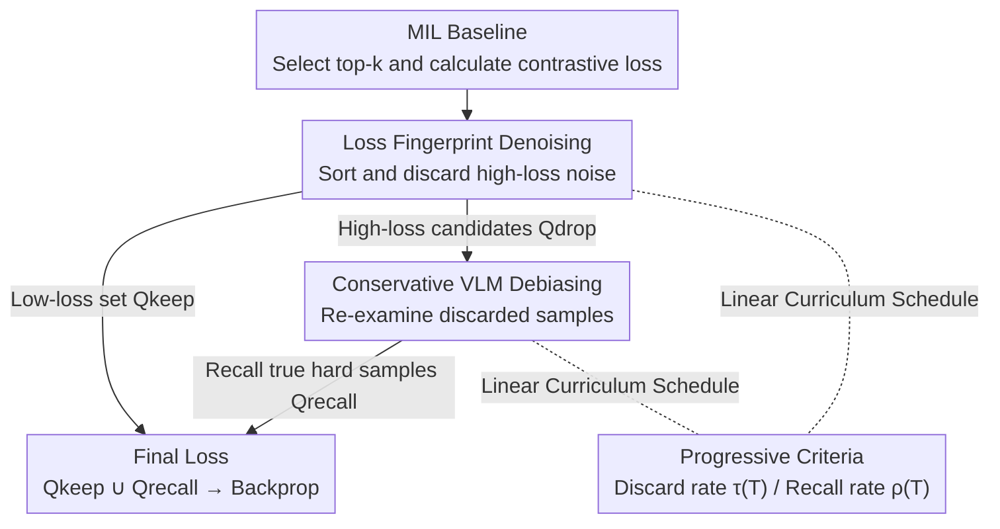

# Learning from Noisy Supervision: A Denoising-Debiasing Framework for Weakly Supervised Video Anomaly Detection

**Conference**: CVPR 2026  
**Paper**: [CVF Open Access](https://openaccess.thecvf.com/content/CVPR2026/html/Zhao_Learning_from_Noisy_Supervision_A_Denoising-Debiasing_Framework_for_Weakly_Supervised_CVPR_2026_paper.html)  
**Area**: Video Understanding  
**Keywords**: Weakly Supervised Video Anomaly Detection, Multiple Instance Learning, Noisy Labels, VLM Debiasing, Curriculum Learning

## TL;DR
Addressing the noise supervision problem in the MIL framework—where normal snippets in abnormal bags are misidentified as anomalies—this paper proposes the plug-and-play D2MIL framework. It dynamically discards high-loss noise based on the observation that "noise samples exhibit higher loss," and subsequently recovers mis-deleted hard samples using a frozen VLM. D2MIL provides consistent improvements across five mainstream MIL baselines on ShanghaiTech, UCF-Crime, and MSAD.

## Background & Motivation
**Background**: Weakly Supervised Video Anomaly Detection (WS-VAD) aims to locate frame-level anomalies using only video-level binary labels (normal/abnormal). The dominant approach is Multiple Instance Learning (MIL), where a video is treated as a "bag" and snippets as "instances." All instances in a normal bag are normal, while abnormal bags contain at least one abnormal instance. Models select top-$k$ high-scoring instances from both bags to maximize their score separation using contrastive loss.

**Limitations of Prior Work**: The risk of this paradigm lies in the noisy supervision signals. Most snippets in an abnormal video are actually normal, but inaccurate scoring in early training often leads models to select these normal snippets as high-scoring anomalies. These misselected instances act as "noisy samples," providing incorrect supervision and contaminating the learning of true anomaly patterns. Most MIL methods (RTFM, MGFN, UR-DMU, etc.) ignore this training noise.

**Key Challenge**: The authors observe a critical phenomenon: noisy samples exhibit **higher and more oscillatory** loss curves during training, whereas true anomaly samples converge with stable, lower losses. However, the challenge is that a subset of **true "hard anomalies" also produce high loss** because they represent difficult patterns the model hasn't yet mastered. Consequently, the high-loss set is a mixture of noise that should be discarded and hard samples that should be retained. Simply discarding all high-loss samples excludes valuable hard cases, leading to overfitting on simple samples and poor generalization.

**Goal**: Without introducing extra annotations, (1) filter out noisy samples from training; (2) avoid mis-deleting high-loss hard anomaly samples.

**Key Insight**: Utilize loss values for an initial coarse screening (denoising), then employ a **frozen Vision-Language Model (VLM)** for a second refined screening (debiasing). Given the zero-shot cross-modal reasoning capabilities of VLMs, they can be used to judge whether a discarded frame "actually looks like an anomaly" to recall mis-deleted hard samples.

**Core Idea**: A two-stage collaborative process of "denoising followed by debiasing"—first dynamically dropping high-loss noise, then re-evaluating the candidates with a VLM to recall true anomalies. This acts as a universal strategy applicable to any MIL method.

## Method

### Overall Architecture
D2MIL (Denoising–Debiasing in MIL) is not a new MIL model but a **two-stage plugin** integrated into the training process of existing MIL baselines. Given a batch, the baseline selects top-$k$ instances and calculates contrastive losses. D2MIL takes over the selection of samples for backpropagation: the first stage (denoising) discards suspected noise by sorting losses and retaining a low-loss set $Q_{keep}$, while storing discarded pairs in a candidate noise set $Q_{drop}$. The second stage (debiasing) uses a frozen VLM to re-examine each pair in $Q_{drop}$; instances identified as true anomalies are recalled into $Q_{recall}$. Finally, loss is calculated using $Q_{keep} \cup Q_{recall}$ for model updates. Both discard and recall ratios are controlled by a linear curriculum scheduler that tightens criteria as training progresses.

### Key Designs

**1. Loss Fingerprint Denoising: Dynamically discarding noise based on "high loss"**

This step addresses the problem where normal snippets in abnormal bags are erroneously selected. The authors utilize the standard MIL contrastive loss (e.g., top-1):

$$L(B_a,B_n)=\max\big(0, 1-\max_{i\in B_a} f(v_i^a)+\max_{i\in B_n} f(v_i^n)\big)$$

where $f(\cdot)$ is the anomaly scoring function. For each normal-abnormal bag pair in a batch, losses $Q=\{l_1,\dots,l_b\}$ are calculated and **sorted in ascending order** to obtain $Q_s$. The low-loss subset is retained based on the current discard rate:

$$Q_{keep}=Q_s\big[:\,(1-\tau(T))\,b\big]$$

The high-loss candidates $Q_{drop}$ are passed to the second stage. This adaptive sorting is more robust than fixed loss thresholds as it adjusts to the loss distribution of each batch.

**2. Conservative VLM Debiasing: Recalling mis-deleted hard samples**

To prevent the loss of "hard anomalies" that mimic noise characteristics, D2MIL re-evaluates indices in $Q_{drop}$. For each entry, the corresponding normal-abnormal snippet pair $(s_i'^n, s_i'^a)$ is retrieved. The **middle frame** of each snippet is used as a representative. These frames are processed by a frozen **Qwen-VL-Max** with a conservative prompt asking: "Which image clearly depicts an abnormal event? Return 0/1; answer only if highly certain, otherwise return 2." If the VLM identifies the suspected snippet as a true anomaly, it is added to $Q_{recall}$. This conservative strategy ensures that noise is not accidentally reintroduced during the recall phase.

**3. Linear Curriculum Scheduling: "Easy-to-Hard" Denoising and Debiasing**

To prevent training instability, both the discard rate $\tau(T)$ and recall rate $\rho(T)$ follow a linear schedule increasing with iterations $T$ within an epoch:

$$\tau(T)=\tau_{max}\cdot\frac{T}{T_{total}-1}$$

In the early stages of each epoch, the model learns from the full data set to grasp general patterns. As training progresses, noise filtering and hard-sample recall intensities are gradually increased.

### Loss & Training
The base loss remains the hinge-based contrastive loss of the MIL framework. D2MIL does not modify the loss function itself but rather filters the sample pairs contributing to it. Each epoch follows the D2MIL workflow: select top instances $\to$ sort losses $\to$ retain low-loss pairs and evaluate high-loss pairs via VLM $\to$ backpropagate using $Q_{keep} \cup Q_{recall}$. D2MIL introduces only two additional hyperparameters, $\tau_{max}$ and $\rho_{max}$, while retaining the baseline's original parameters.

## Key Experimental Results

### Main Results
Testing across three datasets (ShanghaiTech, UCF-Crime, MSAD) using frame-level AUC as the primary metric, D2MIL was applied to five major MIL baselines. Results for UCF-Crime are shown below:

| Method | Feature | AUC(%) | Gain |
|------|------|--------|-----------|
| UMIL (CVPR 2023) | I3D | 86.75 | — |
| VERA (CVPR 2025, VLM) | VLM | 86.55 | — |
| ProDisc-VAD (2025) | ViT | 87.12 | — |
| Sultani et al. + D2MIL | I3D | 85.24 | +1.90 |
| RTFM + D2MIL | I3D | 84.30 | +1.16 |
| TEVAD + D2MIL | I3D+Text | 84.76 | +0.22 |
| MGFN + D2MIL | I3D | 83.70 | +0.40 |
| **UR-DMU + D2MIL** | I3D | **87.80** | **+1.61** |

UR-DMU+D2MIL achieved 87.80% AUC on UCF-Crime, setting a new SOTA for MIL-based methods and outperforming LLM-based Holmes-VAD (84.61%).

### Ablation Study
The ablation verifies the contributions of individual modules: Raw Baseline $\to$ Denoise-only $\to$ Full D2MIL.

| Baseline | Raw(%) | Denoise-only(%) | D2MIL(%) | Denoise Gain | Debiasing Gain |
|------|--------|-----------------|----------|---------|---------|
| Sultani et al. | 83.34 | 84.77 | 85.24 | +1.43 | +0.47 |
| RTFM | 83.14 | 83.96 | 84.30 | +0.82 | +0.34 |
| UR-DMU | 86.19 | 87.53 | 87.90 | +1.34 | +0.37 |

### Key Findings
- **Denoising is the primary driver, while debiasing provides refinement**: Denoising contributed the majority of the performance gain, while the VLM debiasing module provided a consistent supplemental improvement (+0.11% to +0.47%).
- **Greater gains in complex scenarios**: The MSAD dataset (multi-scenario aerial, cross-view) saw the most significant relative improvements, confirming that noise filtering and hard-example retention are particularly effective for difficult distributions.
- **Plug-and-play capability**: D2MIL consistently improved five baselines with varying structures, proving it is decoupled from specific MIL designs.

## Highlights & Insights
- **Distinguishing Noise from Hard Anomalies**: The study is the first to explicitly differentiate "noisy samples" from "hard anomalies" in the MIL framework—both present high loss, but one should be discarded while the other kept. Using a VLM as an external "judge" to resolve this ambiguity is a highly effective design.
- **VLM as a "Refining Judge"**: Rather than fine-tuning a VLM as the backbone (which is computationally expensive), the authors use it for zero-shot binary judgment with conservative prompting. This utilizes strong semantic priors efficiently with zero training overhead.
- **Decoupled Sample Governance**: D2MIL manages "which samples enter the loss" without altering the model architecture or loss formulas. This "sample governance" approach is a valuable template for other weakly supervised or noisy-label tasks.

## Limitations & Future Work
- **VLM Performance Ceiling**: The debiasing efficacy is tied to the underlying VLM's reasoning capability; incorrect VLM judgments lead to incorrect sample recall.
- **Single-Frame Limitation**: Compressing a snippet into its middle frame may cause the model to miss anomalies that rely on temporal context or motion (e.g., slow-evolving events).
- **Conservative Bias**: The "uncertain = discard" strategy prioritizes precision over recall, potentially missing some valuable hard cases in datasets where anomalies are already sparse.
- **Computational Overhead**: The paper does not quantify the inference cost of calling the VLM for every high-loss pair during training, which may impact scalability for massive datasets.

## Related Work & Insights
- **Comparison to Standard MIL**: Unlike methods that assume top-$k$ selection is always correct, D2MIL acts as a modular protective layer for sample governance.
- **Comparison to LLM/VLM Backbones**: In contrast to Holmes-VAD (fine-tuning multi-modal LLMs) or VERA (explainable detection), D2MIL uses VLMs only as an auxiliary review module, achieving superior performance on UR-DMU+D2MIL compared to those heavier models.

## Rating
- Novelty: ⭐⭐⭐⭐ (First to distinguish noise vs. hard anomalies in MIL using VLM debiasing)
- Experimental Thoroughness: ⭐⭐⭐⭐ (Extensive benchmarks across multiple baselines and datasets)
- Writing Quality: ⭐⭐⭐⭐ (Clear motivation and well-structured methodology)
- Value: ⭐⭐⭐⭐ (Highly practical, plug-and-play strategy for noisy supervision)

<!-- RELATED:START -->

## Related Papers

- [\[CVPR 2026\] The Road Less Seen: Segment Exploration for Weakly Supervised Video Anomaly Detection](the_road_less_seen_segment_exploration_for_weakly_supervised_video_anomaly_detec.md)
- [\[CVPR 2026\] Weakly Supervised Video Anomaly Detection with Anomaly-Connected Components and Intention Reasoning](weakly_supervised_video_anomaly_detection_with_anomaly-connected_components_and_.md)
- [\[CVPR 2026\] Joint Learning of General and Diverse Patterns with Mixture of Memory Experts for Weakly-Supervised Video Anomaly Detection](joint_learning_of_general_and_diverse_patterns_with_mixture_of_memory_experts_fo.md)
- [\[CVPR 2026\] TLMA: Mitigating the Impact of Weakly Labeled Information for Video Anomaly Detection](tlma_mitigating_the_impact_of_weakly_labeled_information_for_video_anomaly_detec.md)
- [\[AAAI 2026\] Learning to Tell Apart: Weakly Supervised Video Anomaly Detection via Disentangled Semantic Alignment](../../AAAI2026/video_understanding/learning_to_tell_apart_weakly_supervised_video_anomaly_detection_via_disentangle.md)

<!-- RELATED:END -->
