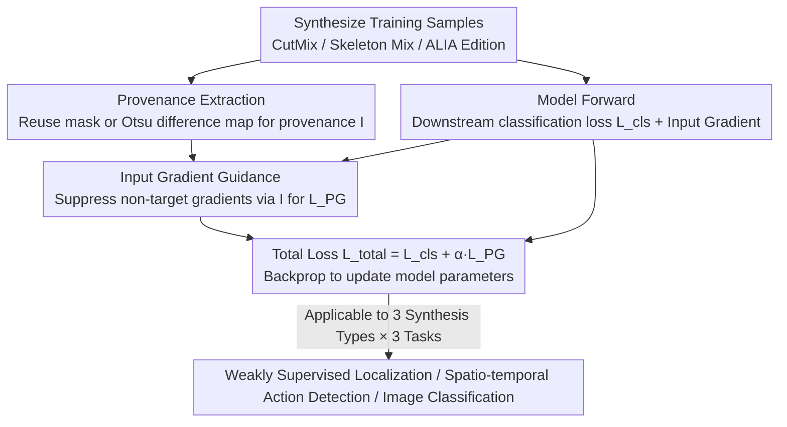

# Learning from Synthetic Data via Provenance-Based Input Gradient Guidance

**Conference**: CVPR 2026  
**arXiv**: [2604.02946](https://arxiv.org/abs/2604.02946)  
**Code**: None  
**Area**: Deep Learning Methods  
**Keywords**: Synthetic Data Learning, Input Gradient Guidance, Spurious Correlation Suppression, Data Augmentation, Provenance Information

## TL;DR

This paper proposes utilizing "provenance" automatically obtained during the synthetic data generation process as an auxiliary supervision signal. By employing input gradient guidance—specifically inhibiting input gradients in non-target regions—the method directly encourages models to learn discriminative representations focused on target areas. Its effectiveness is validated across multiple tasks and modalities, including weakly supervised localization, spatio-temporal action detection, and image classification.

## Background & Motivation

In the training of deep learning models, synthetic data (via data augmentation, generative model editing, etc.) has become an essential means of enhancing robustness. Existing synthesis-based learning methods (e.g., CutMix, mixup, diffusion-based image editing) improve robustness indirectly by diversifying the training sample distribution. However, they suffer from fundamental flaws:

1.  **Lack of Explicit Guidance**: Models are only provided with supervisory labels and must independently determine which regions in the input space contribute to classification, often leading to the learning of spurious correlations (e.g., backgrounds, co-occurring objects).
2.  **Synthetic Bias**: Artifacts and biases introduced by data augmentation or generative models may themselves be erroneously learned, preventing accuracy from scaling linearly with data volume.
3.  **Robustness as a "Byproduct"**: The robustness gains in existing methods are indirect effects of increased training samples rather than the direct learning of discriminative features of the target objects.

**Key Insight**: The synthesis process naturally records "provenance" information indicating which pixels originate from which target (e.g., CutMix masks or differences before/after image editing). However, this free information has not previously been utilized to explicitly constrain model learning behavior.

## Method

### Overall Architecture

The paper addresses the issue in synthetic data learning where the "model does not know where to look." Since existing methods provide only labels, models often rely on spurious correlations like backgrounds. The authors' **Key Insight** is to extract the "provenance" $\mathbf{I}$ (identifying which pixels belong to which target), which is naturally generated during synthesis, and use it as auxiliary supervision.

The pipeline adds a guidance layer to standard training: first, training samples are synthesized while extracting provenance information $\mathbf{I}$. Downstream classification loss $L_{cls}$ is calculated as usual, while provenance information is converted into a regularization term $L_{PG}$ acting on the input gradients. This constrains the model predictions from depending on non-target regions. The total loss is $L_{total} = L_{cls} + \alpha L_{PG}$, where $\alpha$ controls guidance strength. This approach does not alter network architecture and is plug-and-play for any synthesis method that can identify target/non-target regions.

### Key Designs

**1. Provenance Extraction: Utilizing Synthesis "Byproducts" as Supervision**

Spurious correlations arise because models are not told which regions are targets. The synthesis process, however, already contains this answer. The authors present zero-cost extraction methods for three mainstream synthesis types:
- **Image Blending** (CutMix, ResizeMix): Directly reuse the synthesis mask $M$. Areas from image A are $\mathbf{I}_A = M$, and from image B are $\mathbf{I}_B = 1-M$.
- **Skeleton Sequence Blending**: Use a spatio-temporal binary mask $M \in \{0,1\}^{P \times F \times E}$ to mark the source of each skeleton feature.
- **Generative Model Image Editing** (e.g., ALIA): Compare pixel-wise differences $D(u,v)$ between original and edited images, applying Otsu's thresholding to get $\mathbf{I}(u,v)=1$ for unmodified target regions.
These annotations are naturally generated during synthesis, requiring no human labeling while precisely defining targets.

**2. Input Gradient Guidance: Directing the Model via Gradients**

The input gradient $\nabla_{\tilde{x}} f_y(\tilde{x})$ reflects the sensitivity of the prediction to input elements. High sensitivity indicates where the model is "looking." The provenance loss suppresses sensitivity in non-target regions. For soft-label scenarios (blending two images):

$$L_{PG} = \big\| (1-M) \odot \nabla_{\tilde{x}} f_A(\tilde{x}) + M \odot \nabla_{\tilde{x}} f_B(\tilde{x}) \big\|_2^2,$$

meaning predictions for class A should not depend on regions from image B, and vice versa. For hard-label scenarios (generative editing with label $y$):

$$L_{PG} = \| (1-M) \odot \nabla_{\tilde{x}} f_y(\tilde{x}) \|_2^2,$$

ensuring the logit for $y$ does not depend on edited regions. Unlike indirect robustness from increased data, this explicitly eliminates spurious correlations at the gradient level.

**3. Cross-modal and Cross-task Generality**

Because the mechanism relies only on "provenance + input gradients"—elements decoupled from specific synthesis methods or architectures—it is naturally versatile. The paper validates this across three synthesis methods (CutMix/ResizeMix/PuzzleMix, BatchMix, ALIA) and three tasks (localization, detection, classification) by simply adding the provenance loss to existing workflows.

### Loss & Training

The total loss is $L_{total} = L_{cls} + \alpha L_{PG}$. Experiments show performance is stable for $\alpha \in [0.01, 0.09]$. As $L_{PG}$ involves second-order derivatives (gradient of the input gradient), implementation utilizes PyTorch autograd with AMP acceleration, maintaining FP32 for the loss calculation to avoid numerical instability.

## Key Experimental Results

### Main Results

| Task/Dataset | Metric | Baseline | + Synthetic Method | + Ours | Gain |
|------------|------|------|-----------|-----------|------|
| WSOL/CUB (VGG16) | MaxBoxAccV2 Mean | - | 62.3 (CutMix) | **65.1** | +2.8 |
| WSOL/CUB (VGG16) | MaxBoxAccV2 Mean | - | 57.6 (ResizeMix) | **62.2** | +4.6 |
| WSOL/CUB (SAT) | MaxBoxAccV2 Mean | 91.4 | 91.5 (CutMix) | **92.1** | +0.6 |
| STAD/UCF101-24 | AP@0.5 | 37.4 (SKP) | 38.0 (BatchMix) | **39.7** | +1.7 |
| Classification/Waterbirds | Top-1 Acc | 62.2 | 71.4 (ALIA) | **80.7** | +9.3 |
| Classification/iWildCam | Top-1 Acc | 75.0 | 83.5 (ALIA) | **84.4** | +0.9 |
| Classification/CUB | Top-1 Acc | 70.8 | 71.7 (ALIA) | **72.0** | +0.3 |

### Ablation Study

| Configuration | CUB Localization Acc (%) | Description |
|------|-------------------|------|
| Random mask | 60.5 | Random mask as pseudo-provenance |
| Unmasked (Full) | 61.1 | No distinction between target/non-target |
| Ours (True Provenance) | **65.1** | Using actual provenance from synthesis |

Ablation on provenance quality (Classification): Dilating/eroding foreground masks by $\pm 10\%/\pm 30\%$ resulted in limited performance drops (CUB: 72.1 $\rightarrow$ 71.5), demonstrating robustness to provenance precision.

### Key Findings

- **Largest gain on Waterbirds (+9.3pp)**: Waterbirds is designed with strong spurious correlations between background and class; provenance guidance directly suppressed background dependence.
- On VGG16 with CutMix, when the IoU threshold $\delta=0.5$, accuracy improved from 67.3% to 74.6%. However, at $\delta=0.7$, it dropped from 28.6% to 23.1%, suggesting the model tends to produce larger detection boxes under strict thresholds.
- regarding training efficiency: although second-order derivatives increase time per epoch (140s $\rightarrow$ 150s), the model converges significantly faster (50 epochs $\rightarrow$ 15 epochs), reducing total training time from 1.9h to 0.6h.
- Comparison with random masks proves that the accuracy of provenance information, rather than gradient regularization itself, is the key factor.

## Highlights & Insights

- **"Free lunch" supervision signals** are the primary highlight. Provenance is naturally generated during synthesis but has been neglected; this paper is the first to systematically use it as auxiliary supervision. This simple yet profound idea can be integrated into any data augmentation pipeline at zero cost.
- **Shift from indirect to direct paradigm**: While previous methods relied on sample distribution to indirectly improve robustness, this method uses gradient regularization to explicitly tell the model "where to look."
- **Strong generality**: Effective across modalities (images, skeleton sequences), tasks (localization, detection, classification), and synthesis methods (mixing, generative models).
- **Unexpected acceleration**: Theoretically, second-order differentiation increases computation, but the boost in convergence speed actually reduces total training time.

## Limitations & Future Work

- Provenance granularity is limited by the synthesis method—CutMix provides only rectangular masks, and generative editing relies on Otsu binarization of difference maps, which may lack precision.
- Provenance extraction for generative editing depends on pixel-wise comparison; if a generative model modifies the appearance of the target object itself, misclassification of target regions may occur.
- Validation is performed on medium-scale models (VGG16, ResNet-50); effectiveness on large-scale pre-trained models remains unverified.
- Future work could explore combining provenance with attention mechanisms or extending to self-supervised learning to utilize correspondences before and after augmentation.

## Related Work & Insights

- **vs. CutMix/ResizeMix/PuzzleMix**: These methods perform only data-level mixing; the proposed method adds explicit gradient-level guidance, achieving a "augmentation + guidance" two-stage improvement.
- **vs. Right for the Right Reasons (Ross et al.)**: That work also manipulates input gradients but requires human-annotated gaze regions. This method utilizes automatically obtained provenance from synthesis.
- **vs. ALIA**: ALIA uses diffusion models to edit training images for diversity; focusing ALIA with provenance loss yielded a +9.3pp improvement on Waterbirds.
- The concept of provenance guidance could inspire improvements in positive/negative sample construction for contrastive learning.

## Rating

- **Novelty**: ⭐⭐⭐⭐ The idea of using synthesis provenance as a free supervision signal is novel and practical, though the technical tool (input gradient regularization) is relatively established.
- **Experimental Thoroughness**: ⭐⭐⭐⭐⭐ Comprehensive validation across three synthesis methods, three tasks, and multiple datasets, with detailed ablation studies.
- **Writing Quality**: ⭐⭐⭐⭐ Clear problem definition, rigorous derivation, and consistent mathematical notation.
- **Value**: ⭐⭐⭐⭐ Highly generalizable, easy to implement, and zero additional annotation cost; likely to be widely adopted in data augmentation pipelines.

<!-- RELATED:START -->

## Related Papers

- [\[CVPR 2026\] SAIL: Similarity-Aware Guidance and Inter-Caption Augmentation-based Learning for Weakly-Supervised Dense Video Captioning](sail_similarity-aware_guidance_and_inter-caption_augmentation-based_learning_for.md)
- [\[CVPR 2026\] FlashMotion: Few-Step Controllable Video Generation with Trajectory Guidance](flashmotion_fewstep_controllable_video_generation.md)
- [\[CVPR 2026\] MDS-VQA: Model-Informed Data Selection for Video Quality Assessment](mds-vqa_model-informed_data_selection_for_video_quality_assessment.md)
- [\[CVPR 2026\] Image Guides Images: Consistent Video Amodal Completion with Rectified In-Context Exemplar Guidance](image_guides_images_consistent_video_amodal_completion_with_rectified_in-context.md)
- [\[ICLR 2026\] PPLLaVA: Varied Video Sequence Understanding With Prompt Guidance](../../ICLR2026/video_understanding/ppllava_varied_video_sequence_understanding_with_prompt_guidance.md)

<!-- RELATED:END -->
